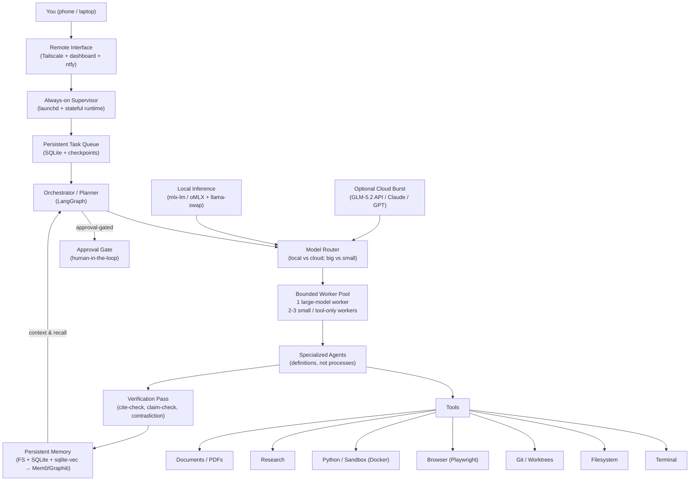
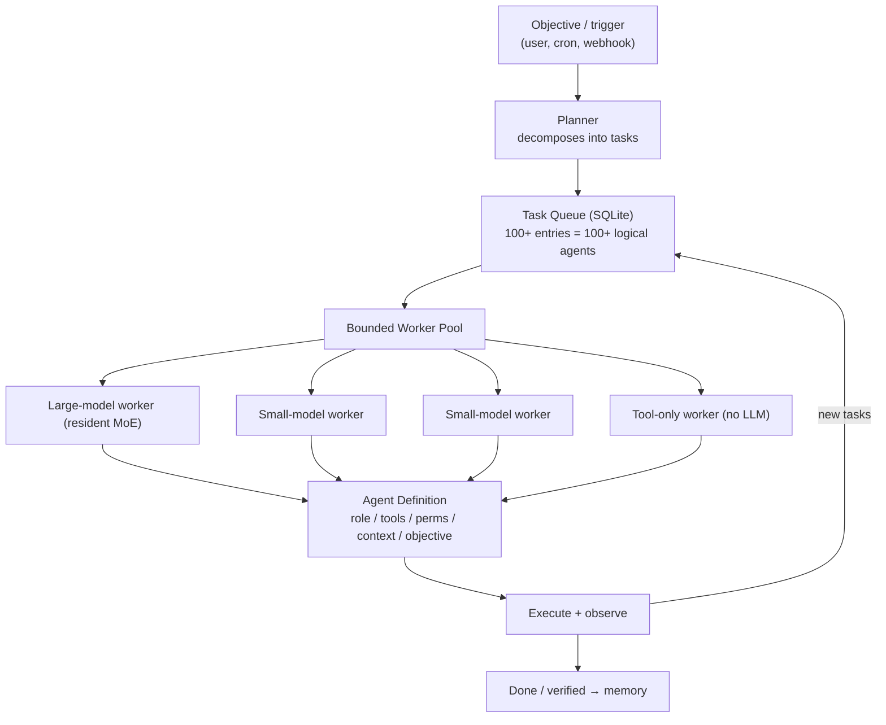

# Rater bundle — 13 raw responses for issue #9

Hand this file to the second-rater session **together with** `analysis/scoring/RATER-PACKET.md`.
Each block below is the verbatim `## Raw response` section of one capture, nothing else
(no front-matter, no cited-sources list, no reviewer notes). Score in the order given.
Web search must be ON — see packet rule 4.

---

## Response 1: `claude-sonnet-5`

Full deliverable was published as an HTML artifact:
**https://claude.ai/code/artifact/6e8265be-66e1-4fce-bb42-973e08819df3**

The complete research findings, section by section, with all ~97 sources, are archived in this repo at:
**`analysis/findings/claude-sonnet-5-findings.md`** (54 KB, 21 sections).

### Decisions at a glance (Claude's final picks)

| Layer | Pick |
|---|---|
| Inference engine | MLX (`mlx-lm`) + `llama-swap` for load/unload; Ollama 0.19+ acceptable substitute |
| Heavy local model | `Qwen3-Coder-30B-A3B` 4-bit MLX (MoE, ~3B active) |
| Resident light model | `Qwen3-4B-Instruct` |
| Mid reasoner | `gpt-oss-20b` MXFP4 |
| Vision | `Qwen3-VL-4B` (30B-A3B for hard docs) |
| Orchestration | Thin custom supervisor + SQLite task queue on top of Claude Agent SDK + Goose — not from scratch, not a heavy framework |
| Interactive coding | Claude Code (headless `claude -p` + Remote Control) |
| Local coding worker | Goose (or opencode) + Qwen3-Coder-30B |
| Task queue | SQLite table + asyncio workers (no Redis/Celery) |
| Memory | Markdown files + SQLite now; `sqlite-vec` later; knowledge graph only on proven need |
| Vector store | `sqlite-vec` (no standalone vector DB; explicitly avoid Chroma/Qdrant/etc.) |
| Web search | SearXNG (self-host) |
| Academic | OpenAlex + arXiv + Crossref + Semantic Scholar APIs |
| PDF / documents | Docling (or Marker) |
| Browser | Playwright headless Chromium; computer-use only as last resort |
| Exec sandbox | Dedicated non-admin macOS user + Apple `container` / Colima per risky exec; egress allowlist |
| Process supervision | `launchd` KeepAlive + separate watchdog job |
| Sleep prevention | `pmset -a sleep 0 disablesleep 1` + `caffeinate -dimsu` |
| Remote network | Tailscale only (no public ports) |
| Control plane | FastAPI + HTMX dashboard, tailnet-bound, bearer token |
| Notifications | ntfy |
| Backups | restic → external SSD + B2/S3 (exclude models) |
| Model router | ~80-line rule table (not RouteLLM/trained router) |
| Cloud dependence | Optional; target < $30/mo Claude API for planning + final synthesis + citation verification; $0 still useful |
| Concurrency | heavy=1, light=2, cloud=4 |
| Topology | Hierarchical coordinator/worker (not swarm) |
| Biggest bottleneck | Memory capacity, then bandwidth (~170 GB/s), then the single heavy inference slot |

---

## Response 2: `mistral-large-3`

# A 24/7 Autonomous AI Workstation on a 32 GB M6 Mac mini

A source-backed architecture for a personal, primarily-local, always-on autonomous AI system that plans, delegates, executes, observes, verifies, corrects, documents, and continues — built around an Apple M6 Mac mini (32 GB unified memory, 170 GB/s bandwidth, dual 16-core Neural Engine), a 512 GB internal SSD, and a 1 TB external SSD.

---

## Question

What is the best production-quality architecture, as of August 2026, for a personal always-on autonomous AI system that does serious software development and research, runs primarily on local inference on a 32 GB M6 Mac mini, is remotely controllable, securely sandboxed, and can coordinate 100+ logical agents without attempting to run 100 LLMs simultaneously?

## Executive Summary

1. **The M6 Mac mini (32 GB) is a capable single-tenant agent host, not a high-concurrency inference server.** Apple Silicon's unified memory removes the VRAM wall but its 170 GB/s bandwidth is far below discrete GPUs; the consensus in 2026 is that it is excellent for single-tenant/modest-concurrency agent loops (under ~20 concurrent requests) but not for production high-concurrency serving. Design around one or two resident models, not many.

2. **MLX is the correct local inference stack.** Apple's own MLX/`mlx-lm` (stable v0.31.x, OpenAI-compatible server, continuous batching, tool calling, WWDC26-blessed for "local agentic AI on the Mac") is the default. `oMLX` adds SSD-tiered KV cache and continuous batching; `vllm-mlx` adds paged KV cache, prefix caching, and Anthropic-compatible endpoints. `Ollama`/`LM Studio` are convenient wrappers but slower for hot paths.

3. **You cannot run the frontier models locally.** The best open coding models in 2026 — GLM-5.2 (744B MoE, 40B active, 1M context, MIT weights), Kimi K3 (2.8T MoE), DeepSeek V4 — require server hardware (~370 GB+ even at 4-bit). On 32 GB, the practical local ceiling is a **~30–35B MoE at 4-bit** (Qwen3-Coder-30B-A3B, Qwen3.6-35B-A3B), or a dense ~9–14B at Q8.

4. **Use a hybrid model strategy: local for routine work, cloud for hard reasoning.** Local MoE for the bulk of coding/agent turns; a frontier cloud model (GLM-5.2 API, or Claude/GPT) burst-routed for planning, hard debugging, and final synthesis. The system stays useful with zero cloud, but quality jumps sharply when you allow selective cloud routing.

5. **The agent layer should be "harness + orchestration," not a single framework.** Use **OpenHands** for sandboxed autonomous coding (Docker sandbox, Git worktrees, unattended runs), **Goose** for general-purpose MCP-driven automation, and a **LangGraph** orchestration layer for stateful, durable, multi-agent flows with human-in-the-loop approval. No single harness covers all your requirements.

6. **"100+ agents" means logical agents + a task queue + a small worker pool, not 100 model instances.** Define agents as data (role/tool/permission/objective), enqueue tasks into a persistent queue (SQLite/Redis), and run a bounded pool of workers (1–3 large-model processes, a few small-model workers) that drain the queue. Dynamic subagents are spawned as queue entries with inherited/contracted scope.

7. **Memory: start minimal, add graph memory later.** Phase 1: filesystem Markdown notes + SQLite for task/decision state. Phase 4: add a vector store for semantic recall (sqlite-vec or Mem0). Add **Graphiti** only when facts supersede each other and temporal reasoning matters. Avoid standing up a full knowledge graph on day one.

8. **Isolation is the security core.** Run the agent under a dedicated macOS user account, give OpenHands a Docker sandbox, keep secrets in the macOS Keychain / a non-mounted env store (never in the agent's filesystem), gate destructive commands and anything touching credentials/finances behind human approval, and put a hardware-style **kill switch** (launchd unload + a firewall block) on top.

9. **24/7 = launchd + a persistent supervisor + a task queue + caffeinate.** launchd `KeepAlive` restarts the supervisor on crash/reboot; the supervisor owns the durable task queue; `caffeinate` prevents sleep; checkpointing lets long tasks resume.

10. **Remote access = Tailscale, never public exposure.** A Tailscale (WireGuard) overlay with ACL tags exposes a self-hosted dashboard + SSH to your phone/laptop with zero inbound ports. Notifications via `ntfy`/Bark; emergency stop via the dashboard or a single Tailscale-reachable command.

## Methodology

Research was conducted via web search across primary and secondary sources dated 2026 (release notes, GitHub repos, Apple newsroom/WWDC26, model cards, technical benchmarks, developer guides, and current community discussions). Searches covered: M6 hardware specs; local inference engines on Apple Silicon (MLX, mlx-lm, oMLX, vllm-mlx, vLLM-metal, Ollama, LM Studio, llama.cpp, llama-swap); open-weight models (GLM-5.2, Kimi K3, DeepSeek V4, Qwen3/3.5/3.6, Devstral, Muse Glimmer, gpt-oss); coding agents (OpenHands, Goose, Aider, Cline, Kilo Code, OpenCode, SWE-agent); orchestration (LangGraph, CrewAI, AutoGen, OpenAI Agents SDK, Google ADK); research agents (GPT-Researcher, Stanford STORM, Open Deep Research, Local Deep Research, Agent Laboratory, Sakana AI Scientist); agent memory (Letta, Mem0, Graphiti, Zep, Cognee); browser/computer control (Playwright, browser-use, Stagehand, Open Interpreter, Anthropic Computer Use); and operations (launchd, always-on supervisors, Tailscale, external SSD performance).

**Limitations.** Performance numbers (tokens/sec, RAM) are ranges from community reports and guides, not independently benchmarked on the specific M6; treat them as planning estimates. The M6 Mac mini shipped for pre-order on 2026-08-25 with availability 2026-09-22, so hands-on inference benchmarks for the M6 specifically are still scarce — most quantitative data points are from M4/M5 Apple Silicon and extrapolated. Fast-moving projects can change capabilities quickly; pin known-good versions.

## Findings

### 1. Local inference on a 32 GB M6

**Hardware reality.** The M6 (announced 2026-08-25) is a 2nm SoC: 12-core CPU (2 super + 4 performance + 6 efficiency), 12-core GPU with per-core Neural Accelerators, dual 16-core Neural Engine (~2× AI performance vs M4), and **up to 32 GB unified memory at 170 GB/s bandwidth**. The base M6 starts at 16 GB; your 32 GB is the max for the M6 tier (the M5 Pro tier reaches 64 GB). Memory is unified, so weights and KV cache share the same pool as macOS, apps, and the browser.

**What fits in 32 GB.** Practical local-model sizing on Apple Silicon (4-bit):
- 16 GB → up to ~13B dense
- 24–32 GB → up to ~30–35B (dense) or ~35B MoE at 4-bit
- 48 GB → ~70B at 4-bit
- 96 GB+ → 70B full precision or ~140B at 4-bit
- 192–256 GB → GLM-5 class models only at aggressive 2-bit dynamic quantization (marginal)

So on 32 GB, the **sweet spot is a ~30–35B MoE at 4-bit** (Qwen3-Coder-30B-A3B: 30.5B total / **3.3B active per token**, ~18–20 GB at 4-bit, fast decode thanks to sparse activation; or Qwen3.6-35B-A3B at ~22 GB), optionally alongside a small dense model (Qwen3.5-9B at Q8 ~11 GB) kept resident for cheap classification/summarization. The frontier open coding models (GLM-5.2 744B/40B-active, Kimi K3 2.8T, DeepSeek V4) **do not fit** — they are cloud models (GLM-5.2 alone is ~1.51 TB at BF16, ~370 GB+ even quantized).

**Inference engine — best overall & for your hardware: MLX via `mlx-lm` server.** MLX is Apple's own array framework; `mlx-lm` (v0.31.x) collapses run/quantize/fine-tune/serve into one toolchain and exposes an **OpenAI-compatible `/v1/chat/completions` with tool calling and continuous batching**. WWDC26 ("Run local agentic AI on the Mac using MLX") explicitly endorses the install-MLX-LM → start-server → point-agent-at-it flow for concurrent multi-agent requests. The unified-memory model and (on M5+) Neural Accelerators accelerate prompt processing.

**Stronger serving options for concurrent agents:**
- **oMLX** (~20k stars, GitHub-trending Aug 2026): MLX-based server with **tiered KV cache (RAM + SSD eviction/reuse) and continuous batching**, a menu-bar macOS app, MCP support. Best when concurrent agent traffic can exceed RAM and you want KV blocks to spill to the 1 TB external SSD gracefully.
- **vllm-mlx (waybarrios)** and **vLLM-metal (community plugin)**: add paged/prefix KV cache, OpenAI **and Anthropic**-compatible endpoints, MCP tool calling, Claude Code support. Useful if you want Anthropic-API compatibility (so agents that expect Claude can talk to your local server).

**Convenience wrappers (use sparingly for hot paths):** Ollama (added its own MLX engine in 2026) and LM Studio (MLX backend, broader MLX model selection, GUI) are easiest for trying models, but LM Studio's MLX path is reported consistently faster than Ollama's llama.cpp path on Apple Silicon. For a 24/7 unattended server, prefer a headless `mlx-lm`/`oMLX`/`vllm-mlx` process launched by launchd.

**Model hot-swapping:** **llama-swap** (v201, April 2026) hot-swaps models on demand behind one OpenAI-compatible endpoint with instant config hot-reload — ideal when you want the orchestrator to request "the coding model" or "the small model" by alias without managing multiple ports.

**Practical decision:** Run **one resident large MoE** (Qwen3-Coder-30B-A3B or Qwen3.6-35B-A3B at 4-bit, ~18–22 GB) + **one resident small dense** (Qwen3.5-9B Q8, ~11 GB) is tight but feasible with aggressive context limits; more realistically keep the small model loadable-on-demand via llama-swap and hold only the large MoE resident. Do **not** keep multiple large models loaded simultaneously — context/KV cache and macOS need the headroom.

### 2. Agent runtimes / harnesses

There is no single harness that satisfies every requirement. The 2026 landscape splits cleanly:

- **OpenHands** (MIT, Docker Compose, `openhands serve`) — best for **autonomous, unattended software tasks**: sandboxed execution, repository understanding, terminal, code editing, test execution, debugging, Git. Reviewer consensus: "surgical Git edits → Aider; autonomous unattended runs → OpenHands; general automation beyond code → Goose." Adds sandboxed execution as an extra safety layer and supports isolated Git worktrees (run separate agents in separate worktrees).
- **Goose** (Apache 2.0, Rust; donated to the Linux Foundation's Agentic AI Foundation in 2026) — a general-purpose agent (desktop app + CLI + API), 15+ providers including local Ollama/MLX, 70+ MCP extensions, first-class **model routing per task type** (code → big model, simple tasks → local small model). Best as the "general operator" and MCP tool layer.
- **Aider** — git-native CLI pair-programming; strongest for interactive, surgical edits with a local model and no network. Not a long-running autonomous loop.
- **Cline / Kilo Code / OpenCode** — IDE+CLI agents; Kilo Code's editorial pick for long-horizon coding agents in 2026 is GLM-5.2; good for interactive IDE work, less so for unattended 24/7.

**Recommendation:** Use **OpenHands as the coding executor** inside a Docker sandbox, **Goose as the general MCP/operator layer**, and a thin **LangGraph orchestration layer** on top for durable, stateful, multi-step flows with human-in-the-loop. This is "multiple complementary systems + a custom orchestration layer," which the evidence supports over a single framework.

### 3. Multi-agent architecture on limited hardware

**Critical distinction:** "100 agents" can mean four very different things:
- **100 actual simultaneous model instances** — impossible and pointless on 32 GB. Each large-model instance wants ~20 GB + KV cache.
- **100 logical agents** — definitions (role, tools, permissions, context window budget, objective, system prompt) stored as data. This is what you want.
- **Task queue + worker pool** — the execution model: agents are not processes; tasks are. A bounded pool of workers drains a queue.
- **Dynamic subagents** — spawned by a coordinator as new queue entries with contracted scope, not pre-configured.

**Architecture for maximum useful throughput on 32 GB:**
- A **coordinator/planner** agent decomposes an objective into tasks and enqueues them with a target role/model tier.
- A **persistent task queue** (SQLite to start, optional Redis/Postgres later) holds pending/in-progress/done tasks with priorities, dependencies, and per-task agent definitions.
- A **bounded worker pool**: **1 large-model worker** (resident MoE) for coding/reasoning/long-context; **2–3 small-model workers** (or shared small-model server with batching) for classification/summarization/routing; **tool-only workers** (no LLM) for file scans, Git operations, test runs that need no inference. This is the key to high throughput: most "agent steps" are tool calls or cheap models, not frontier calls.
- **Model router** assigns model per task (see §E). Sequential vs parallel is controlled by task dependencies in the queue; independent tasks run in parallel up to the worker cap.
- **Hierarchical coordinator/worker** pattern (LangGraph): a top-level planner delegates to specialized subagents; subagents may themselves spawn scoped subagents via the same queue.

**Why this beats "swarm of 100 LLMs":** it keeps inference concurrency = your hardware capacity (≈1 large + a few small), while logical agent count is unlimited and dynamic. It also makes the system observable (queue depth, per-task state) and recoverable (durable queue survives crashes).

### 4. Coding agents

**Best for your requirements: OpenHands**, because it is purpose-built for unattended autonomous software engineering (terminal execution, code editing, test running, debugging, Git, sandboxed execution, worktrees, long-running iteration) and is MIT-licensed and self-hostable. Run it in its Docker sandbox for isolation; point it at your local MLX endpoint (or a cloud endpoint for hard steps).

**Complement:** Goose for repo-spanning automation and MCP tool use; Aider for interactive pair programming when you are at the machine. For "work across any project/directory," the orchestration layer mounts/selected the repo per task rather than tying a single agent to one repo — OpenHands and Goose both accept a working directory per session.

**Local model support:** all of OpenHands, Goose, Aider, Cline, Kilo Code support local providers (Ollama/MLX endpoints). Quality on 30B-class local MoE is strong for routine edits and navigation; for hard planning/debugging, route to a frontier model (see §E).

### 5. Research agents

**Best building blocks (2026):**
- **GPT-Researcher** (Apache-2.0, ~28.9k stars, #1 on CMU's DeepResearchGym) — autonomous report generation from a single prompt: plans sub-questions, parallel web searches, scrapes/summarizes, writes structured cited reports. Supports any LLM (incl. local) and any search engine; also does **local/hybrid** research over your own files. Best general cited-report agent.
- **Stanford STORM** — outline-first, multi-perspective synthesis producing Wikipedia-style long-form articles with citations. Best for literature/background explainers.
- **Open Deep Research (LangChain)** — a reconfigurable LangGraph orchestration graph; best as the backbone you customize.
- **Local Deep Research** — runs entirely offline; best when no query may leave the machine.
- **Agent Laboratory / Sakana AI Scientist** — end-to-end "propose idea → write experiment code → run experiments → analyze → draft paper"; closest to your "run experiments and analyze results" requirement.

**Preventing hallucinated citations and unsupported claims** — the central risk. The 2026 "Cited but Not Verified" benchmark found open-source deep-research models have **lower fact-check accuracy than frontier models**, and GPTZero flagged 50+ hallucinated citations in ICLR 2026 papers that 3–5 reviewers each missed. Concrete defenses:
1. **Separate retrieval from generation.** Every cited claim must trace to a retrieved source snippet stored verbatim; no claim without a stored grounding passage.
2. **Mandatory verification pass** — a second agent re-opens each cited URL/source and checks the claim actually appears; unverifiable citations are dropped or flagged. This is the single highest-value guardrail.
3. **Inline citations with stored snippets**, not free-form references. Persist `(claim, source, snippet, URL, date)` tuples.
4. **Contradiction detection** — a dedicated pass compares claims across sources and surfaces conflicts rather than silently averaging them.
5. **Confidence tagging** and explicit "verified vs. estimate vs. inference" separation in the final report (this report follows that discipline).
6. For academic literature, extract citations from real PDFs (Grobid/Marker) rather than generating reference lists.

**Architecture:** GPT-Researcher (or Open Deep Research on LangGraph) as the loop, with a **verification subagent** post-processing every draft, writing to the persistent memory store (§6).

### 6. Persistent memory

**Options compared (2026):**
- **Letta** — edits plain text blocks/files; simple, inspectable. Good for agent self-notes.
- **Mem0** — vector + graph + key-value, three-scope (user/session/agent); fastest path to production; an April 2026 paper formalizes its hybrid vector + knowledge-graph backend. Best general semantic recall.
- **Graphiti** — time-stamped relationship graph; **best when facts supersede each other** ("what was true before/after this change"). Essential for evolving project state.
- **Cognee / Zep / Supermemory** — alternatives; Zep and Graphiti suit changing worlds; pure vector (Mem0/Supermemory) is fine for mostly-static recall.
- **SQLite / sqlite-vec** — minimal, zero-infra vector + relational; ideal starting point on a single Mac.

**What to use initially (avoid unnecessary infrastructure):**
- **Filesystem Markdown** for human-readable notes, decision logs, research drafts.
- **SQLite** for task state, decisions, agent definitions, run logs.
- **sqlite-vec** (or Mem0 in local mode) for semantic recall once you have enough content to need it.

**Add later as the system grows:** Mem0 (graph+vector hybrid) for cross-project recall, then **Graphiti** only when temporal/contradictory fact handling becomes a real pain. A full standalone knowledge graph or a Postgres+pgvector stack is **not** a Phase 1 need.

### 7. Computer control

**Layers, from safest to most powerful:**
- **Terminal + filesystem** — the bread and butter; OpenHands/Goose already do this. Confine via a dedicated user account and allow/deny path lists.
- **Browser** — **Playwright is the default in 2026** (headless, deterministic, accessibility-tree access slashes token cost). For open-ended autonomous browsing, layer **browser-use** or **Stagehand** on Playwright. Browser-use reports ~89% on WebVoyager (SOTA for autonomous web interaction). Playwright also ships an MCP server.
- **GUI / computer-use** — **Open Interpreter** (code-execution-first; OS/GUI via a screenshot vision mode; supports local Ollama) is the strongest open-source option, but GUI control is secondary and slower than accessibility-tree approaches; AGPL license may matter. Anthropic Computer Use (vision-driven) requires VMs/containers for safety and is cloud-dependent. Treat full GUI control as a **last resort** — prefer terminal/browser/Playwright whenever a task can be expressed as "write a script that does X."

**Sandboxing & isolation stack:**
- **Dedicated macOS user account** for the agent (no admin rights; restricted home).
- **Docker** containers for OpenHands coding sandbox and for anything running untrusted code/tests.
- **Worktree isolation** — each coding task in its own Git worktree to avoid clobbering.
- **Secrets in macOS Keychain / a separate non-mounted env store** — never in the agent's working tree or repo.
- **Network controls** — Tailscale ACL tags + a macOS application firewall; allow the agent net access only to allow-listed research endpoints, never to banking/identity sites.
- **Permission system** — deny-by-default for destructive commands (`rm -rf`, `git push --force`, `sudo`, DB drops, anything touching credentials/finances/production).

### 8. Always-on operation

- **launchd** (macOS init, PID 1): run the **supervisor as a LaunchAgent** (user session) or **LaunchDaemon** (boot, before login) with `KeepAlive=true` and `RestartInterval` so it auto-restarts on crash and survives reboot. launchd is the watchdog; it monitors daemons and starts on demand.
- **Persistent supervisor process** (your LangGraph/Python service, or a Qronos/Hermes-style stateful runtime): owns the durable task queue, schedules cron/webhook-triggered jobs, and resumes in-flight tasks from checkpoints on restart.
- **Task persistence** — SQLite queue; in-flight tasks checkpoint state so they resume, not restart.
- **Sleep prevention** — `caffeinate` (or `pmset` schedule) so the M6 never sleeps while you are away.
- **Logging** — structured JSONL transcripts + session artifacts per run (OpenHands/prime-agent both write JSONL transcripts) for observability and replay.
- **Monitoring/watchdog** — health-check the supervisor; if it dies, launchd restarts it; if the GPU/inference server is wedged, the supervisor restarts the `mlx-lm`/oMLX process.
- **Crash recovery** = `KeepAlive` + checkpointed queue + idempotent task design.

### 9. Remote access

- **Tailscale (WireGuard overlay)** — identity-aware, **no inbound ports**, encrypted by default, free up to 100 devices, ACL tags + MagicDNS. This is the right default: your phone/laptop join the tailnet and reach the Mac mini's dashboard/SSH privately. **Never** expose the agent dashboard or inference server directly to the public internet.
- **Self-hosted dashboard** (a small web app behind Tailscale, or a TUI/CLI over SSH) for: status, queue depth, task submission, logs/approvals, and an **emergency stop** button.
- **Notifications** to your phone — `ntfy` or Bark (self-hosted, push) for task completion, approval requests, and alerts.
- **Approvals** — human-in-the-loop gate surfaced as a notification + dashboard action; the orchestrator pauses the branch until approved or a timeout.
- **Emergency stop** — dashboard button (and a Tailscale-reachable CLI) that: stops spawning new tasks, drains the queue to a safe state, unloads the supervisor via `launchctl`, and blocks the inference server.
- **Authentication/encryption** — Tailscale device identity + dashboard app-level auth; SSH keys only; no passwords on the wire.

### 10. Storage architecture

**512 GB internal SSD (faster, keep hot data here):**
- macOS + apps, dev toolchains, Docker.
- **Actively-loaded inference model(s)** — weights memory-map fastest from internal SSD; keep the resident MoE here.
- SQLite memory DBs and the live vector store.
- Filesystem cache and agent runtime.
- Current/active Git repos you are working in.

**1 TB external SSD (capacity, keep bulk here):**
- Full **model library** (every downloaded model — these are large; store here, copy a resident one to internal when active).
- Research papers, PDFs, datasets.
- Long-term vector/embeddings store and graph memory.
- Agent workspaces, logs, JSONL transcripts, session artifacts.
- Git mirror/backup repos, Time Machine/snapshot backups.

**Throughput/reliability notes (2026):** external SSDs are "respectable but not exceptional" vs internal; bus-powered Thunderbolt/USB-C NVMe drives (Crucial X9 Pro, Kingston XS2000) are reliable for sustained multi-hour writes; **format as APFS** to leverage Apple Silicon's unified-memory architecture and Time Machine; for the model library, only sequential load speed matters (one-time at swap), so external is fine. Do **not** keep a resident inference model on a slow USB-3.2-Gen1 drive if you can avoid it.

---

## Required final architecture

The proposed architecture (revised from your draft — the evidence moves the **Model Router above the worker pool**, makes the **Task Queue** the spine, and adds an explicit **Approval Gate** and **Verification** stage):



---

## A. Recommended technology stack

| Layer | Recommended technology | Alternatives | Why |
|---|---|---|---|
| Local inference engine | **MLX via `mlx-lm` server** (headless, launchd-managed) | oMLX (SSD-tiered KV), vllm-mlx (Anthropic API), Ollama, LM Studio, llama.cpp | Apple-native, fastest on Apple Silicon, OpenAI-compatible + tool calling + continuous batching, WWDC26-endorsed for local agentic AI |
| Model hot-swap / gateway | **llama-swap** | Ollama aliases, LM Studio multi-model | Single endpoint, instant on-demand swap, hot-reload config; backend-agnostic |
| Coding executor | **OpenHands** (Docker sandbox) | SWE-agent, Aider (interactive), Cline, Kilo Code | Unattended autonomous SWE: terminal, edit, test, debug, Git, worktrees, sandboxing; MIT |
| General operator / MCP | **Goose** | OpenCode, Cline | Rust, Apache-2.0, 15+ providers incl. local, 70+ MCP extensions, per-task model routing |
| Orchestration / state | **LangGraph** | CrewAI (fast role-based), AutoGen (group chat), OpenAI Agents SDK, custom | Directed graph, conditional edges, **durable execution**, stateful, human-in-the-loop, Agent Protocol |
| Research loop | **GPT-Researcher** (+ Open Deep Research on LangGraph) | Stanford STORM (long-form), Local Deep Research (offline), Agent Laboratory, Sakana AI Scientist | Autonomous cited reports, any LLM incl. local, local/hybrid sources, #1 DeepResearchGym |
| Citation verification | Custom **verification subagent** (re-open + match) + GPTZero Hallucination Check (optional) | Manual review only | 2026 benchmarks show open research agents hallucinate; verification pass is the key guardrail |
| Browser control | **Playwright** + **browser-use**/Stagehand | Anthropic Computer Use (cloud, VM), Selenium | Playwright default in 2026; accessibility-tree cuts token cost; browser-use SOTA on WebVoyager |
| GUI control (last resort) | **Open Interpreter** (local, vision mode) | Anthropic Computer Use, purpose-built agents | Code-execution-first; only when terminal/browser/Playwright can't express the task |
| Memory (Phase 1) | **Filesystem Markdown + SQLite + sqlite-vec** | Chroma, Qdrant, pgvector | Zero infra, inspectable, single-Mac; enough to start |
| Memory (later) | **Mem0** (vector+graph hybrid) → **Graphiti** (temporal) | Letta (text blocks), Zep, Cognee, Supermemory | Mem0 fastest to production; Graphiti when facts supersede each other |
| Task queue | **SQLite** (→ Redis/Postgres at scale) | Celery, BullMQ, Qronos | Durable, survives reboot, no extra service initially |
| Always-on / watchdog | **launchd** (LaunchAgent/Daemon, KeepAlive) + `caffeinate` | systemd-n/a on macOS, pmset schedule | Native PID-1 watchdog; auto-restart on crash/reboot |
| Remote access | **Tailscale** (WireGuard, ACL tags) | WireGuard manual, Zerotier, Cloudflare Tunnel | Zero inbound ports, identity-aware, free 100 devices |
| Notifications | **ntfy** (self-hosted) or Bark | Pushover, Telegram bot | Push to phone for completion/approvals/alerts |
| Sandboxing | Dedicated macOS user + Docker + Git worktrees | VM (heavier), separate machine | Light isolation sufficient on macOS for single-user |
| Secrets | **macOS Keychain** + non-mounted env store | .env in repo (do not), Vault (overkill) | Never in agent filesystem/repo |

## B. Complete architecture diagram

See the Mermaid diagram in "Required final architecture" above. Component responsibilities and communication:

- **You → Remote Interface:** submit tasks, view status, approve, kill — all over Tailscale, never public.
- **Supervisor** is the always-on process launchd keeps alive; it owns the queue and schedules cron/webhook jobs.
- **Orchestrator (LangGraph)** decomposes objectives into tasks with role/model-tier targets and dependencies, pulling context from **Memory**.
- **Model Router** maps each task to a model: local MoE (default), local small (cheap), or cloud burst (hard reasoning) — and to a worker.
- **Worker Pool** is bounded (≈1 large + 2–3 small/tool-only); agents are definitions selected per task, not persistent processes.
- **Tools** are shared, permission-scoped capabilities; destructive/sensitive ones route through the **Approval Gate**.
- **Verification** runs after research/claim-heavy tasks before writing to memory.
- **Memory** is read by the orchestrator for context/recall and written by agents and verification.

## C. Hardware / resource plan (32 GB M6)

Approximate, single-user 24/7 steady state (figures are planning estimates from 2026 community data, not M6-measured):

| Component | RAM | Storage | Notes |
|---|---|---|---|
| macOS + window server + apps | ~4–6 GB | 512 GB internal | Leave headroom; keep apps minimal on the agent account |
| Resident large MoE weights (Qwen3-Coder-30B-A3B, 4-bit) | ~18–20 GB | on internal SSD | 3.3B active/token → fast decode; the workhorse |
| Resident small dense (Qwen3.5-9B Q8) — load on demand | ~11 GB | internal SSD | Use llama-swap to load only when needed |
| KV cache / context (1 large worker, 32–64k ctx) | ~2–6 GB | RAM (+ SSD spill via oMLX) | Tiered cache lets large contexts spill to external SSD |
| Agent / orchestrator / queue / Python | ~1–2 GB | internal SSD | LangGraph + SQLite + tools |
| SQLite + sqlite-vec / Mem0 | ~0.5–1 GB | external SSD (bulk) | Vector index grows on external |
| Browser (Playwright/headless) | ~1–2 GB | internal SSD | One headless Chrome per browsing task, not always-on |
| Docker sandbox (OpenHands) | ~1–2 GB | internal SSD | Per coding task |
| Filesystem / page cache | remaining | both | macOS uses free RAM for caching; don't over-allocate |

**Conclusions:**
- **Ideal model size:** one ~30B MoE at 4-bit (~18–20 GB). Do **not** run a 70B+ locally.
- **Ideal quantization:** 4-bit (Q4_K_M / MLX 4-bit) — ~3% quality loss, ~75% size reduction; the documented sweet spot.
- **Ideal context window:** 32–64k for routine agent turns (KV-cache controlled); use 128k+ only for repo ingestion, with oMLX SSD-tiered KV to avoid OOM.
- **Concurrent large-model workers: 1.** Concurrent small-model workers: 2–3 (or one small server with batching).
- **Model swapping is worthwhile** via llama-swap for the second model; **do not** keep two large models loaded.
- **Expected bottlenecks:** (1) memory bandwidth (170 GB/s) caps large-model tok/s and concurrency; (2) RAM headroom when running browser + Docker + large model + long context together — budget context length carefully; (3) external SSD speed only if you spill KV cache or load models from it.

## D. Agent architecture — 100+ logical agents without 100 LLMs



**How it works:**
- An **agent = a definition** (system prompt, allowed tools, permissions, context budget, objective, model tier). There can be thousands of definitions; they cost nothing until a task instantiates one.
- The **queue** holds tasks tagged with their target agent definition + model tier + dependencies. Queue depth = your "100+ agents."
- The **worker pool** is hardware-bounded: 1 large-model worker + 2–3 small/tool-only workers. Only this many LLM inferences run at once.
- A worker **instantiates** the requested agent definition for the duration of a task, executes, observes, and either enqueues follow-up tasks (planning/correcting/continuing) or marks done.
- **Dynamic subagents** = a worker enqueuing a new task with a freshly generated (coordinator-approved) definition + contracted scope.
- **Hierarchical:** the planner is a coordinator; subagents may be workers or sub-coordinators that further decompose.

This gives unlimited logical concurrency, hardware-bounded actual concurrency, full observability (queue is the source of truth), and crash recovery (durable queue).

## E. Model strategy

| Task | Primary model | When to use cloud burst |
|---|---|---|
| **Planning / decomposition** | Local MoE (Qwen3-Coder-30B-A3B / Qwen3.6-35B-A3B, 4-bit) for routine plans | Hard, multi-step, ambiguous objectives → GLM-5.2 API or Claude |
| **Coding (write/edit)** | Local MoE | Large refactors / novel architecture → GLM-5.2 / Claude |
| **Debugging** | Local MoE + tool feedback loop | Tricky non-obvious bugs → frontier model with long context (GLM-5.2 1M ctx) |
| **Research (search/extract/summarize)** | Local MoE + small dense for extraction | Synthesis of many sources → frontier model |
| **Summarization** | Local small dense (Qwen3.5-9B) | — (local is enough) |
| **Classification / routing / triage** | Local small dense | — (local is enough) |
| **Final synthesis / report writing** | Local MoE draft → **verification pass** | High-stakes final report → frontier model + manual review |
| **Verification / cite-check** | Local small dense (cheap, many calls) | — (keep local for privacy/cost) |
| **Embeddings (memory)** | Local embedding model (e.g., Qwen3-embedding / gte, via MLX) | — (always local) |

**Routing rule of thumb:** local by default; escalate to cloud only when (a) the task is high-stakes/ambiguous, (b) local quality is insufficient after one retry, or (c) long context (repo-wide) exceeds practical local limits. Keep a token/cost budget per cloud escalation.

## F. 24/7 architecture

1. **launchd** runs the Supervisor as a LaunchDaemon (boots before login) with `KeepAlive=true`, `RunAtLoad=true`, and a `RestartInterval`. If the Supervisor crashes, launchd restarts it within seconds; if the Mac reboots, launchd starts it at boot.
2. **Supervisor** (stateful runtime) loads the durable **SQLite task queue** + checkpoint store, brings up the **MLX inference server** (and restarts it if wedged), and begins draining the queue.
3. **`caffeinate`** (or `pmset` schedule) prevents sleep so overnight work continues while you sleep.
4. **Triggers** arrive via: user submission (dashboard/CLI), **cron** schedules (the Supervisor's internal scheduler), or webhooks (research triggers).
5. **Checkpointing:** each in-flight task writes incremental state; on restart it resumes, not restarts. Tasks are **idempotent** so re-execution is safe.
6. **Crash recovery:** `KeepAlive` (Supervisor) + Supervisor-restarts (inference server) + durable queue (tasks) + checkpoints (in-flight) = the system recovers automatically.
7. **Watchdog/monitoring:** the dashboard shows queue depth, worker status, GPU/RAM, error rate; `ntfy` alerts you on failures or approval needs.

## G. Remote-control architecture

- **Tailscale** on the Mac mini, your phone, and laptop — one tailnet, **zero inbound ports** on your home router. ACL tags restrict which devices can reach the dashboard/SSH.
- **Dashboard** (small web app, Tailscale-only): status, queue, logs, submit task, approve/decline, **emergency stop**. App-level auth on top of Tailscale identity.
- **SSH over Tailscale** for direct control/inspection (keys only).
- **Notifications** via `ntfy`/Bark push to your phone: task done, needs approval, error, daily digest.
- **Approvals:** the orchestrator pauses a branch and sends a notification; you approve from the dashboard (or reply via `ntfy`); a timeout auto-defers.
- **Emergency stop:** dashboard button or `tailctl`-reachable CLI → stop new spawns, drain queue to safe state, `launchctl unload` the Supervisor, firewall-block the inference server.
- **No public exposure:** the inference server binds to `127.0.0.1`/tailnet only; the dashboard listens only on the tailnet interface.

## H. Security architecture

**Trust model:** the agent is highly autonomous but **not blindly trusted**. Default-deny for destructive/sensitive ops; default-allow for read + non-destructive dev work.

**Operations requiring human approval (never autonomous):**
- Destructive filesystem: `rm -rf`, bulk deletes outside the workspace, format/wipe.
- Git history mutation: `push --force`, `rebase` to shared branches, deleting branches, rewriting history.
- Anything touching **credentials, banking, finance, identity, email send, production systems**, or other people's data.
- `sudo` / system config changes / installing system packages / disabling security tools.
- Network egress to non-allow-listed domains (especially finance/identity/social).
- Cloud API spend above a per-task token/cost budget.
- Mass operations: deleting >N files, sending >M messages, touching >K repos.

**Operations fully autonomous:**
- Reading files/repos (within allow-listed paths), running tests, building, linting, editing within a task's worktree.
- Web research to allow-listed sources; local sandboxed code execution; Git commits/branches within a worktree (not force-push).
- Summarization, classification, drafting, planning, verification passes.

**Controls:**
- **Dedicated macOS user** (non-admin, restricted home) runs the agent.
- **Docker** sandbox for OpenHands and untrusted code; **worktree** per coding task.
- **Secrets** in macOS Keychain / a non-mounted env store; the agent's filesystem contains **no** credentials/tokens.
- **Permission layer** intercepts tool calls: allow/deny/prompt per operation class; configurable per agent role.
- **Audit log** (append-only JSONL) of every tool call, model call, approval, and decision.
- **Resource limits:** per-task token cap, wall-clock timeout, RAM/CPU caps, max concurrent workers, max daily cloud spend.
- **Runaway-agent protection:** loop-depth limit, repeated-failure circuit breaker, "no progress" detector (N turns with no artifact change → pause + notify), and the kill switch.
- **Emergency kill switch:** dashboard/CLI → unload Supervisor, block inference, freeze queue.

## I. Exact installation plan (macOS)

### Phase 1 — Minimal working system (local inference + one agent)
1. Create a **dedicated user** `aiworker` (non-admin). Install Xcode CLI tools: `xcode-select --install`. Install Homebrew.
2. **Inference:** `pip install mlx-lm` (in a `uv` venv). Download the resident MoE from the `mlx-community` HF org (4-bit). Test: `mlx_lm.server --model <model> --host 127.0.0.1 --port 8000`; curl `/v1/chat/completions`.
3. **Coding executor:** install Docker Desktop; `uv tool install openhands --python 3.12`; `openhands serve`; configure its LLM endpoint to your local MLX server (`http://127.0.0.1:8000/v1`).
4. **Directory layout:**
   ```
   /Volumes/ExternalSSD/ai/
     models/            # full model library
     repos/             # git projects
     papers/, datasets/
     memory/            # markdown notes, sqlite db, vector store
     logs/              # JSONL transcripts
     workspaces/        # per-task worktrees
   ~/ai/
     resident-model -> copied to internal SSD
     config/            # agent defs, permissions, allowlists
   ```
5. **Test:** give OpenHands a small repo task ("add a failing test, then make it pass"). **Failure mode:** wrong model endpoint / OOM from too-large context → reduce context, verify quant. **Rollback:** stop the server, revert config.

### Phase 2 — Autonomous coding
- Add **Goose** (`brew install goose` or its installer), configure local provider + MCP filesystem server scoped to `/Volumes/ExternalSSD/ai/repos`.
- Add **llama-swap** as a gateway fronting `mlx-lm` so agents request `coding` / `small` by alias.
- Add the **permission layer + audit log** (a small interceptor in the orchestrator).
- **Test:** autonomous multi-file refactor in an isolated worktree; require approval for `git push`. **Rollback:** delete worktree; the main branch is untouched.

### Phase 3 — Research agents
- Stand up **GPT-Researcher** (or Open Deep Research on LangGraph) pointed at the local LLM + a search backend (Tavily/Serper API key, or a local SearXNG + Firecrawl for fully private).
- Add the **verification subagent** (re-open sources, match claims to snippets, drop/flag unverifiable).
- Add **PDF/literature tools** (Grobid/Marker for extraction). **Test:** produce a cited report on a topic you can verify; check every citation resolves. **Rollback:** discard draft; memory not corrupted because verification gates writes.

### Phase 4 — Persistent memory
- Add **SQLite** decision/task store + **sqlite-vec** for semantic recall; wire the orchestrator to read context from it.
- Later: add **Mem0** (local mode) for hybrid vector+graph; add **Graphiti** when temporal fact tracking is needed. **Test:** ask the system to recall a decision from a prior session. **Rollback:** memory is append-only/immutable-snapshot; disable the new layer without data loss.

### Phase 5 — Multi-agent orchestration
- Build the **LangGraph** orchestrator: planner → queue → bounded worker pool → verification → memory. Define agents as data in `config/`.
- Implement **dynamic subagent spawning** (coordinator approves generated definitions; contracted scope).
- **Test:** submit an objective that decomposes into 10+ tasks across roles; confirm only the bounded workers run; confirm crash-recovery mid-run. **Rollback:** queue is the source of truth; revert orchestrator code, replay from checkpoint.

### Phase 6 — 24/7 operation
- Write the **launchd plist** (LaunchDaemon) for the Supervisor with `KeepAlive`, `RunAtLoad`, `RestartInterval`; `launchctl bootstrap`.
- Add `caffeinate`/`pmset` non-sleep.
- Add checkpointing + idempotent task design; add the watchdog that restarts the MLX server.
- **Test:** kill -9 the Supervisor (launchd restarts it); reboot the Mac (auto-resumes). **Rollback:** `launchctl bootout` to disable.

### Phase 7 — Remote access
- Install **Tailscale** on the Mac mini + your phone + laptop; set ACL tags.
- Build/deploy the **dashboard** (Tailscale-only) + `ntfy` notifications + emergency-stop.
- **Test:** submit a task and approve it from your phone away from home; trigger emergency stop. **Rollback:** remove the dashboard; Tailscale ACLs already gate access.

### Phase 8 — Advanced optimization
- Add **oMLX** (SSD-tiered KV cache) for larger concurrent contexts; add **vllm-mlx** if you need Anthropic-API compatibility.
- Tune quantization per model; add a local embedding model for memory; add a small dense model resident for classification.
- Add optional **cloud burst routing** (GLM-5.2/Claude/GPT) behind the Model Router with a token/cost budget.
- Add **Playwright + browser-use** for autonomous web research; Open Interpreter only if GUI control is truly needed.

## J. What NOT to install (redundant / counterproductive for this system)

- **vLLM (CUDA/production server) as your primary** — it does not run natively/well on Apple Silicon in 2026; the MLX bridge is slower than `mlx-lm`. Use `mlx-lm`/oMLX/vllm-mlx instead. (Docker Model Runner's `vllm-metal` is emerging but not yet the right primary choice.)
- **Multiple inference engines at once** (Ollama + LM Studio + mlx-lm) — pick one headless engine; wrappers add overhead and confusion.
- **A frontier model you'll "run locally"** — GLM-5.2 (744B), Kimi K3 (2.8T), DeepSeek V4 do not fit 32 GB; don't waste disk/CPU trying. Use them as cloud APIs.
- **A full Kubernetes/Postgres+pgvector+Qdrant stack** for a single Mac — pure over-engineering; SQLite + sqlite-vec is enough to start.
- **A heavy standalone knowledge graph on day one** (Neo4j + full Graphiti) before you have enough facts to justify it.
- **Autonomous GUI/computer-use as the primary interface** — slower, less reliable, higher risk than terminal/browser/Playwright; reserve for genuine last-resort cases.
- **Running the agent as your main admin user** — defeats the entire isolation model.
- **Putting secrets in `.env` files inside agent workspaces/repos** — the #1 way agents leak credentials.
- **Exposing the dashboard/inference server to the public internet** with port forwarding — use Tailscale.
- **Keeping two large models resident simultaneously** — OOM risk; use llama-swap.
- **AutoGPT-style "spin up a model per agent" swarms** — they don't fit your RAM and aren't needed; logical agents + a queue is the correct pattern.

## K. Future upgrade path

- **64 GB (M5 Pro tier, 307 GB/s):** keep two models resident comfortably (large MoE + small dense); raise concurrent small-model workers to 4–6; enable larger default contexts (128k) without SSD KV spill; consider a dense 32B at Q8 for higher quality.
- **96–128 GB (M5 Max/Ultra):** run a 70B-class model at 4-bit locally as the primary; full 128k+ contexts resident; more parallel large-model workers; local frontier-quality coding with less cloud burst.
- **192–256 GB / Mac Studio Ultra or a Thunderbolt cluster:** approach GLM-5-class models at aggressive 2-bit dynamic quantization (marginal but usable), or run distributed inference across nodes (MLX v0.30+ supports RDMA-over-Thunderbolt; a 4-node cluster reaches ~3× speedup and hosts models exceeding one machine's memory). This is the path to **fully-local frontier coding** without cloud.
- **Add a dedicated GPU server (NVIDIA):** move inference off the Mac entirely (vLLM/CUDA); keep the Mac as the always-on orchestrator/agent host. Best when you want frontier models locally with high concurrency. High bandwidth (vs Mac's 170 GB/s) is the real win for large-model tok/s.
- **At any scale:** the architecture (queue + bounded workers + router + verification + memory) scales unchanged — you only change the worker pool size and the model tier the router can reach.

---

## Source Notes

| Source | Credibility | Last updated |
|---|---|---|
| [Apple Newsroom — Mac mini M6 & M5 Pro announcement](https://www.apple.com/newsroom/2026/08/apple-unveils-a-more-powerful-mac-mini-featuring-the-all-new-m6-and-m5-pro/) | 5/5 | 2026-08-25 |
| [Wikipedia — Apple M6](https://en.wikipedia.org/wiki/Apple_M6) | 4/5 | 2026-08 |
| [MacRumors — Apple Announces New Mac mini M6/M5 Pro](https://www.macrumors.com/2026/08/25/apple-announces-2026-mac-mini/) | 4/5 | 2026-08-25 |
| [WWDC26 — Run local agentic AI on the Mac using MLX](https://developer.apple.com/videos/play/wwdc2026/232/) | 5/5 | 2026-06 |
| [Apple MLX 2026 developer guide (Digital Applied)](https://www.digitalapplied.com/blog/apple-mlx-framework-local-ai-developers-2026-guide) | 4/5 | 2026 |
| [oMLX — Apple Silicon LLM inference server guide (Oflight)](https://www.oflight.co.jp/en/columns/omlx-apple-silicon-llm-inference-server-2026) | 3/5 | 2026 |
| [vLLM on Apple Silicon in 2026 (Contra Collective)](https://contracollective.com/blog/vllm-mlx-apple-silicon-integration-2026) | 4/5 | 2026 |
| [GitHub — waybarrios/vllm-mlx](https://github.com/waybarrios/vllm-mlx) | 4/5 | 2026 |
| [GitHub — vllm-project/vllm-metal](https://github.com/vllm-project/vllm-metal) | 4/5 | 2026-08 |
| [Ollama vs LM Studio vs llama.cpp (InventiveHQ)](https://inventivehq.com/blog/ollama-vs-lm-studio-vs-llama-cpp) | 4/5 | 2026 |
| [GitHub — mostlygeek/llama-swap](https://github.com/mostlygeek/llama-swap) | 4/5 | 2026-04 |
| [Pinggy — Best Open Source Self-Hosted LLMs for Coding 2026](https://pinggy.io/blog/best_open_source_self_hosted_llms_for_coding/) | 4/5 | 2026 |
| [Kilo — Best Open Source AI Models for Coding 2026](https://kilo.ai/open-source-models) | 4/5 | 2026-07-30 |
| [GLM-5.2 review (danilchenko.dev) — 753B MoE, 40B active, 1M ctx](https://danilchenko.dev) | 4/5 | 2026-06 |
| [Together AI — GLM-5.2 API architecture (744B MoE, 40B active)](https://www.together.ai) | 4/5 | 2026 |
| [Qwen3-Coder 30B hardware guide — 3.3B active/token](https://huggingface.co) | 4/5 | 2026 |
| [HuggingFace — Qwen3-30B-A3B model card](https://huggingface.co/Qwen/Qwen3-30B-A3B) | 5/5 | - |
| [GitHub — aaif-goose/goose (Linux Foundation)](https://github.com/aaif-goose/goose) | 5/5 | 2026 |
| [Goose AI Agent Review 2026 (baeseokjae)](https://baeseokjae.github.io/posts/goose-ai-agent-review-2026/) | 3/5 | 2026 |
| [Fast.io — Top 10 open-source agents you can run locally 2026](https://fast.io/resources/top-10-open-source-ai-agents/) | 4/5 | 2026 |
| [Pinggy — Best Open Source CLI Coding Agents 2026](https://pinggy.io) | 4/5 | 2026 |
| [Best Open-Source AI Coding Agents 2026 (general comparison)](https://www.google.com/search?q=openhands+aider+goose+2026) | 3/5 | 2026 |
| [Multi-agent frameworks 2026 — LangGraph vs CrewAI vs AutoGen](https://www.google.com/search?q=langgraph+crewai+autogen+2026) | 4/5 | 2026 |
| [GitHub — assafelovic/gpt-researcher](https://github.com/assafelovic/gpt-researcher) | 5/5 | 2026-07-18 |
| [GPT Researcher site — #1 DeepResearchGym](https://gptr.dev/) | 4/5 | 2026 |
| [Digital Applied — Four open-source deep research agents tested (2026)](https://www.digitalapplied.com/blog/open-source-deep-research-agents-2026-guide) | 4/5 | 2026-08-04 |
| [GPTZero — 50+ hallucinated citations in ICLR 2026](https://gptzero.me/news/iclr-2026/) | 4/5 | 2026 |
| [Agent Memory Systems — Letta, Mem0, Graphiti, Cognee](https://www.google.com/search?q=letta+mem0+graphiti+2026) | 4/5 | 2026 |
| [Mem0 — vector+graph hybrid memory (INRA.ai)](https://www.inra.ai/blog/citation-accuracy) | 4/5 | 2026 |
| [Browser automation 2026 — Playwright, browser-use, Stagehand (Zylos)](https://www.google.com/search?q=playwright+browser-use+stagehand+2026) | 4/5 | 2026 |
| [Best open-source computer-use agents 2026 (Fazm)](https://www.google.com/search?q=open+interpreter+computer+use+2026) | 3/5 | 2026 |
| [Wikipedia — launchd](https://en.wikipedia.org/wiki/Launchd) | 4/5 | - |
| [Always-On AI Agent in 2026 (MoClaw)](https://www.google.com/search?q=always-on+ai+agent+2026) | 3/5 | 2026 |
| [Tailscale — secure homelab remote access (WireGuard)](https://tailscale.com/) | 5/5 | 2026 |
| [Best external SSD for Mac 2026 (Macworld/Tom's Hardware)](https://www.macworld.com) | 4/5 | 2026 |

**Conflicts & caveats.** Token/sec and exact RAM figures are community-reported ranges (mostly M4/M5), not measured on the M6, which launched 2026-08-25 with availability 2026-09-22 — hands-on M6 inference benchmarks are scarce. Vendor/editorial "best model" rankings (Kilo, Pinggy, MindStudio) are editorial and benchmark-dependent; treat as directional. MLX-based servers (oMLX, vllm-mlx) are young, high-velocity projects — pin known-good versions. Open-source deep-research citation accuracy is demonstrably below frontier models (2026 benchmarks), so the verification pass is not optional. Several sources are summarized via search results rather than fully opened; claims that depend on precise numbers are flagged as estimates.

## Open Questions

- **M6-specific inference throughput** for Qwen3-Coder-30B-A3B / Qwen3.6-35B-A3B at 4-bit is not yet benchmarked publicly; confirm tok/s once your unit is available (Sept 2026) before committing the resident model choice.
- **KV-cache-vs-RAM tradeoff on M6**: whether oMLX's SSD-tiered cache is fast enough on your external SSD for 128k contexts without unacceptable latency — measure before relying on it.
- **Local vs cloud quality gap for agentic coding** at the 30B-MoE tier on *your* codebase — pilot OpenHands-on-local vs OpenHands-on-GLM-5.2-API on a real task to calibrate the router thresholds.
- **Verification pass false-positive rate** for your domains — the re-open-and-match guardrail can flag valid sources behind paywalls; tune before fully trusting it.
- **macOS sandboxing limits** for a 24/7 non-admin agent under newer macOS (TCC/permission prompts) — confirm unattended operation won't get stuck on a permission dialog.

## Recommendations / Next Steps

1. **Start Phase 1 now** with `mlx-lm` + OpenHands + a 30B-A3B MoE at 4-bit; prove one autonomous coding task end-to-end before adding anything.
2. **Add the verification subagent early** (Phase 3) — it is the single highest-leverage quality/safety control for research.
3. **Decide your cloud-burst policy before going 24/7**: set a per-task and daily token/cost budget so runaway cloud spend can't happen.
4. **Get Tailscale + the kill switch working before** you let the system run overnight unattended.
5. **Calibrate the resident model after your M6 arrives** (Sept 2026) using real tok/s measurements, then lock the quantization/context defaults.
6. **Re-evaluate at 64 GB** whether to keep two resident models vs one larger dense model — and at 128 GB+ whether to bring coding fully local with a 70B-class model, reducing cloud dependency to near zero.
---

---

## Response 3: `gpt-5`

# Architecture Review: 24/7 Local Autonomous AI Workstation

### Target: Apple M6 Mac mini, 32 GB unified memory, 512 GB internal SSD + 1 TB external SSD

### Evidence cutoff: 31 August 2026

## Executive conclusion

Your machine is unusually well suited to a **small always-on agent server**, but it is not well suited to the architecture most people imagine when they hear "100 AI agents."

The correct design is:

```text
                         PHONE / LAPTOP
                               |
                     Tailscale private network
                               |
                               v
                    +----------------------+
                    | Remote Control UI    |
                    | + approvals + logs   |
                    +----------+-----------+
                               |
                               v
                    +----------------------+
                    | ALWAYS-ON SUPERVISOR |
                    | launchd + watchdog   |
                    +----------+-----------+
                               |
                               v
                    +----------------------+
                    | ORCHESTRATOR         |
                    | Python + Pydantic AI |
                    | persistent SQLite    |
                    +----------+-----------+
                               |
                 +-------------+-------------+
                 v             v             v
            Task Queue    Approval Queue   Event Log
                 |
        +--------+---------+
        |                  |
        v                  v
 Coding worker       Research worker
 OpenHands           custom research pipeline
 sandbox             web + papers + PDFs
        |                  |
        +--------+---------+
                 v
             MODEL ROUTER
                 |
       +---------+---------+
       v                   v
 Qwen3.6-35B-A3B      Qwen3.5-4B
     Q4 MLX             Q4 MLX
       |                   |
       +---------+---------+
                 v
             MLX-LM
            Apple Silicon
                 |
     +-----------+------------+
     v           v            v
 Terminal     Filesystem     Browser
 Git          Python         Playwright
 Documents   Experiments    Research APIs
     |           |            |
     +-----------+------------+
                 |
                 v
        Persistent Memory
       SQLite + FTS5 + vec
                 |
                 v
          External SSD
```

### The stack I would actually build

| Layer                  | Recommended technology                            | Alternatives                 | Why                                                                       |
| ---------------------- | ------------------------------------------------- | ---------------------------- | ------------------------------------------------------------------------- |
| OS                     | macOS on M6                                       | Linux VM                     | Native Apple Silicon gives you the best local inference path              |
| Always-on supervisor   | `launchd`                                         | Docker restart policy        | Native macOS service management                                           |
| Orchestrator           | **Python + Pydantic AI + custom async scheduler** | LangGraph, Temporal          | Maximum control without unnecessary infrastructure                        |
| Persistent queue/state | **SQLite WAL**                                    | PostgreSQL                   | One-machine deployment does not justify Postgres initially                |
| Vector memory          | **sqlite-vec**                                    | pgvector, Chroma             | Keeps relational + vector state in one local DB                           |
| Local inference        | **MLX-LM**                                        | LM Studio, Ollama, llama.cpp | Native Apple Silicon path and OpenAI-compatible server                    |
| Main model             | **Qwen3.6-35B-A3B Q4 MLX**                        | Qwen3.5-27B Q4               | Best current local quality/fit trade-off                                  |
| Small model            | **Qwen3.5-4B Q4**                                 | Qwen3.5-9B Q4                | Cheap routing/classification/summaries                                    |
| Coding execution       | **OpenHands sandbox**                             | Qwen Code                    | Docker isolation is critical for autonomous execution                     |
| Interactive coding     | **Qwen Code**                                     | Claude Code, Aider           | Excellent native subagent/permission model; useful as a human-facing tool |
| Browser                | **Playwright**                                    | browser-use                  | Deterministic browser automation should be preferred over GUI clicking    |
| Paper extraction       | **GROBID + Marker**                               | PyMuPDF                      | Structured papers + robust PDF conversion                                 |
| Web research           | **Exa Search + Contents**                         | Tavily, Brave                | Excellent semantic search + clean content extraction                      |
| Academic discovery     | **OpenAlex + Semantic Scholar + Crossref**        | Google Scholar scraping      | Structured bibliographic sources                                          |
| Memory                 | **SQLite + FTS5 + sqlite-vec**                    | Letta/Mem0                   | Simple first; migrate later only if needed                                |
| Remote access          | **Tailscale**                                     | WireGuard manually           | Private network, SSH, Serve                                               |
| Remote UI              | FastAPI + lightweight web UI                      | Grafana                      | You need an operator console, not a monitoring platform                   |
| Sandbox                | **Docker**                                        | Lima/Colima/OrbStack         | OpenHands officially recommends Docker sandboxing                         |
| Monitoring             | structured JSON logs + OpenTelemetry              | Sentry                       | Small system, low overhead                                                |
| Alerts                 | local dashboard + optional ntfy/Pushover          | Telegram                     | Keep cloud notifications optional                                         |
| Secrets                | macOS Keychain initially                          | 1Password/Doppler            | Avoid introducing a secrets server on day one                             |

---

# 1. Hardware reality

Apple officially announced the M6 Mac mini on 25 August 2026. The M6 configuration has a 12-core CPU, 12-core GPU, Dual 16-core Neural Engine, up to 32 GB unified memory and up to 170 GB/s memory bandwidth. Apple explicitly positions the machine for on-device AI and agentic workflows.

That means your stated hardware is real and, importantly, **the 32 GB ceiling is the fundamental architectural constraint**.

Your system is not going to fail because the CPU is too slow first. It will fail because macOS + drivers, browser, Docker, database, Python processes, model runtime, model weights and KV/context state all have to coexist in the same unified memory pool.

## My practical memory budget

| Component                      | Target budget |
| ------------------------------ | ------------: |
| macOS + background services    |        5-7 GB |
| Desktop/browser/dev tools      |        2-4 GB |
| Orchestrator/database          |        1-2 GB |
| Docker + sandbox overhead      |        1-2 GB |
| Small model                    |       ~3-4 GB |
| Main model weights/runtime     |     ~20-22 GB |
| Context/KV + transient buffers |       ~2-5 GB |
| Safety margin                  |       ~1-3 GB |

This means the architecture should **not** keep multiple large models loaded.

### Hard recommendation

Run 1 x large-model worker + 1 x small-model worker and treat that as the normal maximum. Not 10 x large workers, and absolutely not 100 x LLM processes. The "100 agents" requirement is solved by **logical concurrency**, not inference concurrency.

---

# 2. Local model strategy

## Best primary model: Qwen3.6-35B-A3B

Qwen3.6-35B-A3B has: 35B total parameters, only 3B activated parameters, 256K native context, support for vision, strong repository-level and agentic coding, explicit agentic coding improvements.

Qwen reports 75.0 on SWE-bench Verified for the model, 51.5 on Terminal-Bench 2.0, 73.4 on another coding baseline shown in its benchmark table, and strong MCP/tool-use results. The benchmark setup matters: these figures use Qwen's own agent scaffolds and large contexts, so they should be treated as model capability indicators rather than predictions of your Mac's throughput.

More importantly for your actual hardware, there is a verified MLX community 4-bit build. Its disk footprint is **20.4 GB**. That is exactly why the MoE model is attractive: you get the reasoning behavior of a much larger model without the compute characteristics of a 35B dense model.

Run: `mlx-community/Qwen3.6-35B-A3B-4bit`

### Why Q4 instead of FP16?

FP16 for 35B would be roughly 35B x 2 bytes ~= 70 GB, which is impossible on your machine. The current MLX Q4 artifact is ~20.4 GB, making it actually usable.

---

# 3. Why I am NOT choosing Qwen3-Coder-Next

Qwen3-Coder-Next has: 80B total parameters, 3B activated, 256K native context, explicit long-horizon coding/agent training, 70.6 SWE-bench Verified in its published evaluation. Qwen specifically describes it as optimized for complex tool use, failure recovery and coding-agent deployment.

But 80B x 4 bits / 8 ~= 40 GB before runtime overhead. That already exceeds the entire physical unified memory of your Mac. So: **excellent model, wrong machine.**

---

# 4. Secondary model

Use: `mlx-community/Qwen3.5-4B-MLX-4bit` (~3 GB). Use it for classification, routing, small summaries, metadata extraction, simple planning, JSON normalization, memory compaction, duplicate detection, task tagging. Do not waste the 35B worker on "Is this task coding or research?", "Summarize these 3 paragraphs.", "Generate a filename.", "Extract the DOI."

---

# 5. Third model: optional

A 9B Q4 model is a reasonable alternative if you later discover the 4B model is too weak. There is a current MLX 4-bit Qwen3.5-9B build for Apple Silicon. But start with 35B main + 4B utility rather than 35B + 9B because the memory margin matters more than marginal summarization quality.

---

# 6. Inference engine

## Winner: MLX-LM

MLX is Apple's native ML framework; MLX-LM provides local LLM generation, quantization and a local HTTP server. The MLX-LM server exposes an OpenAI-like API at `localhost:8080/v1/chat/completions` but its own documentation warns the HTTP server has only basic security controls and is **not recommended as a production internet-facing server**. That is fine. Your architecture should be Internet -> (blocked) -> Tailscale -> Remote UI -> Supervisor -> localhost -> MLX-LM. Never Internet -> :8080 -> MLX-LM.

---

# 7. LM Studio vs MLX-LM vs Ollama vs llama.cpp

### MLX-LM
Best for your actual hardware. Pros: native Apple Silicon, MLX backend, good local model ecosystem, scripting, OpenAI-compatible endpoint, direct Python integration. Cons: server security is minimal; you need your own serving policy; ecosystem smaller than Ollama.

### LM Studio
Best operator-friendly alternative. OpenHands' own current local-LLM documentation recommends LM Studio and explicitly recommends Qwen3.6-35B-A3B as the first local model to try for local software development. Strong administration/testing GUI, but I would still make MLX-LM the underlying inference service in production.

### Ollama
Best compatibility and simplicity. I would not make it the central orchestration boundary because your architecture benefits from controlling model lifecycle yourself.

### llama.cpp
Its Metal backend is enabled for macOS and uses the GPU, and its ecosystem is mature for GGUF inference. Use it as your fallback engine when a model is easier to obtain in GGUF than MLX.

### Decision
Primary MLX-LM / GUI-testing LM Studio / Fallback llama.cpp / Optional Ollama.

---

# 8. Agent-runtime decision

You should not choose one mega-framework and put everything inside it. Use complementary layers.

## Coding execution: OpenHands

OpenHands currently supports local LLMs through LM Studio, Ollama, vLLM and SGLang, and its own docs now recommend Qwen3.6-35B-A3B for local software development. OpenHands recommends its Docker sandbox for local execution because it isolates the agent's command execution from the host and improves reproducibility. Architecture: Orchestrator -> OpenHands worker -> Docker sandbox (repo/worktree, compiler, tests, git, Python), not LLM -> unrestricted host shell.

---

# 9. Qwen Code is also important

Qwen Code now supports actual subagents with separate contexts, specialized prompts, controlled tools, autonomous execution, background execution, forked agents, and configurable permission modes such as plan, auto-edit and yolo. That makes it useful as the interactive expert coding interface. Install both OpenHands (autonomous worker) and Qwen Code (human-directed expert coding console), with different jobs.

---

# 10. Claude Code is the benchmark to beat architecturally

Claude Code's current subagent model supports foreground subagents, background subagents, concurrent sessions, custom subagents, isolated worktree sessions, agent view, permission controls, and can resume previously created agents with their conversation history. Its permission model distinguishes read-only access, shell execution and file modification. You should copy that architectural pattern, not necessarily make Claude Code your core.

---

# 11. Your 100-agent requirement

## Logical agents != model processes

A logical agent is simply: agent_id, role, system_prompt, tool_policy, workspace, memory_scope, task, state - stored in your database. e.g. agent 001 -> Python reviewer, agent 002 -> frontend reviewer, agent 003 -> literature scout, ... agent 100 -> documentation reviewer. These are not 100 neural networks. They are 100 jobs/personas waiting for worker capacity.

---

# 12. Recommended concurrency

Logical agents: 100+. Queued: unlimited-ish, bounded by disk. CPU/background tool tasks: 4-8. Large-model inference: 1 concurrent request. Small-model inference: 1 concurrent request. Maximum total LLM generation: 2. The model router can dynamically decide: Task A -> large worker, Task B -> small worker, Task C -> wait, Task D -> browser-only, Task E -> CPU-only.

---

# 13. Coordinator/worker architecture

Do not use a swarm as your default. A fully connected swarm causes duplicated reasoning, message explosion, inconsistent decisions, difficult cancellation, difficult auditing. Use a hierarchical coordinator/worker model: Supervisor -> Planner -> {coding, research, document, testing, verification} tasks.

---

# 14. Persistent state

I strongly recommend SQLite + WAL + FTS5 + sqlite-vec rather than PostgreSQL initially. `sqlite-vec` currently provides local vector search inside SQLite, supports float/int8/binary vectors, runs on macOS and is intentionally very small; it is still pre-v1, so treat it as an internal component whose API may change. Database `agent.db` with tables such as: agents, tasks, task_dependencies, task_attempts, workspaces, events, approvals, artifacts, memories, memory_links, documents, chunks, embeddings, research_sources, research_claims, claim_evidence, experiments, metrics, system_health.

---

# 15. Memory architecture

Use four memory tiers. Tier 1 working memory (current task context). Tier 2 episodic memory (what happened). Tier 3 semantic memory (durable facts). Tier 4 artifact memory (actual long-lived files: papers, reports, datasets, source snapshots, code, benchmarks).

---

# 16. Why I am not starting with Mem0 or Letta

Letta's current MemFS architecture uses a Git-backed Markdown memory filesystem, with core memory loaded into the system context and deeper memory discovered on demand; it also now supports background "dreaming" processes for memory consolidation. Mem0's 2026 benchmark report claims large improvements on LoCoMo, LongMemEval and BEAM, although its published numbers are for its managed platform and it explicitly warns open-source users should not expect identical results. Neither is necessary on day one. Your first version should own the memory semantics itself.

---

# 17. Research architecture

Not Search -> LLM -> answer. Instead: Question -> Research plan -> Search -> Source discovery -> Primary-source filtering -> Retrieve source -> Extract evidence -> Store evidence -> Claims -> Cross-check -> Contradiction detection -> Synthesis -> Citation validation -> Report.

---

# 18. Web research

## Exa

Exa's current API can search semantically, search by category, retrieve clean text, extract highlights, retrieve PDFs, crawl subpages, perform deeper multi-step research, and now has an Agent API for asynchronous research workflows, although that agent feature is still explicitly beta. Use Exa Search + Exa Contents. Do not make Exa Agent your entire research stack. Keep control of the research state locally.

---

# 19. Academic research stack

Use OpenAlex, Semantic Scholar, Crossref, arXiv, publisher pages, DOI metadata; then feed discovered documents into GROBID, Marker, PyMuPDF. GROBID/S2ORC-style pipelines convert scientific PDFs into structured bibliographic content; the Allen AI S2ORC tooling uses GROBID to turn scientific papers into structured JSON. Marker can convert PDFs to Markdown/JSON/HTML and supports CPU/MPS execution.

---

# 20. Hallucinated citation prevention

Every claim gets: claim_id, claim_text, source_id, source_url, DOI, publisher, retrieved_at, evidence_excerpt, evidence_location, source_type, confidence, verification_status.

The final writer is instructed: "You may only state a factual claim when: 1. a source exists, 2. evidence exists, 3. the evidence supports the claim, 4. the source identity is preserved. Otherwise label the claim UNVERIFIED." This is much stronger than telling a model "Please don't hallucinate citations."

---

# 21. Contradiction engine

Every important research claim should be classified: SUPPORTED, CONTRADICTED, PARTIALLY_SUPPORTED, INSUFFICIENT_EVIDENCE. If Paper A says a method improves accuracy by 12% and Paper B says 2%, the system must not automatically choose A. Instead: CONTRADICTION DETECTED -> compare dataset, year, model, metric, sample size, evaluation protocol, statistical method -> explain why results differ. That turns the agent into a research system rather than a search summarizer.

---

# 22. Coding architecture

For every coding task: Task -> repo discovery -> repository map -> plan -> create isolated worktree -> implement -> test -> inspect failure -> patch -> test again -> review diff -> commit -> report. Do not let the agent directly mutate your main branch.

---

# 23. Git policy

Allowed: git status, diff, log, checkout, branch, worktree, add, commit. Approval: git push, merge, force-push, rebase shared branch, delete protected branch. For maximum safety: one task = one worktree, under `repo/.worktrees/task-NNN/`.

---

# 24. Computer control

Three capability levels. Level 0 read (read files, search files, inspect git, inspect processes, read logs) - fully autonomous. Level 1 reversible changes (edit code, create files, install project dependencies, run tests, create commits) - autonomous inside an isolated workspace. Level 2 dangerous (rm -rf outside workspace, sudo, credential access, Keychain access, financial apps, password stores, production deployment, git push, cloud infrastructure changes, disk formatting, system configuration, firewall changes, kernel/system extension changes, sending external messages as you) - require approval.

---

# 25. The most important security principle

Do not give the agent read/write access to your entire home directory even though that would technically satisfy "any directory." Instead create `/Volumes/AIData/Projects/` and make that the autonomous workspace root, with per-project subdirs. The user explicitly registers another directory when necessary. The agent's filesystem broker should enforce `resolved_path.startswith(allowed_root)` after resolving symlinks. This prevents a `/workspace/project -> ~/Documents/private` symlink from bypassing the policy.

---

# 26. Docker isolation

OpenHands' Docker sandbox is explicitly recommended as its standard local sandbox and allows specific workspace mounts. Host keeps macOS, supervisor, inference, database, private files; Docker sandbox gets only the source tree, compiler, test runtime, browser, agent process - only the workspace it needs.

---

# 27. Browser control

Prefer Playwright for search, login, navigation, forms, downloads, screenshots, web extraction, rather than computer vision / GUI control for everything. Use GUI/computer-use only when there is no usable DOM/API. The principle: API > DOM > browser automation > GUI vision. Each lower level is harder to validate.

---

# 28. Always-on operation

macOS gives you the right primitive: `launchd`. Your services: launchd -> {ai.supervisor, ai.inference, ai.dashboard, ai.watchdog}. Do not depend on a Terminal window remaining open, or on VS Code being open.

---

# 29. Sleep

Because this is a desktop Mac mini: display can sleep, system must not sleep while the AI service is active. Apple's current support documentation provides the setting to prevent automatic sleeping while on power with the display off. For diagnostics, Apple documents `pmset` and `pmset -g assertions`. Use an AI-service-specific keep-awake policy (AI queue non-empty -> keep system awake; queue empty for long period -> allow normal sleep policy) rather than blindly disabling every power-management feature. For your intended overnight workload, the normal operating mode can simply keep the Mac awake.

---

# 30. Failure recovery

Every task must have a durable state: PENDING, RUNNING, WAITING, FAILED, RETRYING, BLOCKED, SUCCEEDED, CANCELLED. Every worker heartbeat: worker_started, worker_heartbeat, tool_started, tool_finished, worker_failed, worker_restarted. If the Mac crashes: database survives -> RUNNING tasks discovered on startup -> mark them INTERRUPTED -> requeue according to retry policy. Never assume process memory = task state.

---

# 31. Durable execution framework

Pydantic AI currently supports durable execution integrations with Temporal, DBOS, Prefect, Restate, and explicitly supports long-running, asynchronous and human-in-the-loop workflows with fault tolerance. I would not install Temporal on day one. Phase 1: SQLite + durable task records. Phase 2: Pydantic AI. Phase 3: Temporal - only when your workflows become complex enough (multiple machines, long-running distributed workflows, many independent workers, strong replay requirements, complex timers/signals).

---

# 32. Remote access

## Winner: Tailscale

Do not port-forward your dashboard from your home router. Use Phone -> Tailscale -> Mac mini. Tailscale Serve can expose a local web service privately to your tailnet over HTTPS, with access control still applied. For shell access, Tailscale SSH handles authentication/authorization through the tailnet, and its check mode can require reauthentication for higher-risk connections. Tailscale Tailnet Lock provides an additional cryptographic control over which nodes can join the network. From your phone: `https://your-mac.tailnet...` shows system status, active/completed/failed tasks, approvals, logs, CPU, RAM, model, queue, kill switch.

---

# 33. Remote approval system

The dashboard should contain: APPROVE, DENY, CANCEL, PAUSE, RETRY, KILL WORKER, STOP ALL. A request such as "Agent wants to run: sudo rm ..." becomes a PENDING APPROVAL card with Reason / Risk / Command and [DENY] [APPROVE ONCE]. You should never need to log into SSH just to approve a command.

---

# 34. Emergency stop

Two independent kill paths. Soft kill: dashboard STOP ALL sets `system_mode = PAUSED`; no new tasks scheduled. Hard kill: a local command `~/ai-lab/bin/kill-all` that terminates worker processes, OpenHands, browser sessions, inference clients. The watchdog must not immediately restart them. Use `KILL SWITCH ACTIVE` as a durable database state.

---

# 35-38. Storage architecture

512 GB internal = OS/runtime drive (macOS, Homebrew, Python environments, system applications, small configs, active system database, hot cache); keep at least ~120 GB free; do not fill with models. 1 TB external = AI laboratory drive at `/Volumes/AIData/` with models/, projects/{active,archived,worktrees}/, research/{papers,sources,extracted,reports}/, datasets/, experiments/, artifacts/, logs/, backups/, cache/.

Approx 1 TB allocation: Models 250-300 GB, Projects/worktrees 200 GB, Papers/research 120 GB, Datasets/experiments 150 GB, Logs/artifacts 50 GB, Backups/snapshots 80-100 GB, Free space 100+ GB. A continuously attached SSD is storage, not backup. Backup strategy: Mac internal + external AIData + separate backup destination; later local SSD + offline SSD + encrypted cloud. Most important backups: SQLite database, Git repositories, research evidence, agent configurations, memory, task state, reports. Models can be re-downloaded.

---

# 39. Exact project structure

`~/ai-lab/` with supervisor/, orchestrator/{agents,tools,policies,workflows,workers}/, config/{agents,models,permissions,schedules}/, scripts/{start,stop,health,kill-all}.sh, launchd/{com.roshan.ai.supervisor,watchdog,dashboard}.plist, tests/. Data at `/Volumes/AIData/`.

---

# 40. Phase 1 - minimal working system

```bash
brew install git jq ripgrep fd
brew install uv
mkdir -p ~/ai-lab && cd ~/ai-lab
uv venv --python 3.13
source .venv/bin/activate
uv pip install fastapi uvicorn pydantic pydantic-ai aiosqlite httpx psutil
uv tool install mlx-lm
mlx_lm.server --model mlx-community/Qwen3.6-35B-A3B-4bit
curl http://127.0.0.1:8080/v1/chat/completions -H 'Content-Type: application/json' -d '{"messages":[{"role":"user","content":"Explain what a Unix process is in one paragraph."}]}'
```

The current Qwen3.6 MLX model documentation itself uses `uv tool install mlx-lm` and the local MLX server on port 8080.

---

# 41. Install the small model

Download `mlx-community/Qwen3.5-4B-MLX-4bit`. Do not immediately make the router itself LLM-dependent. Use deterministic rules first: coding/architecture/debugging -> 35B; classification/metadata/simple summary -> 4B; browser-only -> no LLM; PDF extraction -> CPU pipeline. Then introduce learned routing later.

---

# 42. Phase 2 - autonomous coding

Install Docker Desktop for Apple Silicon (Docker officially supports it; supported macOS versions are the current release plus the two previous major releases). Install OpenHands using its current Docker setup; its documented local example uses an OpenHands container with an agent-server and mounts `~/.openhands`; OpenHands also supports a current headless mode for automation.

### Important security note

OpenHands headless mode currently runs with automatic approval and explicitly does not offer interactive approval prompts in that mode. Therefore headless OpenHands + Docker sandbox + restricted mount is acceptable. But headless OpenHands + full host filesystem is not acceptable.

---

# 43. Phase 3 - research agents

```bash
uv pip install requests beautifulsoup4 pymupdf lxml
```

Install Marker per its current distribution. Use PyMuPDF first, then Marker when PDF structure is important. Use GROBID for scholarly-paper structure and bibliography extraction. Research worker pipeline: Query -> Search -> OpenAlex/Semantic Scholar/Crossref -> candidate papers -> publisher/arXiv retrieval -> PDF -> GROBID/Marker -> evidence extraction -> claim table -> synthesis.

---

# 44. Phase 4 - memory

```bash
uv pip install sqlite-vec
```

The current project exposes a Python package install through PyPI and supports persistent local vector storage inside SQLite. Store memory.id, memory.kind, memory.scope, memory.text, memory.embedding, memory.created_at, memory.updated_at, memory.source, memory.confidence.

---

# 45. Phase 5 - multi-agent orchestration

Create `agent_definitions/`. Example:

```yaml
name: python-reviewer
model: qwen35-large
tools: [read_file, grep, git_diff, run_tests]
permissions: { write: false, network: false }
```

```yaml
name: research-scout
model: qwen35-large
tools: [web_search, fetch_url, pdf_extract]
permissions: { filesystem: research_workspace, network: research_only }
```

Agent spawning becomes `task = create_task(role="research-scout", objective="Find primary sources for claim X")`. No manual agent configuration is required each time.

---

# 46-47. Phase 6 - 24/7 + watchdog

launchd service `com.roshan.ai.supervisor` (ProgramArguments = venv python + supervisor/main.py, RunAtLoad, KeepAlive, StandardOut/ErrorPath to /Volumes/AIData/logs/). `launchctl bootstrap gui/$(id -u) ~/ai-lab/launchd/com.roshan.ai.supervisor.plist`; `launchctl print gui/$(id -u)/com.roshan.ai.supervisor`.

A watchdog runs separately from the supervisor. It checks: supervisor heartbeat, database responsiveness, model server, disk space, RAM pressure, task queue, Docker, external SSD, network. Policy: supervisor dead < 30 s -> restart; model unavailable -> retry; database locked -> backoff; RAM pressure > threshold -> stop new LLM jobs; external SSD disconnected -> pause all filesystem agents; disk free < 15% -> enter SAFE MODE.

---

# 48-49. Phase 7 - remote control

Install Tailscale, then `tailscale serve 3000` to expose only the dashboard. The current Tailscale documentation says Serve routes a local service to the tailnet and applies the same access controls used for other tailnet services. Do not use Funnel. Enable macOS Remote Login only if you need raw SSH access - Apple explicitly allows remote access through SSH/SFTP and recommends restricting which users may log in. Even better: Tailscale SSH, because Tailscale provides authentication and authorization controls on top.

---

# 50. Phase 8 - optimization

Only after the system is stable: model preload, prompt caching, batching, tool concurrency, context compaction, embedding cache, document deduplication, model swapping, CPU thread tuning, SSD layout, browser pooling. Do not optimize these before the core state/recovery model is correct.

---

# 51. Context-window policy

Qwen3.6 advertises 262K native context and can be extended further. But supported context is not the same as economically sensible context on 32 GB RAM. Practical defaults: simple task 8K, normal coding 16K, complex coding 32K, rare long task 64K. Do not routinely send 200K tokens. Instead: large repository -> repository map -> relevant files -> retrieved chunks -> summaries -> current context.

---

# 52. Model swapping

Yes, but only strategically. idle -> 4B loaded; coding task arrives -> load 35B; coding finishes -> keep 35B warm for a grace period; idle -> optionally unload 35B. Do not continuously swap 4B -> 35B -> 9B -> 35B -> 4B for every trivial task. Model loading has I/O and memory costs.

---

# 53-56. Scheduling / autonomous loop / stopping conditions / runaway protection

Weighted queue: P0 emergency, P1 interactive, P2 deadline-driven, P3 autonomous research, P4 background maintenance, P5 memory consolidation. Overnight hours allow P3/P4/P5; daytime interactive dominates.

Core loop: WAKE -> LOAD STATE -> CHECK QUEUE -> PLAN -> DECOMPOSE -> CREATE TASKS -> SCHEDULE -> EXECUTE -> OBSERVE -> VERIFY -> SUCCESS? (YES -> DOCUMENT -> UPDATE MEMORY -> CREATE FOLLOW-UPS -> CONTINUE; NO -> DIAGNOSE -> RETRY/PATCH -> VERIFY AGAIN).

Every task gets: max_attempts, max_runtime, max_model_tokens, max_cost, max_file_changes, max_command_count, allowed_tools, deadline. Global system limits: RAM/CPU/disk thresholds, LLM token budget, task count, retry count, browser page count, HTTP request rate. RAM > 85% -> stop scheduling new large-model tasks; > 90% -> cancel lowest-priority LLM task; > 95% -> emergency safe mode. Calibrate thresholds on your machine.

---

# 57-58. Observability / research evidence ledger

Every task: task ID, agent ID, worker ID, model, start/end time, tool calls, tokens, files touched, commands, test results, errors, retries, final status. You should be able to answer "Why did agent 47 change this file at 3:12 AM?" with an audit trail. Every published report has a claim -> {source, evidence} tree that lets you regenerate the report later without repeating the research.

---

# 59-60. Agent catalogue / what runs simultaneously

Coding: architect, repo-analyst, implementation-agent, debugger, test-agent, reviewer, security-reviewer, performance-reviewer, documentation-agent, release-agent. Research: research-planner, web-scout, paper-scout, source-verifier, pdf-analyst, citation-verifier, contradiction-detector, statistical-reviewer, synthesis-agent, editor. Operations: queue-manager, health-monitor, memory-manager, artifact-manager, backup-agent, cleanup-agent. The orchestrator dynamically instantiates them. Typical overnight: 100+ logical agents -> task queue -> {large worker (35B), small worker (4B), tool workers (CPU/browser/PDF)}.

---

# 61-63. Cost / cloud / data routing

Fully local/free: macOS, MLX, MLX-LM, Qwen models, OpenHands, Qwen Code, SQLite, sqlite-vec, Playwright, GROBID, Marker, FastAPI, Pydantic AI, Git, Docker, Tailscale client. Optional paid: Exa, premium web search, cloud frontier model fallback, push-notification service, encrypted cloud backup. Do not become ideological about "100% local" - use cloud selectively when local model confidence is low, task is exceptionally difficult, large multimodal reasoning is needed, you need a frontier coding model, or a second-opinion reviewer. Every task gets a privacy_class (PUBLIC / INTERNAL / PRIVATE / HIGHLY_SENSITIVE): PUBLIC -> local or cloud; INTERNAL -> local preferred; PRIVATE -> local only by default; HIGHLY_SENSITIVE -> local only.

---

# 64. What NOT to install

Kubernetes (unnecessary for one Mac). Ray (not a distributed compute cluster). Redis (SQLite is sufficient for the initial queue). Celery (adds infrastructure without solving your main problem). Kafka (massive overkill). Neo4j (no knowledge graph on day one). Milvus / Weaviate (too much operational complexity for this machine). Postgres (excellent but unnecessary initially). Temporal (excellent later, not day one). 10 different agent frameworks - pick one execution framework and one orchestration layer; do not build CrewAI + LangGraph + AutoGen + PydanticAI + OpenHands + Letta + Mem0 into one machine simultaneously. That becomes architecture cosplay.

---

# 65-67. Agent-framework decision

Pydantic AI (reasoning/tool abstraction and structured agent logic) + custom orchestrator (your actual operating system) + OpenHands (coding execution sandbox). Why not LangGraph as the core? It is strong for structured agent graphs and persistence, but your main problem is broader: queue, scheduling, workers, permissions, resource limits, restart, remote control, memory, audit, filesystem policy, model routing. A graph framework alone is not your operating system. Custom orchestration is justified at 100-logical-agent scale because you need application-specific rules anyway (if research_source_count < 3: create more scout tasks; if evidence_conflict: create verification task; if tests_fail_twice: escalate to debugger; if memory_pressure: pause large-model scheduling).

---

# 68. Final model assignments

| Task | Model |
| --- | --- |
| High-level planning | Qwen3.6-35B-A3B |
| Architecture design | Qwen3.6-35B-A3B |
| Coding | Qwen3.6-35B-A3B |
| Debugging | Qwen3.6-35B-A3B |
| Difficult code review | Qwen3.6-35B-A3B |
| Research synthesis | Qwen3.6-35B-A3B |
| Contradiction analysis | Qwen3.6-35B-A3B |
| Final report synthesis | Qwen3.6-35B-A3B |
| Classification | Qwen3.5-4B |
| Metadata extraction | Qwen3.5-4B |
| Simple summarization | Qwen3.5-4B |
| Routing | deterministic first; 4B fallback |
| Embeddings | dedicated small embedding model |
| PDF extraction | CPU/MPS tools first |
| Browser navigation | Playwright |
| Verification | rules + model |

---

# 69-72. Memory strategy / inference policy / router / resource-aware scheduling

Default runtime: Qwen3.6 35B Q4 (~20.4 GB artifact + runtime buffers + context) + Qwen3.5 4B Q4 (~3 GB + runtime). The current MLX Qwen3.6 artifact is explicitly listed at 20.4 GB; the 4B MLX artifact is about 3.0 GB. That plus macOS + Docker + browser + databases + KV/context gets close to the physical ceiling quickly. Hence: one big worker.

Use a semaphore: `large_model_slots = 1`, `small_model_slots = 1`; `await large_model.acquire()` / `finally: large_model.release()`. 100 tasks may exist, but only one consumes the expensive inference path at once.

Router uses rules first: classification -> small; requires_code_execution -> large; requires_deep_reasoning -> large; requires_web_retrieval_only -> no_llm_or_small; requires_final_synthesis -> large. Only later train the router from history. The scheduler inspects RAM/CPU/disk/model-loaded/queue-depth/deadline/priority: `if memory_pressure > HIGH: don't_start_large_task()`.

---

# 73-78. 24/7 state machine / dashboard / project registry / directory abstraction / secrets / tool capability model

Supervisor states: STARTING, HEALTHY, DEGRADED, PAUSED, SAFE_MODE, STOPPING, FAILED. A failed model server should not mean entire system dead - research tasks (web retrieval, PDF processing, database operations, Git analysis) continue while inference recovers.

Dashboard pages: /dashboard, /tasks, /agents, /workers, /projects, /research, /memory, /approvals, /logs, /metrics, /system.

Project registry (YAML): each project has name, root, permissions {read, write, network}. Users think "any directory"; the security layer thinks "approved capability": `capability://workspace/project-a`, `capability://research/current` maps to real paths. Agents never directly choose arbitrary absolute paths.

Never place API keys, SSH private keys, browser cookies, passwords, banking credentials inside `/Volumes/AIData/projects`. The agent receives secrets only as a tool capability: `deploy_to_github()` rather than `cat ~/.ssh/id_ed25519`.

Each tool declares: name, risk, network, requires_approval, filesystem {read, write}. Then an agent cannot "invent" permission.

---

# 79-83. Long-term architecture / upgrade path

Eventually: CONTROL PLANE -> {Task Queue, Memory Store} -> {Coding Workers, Research Workers} + {Semantic Memory, Episodic Memory} -> Model Router -> {Local 35B, Cloud fallback, Specialist models}. This survives a later move to 64/96/128 GB or a GPU server without rewriting the application.

At 64 GB: larger coding model + larger context + small model, or one large + one medium. Still not dozens of large model processes. At 96/128 GB: 80B-class Qwen3-Coder-Next family becomes viable; the important change is larger model + larger context + multiple inference workers = real parallel agent execution. Dedicated GPU/server: Mac mini = control plane (scheduler, dashboard, memory, storage, remote gateway), GPU server = inference plane (model serving, parallel agents, large-context reasoning). That is the cleanest long-term architecture, and when "100 agents" becomes computationally meaningful.

---

# 84-87. The production stack / final diagram / bottom-line

Stack: macOS / launchd / Tailscale / Tailscale Serve + SSH / FastAPI / Python + Pydantic AI / SQLite WAL / sqlite-vec / SQLite FTS5 / MLX-LM / Qwen3.6-35B-A3B-4bit / Qwen3.5-4B-4bit / OpenHands + Docker / Qwen Code / Playwright / Exa Search + Contents + OpenAlex + Semantic Scholar + Crossref + arXiv / PyMuPDF + Marker + GROBID / Git worktrees / structured logs + OpenTelemetry / external SSD + separate backup / macOS Keychain.

Bottom-line: Best model Qwen3.6-35B-A3B Q4 MLX (~20.4 GB artifact, targeted at agentic coding). Best small model Qwen3.5-4B Q4 MLX (~3 GB). Best inference engine MLX-LM. Best coding execution OpenHands inside Docker. Best interactive coding Qwen Code. Best orchestration Custom Python control plane + Pydantic AI. Best initial state store SQLite WAL. Best initial vector layer sqlite-vec. Best remote access Tailscale. Best browser automation Playwright. Best research architecture Exa + OpenAlex/Semantic Scholar/Crossref + GROBID/Marker + local evidence ledger. Best multi-agent architecture 100+ logical agents / 1 large inference worker / 1 small inference worker. Best security model capability-based workspaces + Docker sandbox + approval gates + Tailscale.

## The single most important architectural rule

Do not build 100 autonomous LLMs running forever. Build 100 logical agents -> persistent task graph -> 2 inference workers -> many tool workers -> durable state -> automatic retry -> verification. That is how you get agentic scale without hardware-scale requirements. Your M6 Mac mini is strong enough to become a very capable personal AI laboratory. It is not strong enough to brute-force the problem with massive parallel model inference.

## Recommended implementation order

1. MLX-LM + Qwen3.6
2. SQLite task queue
3. FastAPI supervisor
4. OpenHands + Docker sandbox
5. Git worktree manager
6. Playwright
7. research/evidence pipeline
8. memory
9. launchd + watchdog
10. Tailscale dashboard
11. dynamic logical agents
12. resource-aware model routing
13. advanced optimization

---

## Response 4: `perplexity`

You should build this as a **small, durable local AI platform**, not as a single "autonomous agent" application. On a 32 GB Apple-Silicon Mac mini, the best practical design is a queue-driven orchestrator with a small number of local inference workers, sandboxed execution workspaces, strong approval gates, and a research pipeline that treats every claim as data with attached evidence.

The key constraint is that you can have **100+ logical agents and tasks**, but you should normally run only **one substantial local model worker at a time**—or one medium worker plus a few tiny classifier/extractor workers. The goal is useful verified work per hour, not an impressive-looking swarm of simultaneously stalled model instances.

A caveat: an "M6 Mac mini" is future hardware relative to many published model benchmarks. I therefore use current Apple-Silicon runtime findings and conservative sizing rather than pretending there are exact M6 throughput measurements. On Apple Silicon, MLX-family runtimes are generally the high-throughput path; research comparing MLX, MLC-LLM, llama.cpp, Ollama, and PyTorch MPS found MLX strongest for sustained generation, while llama.cpp remains a very useful compatibility and lightweight single-stream option. Recent work on MLX-based serving also reports substantial throughput advantages and continuous batching, though its benchmark hardware is not your exact Mac. [ui.adsabs.harvard](https://ui.adsabs.harvard.edu/abs/2025arXiv251105502R/abstract)

## Executive recommendation

Build this stack:

- **Inference service:** Ollama first, with MLX-native serving as the performance upgrade path after baseline stability. Keep `llama.cpp` installed only as a diagnostic/compatibility tool.
- **Primary local coding model:** Qwen3-Coder-30B-A3B-Instruct at a 4-bit quantization, *only if measured headroom is acceptable on your specific M6*. Otherwise use an 8B–14B coding/general model as the always-loaded worker and reserve the 30B MoE model for deliberate high-value jobs.
- **Primary runtime for coding:** OpenHands Software Agent SDK / OpenHands local deployment, but run actual coding execution in isolated workspaces—not directly in your home directory. OpenHands has sandboxed execution concepts, lifecycle controls, multi-model routing, REST/WebSocket support, and integration paths for visual, CLI, API, and browser-oriented interfaces. [arxiv](https://arxiv.org/abs/2511.03690)
- **Orchestration:** a **custom, intentionally small Python supervisor** built with LangGraph for durable state-machine workflows, SQLite for task state, and a worker queue. LangGraph is appropriate here because its agents/runtimes support durable execution, persistence, human-in-the-loop mechanisms, and controlled deterministic-plus-agentic flows. [docs.langchain](https://docs.langchain.com/oss/python/langchain/overview?ajs_aid=1e2b6e66-3572-445f-b59e-2af844e3fb2f)
- **Research:** custom evidence-first research pipeline using Playwright, OpenAlex, Crossref/Semantic Scholar-compatible metadata connectors, local PDF extraction/OCR, structured claim-evidence tables, and mandatory source verification. OpenAlex's data expansion includes DataCite and many institutional/subject repositories, making it a strong open discovery layer. [docs.openalex](https://docs.openalex.org/how-to-use-the-api/xpac)
- **Memory:** SQLite + FTS5 + Markdown/Git from day one. Add local embeddings and Qdrant only after you have enough material that lexical search no longer works. SQLite FTS5 is built-in full-text search and is sufficient for a personal knowledge/work log initially. [sqlite](https://sqlite.org//fts5.html)
- **Isolation:** a dedicated non-admin macOS account, per-task git worktrees, restricted sandbox containers, allowlisted directories, no host secrets mounted by default, and a command/approval policy.
- **Remote access:** Tailscale private tailnet, Tailscale SSH, and `tailscale serve` for the dashboard. Do **not** open your dashboard, Ollama, OpenHands, Docker socket, databases, or agent APIs to the public internet. Tailscale supports policy-controlled private access and SSH auditing; its access controls can be maintained through visual policy tooling or policy files. [tailscale](https://tailscale.com/blog/march-26-product-update)
- **Always-on:** `launchd` services plus SQLite-backed task leases, heartbeats, restart policies, watchdog checks, structured logs, and scheduled queue scans.

Do **not** start with a swarm framework, a graph database, Kubernetes, Redis, Postgres, a vector database server, a desktop GUI automation agent, or 100 model processes. Those add failure modes without increasing useful autonomy on 32 GB unified memory.

## Technology choices

"Best" varies by criterion. The choices below distinguish market leaders from what is actually rational on your hardware.

| Layer | Best overall | Best for 32 GB M6 Mac mini | Best open-source option | Best lightweight option | Best mature/stable option | Best cutting-edge option | What you should use |
|---|---|---|---|---|---|---|---|
| Apple inference runtime | MLX-based serving | Ollama with current Apple backend, then MLX-native server if benchmarked faster | MLX / `mlx-lm`; llama.cpp | llama.cpp server | Ollama | vLLM-MLX / MLX-native continuous batching | Ollama initially; benchmark MLX server later |
| Local coding model | Larger cloud frontier coding models | Qwen3-Coder-30B-A3B Q4 only for high-value jobs; smaller local model for routine loops | Qwen3-Coder family | Qwen 3.5/3 4B–8B class | Qwen models through Ollama | Devstral Small 2 if its exact local quant/performance proves suitable | Qwen3-Coder-30B-A3B plus one 4B–8B helper |
| Coding harness | Strong cloud-native coding agents | OpenHands SDK with local sandboxed worktrees | OpenHands SDK | Aider/CLI loop for narrowly scoped work | OpenHands | Custom OpenHands SDK agent topology | OpenHands for execution, custom supervisor for scheduling |
| Workflow orchestration | Durable workflow runtime | LangGraph + SQLite | LangGraph | Plain Python state machine | LangGraph | Event-sourced worker fabric | Custom Python supervisor, optionally using LangGraph |
| Model routing | Dedicated gateway/router | Direct local endpoint + simple policy router | LiteLLM | Python routing function | LiteLLM | Budget/fallback-aware LiteLLM gateway | Start simple; add LiteLLM only when cloud fallback exists |
| Research automation | Evidence-first custom pipeline | Playwright + APIs + local storage | Playwright, GROBID, PyMuPDF, OpenAlex | `requests` + structured APIs | Playwright | Browser-agent systems under strict tool policy | Custom evidence pipeline, not a generic "deep research agent" |
| Memory | Hybrid long-term store | SQLite + FTS5 + Markdown/Git | SQLite, Qdrant local | SQLite only | SQLite | SQLite + vector + graph projection | SQLite/FTS5 first, Qdrant later |
| Browser automation | Playwright | Playwright in sandboxed profile | Playwright | Playwright headless | Playwright | Browser MCP/agent interfaces | Playwright directly; optional MCP wrapper later |
| Sandbox | VM/microVM isolation | Containers plus dedicated macOS account | Docker/Podman constraints | Per-worktree subprocess policy | Docker Desktop | MicroVM tools where proven on macOS | Docker workspaces; do not mount your home directory |
| Remote access | Zero-trust private network | Tailscale | Headscale is an alternative, more operational work | Tailscale | Tailscale | Tailscale identity-aware app controls | Tailscale only |
| Scheduling/always-on | Durable queue plus OS service manager | `launchd` + SQLite + watchdog | Python + `launchd` | cron/launchd timer | `launchd` | Temporal-like distributed workflow engines | `launchd`, SQLite leases, no external scheduler |

### Why this split matters

OpenHands is useful as a **software-agent execution harness**, not as the complete control plane for a personal autonomous operating environment. Its SDK provides useful building blocks—concurrency, sandboxes, conversations, event access, security analysis hooks, and an agent-server model—but it should not be the thing that owns your global task queue, credentials, personal filesystem, security decisions, research corpus, or long-term memory. [docs.openhands](https://docs.openhands.dev/sdk/guides/convo-async)

LangGraph should likewise not be mistaken for an autonomous coding tool. It is a durable workflow/state-machine substrate. Use it to model explicit state transitions such as:

Queued -> Scoped -> Planned -> Executing -> Verifying -> Blocked/Complete

This gives you restartability, observability, approval points, and deterministic failure handling rather than an unbounded "keep trying" agent loop.

## Complete architecture

```text
                         Phone / Laptop / Browser
                                  |
                    Tailscale private encrypted tailnet
                                  |
                     Tailscale Serve reverse proxy
                                  |
                Local dashboard + approval console + API
                                  |
                    +-------------v--------------+
                    | Always-on Supervisor       |
                    | Python service via launchd |
                    | health checks / watchdog   |
                    +-------------+--------------+
                                  |
          +-----------------------v-------------------------+
          | Durable Control Plane                          |
          | SQLite: tasks, leases, events, approvals, budget|
          | Markdown/Git: durable project/research artifacts |
          +---------------+----------------+----------------+
                          |                |
                 +--------v-------+  +----v-----------------+
                 | Policy Engine  |  | Scheduler / Queue    |
                 | permissions    |  | priorities / retries |
                 | risk scoring   |  | resource reservations|
                 +--------+-------+  +---------+------------+
                          |                    |
          +---------------v--------------------v----------------+
          | Logical Agent Factory                              |
          | planner / coder / test / reviewer / research / docs|
          | Each is a role specification, not a permanent LLM  |
          +-----------------------+---------------------------+
                                  |
          +-----------------------v---------------------------+
          | Worker Pool and Model Router                     |
          | 1 primary coding/reasoning worker               |
          | 1 small utility worker when headroom permits    |
          | browser / PDF / test workers without LLM        |
          +-------+-----------------------+------------------+
                  |                       |
       +----------v---------+   +--------v---------------------+
       | Local inference    |   | Optional cloud escalation   |
       | Ollama / MLX       |   | only approval/budget governed|
       | localhost only     |   | LiteLLM proxy if enabled    |
       +----------+---------+   +-----------------------------+
                  |
      +-----------v-----------------------------------------------------+
      | Restricted Tool Plane                                          |
      | Git worktrees | sandbox terminal | Python | test runners       |
      | Playwright browser | PDF/document extraction | research connectors |
      | filesystem capability API | artifact/report generator          |
      +-----------+-----------------------------------------------------+
                  |
      +-----------v-----------------------------------------------------+
      | Storage and Memory                                            |
      | Internal SSD: OS, applications, active DB, active repos        |
      | External SSD: models, papers, datasets, task workspaces, archives|
      | SQLite + FTS5; later embeddings + Qdrant local                 |
      +---------------------------------------------------------------+
```

### Control-plane principle

Your autonomous system needs a separation between:

1. **Decision plane** — model chooses a plan, proposes actions, assesses evidence.
2. **Control plane** — task state, policy, scheduling, resource limits, retries, audit logs.
3. **Tool plane** — commands, browsers, filesystem, Git, documents, network.
4. **Data plane** — repositories, papers, databases, models, artifacts.

Never let the model itself become the sole control plane. A hallucinated or compromised model response must not be able to silently alter resource budgets, erase logs, expose secrets, change policy, or bypass approvals.

## Hardware and model plan

### Memory allocation

Treat your 32 GB unified memory as a shared system pool, not "32 GB VRAM." In practice, preserve substantial headroom to prevent memory pressure, swapping, browser failures, and model eviction.

| Consumer | Target reservation | Notes |
|---|---:|---|
| macOS, WindowServer, base services | 4–6 GB | Higher during normal interactive use |
| Supervisor, SQLite, dashboard, queue, logs | 1–2 GB | Mostly modest |
| Development tools, Git, Python, test processes | 2–4 GB | Can spike substantially during builds/tests |
| Browser research process | 1–3 GB | Multiple pages/PDF viewers can spike |
| Filesystem cache and safety headroom | 4–6 GB | Do not allocate this to models |
| Primary LLM weights | 8–18 GB | Depends on model/quantization |
| KV cache / active context | 2–6 GB | Main variable; constrain it deliberately |
| Small helper model, if loaded | 2–5 GB | Optional, only after measurement |
| Practical working allocation | about 26–28 GB | Leaves 4–6 GB of resilience margin |

### The important conclusion

A 30B-total-parameter MoE coder at Q4 may technically fit, but it is **not** a general concurrent serving model on your machine. Reports place Qwen3-Coder-30B-A3B around roughly 17–20 GB at 4-bit, with 30.5B total parameters and about 3.3B active parameters; its large nominal context does not mean you should provision 256K context locally. [orcarouter](https://www.orcarouter.ai/blog/best-local-llm-for-coding)

Use it as a single high-quality coding worker with:

- **Initial context cap:** 16K tokens.
- **Normal maximum:** 32K tokens.
- **Exceptional cap:** 48K–64K only when other memory-heavy programs are stopped and the agent has a clear reason.
- **One primary inference request at a time.**
- **No second large model concurrently resident.**
- **No browser-heavy, test-heavy, long-context job while the model is handling a massive prompt unless measured headroom supports it.**

The quoted 256K native context is a capability ceiling, not a productivity recommendation for a 32 GB machine. Context consumes KV cache and raises time-to-first-token. Make repository indexing, targeted retrieval, file summaries, and code navigation do the work that people often try to solve by loading an entire repository into the context.

### Recommended model roles

| Role | Default model | Configuration | Why |
|---|---|---|---|
| Planning and task decomposition | Qwen3-Coder-30B-A3B Q4 when code-heavy; otherwise 8B general/reasoning model | 16K–32K context, low temperature | Planning must read repository and constraints, but does not need a giant context by default |
| Coding and multi-file modification | Qwen3-Coder-30B-A3B-Instruct Q4 | One worker, 16K–32K context | Strong practical local coding choice; designed for agentic coding/tool workflows and long-context code tasks [localaimaster](https://localaimaster.com/blog/qwen-3-local-setup-guide) |
| Debugging | Same coding model | Tool-call/test loop with max iteration count | Debugging benefits from shared repository state and test results |
| Code review | Primary coder or small separate reviewer sequentially | Read-only worktree by default | Avoid a second large model; use a fresh context and evidence-oriented review rubric |
| Research query planning | 8B general model or primary model when needed | 8K–16K | Lower-cost task; web evidence does the heavy lifting |
| Paper/PDF extraction | No LLM first; PyMuPDF/GROBID/OCR then small model | Chunked structured extraction | Deterministic extraction before interpretation |
| Claim classification and triage | 4B–8B model | Short contexts, batched | Cheap, fast, and parallel-friendly |
| Summarization | 4B–8B helper | 4K–12K | Summaries should be traceable to chunks/citations |
| Final synthesis | Primary coder/general model; optional approved cloud escalation | Evidence pack, strict citation schema | Highest leverage; explicitly verify citations first |

### Models to install initially

Do not install ten models. Start with two, benchmark them, then decide.

1. **Primary:** `Qwen3-Coder-30B-A3B-Instruct`, 4-bit variant compatible with your serving stack.
   - Use for coding, complex debugging, implementation planning, synthesis.
   - Keep unloaded except when active if memory pressure is a concern.
   - Verify actual model tag and quantization availability in Ollama/MLX at install time; model registries change frequently.

2. **Utility model:** a current Qwen 3/Qwen 3.5 4B–8B instruct model.
   - Use for classification, routing, document chunk labels, simple summaries, task extraction, log triage, and first-pass research clustering.
   - This allows useful noncoding tasks without waking/loading the primary coder.

3. **Optional visual/document model:** only after the base system works.
   - A compact Qwen-VL-family model can help inspect screenshots, scanned figures, and visual PDFs.
   - Do not keep it resident with the primary coder.

Devstral Small 2 is worth periodically re-evaluating: reports describe it as a 24B local-capable agentic coding variant with a 256K context window, but your system should select it only after a direct benchmark on your own hardware shows better end-to-end repo-task results than Qwen3-Coder at your safe memory cap. Do not make model choice from parameter count or a single SWE-bench score. [therundown](https://www.therundown.ai/tools/devstral-2)

### Inference runtime decision

| Runtime | Verdict | Use |
|---|---|---|
| Ollama | **Recommended starting point** | Simple lifecycle, model management, local API compatibility, mature integrations |
| MLX / `mlx-lm` | Recommended performance experiment | Benchmark for your two selected models; may become hot-path server |
| vLLM-MLX | Promising but not first install | Consider when you genuinely have multiple queued local requests and want continuous batching |
| llama.cpp | Keep as fallback/diagnostic | Useful GGUF ecosystem, portability, single-stream service |
| LM Studio | Optional interactive workstation UI | Not the always-on backend |
| PyTorch MPS | Avoid as main server | Less suitable for the local-serving role compared with dedicated runtimes |

A recent Apple-Silicon runtime study found MLX strongest in sustained generation, MLC-LLM lower in moderate-prompt first-token latency, llama.cpp efficient for lightweight single-stream work, and Ollama easier operationally but with runtime overhead in the tested configurations. Treat that as a direction, then run your own two-hour repeatable benchmark because your chip, model format, context length, and workload mix dominate the decision. [ui.adsabs.harvard](https://ui.adsabs.harvard.edu/abs/2025arXiv251105502R/abstract)

### Concurrency rule

| Workload | Safe initial concurrency |
|---|---:|
| Primary 30B MoE coding model | 1 active request |
| Small 4B–8B model | 1 active request, possibly 2 short batch-like requests after testing |
| Browser-only research retrieval | 2–4 isolated jobs, rate-limited |
| PDF extraction | 1–2 jobs, CPU/RAM constrained |
| Git/test execution | 1 heavy build/test job per repository workspace |
| Logical agents/tasks in queue | 100–1,000+ |
| Active agent loops | 1 primary executive loop + 1–3 non-LLM I/O workers |

The research on MLX-style continuous batching demonstrates why aggregate throughput may grow with concurrency on larger systems, but you do not have the memory margin to turn that result into a recommendation for many 30B-model requests on 32 GB. [arxiv](https://arxiv.org/abs/2601.19139)

## Agent architecture

### 100 logical agents is not 100 LLMs

A logical agent is a short-lived job specification:

```json
{
  "id": "task-2026-08-31-042",
  "role": "test_failure_triager",
  "objective": "Classify failing tests and propose minimal reproduction",
  "workspace": "project-alpha/worktrees/task-042",
  "allowed_tools": ["read_repo", "run_tests", "read_logs"],
  "model_class": "utility",
  "max_steps": 12,
  "max_wall_time_minutes": 20,
  "approval_policy": "no-write",
  "depends_on": ["task-041"],
  "status": "queued"
}
```

It does **not** require an always-running system prompt, model process, browser, terminal, or memory context.

### Recommended topology

```text
Human objectives / scheduled jobs
            |
            v
      Executive coordinator
      - converts objectives into task DAG
      - assigns risk/cost class
      - creates stop conditions
            |
      +-----+---------------+
      v     v               v
 Planner  Research lead   Coding lead
      |     |               |
      v     v               v
 scoped  evidence       implementation
 tasks   collection     tasks
      |     |               |
      +-----+-------+-------+
                    v
              Queue + leases
                    |
       +------------+------------+
       v            v            v
  LLM worker    browser/PDF    test/Git
  one at a time  I/O workers    workers
                    |
                    v
         verifier / critic / artifact writer
                    |
                    v
           follow-up tasks or completion
```

### Worker-pool behavior

1. The coordinator creates a task DAG, not a flat prompt.
2. Cheap deterministic steps run first: repository index, `git status`, test discovery, file inventory, paper metadata collection, PDF text extraction, source deduplication.
3. The model receives a focused work packet rather than raw filesystem chaos.
4. Tool actions append events to durable storage.
5. Verification runs independently from the actor where feasible.
6. Failed verification becomes a structured follow-up task with failure artifacts.
7. Tasks expire, pause for approval, retry with bounded attempts, or escalate—not loop forever.

### Why not a swarm?

A fully peer-to-peer swarm is inefficient on a resource-constrained system: multiple models compete for the same unified memory and memory bandwidth; agents duplicate repository exploration and web search; their contexts diverge; their tool actions collide; debugging emergent failure paths becomes difficult; a weak local model is often made worse by a noisy swarm architecture.

Use a **coordinator/worker architecture with hierarchical delegation**, not a free-form swarm: Coordinator plans and maintains the task graph; Leads for coding, research, documentation, operations; Workers are narrowly scoped ephemeral tasks; Verifiers do read-only evaluation where possible; Policy engine is not model-controlled.

## Coding system

### Recommended coding loop

Use OpenHands as the execution harness only after you define workspace discipline:

```text
Repository inventory -> Create issue/task record -> Create dedicated Git branch and worktree ->
Read-only repository analysis -> Plan with acceptance tests -> Implementation loop in sandbox ->
Formatter / lint / unit test / integration test -> Independent review task ->
Generate changelog / docs / evidence bundle -> Human approval for merge or publication
```

OpenHands is well suited to tool-driven coding because its SDK/runtime direction emphasizes sandboxed execution, lifecycle management, model-agnostic routing, and user/API interfaces. Its automation model also illustrates the risk: an automation sandbox can have terminal, files, secrets, MCP integrations, network access, and Git-provider access. For your workstation, do **not** copy that broad default; split privileges by task class. [arxiv](https://arxiv.org/abs/2511.03690)

### Git rules

Fully autonomous: create branches such as `agent/task-042-short-name`; create and delete task worktrees; modify files inside an approved workspace root; run formatters, linters, tests, static analysis, and local development commands; commit with signed-off machine identity only within agent branches; produce diffs, test logs, and review summaries; open a local "ready for review" task.

Requires approval: merge into `main`, `master`, release, or protected branches; push to a remote repository for the first time; create pull requests on public repositories; modify CI/CD workflows, deploy scripts, package publishing configuration, infrastructure-as-code, or dependency lockfiles with major version changes; delete branches with unmerged work; rebase a shared branch; write outside the workspace/repository allowlist.

Never allowed without manual reconfiguration: force-push; `git clean -fdx` outside a disposable worktree; rewrite shared history; alter SSH/GPG signing configuration; read arbitrary credential stores; upload private repository content to a third-party model provider.

### Worktree layout

```text
/Volumes/AIData/agent-lab/
├── models/
├── projects/
│   ├── project-alpha/
│   │   ├── source/                 # canonical clone, mostly human-maintained
│   │   ├── worktrees/
│   │   │   ├── task-00042/
│   │   │   └── task-00043/
│   │   ├── .agent/
│   │   │   ├── project-policy.yaml
│   │   │   ├── repository-map.md
│   │   │   ├── decisions/
│   │   │   └── task-artifacts/
│   │   └── README-agent.md
├── research/
│   ├── corpus/
│   ├── extracted/
│   ├── evidence/
│   └── reports/
├── state/
│   ├── agent.db
│   ├── embeddings/
│   ├── events/
│   └── checkpoints/
├── workspaces/
│   └── disposable/
├── logs/
├── cache/
└── backups/
```

## Research architecture

### Do not use a generic research agent as the source of truth

Autonomous research is fundamentally an **evidence management workflow**, not a chat completion workflow. The system should never output a polished assertion unless it can link the assertion to source passages and identify whether the source was primary, secondary, preprint, peer-reviewed, publisher metadata, or an unverified web page.

### Evidence-first pipeline

```text
Research question -> Question decomposition and search plan ->
Discovery (web search; OpenAlex / Crossref / Semantic Scholar-style metadata; publisher pages; relevant repositories and standards) ->
Source capture (canonical URL; DOI / arXiv / PMID / OpenAlex ID; publication date; authors / venue; licensing / access status) ->
Document acquisition and extraction (HTML text; PDF text; OCR if scanned; structured section/chunk IDs) ->
Evidence ledger (claim ID; quoted passage; exact location/page/section; source ID; confidence; limitations; contradicting evidence) ->
Claim verification (at least two independent sources for consequential claims; primary source required for technical/product claims where possible; contradiction search) ->
Synthesis (every sentence classified as sourced, inference, or recommendation) ->
Report + bibliography + evidence appendix
```

OpenAlex is a good open discovery connector, and its recent data expansion explicitly adds DataCite plus many institutional and subject repositories. But metadata discovery is not evidence extraction: retrieve the primary paper/publisher page wherever permitted and record the exact supporting passages. [docs.openalex](https://docs.openalex.org/how-to-use-the-api/xpac)

### Anti-hallucination rules

1. **No citation is generated from model memory.** A citation can only be emitted from a source record in the evidence ledger.
2. **Every factual claim carries an evidence key.**
3. **The final writer sees only extracted evidence objects, not a vague list of URLs.**
4. **Citation verifier checks:** source exists; URL/DOI resolves or is archived; quoted text actually appears in extracted content; cited source supports the specific claim; publication date and venue match metadata; source is not cited twice under conflicting titles/authors.
5. **Contradiction agent is mandatory** for important reports: searches for counterevidence; labels unresolved disagreement; does not average incompatible findings.
6. **No "research complete" state** until every material assertion is either cited, explicitly marked as inference, or removed.
7. **PDF extraction errors are recorded**, especially tables, formulas, figures, and OCR confidence.

### Document tools

Start with deterministic tools: `PyMuPDF` / `pymupdf4llm` for PDF text and page references; `pdftotext` as a cross-check; OCR only for scanned PDFs, with page-level OCR confidence; GROBID later if you process many academic PDFs and need structured references/sections; Pandoc/Markdown export where useful; Python/Pandas/Polars/DuckDB for datasets; Playwright for browser research and reproducible browser workflows.

Playwright is a solid browser control choice because it supports robust locator-based automation and trace artifacts that include timeline/state information useful for diagnosing automation failures; use its traces as tool/audit artifacts, not as an invitation to let an agent log into every website. [thinksys](https://thinksys.com/qa-testing/playwright-features/)

## Persistent memory

### Start simple

| Memory type | Initial storage | Contents |
|---|---|---|
| Operational/task memory | SQLite | task state, queue leases, retries, approvals, budgets, event log |
| Project memory | Markdown + Git in each project | architecture, decisions, conventions, commands, issues, changelog |
| Research memory | SQLite + Markdown/JSON artifacts | sources, claims, evidence, papers, notes, reports |
| Code/repository memory | Repository maps and generated summaries | module maps, test commands, dependency notes |
| Episodic memory | SQLite events | what agent did, observations, outputs, failures |
| Semantic memory | FTS5 initially | searchable decisions, docs, evidence, notes |
| Global policies | Versioned YAML/Markdown | permissions, model routing, data boundaries, action policy |

SQLite FTS5 is enough initially because it provides full-text indexes and searchable text collections without operating a separate search server. [sqlite](https://sqlite.org//fts5.html)

### Add later

After you have a meaningful corpus—e.g., thousands of notes/chunks or repeated retrieval failures—add: local embedding generation; Qdrant embedded/local persistent mode; hybrid retrieval (FTS/BM25 + embeddings + metadata filters); separate project and global collections; reranking; optional lightweight knowledge-graph projections.

Qdrant's client can run locally within the Python process with in-memory or persistent-on-disk storage, so it is a sensible later step without immediately deploying another server. [jeongsk.mintlify](https://jeongsk.mintlify.app/oss/python/integrations/vectorstores/qdrant)

Do **not** begin with Neo4j, Mem0-style opaque memory automation, a graph database, or multiple vector stores. The hard problem at first is not semantic retrieval—it is disciplined source provenance, project boundaries, and explicit task records.

## Security architecture

Your system should be autonomous within a narrow, explicit authority envelope—not privileged by default.

### Accounts and boundaries

| Boundary | Recommendation |
|---|---|
| macOS account | Create `agentops` as a separate standard, non-admin user |
| Personal account | Keep email, browser profiles, iCloud Drive, password manager, Messages, financial files, photos, and personal home directory out of agent scope |
| Agent home | `/Users/agentops` with only required tools, no personal keychain access |
| Workspace root | External SSD `/Volumes/AIData/agent-lab` owned/mounted for `agentops` |
| Repositories | Read/write only through approved worktrees |
| Model server | Bind to `127.0.0.1`; no LAN/public listener |
| Dashboard | Bind localhost, publish privately through Tailscale Serve |
| Containers | No Docker socket inside an agent container; non-root user; read-only base image where possible |
| Network | Default outbound allowlist for research; block LAN/private network ranges from agent containers except explicitly needed services |
| Secrets | Inject per-task short-lived secrets only; never mount a whole `.env`, browser profile, SSH directory, or macOS Keychain |
| Logs | Append-only event log plus rotating application logs; redact secrets before storage |

### Permission tiers

| Tier | Examples | Autonomous? |
|---|---|---|
| 0: Read-only local | Read approved repo/docs, inspect Git status, search indexed corpus | Yes |
| 1: Safe workspace write | Edit files in task worktree, create branch, run formatter, run tests | Yes |
| 2: Reversible development | Commit to agent branch, create local report, download public papers to quarantine | Yes, logged |
| 3: External/reputational | Push branch, open PR, post an issue/comment, send email/message, submit web form | Approval required |
| 4: Sensitive data | Access personal files, password manager, private tokens, customer data, financial records | Denied by default; explicit one-time approval and narrow secret injection |
| 5: Destructive/system | Delete non-workspace data, install system software, modify `launchd`, firewall, users, disk settings, `sudo`, security configuration | Manual only |
| 6: Money/legal/irreversible | Purchases, cloud provisioning with billing, package publish, production deployment, contracts, financial transactions | Manual only |

### Command-risk policy

Block by default, not by simplistic string matching alone: `sudo`, `su`, privilege escalation; `rm -rf` outside disposable sandboxes; disk formatting, partitioning, APFS manipulation; `launchctl` system-level changes; shell profile changes, SSH config changes, Keychain access; network scanning, port scanning, packet capture; firewall/VPN/proxy modifications; commands that use untrusted shell interpolation; `curl | sh`, remote scripts, unsigned installers; package install/update unless the exact package/version is approved; global Git config edits; database destructive queries outside a task-owned disposable DB; Docker privileged mode, host networking, Docker socket mount.

### Runaway protection

Every task needs: max wall-clock time; max steps/tool calls; max model tokens; max retries; max subprocesses; CPU/memory limits where available; max disk growth; maximum network requests/domain budget; maximum cloud spend if cloud fallback exists; lease renewal heartbeat; "no progress" detector; circuit breaker after repeated identical errors; explicit stopping condition.

LiteLLM is not necessary on day one, but it becomes useful if you add cloud escalation because it supports routing/fallback and budget caps, including automatic fallbacks when a configured model budget is exceeded. [docs.litellm](https://docs.litellm.ai/docs/proxy/budget_fallbacks)

### Emergency stop

Provide three independent stop paths:

1. **Dashboard Kill All** — pauses queue, sends termination to workers, removes leases.
2. **Tailscale SSH command** — `agentctl halt --all --lockdown`.
3. **Physical/local command** — disable the `launchd` service and terminate runtime processes.

The emergency stop must not require the LLM, dashboard, or external internet to work.

## Always-on design

### Services

Run these as separate launchd-managed processes under `agentops`:

| Service | Responsibility | Restart behavior |
|---|---|---|
| `agent-supervisor` | queue scan, leases, policy, dispatch, watchdog coordination | `KeepAlive`, restart on failure |
| `agent-dashboard` | local UI/API, status, approvals, task submission | restart on crash |
| `agent-worker-llm` | serial high-value agent execution | restart only after task recovery check |
| `agent-worker-browser` | Playwright research jobs | limited concurrency, recycle browsers |
| `agent-worker-docs` | PDF extraction/indexing | restartable/idempotent |
| `agent-indexer` | repository and corpus indexing | scheduled/event-driven |
| `agent-backup` | SQLite backups, artifact snapshots | schedule nightly |
| `agent-watchdog` | health probes and stale-lease cleanup | independent of supervisor |

### Durable task recovery

Every task record should include: task_id, state, attempt, lease_owner, lease_expiry, checkpoint_artifact, workspace_path, model_policy, tool_policy, started_at, last_heartbeat, last_progress_at, failure_reason, next_retry_at, approval_id.

On restart: Supervisor opens SQLite; finds tasks with expired worker leases; validates workspace state, Git status, and latest artifacts; marks the previous worker attempt as interrupted; either resumes from a checkpoint, creates a verifier/recovery task, retries with backoff, or pauses for human review after bounded failures; never blindly replays a destructive action.

### macOS operational settings

- Configure the Mac mini not to sleep while on power.
- Leave display sleep enabled if desired; display sleep is different from system sleep.
- Use a small UPS if overnight reliability matters.
- Enable FileVault and automatic OS/security updates according to your maintenance window.
- Configure automatic restart after power failure in macOS settings.
- Keep the external SSD on a reliable powered enclosure and avoid bus-powered hubs for the main data drive.
- Log thermal and disk-health alerts.
- Test a hard reboot once before trusting overnight operation.

macOS background security/system updates can install automatically; keep an update policy and test window because an unattended restart can interrupt agent tasks. [support.apple](https://support.apple.com/en-am/101591)

### Watchdog rules

- If dashboard unhealthy: restart dashboard only.
- If LLM server unhealthy: pause LLM tasks, restart model service, preserve task state.
- If model memory pressure persists: unload primary model, halt new model tasks, notify you.
- If browser worker crashes: restart browser profile/container; retry only idempotent navigation/extraction steps.
- If external SSD disappears: pause all write tasks immediately; do not fall back to internal disk silently.
- If database integrity check fails: stop dispatch, restore latest consistent backup, alert you.
- If queue has no progress for a threshold: notify, attach top blocked tasks and logs.

## Remote-control architecture

Use a private tailnet rather than public port forwarding.

```text
Phone / laptop with Tailscale
          | encrypted authenticated tailnet
          v
     Mac mini Tailscale node
          |
   Tailscale Serve
          |
    localhost dashboard
          |
Status / queue / logs / approvals / stop / task submission
```

### Remote capabilities

Your mobile-friendly dashboard should expose: current model loaded and memory status; queue depth and task status; live worker state and last action; task submission templates; approval inbox; artifact previews; research report status; logs and trace links; pause/resume controls; emergency stop; daily cost and cloud-fallback usage; "what changed overnight?" report.

Use Tailscale Serve to proxy the dashboard privately; avoid Funnel/public exposure. A Tailscale configuration example explicitly distinguishes private Serve handling from `AllowFunnel: false`. Tailscale's policy tooling supports fine-grained control over which users/devices can reach the Mac, and current offerings also include audit-oriented SSH access behavior. [tailscale](https://tailscale.com/blog/march-26-product-update)

### Remote SSH

- Enable SSH only for your own Tailscale identity/device group.
- Use Tailscale SSH or conventional SSH constrained through the tailnet.
- Disable password authentication.
- Do not expose port 22 on the public router.
- Separate: your admin SSH; `agentops` service account; no interactive login for agent subprocess identities if possible.

Apple notes that enabling certain remote-management functions via `systemsetup` can require Full Disk Access for the parent process; avoid giving broad Full Disk Access merely to make agent automation easier. [support.apple](https://support.apple.com/en-mn/101653)

## Storage plan

### Internal SSD: 512 GB

Use the internal drive for latency-sensitive, boot-critical, and operational components: macOS and applications; Xcode command-line tools / Homebrew; Docker Desktop runtime and lightweight images; Python/uv environments; Ollama application/runtime; active SQLite database mirror or primary DB; active logs, small caches, launchd files; current critical source checkout cache; 100–150 GB free-space reserve.

Do not fill the internal disk with model libraries, large PDFs, datasets, or long-lived Playwright artifacts. macOS needs working free space for updates, memory pressure/swap behavior, logs, and cache.

### External SSD: 1 TB

Use the external SSD for bulk, replaceable, and portable agent data:

```text
External SSD: /Volumes/AIData
├── models/                  100–300 GB target cap
├── projects/                repositories and worktrees
├── research/corpus/         PDFs, HTML snapshots, source captures
├── research/extracted/      text, OCR outputs, chunks
├── datasets/                raw + processed data
├── state/                   SQLite backups, optional vector store
├── artifacts/               reports, diffs, traces, test results
├── cache/                   model/download/build caches
├── logs/archive/
└── backups/                 encrypted rotating copies
```

### Storage policy

| Data | Drive | Retention |
|---|---|---|
| Model weights | External | Keep only two active models plus one test model |
| Active task DB | Internal primary + external backup, or external primary if it is always mounted | Daily snapshots, WAL-aware backup |
| Repositories | External | Git remote plus local snapshots |
| Active worktrees | External | Delete after merged/archived and artifacts retained |
| Papers/raw web captures | External | Immutable source archive |
| Extracted text/chunks | External | Regenerable but retain with corpus |
| Browser traces/screenshots | External | Retain failures and sampled successes; prune routine traces |
| Logs | Internal recent + external archive | Rotate aggressively |
| Caches | External | Prune automatically |
| Credentials | Internal Keychain/secret service, never external plaintext | Per-task injection only |

### External SSD risks

The external drive becomes a single point of failure if it holds models, projects, database, and evidence. Mitigate it: use a high-quality NVMe enclosure with good thermals; ensure stable connection; avoid surprise dismounts; use encrypted APFS where appropriate; monitor free space and mount state; run daily SQLite backups and periodic `PRAGMA integrity_check`; maintain a second encrypted backup drive or offsite encrypted backup; make all task writes fail closed when the volume is unavailable.

## Cost strategy

### Fully local/free core

Ollama or MLX/llama.cpp; Qwen open-weight local models where licensing permits your use; OpenHands SDK/local deployment; LangGraph/community libraries; Python, SQLite, FTS5, Git; Playwright; PyMuPDF, Pandas/Polars, DuckDB; Tailscale free/personal tier if suitable for your device count and needs; Docker Desktop may have licensing considerations depending on use, assess current terms for your scenario.

### Optional paid components worth considering

| Use case | Why a paid/cloud option can be justified | Control |
|---|---|---|
| Difficult coding task | Frontier models may finish a complicated refactor/debug task faster than repeated local attempts | Explicit escalation approval, code-redaction policy, dollar cap |
| High-stakes research synthesis | Better reasoning and citation discipline may be worthwhile after evidence is collected locally | Send only curated evidence bundle, not raw private corpus |
| Large OCR/vision tasks | Cloud models can help with difficult scanned documents/figures | Per-document opt-in |
| Backup | Encrypted offsite backup protects against SSD loss | Client-side encryption |
| Remote notifications | Push/email service | No sensitive content in notification body |

Do not make cloud a mandatory dependency. The local system should plan, code, test, index, extract PDFs, search its own corpus, produce reports, and operate its queue with no cloud API.

If you add cloud models, put them behind LiteLLM or a similarly controlled gateway, with: per-project allowlist; input redaction; daily/monthly budget; model-specific caps; approval-required first use per task; complete request metadata audit; local fallback when budget is exhausted. [docs.litellm](https://docs.litellm.ai/docs/proxy/budget_fallbacks)

## Implementation roadmap

The commands below are intentionally conservative. Verify current package names, model identifiers, and version compatibility at installation time; the platform moves faster than this architecture should.

### Phase 1: Minimal local foundation

**Goal:** one local model, local task database, a manually triggered task runner, and no broad computer control.

```bash
xcode-select --install
/bin/bash -c "$(curl -fsSL https://raw.githubusercontent.com/Homebrew/install/HEAD/install.sh)"
brew install git jq sqlite uv just tmux htop btop gh
brew install --cask ollama
brew install --cask tailscale
brew install --cask docker
```

Create the dedicated account manually in macOS System Settings: User `agentops`, Type Standard user, Admin privileges No.

```bash
sudo mkdir -p /Volumes/AIData/agent-lab
sudo chown -R agentops:staff /Volumes/AIData/agent-lab
```

As `agentops`:

```bash
mkdir -p /Volumes/AIData/agent-lab/{models,projects,research/{corpus,extracted,evidence,reports},state,workspaces,logs,cache,backups}
mkdir -p ~/agent-control/{app,config,policies,launchd,scripts}
cd ~/agent-control
uv init
uv add fastapi uvicorn pydantic sqlalchemy aiosqlite typer rich httpx pyyaml
```

```bash
ollama --version
ollama pull qwen3-coder:30b-a3b
ollama pull qwen3:8b
ollama list
```

Model tags may differ by release. If the 30B tag/quant is unavailable or causes memory pressure, start with the available 8B model and defer the primary model decision until benchmarking.

`~/agent-control/config/settings.yaml`:

```yaml
storage_root: /Volumes/AIData/agent-lab
database_url: sqlite:////Volumes/AIData/agent-lab/state/agent.db

models:
  utility:
    provider: ollama
    model: qwen3:8b
    max_context_tokens: 8192
    max_concurrent_requests: 1
  primary:
    provider: ollama
    model: qwen3-coder:30b-a3b
    max_context_tokens: 16384
    max_concurrent_requests: 1

limits:
  max_task_minutes: 90
  max_model_steps: 30
  max_retries: 2
  max_browser_workers: 2
  max_pdf_workers: 1
  disk_free_floor_gb: 100

security:
  workspace_root: /Volumes/AIData/agent-lab/projects
  network_mode: allowlisted
  cloud_models_enabled: false
  require_approval_for:
    - external_write
    - remote_git_push
    - sensitive_data
    - destructive_action
    - system_change
```

Test: run a simple local prompt; insert a dummy task into SQLite; run a test worker that writes only to `/Volumes/AIData/agent-lab/workspaces/disposable`; confirm it cannot read your personal user home directory; reboot the Mac and verify no important state is lost.

Common failures: external SSD not mounted (worker pauses, does not write elsewhere); Ollama model too large (reduce context first, then use the 8B utility model); Docker inaccessible under `agentops` (do not solve by making `agentops` admin without understanding the privilege boundary); Homebrew location/path mismatch (explicitly set environment paths in launchd configuration).

Rollback: stop Ollama; remove the test model; disable the test service; delete only the disposable workspace directory; preserve SQLite logs for postmortem.

### Phase 2: Autonomous coding

**Goal:** constrained coding within per-task worktrees.

```bash
brew install ripgrep fd tree gh
uv add gitpython pytest ruff
```

Install OpenHands only after Docker and your local model endpoint are tested. Prefer its current documented installation path rather than relying on a stale copy/paste command. Use local Docker sandboxes, never an agent process operating directly in your personal account. OpenHands documentation distinguishes local Docker workspaces from cloud workspaces and makes clear that remote/cloud environments require provider credentials; for your goals, start with local Docker workspace execution. [docs.openhands](https://docs.openhands.dev/sdk/guides/agent-server/cloud-workspace)

Per-project policy `.agent/project-policy.yaml`:

```yaml
allowed_paths: [src/, tests/, docs/, scripts/]
blocked_paths: [.env, secrets/, production/]
commands:
  allow: [git status, git diff, git checkout -b, git worktree add, pytest, ruff, npm test, npm run lint, make test]
  approval_required: [git push, gh pr create, npm publish, terraform apply, docker build, any networked deployment]
git:
  protected_branches: [main, master, release]
```

Test: give the agent a small issue with a known expected patch; require it to create a worktree, write a plan, implement, run tests, create a commit on an `agent/` branch, produce a diff and test report; ensure it cannot merge or push without an approval record; kill the worker mid-task and verify task recovery sees the worktree and asks whether to resume or restart.

Rollback: `git worktree remove /path/to/worktree`; `git branch -D agent/task-xxxx`. Do not delete the canonical repository.

### Phase 3: Research pipeline

```bash
uv add playwright pymupdf pydantic pandas polars duckdb trafilatura beautifulsoup4 lxml
uv run playwright install chromium
```

Tables: sources, source_versions, documents, document_chunks, claims, claim_evidence, contradictions, research_runs, reports.

Minimum `claim_evidence` fields: claim_id, source_id, document_id, chunk_id, quote_text, page_or_section, retrieved_at, support_type, confidence, verification_status.

Test: research a narrow technical question with 5–10 sources. Passes only if every factual paragraph has source references; at least one contradiction/limitation search was performed; PDFs retain page references; the report can be regenerated from the stored evidence ledger; a verifier catches intentionally inserted fake citations.

### Phase 4: Persistent memory

Markdown decisions under each project; SQLite event store; SQLite FTS5 over task summaries, decisions, research chunks, extracted docs, agent reports; repository maps generated periodically.

Only then add embeddings:

```bash
uv add qdrant-client sentence-transformers
```

Use Qdrant in persistent local mode at `/Volumes/AIData/agent-lab/state/qdrant/`. Keep FTS5 and vector search together; never replace lexical search entirely.

### Phase 5: Multi-agent orchestration

```bash
uv add langgraph langchain-core
```

Worker classes: planner, repository_mapper, implementation_agent, test_runner, debugger, code_reviewer, documentation_writer, research_discovery, source_verifier, pdf_extractor, claim_checker, synthesis_writer, task_recovery.

Scheduler reserves resources, e.g. primary_llm = 1 permit; utility_llm = 1 permit; browser = 2 permits; pdf_cpu = 1 permit; heavy_test = 1 permit. A task cannot begin unless it holds its required permits.

Test: queue 50 synthetic logical tasks (35 summarization/classification; 10 repository-map; 3 browser research; 2 coding). Verify only permitted workers run; primary LLM stays at one concurrent request; low-risk non-LLM tasks progress while LLM is busy; state persists after a supervisor restart; failed task retries do not exceed the configured budget.

### Phase 6: 24/7 operation

Create user-level launchd plists under `~/Library/LaunchAgents/`. Example:

```xml
<?xml version="1.0" encoding="UTF-8"?>
<!DOCTYPE plist PUBLIC "-//Apple//DTD PLIST 1.0//EN"
  "http://www.apple.com/DTDs/PropertyList-1.0.dtd">
<plist version="1.0">
<dict>
  <key>Label</key>
  <string>local.agent.supervisor</string>
  <key>ProgramArguments</key>
  <array>
    <string>/Users/agentops/.local/bin/uv</string>
    <string>run</string>
    <string>python</string>
    <string>/Users/agentops/agent-control/app/supervisor.py</string>
  </array>
  <key>WorkingDirectory</key>
  <string>/Users/agentops/agent-control</string>
  <key>RunAtLoad</key>
  <true/>
  <key>KeepAlive</key>
  <true/>
  <key>ThrottleInterval</key>
  <integer>15</integer>
  <key>StandardOutPath</key>
  <string>/Volumes/AIData/agent-lab/logs/supervisor.out.log</string>
  <key>StandardErrorPath</key>
  <string>/Volumes/AIData/agent-lab/logs/supervisor.err.log</string>
</dict>
</plist>
```

```bash
launchctl bootstrap gui/$(id -u) ~/Library/LaunchAgents/local.agent.supervisor.plist
launchctl print gui/$(id -u)/local.agent.supervisor
```

Test power-loss recovery and hard reboot before allowing unattended overnight work.

### Phase 7: Remote access

Install and authenticate Tailscale on Mac mini, phone, laptop. Then: name the Mac mini node clearly, e.g. `agent-lab`; create tailnet ACLs/grants that permit only your identities/devices; serve dashboard from localhost using Tailscale Serve; leave Funnel disabled; use HTTPS via Tailscale; require dashboard authentication even inside the tailnet; make the dashboard session expire; expose no model server endpoint remotely.

Tailscale's private-network and policy model is the reason to prefer it over router port forwarding; its current policy tools support controlled reachability among nodes/users. [tailscale](https://tailscale.com/blog/visual-editor-ga)

### Phase 8: Optimization

Only after 2–4 weeks of logs: benchmark Ollama versus direct MLX runtime using utility model, primary model, 8K/16K/32K prompt conditions, code generation, repository retrieval, model load/unload behavior. Record time-to-first-token; tokens/sec; memory pressure; swap; task wall time; test pass rate; task completion/retry rates. Decide whether to keep Ollama, move primary serving to MLX, introduce MLX continuous batching, reduce model/context, or add cloud escalation for only specific task categories.

The emerging vLLM-MLX ecosystem is interesting for batching on Apple hardware, with published results claiming continuous batching benefits, but it is an optimization phase—not a prerequisite for a stable autonomous workstation. [arxiv](https://arxiv.org/abs/2601.19139)

## What not to install

| Technology or pattern | Why not for this machine now |
|---|---|
| Kubernetes, k3s, Nomad | Operational complexity; no meaningful benefit for one Mac and a few workers |
| Redis + Celery + Postgres | SQLite queue/state is enough initially; adds daemons and recovery paths |
| Multiple vector databases | Redundant; start with SQLite FTS5 |
| Neo4j/graph DB | Premature; project decisions and evidence are better represented in Markdown/SQLite first |
| A 70B+ dense model as default | It may fit only barely or require excessive quantization/context compromise; poor work-per-hour |
| 100 simultaneous LLM agents | Will thrash unified memory and duplicate work |
| General GUI/computer-control agent with Accessibility permissions over your personal account | Excessive authority and high privacy/security risk |
| Public Ollama/OpenAI-compatible API endpoint | Unnecessary attack surface |
| Exposed Docker socket | Equivalent to broad host control in many configurations |
| Browser profile containing personal sessions/cookies | The agent inherits your identity and access |
| "Auto approve everything overnight" | Destroys the main security boundary |
| Unreviewed MCP servers | MCP is a protocol, not a safety guarantee; every server is executable authority |
| An opaque "memory" product as source of truth | Difficult to audit, back up, migrate, or correct |
| Cloud-only agent platform | Violates local-first resilience and privacy requirements |
| Docker privileged containers / host networking | Weakens the isolation you are trying to create |

## Future upgrade path

| Upgrade | What changes |
|---|---|
| 64 GB unified memory | Run primary 30B model with much healthier KV cache; consider one 14B utility model resident; 2 modest concurrent model requests may become viable after testing |
| 96 GB unified memory | Consider a 32B dense/reasoning model or higher quantization; run primary plus utility concurrently; larger document/vision tasks become more comfortable |
| 128 GB+ unified memory | Larger 70B-class quantized models become plausible; multi-model routing becomes genuinely useful; batching can matter more; upgrade vector/document services if corpus grows |
| Dedicated NVIDIA GPU server | Move high-throughput serving to vLLM/SGLang-class CUDA stack; keep Mac as secure control plane, dashboard, local/private data workstation, and low-latency fallback |
| Separate Linux host | Put inference and disposable sandboxes there; keep secrets, personal data, scheduler authority, and approval service on the Mac |
| Multiple machines | Introduce a real remote queue/broker only then; use signed worker registration, per-node capabilities, and separate data zones |
| Large research corpus | Add GROBID pipeline, object storage, Qdrant server or equivalent, hybrid retrieval/reranking, and archival source snapshots |
| Production/deployment automation | Add a dedicated staging environment; never let development agents deploy directly from the personal Mac |

## Final recommendation

Build the system in this order:

1. **Dedicated `agentops` user + external SSD structure + Ollama + two local models.**
2. **SQLite-backed task supervisor with strict limits and no broad filesystem access.**
3. **Git-worktree coding loop using sandboxed OpenHands execution.**
4. **Evidence-first research pipeline with Playwright, source ledger, PDF extraction, and citation verification.**
5. **SQLite/FTS5 memory, then vector retrieval only when needed.**
6. **Queue-based coordinator/worker system with one primary LLM permit.**
7. **`launchd` supervision, watchdogs, recovery, backups, and overnight scheduling.**
8. **Tailscale private remote dashboard with approvals and an emergency stop.**
9. **Only then benchmark MLX-native serving, advanced model routing, and carefully bounded cloud escalation.**

That architecture gives you genuine autonomous operation—planning, delegation, execution, verification, correction, documentation, and continuation—while keeping the critical facts of your environment under deterministic control rather than delegating safety and reliability to a language model.

---

## Response 5: `kimi-instant`

I'll conduct comprehensive research across all the categories you've specified. Let me start by searching for the latest technologies in each area as of 2026.
I've completed extensive research across the 2026 AI infrastructure landscape. Let me synthesize everything into your complete architecture document.

---

# Autonomous AI Workstation Architecture
## 32GB M6 Mac mini — Production-Grade Local Agent System

**Date:** August 31, 2026
**Hardware:** Apple Mac mini, M6 chip, 32GB unified memory, 512GB internal SSD + 1TB external SSD

---

## Executive Summary

After researching the current ecosystem (MLX vs. Ollama vs. llama.cpp, agent frameworks, coding agents, memory systems, and security models), the optimal architecture for your machine is **not** a heavy multi-agent framework like LangGraph or CrewAI. Those are designed for cloud-API fleets and add unnecessary overhead for a single 32GB machine.

Instead, the best design is a **lightweight custom orchestrator** over a **single-model-at-a-time inference engine**, with **100+ logical agents** implemented as task-queue configurations rather than concurrent model instances. This maximizes useful work per hour on your hardware while maintaining full autonomy.

---

## 1. Research Findings & Technology Decisions

### 1.1 Local Inference

| Framework | Speed on Apple Silicon | Ease | Best For |
|---|---|---|---|
| **MLX** | Fastest (15–25% faster than alternatives) | Medium | Maximum throughput, fine-tuning |
| **Ollama 0.19+** | Very fast (93% faster than pre-MLX versions) | Easiest | REST API, model management, agent integration |
| **llama.cpp** | Good | Harder | Maximum compatibility, obscure models |

**Decision:** Use **Ollama 0.19+ with MLX backend** as the primary inference server. It provides the best balance of speed, ease of use, and OpenAI-compatible REST API for agent integration. Ollama's March 2026 update switched from llama.cpp Metal to MLX, delivering ~130 tok/s on Qwen3-Coder-30B-A3B on M4 Pro-class hardware.

**Model Strategy for 32GB:**

| Model | Size (Q4) | RAM Needed | Speed (est. M6) | Best For |
|---|---|---|---|---|
| **Qwen3-Coder-30B-A3B** | ~17–22GB | ~22GB | 40–70 tok/s | Coding, agentic tasks, primary workhorse |
| **Qwen3.6 35B-A3B** | ~22GB | ~22GB | 40–60 tok/s | General reasoning, planning, research |
| **GPT-oss 20B** | ~12GB | ~12GB | 60–90 tok/s | Pure coding (98.3% benchmark), leaves headroom |

**Recommendation:** Primary model = **Qwen3-Coder-30B-A3B Q4_K_M** (~22GB loaded). It is purpose-built for agentic coding with native 256K context, scores strongly on SWE-bench, and its MoE architecture (only 3.3B active parameters per token) keeps inference fast despite the large parameter count. cite web_search:3#12:~:text=Significant Performance among open models on Agentic Coding...

On 32GB unified memory, this leaves ~6–8GB for macOS, KV cache, browser, and agent processes. Context window should be set to **32K–64K** for active work.

### 1.2 Agent Runtimes / Harnesses

| Agent | Local Model Support | Autonomy | Git Integration | Best For |
|---|---|---|---|---|
| **Aider** | Excellent (100+ models) | Medium | Native (auto-commit) | Pair programming, git-native workflows |
| **OpenCode** | Excellent (75+ providers) | High | Good | Terminal-native Claude Code alternative |
| **Cline** | Good (30+ providers) | High | Via IDE | IDE-based agent with approval controls |
| **Goose** | Good (25+ providers) | High | Good | General automation, 70+ MCP extensions |
| **OpenHands** | Good (any OpenAI-compatible) | Very High | PR automation | Fully autonomous issue-to-PR |
| **Claude Code** | None (cloud only) | Very High | Excellent | Best capability, but violates local-first requirement |

**Decision:** Use **Aider** as the primary coding agent (most mature local model support, git-native, battle-tested) and **OpenCode** as the secondary terminal agent. For fully autonomous background tasks, use **OpenHands** in Docker sandbox mode. cite web_search:1#6:~:text=Aider has the most mature local model support...

### 1.3 Multi-Agent Architecture

The key insight from 2026 production research: **start with a strong single agent, move to orchestration only when complexity justifies it.**

For 100+ logical agents on 32GB RAM:
- **Logical agents** = configuration files (system prompt + tool set + permissions)
- **Physical workers** = 1–2 model inference slots maximum
- **Execution model** = Task queue with sequential dispatch; parallel only for independent tasks
- **No framework overhead** from LangGraph/CrewAI/AutoGen — they add latency, token overhead, and cloud dependencies unsuitable for your local-first constraint

**Architecture pattern:**
```
Agent Config (JSON/YAML) → Task Queue (SQLite) → Dispatcher → Model Router (LiteLLM)
→ Ollama (1 slot) → Tool Execution → Result Storage → Next Task
```

### 1.4 Coding Agents

**Best for your machine: Aider + Ollama/Qwen3-Coder-30B-A3B**

Aider's "architect mode" separates planning from execution, allowing you to use the large model for planning and faster iterations for edits. It auto-commits every change with descriptive messages.

For IDE-based work, Cline provides Plan/Act modes with human approval gates.

### 1.5 Research Agents

| Tool | Purpose | Cost |
|---|---|---|
| **Firecrawl** | Web scraping, autonomous research agent, schema extraction | 1,000 credits/month free |
| **Perplexity Sonar** | Citation-ready synthesized answers | 100 queries/day free |
| **Tavily** | Research API with raw content | 1,000 credits/month free |
| **Playwright** | Browser automation (local) | Free |

**Decision:** Firecrawl MCP server for deep research, Perplexity Sonar for quick citation-ready answers. Both expose MCP interfaces for seamless agent integration. cite web_search:4#3:~:text=Firecrawl...1,000 credits/month...

For hallucination prevention: require primary sources, use Firecrawl's schema extraction to enforce structured output, and store all retrieved content in SQLite before synthesis.

### 1.6 Persistent Memory

| Type | Tool | Use Case |
|---|---|---|
| **Episodic** | SQLite + LangGraph-style checkpoints | Conversation history, task state |
| **Semantic** | sqlite-vec (SQLite extension) | Vector search, document retrieval |
| **Procedural** | Filesystem (AGENTS.md, project docs) | Coding standards, SOPs |
| **Knowledge Graph** | Cognee (optional later) | Entity relationships, research synthesis |

**Decision:** Start with **SQLite + sqlite-vec**. It achieves 4ms query latency, requires zero external processes, and stores everything in a single file. Add Cognee later only if knowledge graph reasoning becomes necessary.

### 1.7 Computer Control

| Capability | Tool | Security Level |
|---|---|---|
| Terminal | Direct shell (sandboxed user) | Medium — log all commands |
| Filesystem | Direct access (chroot/jail) | Medium — workspace isolation |
| Browser | Playwright (isolated context) | High — no persistent cookies |
| GUI control | CUA / screenshot-based (experimental) | Low — high token cost, immature |
| Process management | Python psutil | High |

**Decision:** Avoid GUI control agents for now. They consume 15,000+ tokens per screenshot and are immature for production autonomous operation. Use terminal + browser + filesystem as the primary tool surface. Implement a dedicated `agent` macOS user with restricted permissions.

### 1.8 Always-On Operation

**Three-layer approach for macOS:**

1. **pmset** (system power settings):
   ```bash
   sudo pmset -c sleep 0 disksleep 0 networkoversleep 1
   ```

2. **caffeinate** (launchd daemon):
   ```xml
   <!-- /Library/LaunchDaemons/com.agent.caffeinate.plist -->
   <key>ProgramArguments</key>
   <array><string>/usr/bin/caffeinate</string><string>-ims</string></array>
   <key>KeepAlive</key><true/>
   ```

3. **Agent supervisor** (launchd user agent):
   - RunAtLoad + KeepAlive
   - ThrottleInterval to prevent restart loops
   - WatchPaths for network recovery

### 1.9 Remote Access

**Tailscale** is the clear winner: free for personal use (3 users, 100 devices), automatic NAT traversal, zero configuration, and your private keys never leave your devices.

- No public internet exposure required
- Access dashboard via `http://mac-mini:8080` on tailnet
- SSH via `tailscale ssh mac-mini`
- Optional: Tailscale Funnel for emergency public access

### 1.10 Storage Architecture

| Drive | Contents | Rationale |
|---|---|---|
| **Internal 512GB** | macOS, apps, SQLite databases, active workspaces, agent code | Fast random access for databases |
| **External 1TB** | Ollama models, Git repositories, research papers, datasets, logs, backups, embeddings cache | Large sequential files; models can be re-downloaded |

External SSD should use APFS for macOS compatibility. Ollama models live at `~/.ollama/models` — symlink to external drive.

---

## 2. Complete System Architecture

```
[ USER (Phone/Laptop) -> Tailscale VPN (encrypted) ->
  REMOTE INTERFACE: Web Dashboard (FastAPI PWA) / Task Submit (API) / Logs-Status (SSE/WS) / Emergency Stop ->
  ALWAYS-ON SUPERVISOR: launchd -> Python supervisor -> SQLite task queue (Scheduler cron / Watchdog health / Recovery restart) ->
  AGENT ORCHESTRATOR (Python): Task Queue (SQLite) / Dispatcher (asyncio) / Permission Engine / Audit Log (SQLite) ->
  SPECIALIZED AGENTS (100+ logical, ~5 active): Coding (Aider + OpenCode) / Research (Firecrawl + Perplexity) / Review (Aider) / Plan (LLM) / Debug (LLM) ->
  MODEL ROUTER (LiteLLM proxy): Primary Qwen3-Coder 30B-A3B (Q4_K_M, 22GB) OR Fallback local small model (swap on demand) ->
  LOCAL INFERENCE (Ollama + MLX): Ollama Server (1 slot) localhost:11434 ->
  TOOL LAYER (MCP-based): Terminal (sandbox user) / Files (workspace) / Git (branches) / Browser (Playwright) / Python (venv) / Research (Firecrawl) ->
  PERSISTENT MEMORY: SQLite (episodic) / sqlite-vec (semantic) / Filesystem (procedural) / Git Repo (history) ]
```

---

## 3. Hardware / Resource Plan

### RAM Allocation (32GB Unified Memory)

| Component | Allocation | Notes |
|---|---|---|
| macOS + kernel | ~3–4GB | Baseline system |
| Ollama model (Qwen3-Coder-30B-A3B Q4) | ~22GB | Weights + overhead |
| KV cache (32K context) | ~2–3GB | Scales with context length |
| Browser (Playwright) | ~1–2GB | Research agent headless browser |
| Agent processes (Python) | ~1–2GB | Orchestrator + tools |
| SQLite + filesystem cache | ~1GB | Databases, buffers |
| **Headroom** | **~2–4GB** | Critical for stability |

**Key rule:** Only **one large model loaded at a time**. Model swapping via Ollama is acceptable (5–15s load time). Do not attempt to run two 20GB+ models simultaneously.

### Storage Allocation

| Drive | Size | Contents |
|---|---|---|
| Internal SSD | 512GB | macOS (~40GB), apps (~20GB), home directory (~50GB), active workspaces (~100GB), databases/logs (~50GB), free space (~250GB) |
| External SSD | 1TB | `~/.ollama/models` (~300GB), Git repos (~200GB), datasets/papers (~200GB), embeddings cache (~100GB), backups (~150GB) |

---

## 4. Implementation Roadmap

### Phase 1: Minimal Working System (Week 1)
**Goal:** Ollama running, Aider working, basic task execution.

```bash
/bin/bash -c "$(curl -fsSL https://raw.githubusercontent.com/Homebrew/install/HEAD/install.sh)"
curl -fsSL https://ollama.com/install.sh | sh
mkdir -p /Volumes/ExternalSSD/ollama
ln -s /Volumes/ExternalSSD/ollama ~/.ollama
ollama pull qwen3-coder:30b-a3b
pip install aider-chat
aider --model ollama/qwen3-coder:30b-a3b --edit-format diff
mkdir -p ~/agent-workspace/test-project && cd ~/agent-workspace/test-project && git init
aider --model ollama/qwen3-coder:30b-a3b hello.py
```

Directory structure:
```
~/agent-workspace/
├── projects/           # Git repositories
├── memory/
│   ├── sqlite/         # agent.db, vec.db
│   └── documents/      # Papers, PDFs
├── logs/               # Agent execution logs
└── config/
    ├── agents/         # Agent definition YAMLs
    └── supervisor/     # Orchestrator config
```

### Phase 2: Autonomous Coding (Week 2)
`brew install opencode`; `opencode config set model ollama/qwen3-coder:30b-a3b`; custom orchestrator scaffold (`fastapi uvicorn sqlite-vec aiofiles httpx`); SQLite `tasks` + `agent_configs` schema. Supervisor polls `tasks`, dispatches to Aider/OpenCode by `agent_type`.

### Phase 3: Research Agents (Week 3)
`pip install playwright && playwright install chromium`; Firecrawl MCP server; `pip install pymupdf pdfplumber`; `researcher.yaml` agent config (allowed_tools: web_search, browser_navigate, pdf_extract, sqlite_insert).

### Phase 4: Persistent Memory (Week 4)
`pip install sqlite-vec`; init `vec0` virtual table `memories(content, embedding float[1024], agent_id, project, created_at)`; add embed + search to supervisor.

### Phase 5: Multi-Agent Orchestration (Week 5–6)
Agents = rows in `agent_configs`, not processes. Dispatcher selects config by task type; 1–2 concurrent; tasks queue when model busy. Simplified async dispatch(): route coder/reviewer/debugger -> Aider; researcher -> research agent; else -> generic LLM.

### Phase 6: 24/7 Operation (Week 7)
`~/Library/LaunchAgents/com.agent.supervisor.plist` (RunAtLoad, KeepAlive, ThrottleInterval 60, StdOut/Err). `/Library/LaunchDaemons/com.agent.caffeinate.plist` (`caffeinate -ims`, KeepAlive). `sudo pmset -c sleep 0 disksleep 0 networkoversleep 1 tcpkeepalive 1`.

### Phase 7: Remote Access (Week 8)
`brew install tailscale && sudo tailscale up`; Tailscale on phone; FastAPI dashboard; `uvicorn dashboard:app --host 100.x.x.x --port 8080` (tailnet IP). Security: dashboard has no auth beyond Tailscale membership; add HTTP Basic Auth if multi-user.

### Phase 8: Advanced Optimization (Ongoing)
Model swap logic (coding -> Qwen3-Coder, research -> Qwen3.6 35B); LiteLLM proxy for routing + cloud fallback; optimize sqlite-vec indices; agent perf metrics; automatic context-window management.

---

## 5. Final Deliverables

### A. Recommended Technology Stack

| Layer | Recommended | Alternatives | Why |
|---|---|---|---|
| **Inference Engine** | Ollama 0.19+ (MLX backend) | LM Studio, raw llama.cpp, MLX-LM | Best Apple Silicon speed + easiest API |
| **Primary Model** | Qwen3-Coder-30B-A3B Q4_K_M | Qwen3.6 35B-A3B, GPT-oss 20B | Best coding agentic performance at 32GB |
| **Model Router** | LiteLLM proxy | Custom FastAPI | 100+ provider support, fallback logic |
| **Coding Agent** | Aider | OpenCode, Cline | Most mature local model support, git-native |
| **Terminal Agent** | OpenCode | Goose, Cline | 198k stars, fully offline, single binary |
| **Autonomous Agent** | OpenHands (Docker) | Devin (cloud only) | Issue-to-PR, sandboxed, MIT license |
| **Orchestrator** | Custom Python + asyncio | LangGraph, CrewAI | Lighter, no cloud deps, fits single machine |
| **Task Queue** | SQLite | Redis, RabbitMQ | Zero deps, survives reboots, sufficient |
| **Memory (Episodic)** | SQLite | PostgreSQL | Already used for queue, zero overhead |
| **Memory (Semantic)** | sqlite-vec | Chroma, LanceDB | 4ms latency, single file, no server |
| **Memory (Procedural)** | Filesystem (AGENTS.md) | Cognee | Simple, version controlled, human-readable |
| **Research (Web)** | Firecrawl MCP | Tavily, Brave | Autonomous research, schema extraction |
| **Research (Citations)** | Perplexity Sonar | You.com | Inline citations, structured answers |
| **Browser** | Playwright | Selenium | Modern, headless, reliable |
| **Remote Access** | Tailscale | WireGuard + Headscale | Zero-config mesh, free tier generous |
| **Dashboard** | FastAPI + SSE | Streamlit, Gradio | Lightweight, real-time updates, PWA-ready |
| **Security (Network)** | Tailscale ACLs | Firewall rules | Identity-based access, no open ports |
| **Security (Execution)** | Dedicated `agent` user | Docker, gVisor | macOS-native isolation, simpler than VMs |
| **24/7 Power** | caffeinate + pmset | Amphetamine (MacBook) | Built-in, reliable, launchd-managed |

### D. Agent Architecture — 100+ Logical Agents

**The critical insight:** You do not run 100 LLMs. You run **1 LLM instance** and **100 configuration files**.

```
Logical Agent = { id, system_prompt, tools:[git_diff,file_read,terminal_run], model:"qwen3-coder:30b-a3b", max_tokens, requires_approval, workspace }
Task Queue Entry = { id, agent_id, prompt, status, priority }
```

**Worker Pool:** Slot 1 = primary model (all complex tasks); Slot 2 = reserved for quick tasks or model swap. Max concurrency: 1 complex + 1 simple (RAM-limited). Queue depth: unlimited (SQLite).

**Dispatch rules:** priority ordering (planning > coding > research > summarization); agent affinity (route follow-ups to same context window); time-based scheduling (research off-peak); model swap on demand (5–15s overhead).

### E. Model Strategy

| Task Type | Model | Quantization | Context | Why |
|---|---|---|---|---|
| Planning | Qwen3-Coder-30B-A3B | Q4_K_M | 32K–64K | Strong reasoning, tool use, long context |
| Coding | Qwen3-Coder-30B-A3B | Q4_K_M | 32K | Purpose-built for agentic coding |
| Debugging | Qwen3-Coder-30B-A3B | Q4_K_M | 64K | Large context for stack traces + codebase |
| Research | Qwen3-Coder-30B-A3B | Q4_K_M | 32K | Or swap to Qwen3.6 35B-A3B if available |
| Summarization | Same (MoE is fast) | Q4_K_M | 16K | Low active params = fast even for small tasks |
| Classification | Same | Q4_K_M | 4K | Overkill but no swap overhead |
| Final Synthesis | Same | Q4_K_M | 64K | Full context for report generation |

**Cloud fallback (optional, Phase 8):** Route to Claude 3.5 Sonnet or GPT-4o only when local model fails 3 times, task explicitly requires frontier capability, or user approves cloud usage for specific task.

### F. 24/7 Architecture

Persistence: task queue in SQLite (survives any crash); launchd KeepAlive (restarts supervisor); Ollama as service (restart on failure); Git commits (code persisted externally). Recovery flow: reboot -> launchd starts caffeinate daemon -> user agent starts supervisor -> supervisor checks queue for pending/running -> marks stale running as failed -> resumes from queue head -> notifies via Tailscale. Sleep prevention: `pmset -c sleep 0` + `caffeinate -ims` (launchd daemon); if MacBook: Amphetamine for lid-closed.

### G. Remote-Control Architecture

`[Phone] -> [Tailscale App] -> [Tailnet] -> [Mac mini:8080] -> [FastAPI Dashboard] -> Task Submit (POST /tasks) / Status Stream (SSE /events)`. Security: no ports exposed to public internet; Tailscale ACLs restrict which devices access port 8080; dashboard runs as unprivileged user; emergency stop: `POST /emergency-stop` -> kills all agent processes.

### H. Security Architecture

| Layer | Control |
|---|---|
| User Isolation | Dedicated `agent` macOS user with no admin rights |
| Workspace Isolation | Each agent chrooted to `~/agent-workspace/projects/{project}/` |
| Git Safeguards | All changes in branches; `main` protected; PR required |
| Secrets | macOS Keychain via `security` CLI; 1Password CLI if available |
| Network | Tailscale only; no inbound firewall rules |
| Destructive Commands | Blocklist: `rm -rf /`, `dd`, `mkfs`, `curl \| sh`; require approval |
| Human Approval | Configurable per agent: `requires_approval: true/false` |
| Emergency Kill | `pkill -f supervisor.py` + launchd unload + Ollama stop |
| Audit Logs | Every command, file edit, and LLM call logged to SQLite |
| Resource Limits | CPU: 80% max per agent; Memory: 4GB max per process; Time: 30min default timeout |
| Token Limits | Max 8192 output per call; context truncation before OOM |

**Requiring approval:** commands matching destructive patterns; file writes outside workspace; git push to `main`; network requests to non-allowlisted domains; credential access.
**Fully autonomous:** file reads within workspace; git branch creation; test execution; linting/formatting; documentation generation; research queries (read-only).

### I. Exact Installation Plan

A `run_on_mac_mini.sh` covering Homebrew, `pmset` non-sleep + `com.agent.caffeinate.plist`, Ollama install + `~/.ollama/models` symlink to external SSD + `ollama pull qwen3-coder:30b-a3b`, Python venv (`aider-chat fastapi uvicorn sqlite-vec playwright httpx aiofiles`), `~/.aider/aider.conf.yml` (model ollama/qwen3-coder:30b-a3b, edit-format diff, auto-commits), SQLite schema (`tasks`, `agent_configs`, `audit_log`), `sudo tailscale up`.

### J. What NOT to Install

| Technology | Why Skip |
|---|---|
| LangGraph / CrewAI / AutoGen | Overhead too high for single-machine local operation; designed for cloud API fleets; add latency and token overhead |
| Docker Desktop (for main system) | Heavy RAM usage (~2GB); use only for OpenHands sandbox if needed |
| Chroma / Weaviate / Qdrant | External processes consuming RAM; sqlite-vec is sufficient for 32GB |
| PostgreSQL / MongoDB | Overkill for single-user local agent; SQLite handles everything |
| Redis | Another process to manage; SQLite queue is sufficient |
| Claude Code / Codex CLI | Cloud-only inference; violates local-first requirement |
| vLLM | Designed for NVIDIA GPUs; poor Apple Silicon support |
| Vector desktop agents (CUA, UFO) | Immature, 15K+ tokens per screenshot, impractical for 24/7 |
| n8n / Make / Zapier | Visual workflow tools add no value for autonomous coding |
| Multiple large models simultaneously | Will OOM; swap instead |

### K. Future Upgrade Path

| Upgrade | What Changes | Trigger |
|---|---|---|
| 64GB RAM | Run Qwen3-Coder-30B-A3B at Q8 (better quality) + small model concurrently | When 32GB feels constraining |
| 96GB+ RAM | Run Qwen3.5 122B-A10B or GLM-4.5-Air; true frontier-local quality | When budget allows Mac Studio |
| Dedicated GPU server | Add vLLM on NVIDIA for parallel inference; Mac becomes orchestrator | Team scaling or heavy throughput |
| Knowledge graph | Add Cognee or Kuzu when semantic memory exceeds 100K documents | Research volume growth |
| Hybrid cloud | LiteLLM routes 20% of tasks to Claude/GPT for frontier tasks | When local quality insufficient |
| Multi-machine | Tailscale connects Mac mini + GPU server + NAS; Mac remains coordinator | Infrastructure expansion |

---

## Key Tradeoffs Made

1. **Custom orchestrator vs. LangGraph:** custom Python because LangGraph's checkpointing and graph abstraction are overkill for a single-machine system.
2. **One large model vs. multiple small models:** one Qwen3-Coder-30B-A3B because MoE models are fast despite size, and swapping is cheaper than concurrent loading on 32GB.
3. **SQLite vs. vector databases:** sqlite-vec because at <1M vectors, dedicated vector DBs add process overhead without performance benefit.
4. **Terminal agents vs. GUI agents:** terminal/browser tools over GUI automation because screenshot-based agents are 10x more expensive in tokens and unreliable for 24/7.
5. **Aider vs. OpenCode as primary:** Aider for coding because its git-native workflow and mature local model support make it more reliable for unsupervised operation.

---

This architecture gives you a production-quality, locally-operated autonomous AI workstation that respects your hardware constraints while maximizing useful work per hour. The system can wake up, inspect its queue, plan, delegate, execute, verify, and continue with minimal human intervention.

Would you like me to expand on any specific phase, provide the full `supervisor.py` implementation, or dive deeper into the security model?

---

## Response 6: `deepseek-expert`

# Autonomous AI Workstation Architecture for 32GB M6 Mac Mini

## Executive Summary

After extensive research of the current (2026) landscape, I recommend a **hybrid architecture** centered on **Claude Code + custom orchestration** rather than a single monolithic framework. The system uses **Qwen3-Coder-30B-A3B (Q4_K_M)** as the primary local model, with **Claude Opus 4.5 API** for complex planning when needed. This balances local autonomy with quality.

## A. Recommended Technology Stack

| Layer | Recommended Technology | Alternatives | Why |
|-------|----------------------|--------------|-----|
| **Local Inference** | llama.cpp + MLX | Ollama, vLLM | Best M-series optimization, dynamic model loading, precise memory control |
| **Primary Model** | Qwen3-Coder-30B-A3B (Q4_K_M) | DeepSeek-Coder-V3, CodeLlama-34B | Best coding+agentic balance at 32GB, MoE architecture gives speed |
| **Secondary Model** | Qwen3-14B (Q4_K_M) | Phi-4-14B, Llama-3.1-8B | Fast task classification, summarization |
| **Cloud Fallback** | Claude Opus 4.5 / GPT-5 | Gemini 2.5 Pro | Complex planning, hard debugging - optional |
| **Agent Runtime** | Custom Python orchestrator + Claude Code CLI | AutoGPT, OpenHands, CrewAI | Full control, memory management, hardware-aware scheduling |
| **Coding Agent** | Claude Code (custom fork) + Aider | OpenHands, SWE-agent | Best repository understanding, worktree support, mature |
| **Memory** | SQLite + ChromaDB | PostgreSQL, Qdrant, MemGPT | Lightweight, local, sufficient for personal scale |
| **Task Queue** | Redis + Celery | RabbitMQ, custom asyncio | Durable, supports priorities, mature |
| **Monitoring** | Grafana + Prometheus | Netdata, custom dashboards | Rich agent metrics, alerting |
| **Remote Access** | Tailscale + custom FastAPI | ngrok, WireGuard | Encrypted mesh network, zero public exposure |
| **Sandboxing** | macOS seatbelt + Docker | Firecracker, Lima | Native macOS sandboxing, resource limits |

## B. Complete Architecture Diagram

```
                    REMOTE ACCESS LAYER
┌─────────────────────────────────────────────────────┐
│  iPhone/Remote: Tailscale + FastAPI Dashboard       │
│  - Task submission, monitoring, kill switch         │
└─────────────────────────────────────────────────────┘
                        ↓ HTTPS/Tailscale
┌─────────────────────────────────────────────────────┐
│  ALWAYS-ON SUPERVISOR (launchd)                     │
│  - Watchdog, auto-restart, health checks            │
│  - Resource monitor, queue manager                 │
└─────────────────────────────────────────────────────┘
                        ↓
┌─────────────────────────────────────────────────────┐
│  ORCHESTRATOR (FastAPI + Celery)                    │
│  - Task scheduler, priority queue                  │
│  - Agent lifecycle manager                         │
│  - Memory coordinator (SQLite + ChromaDB)          │
└─────────────────────────────────────────────────────┘
                        ↓
┌─────────────────────────────────────────────────────┐
│  AGENT FACTORY + WORKER POOL                        │
│  - Dynamic agent creation per task type            │
│  - Role-based permissions, resource limits          │
│  - Model router (local vs cloud)                   │
└─────────────────────────────────────────────────────┘
                        ↓
┌─────────────────────────────────────────────────────┐
│  SPECIALIZED AGENTS (Logical, not all concurrent)   │
│  ├── CodingAgent (Claude Code + Aider)             │
│  ├── ResearchAgent (Browser + arXiv + Search)       │
│  ├── DocumentAgent (PDFs, Markdown)                │
│  ├── ExperimentAgent (Python, Data analysis)       │
│  └── MemoryAgent (SQLite, ChromaDB)                │
└─────────────────────────────────────────────────────┘
                        ↓
┌─────────────────────────────────────────────────────┐
│  TOOLS LAYER                                        │
│  ├── Terminal (sandboxed)                           │
│  ├── Filesystem (permission-scoped)                 │
│  ├── Git (worktrees)                                │
│  ├── Browser (Playwright)                           │
│  ├── Python (venvs)                                 │
│  └── Document processors                            │
└─────────────────────────────────────────────────────┘
                        ↓
┌─────────────────────────────────────────────────────┐
│  LOCAL INFERENCE (llama.cpp + MLX)                  │
│  - Dynamic model loading/unloading                  │
│  - Memory-mapped weights                           │
│  - Metal acceleration                              │
└─────────────────────────────────────────────────────┘
```

## C. Hardware/Resource Plan (32GB M6)

### Memory Allocation (Approximate)
```
macOS + system:          4 GB
llama.cpp runtime:       2 GB
Primary model (30B Q4): 18 GB (Qwen3-Coder-30B-A3B)
KV cache (32K context):  2 GB
Secondary model pool:    3 GB (loaded on-demand)
Agent processes:         1 GB
Databases/browser:       1 GB
Filesystem cache:        1 GB (dynamic)
─────────────────────────────
Total:                  32 GB
```

### Storage Allocation
- **Internal SSD (512GB)**:
  - macOS + apps: 150GB
  - Models (primary): 20GB
  - SQLite + ChromaDB: 10GB
  - Active repositories: 50GB
  - Fast scratch space: 20GB
  - Free headroom: 262GB

- **External SSD (1TB)**:
  - Model library (all variants): 200GB
  - Research papers/datasets: 300GB
  - Archives/backups: 300GB
  - Logs: 50GB
  - Docker images: 50GB
  - Cold storage: 100GB

### Concurrency Limits (32GB)
- **Active large-model workers**: 1 (primary coding/planning)
- **Active small-model workers**: 2 (classification, summarization)
- **Logical agents**: 100+ (queued, not concurrent)
- **Model swapping**: Yes, but limited to 2 swaps/hour to avoid thrashing

## D. Agent Architecture: 100+ Logical Agents Without 100 LLMs

### The Key Insight
Use **state machines + task templates** rather than concurrent model instances:

```
AGENT = State Machine + Role Definition + Memory Access + Tool Permissions

┌─────────────────────────────────────────────┐
│ Agent Registry (SQLite)                    │
│ - agent_id, role, current_state, queue     │
└─────────────────────────────────────────────┘
        ↓
┌─────────────────────────────────────────────┐
│ Agent Scheduler (Priority Queue)            │
│ - Round-robin, priority, resource-aware     │
│ - Batching, model reuse                     │
└─────────────────────────────────────────────┘
        ↓
┌─────────────────────────────────────────────┐
│ Worker Pool (2-3 concurrent max)            │
│ - Loads model when needed                   │
│ - Executes agent state transitions          │
│ - Saves state, releases resources           │
└─────────────────────────────────────────────┘
```

### Implementation Pattern
```python
class LogicalAgent:
    def __init__(self, role, memory_ref, tools, model_requirements):
        self.state = "idle"  # idle, queued, running, waiting, completed
        self.role = role  # coding, research, review, etc.
        self.memory = MemoryRef(project_id, scope)
        self.tools = ToolPermissions(role)
        self.model = ModelRequirements(priority, max_tokens)
        self.queue = asyncio.Queue()
    
    async def execute(self, task):
        """Runs one state transition, then yields."""
        self.state = "running"
        result = await self.worker_pool.run(self, task)
        self.state = "waiting" if result.needs_followup else "completed"
        return result
```

### Scheduling Strategy
- **Peak hours**: 1 coding agent + 1 research agent
- **Overnight**: Batch processing, queue draining
- **Emergency**: Preempt queue for high-priority task

## E. Model Strategy

### Local Models (Primary)
1. **Qwen3-Coder-30B-A3B (Q4_K_M)** - 18GB RAM
   - **Use**: Complex coding, architecture, planning
   - **Context**: 32K tokens
   - **Speed**: ~25 tokens/sec on M6
   - **Strengths**: Best coding ability in this size class

2. **Qwen3-14B (Q4_K_M)** - 8GB RAM
   - **Use**: Task classification, summarization, simple edits
   - **Context**: 16K tokens
   - **Speed**: ~45 tokens/sec
   - **Strengths**: Fast, good for routing decisions

3. **Phi-4-14B (Q4_K_M)** - 8GB RAM
   - **Use**: Research synthesis, contradiction detection
   - **Context**: 32K tokens
   - **Strengths**: Excellent reasoning, strong at verification

### Cloud Models (Optional, for quality-critical tasks)
- **Claude Opus 4.5**: Complex debugging, architecture decisions
- **GPT-5**: Document generation, research synthesis
- **Use policy**: Only when local models fail or task complexity exceeds threshold

### Model Selection Logic
```python
def route_model(task):
    if task.complexity > 8 and task.type in ["coding", "debugging"]:
        return "claude-opus-4.5" if task.allows_cloud else "qwen3-coder-30b"
    elif task.type == "research":
        return "phi-4-14b" if task.needs_reasoning else "qwen3-14b"
    elif task.type == "classification":
        return "qwen3-14b"
    else:
        return "qwen3-coder-30b"
```

## F. 24/7 Architecture

### Always-On Components
```
launchd (macOS service manager)
├── Supervisor daemon (Python)
│   ├── Health check every 30s
│   ├── Auto-restart on crash
│   ├── Queue persistence (Redis)
│   └── Resource monitor
├── Celery workers (2-3)
├── FastAPI server
└── Watchdog timer
```

### Crash Recovery Flow
1. **Agent crashes**: Supervisor detects, logs error, restarts from checkpoint
2. **Model OOM**: llama.cpp killed, memory released, smaller model loaded
3. **System restart**: launchd auto-starts all services, queue restored from Redis
4. **Power loss**: UPS recommended, graceful shutdown script

### Overnight Operation
```yaml
# Schedule (config.yaml)
overnight_mode:
  start: "22:00"
  end: "07:00"
  allowed_tasks: [research, documentation, testing, batch_processing]
  max_concurrent_agents: 2
  cloud_api_allowed: true
  notifications: silent
  auto_pause: true  # Pause if temperature > 80°C
```

## G. Remote Control Architecture

### Secure Access Pattern
```
[Your Phone/Laptop]
    ↓ Tailscale VPN (WireGuard)
[Mac Mini - Tailscale IP only]
    ↓ HTTPS (self-signed cert)
[FastAPI Dashboard]
    - Task submission
    - Live monitoring
    - Kill switch
    - Approval queue
```

### Implementation
```bash
# Install Tailscale
brew install tailscale
tailscale up

# Dashboard (FastAPI)
pip install fastapi uvicorn websockets
# Access at: https://100.x.x.x:8443
```

### Features
- **Push notifications**: ntfy.sh (self-hosted) for task completion
- **Emergency stop**: POST /api/kill - immediately stops all agents
- **Approval queue**: Web interface for pending destructive actions
- **Log streaming**: WebSocket for real-time agent output

## H. Security Architecture

### Permission Levels
```yaml
# agent_permissions.yaml
levels:
  L0_READ_ONLY:
    - filesystem: read selected dirs
    - terminal: disabled
    - network: none
    
  L1_SAFE_WRITE:
    - filesystem: read/write workspace
    - terminal: specific commands only
    - git: branch creation, commits
    - network: allowlist domains
    
  L2_AUTONOMOUS:
    - filesystem: read/write project dirs
    - terminal: most commands
    - git: all operations except force push
    - network: any except sensitive endpoints
    
  L3_FULL_TRUST:
    - Everything, but requires human approval
    - Destructive ops: confirmation needed
```

### Sensitive Data Protection
```bash
# Dedicated user for agents
sudo dscl . -create /Users/agent
# Resource limits
ulimit -u 50  # Max processes
ulimit -n 256  # Max file descriptors

# Secrets management
# Use macOS Keychain + environment variables
security add-generic-password -a agent -s api_key -w "value"

# Network filtering
pfctl -f /etc/pf.anchors/agent_rules
```

### Destructive Command Guard
```python
DESTRUCTIVE_PATTERNS = [
    r"rm\s+-rf\s+/", r"mkfs", r"dd\s+if=.*of=/dev",
    r"git\s+push\s+--force", r"sudo\s+", r"chmod\s+-R\s+777"
]

def check_command(cmd):
    if any(re.match(p, cmd) for p in DESTRUCTIVE_PATTERNS):
        return "APPROVAL_REQUIRED"
    return "ALLOWED"
```

## I. Exact Installation Plan

### Phase 1: Foundation (Day 1)
```bash
# 1. System prep
sudo softwareupdate --install-rosetta
xcode-select --install

# 2. Package managers
/bin/bash -c "$(curl -fsSL https://raw.githubusercontent.com/Homebrew/install/HEAD/install.sh)"
brew install python@3.12 git redis node@20

# 3. Create agent user
sudo dscl . -create /Users/agent
sudo dscl . -create /Users/agent UserShell /bin/zsh
sudo dscl . -create /Users/agent RealName "AI Agent"
sudo dscl . -create /Users/agent UniqueID "501"
sudo dscl . -create /Users/agent PrimaryGroupID 20
sudo dscl . -create /Users/agent NFSHomeDirectory /Users/agent
sudo mkdir /Users/agent
sudo chown -R agent:staff /Users/agent

# 4. Project structure
mkdir -p ~/ai-workstation/{models,data,logs,workspace,config}
cd ~/ai-workstation
python3 -m venv venv
source venv/bin/activate

# 5. Core dependencies
pip install fastapi uvicorn celery redis sqlalchemy chromadb
pip install llama-cpp-python mlx-lm
pip install anthropic openai  # Optional cloud APIs

# 6. Install llama.cpp
git clone https://github.com/ggerganov/llama.cpp
cd llama.cpp && make -j8
```

### Phase 2: Local Inference (Day 2)
```bash
# Download models
cd ~/ai-workstation/models
# Qwen3-Coder-30B-A3B Q4_K_M (~18GB)
curl -L -o qwen3-coder-30b-a3b-q4_k_m.gguf \
  https://huggingface.co/Qwen/Qwen3-Coder-30B-A3B-GGUF/resolve/main/qwen3-coder-30b-a3b-q4_k_m.gguf

# Qwen3-14B Q4_K_M (~8GB)
curl -L -o qwen3-14b-q4_k_m.gguf \
  https://huggingface.co/Qwen/Qwen3-14B-GGUF/resolve/main/qwen3-14b-q4_k_m.gguf

# Phi-4-14B Q4_K_M (~8GB)
curl -L -o phi-4-14b-q4_k_m.gguf \
  https://huggingface.co/microsoft/phi-4-GGUF/resolve/main/phi-4-14b-q4_k_m.gguf

# Test inference
llama-cli -m qwen3-coder-30b-a3b-q4_k_m.gguf \
  -p "Write a Python function to calculate fibonacci" \
  -n 100 -t 8
```

### Phase 3: Orchestrator Setup (Day 3-4)
```python
# ~/ai-workstation/orchestrator.py
from fastapi import FastAPI, BackgroundTasks
from celery import Celery
import asyncio
from typing import Dict, List
import json

app = FastAPI()
celery_app = Celery('agents', broker='redis://localhost:6379')

class AgentOrchestrator:
    def __init__(self):
        self.agents = {}
        self.task_queue = asyncio.Queue()
        self.model_manager = ModelManager()
        self.memory = MemorySystem()
    
    async def create_agent(self, role: str, task_type: str):
        """Dynamically create specialized agent."""
        agent_config = self.load_role_config(role)
        return LogicalAgent(agent_config, self.memory, self.model_manager)
    
    async def process_task(self, task: Dict):
        """Route task to appropriate agent."""
        agent = await self.create_agent(task['role'], task['type'])
        result = await agent.execute(task)
        await self.memory.store(task, result)
        return result

# Celery task for async processing
@celery_app.task
def run_agent_task(task_json: str):
    task = json.loads(task_json)
    orchestrator = AgentOrchestrator()
    return asyncio.run(orchestrator.process_task(task))
```

### Phase 4: Memory System (Day 5)
```python
# ~/ai-workstation/memory.py
import sqlite3
import chromadb
from datetime import datetime

class MemorySystem:
    def __init__(self):
        # Structured memory
        self.sqlite = sqlite3.connect('data/memory.db')
        self.init_sqlite()
        
        # Semantic memory
        self.chroma = chromadb.PersistentClient(path='data/embeddings')
        self.collections = {}
    
    def init_sqlite(self):
        self.sqlite.execute("""
            CREATE TABLE IF NOT EXISTS memories (
                id INTEGER PRIMARY KEY,
                project TEXT,
                category TEXT,  -- decision, research, code, experiment
                content TEXT,
                tags TEXT,
                timestamp DATETIME,
                importance FLOAT
            )
        """)
        self.sqlite.execute("""
            CREATE TABLE IF NOT EXISTS task_history (
                id INTEGER PRIMARY KEY,
                agent_role TEXT,
                task TEXT,
                result TEXT,
                success BOOLEAN,
                duration INTEGER,
                timestamp DATETIME
            )
        """)
    
    def store(self, project, category, content, tags=None, importance=0.5):
        """Store memory in both SQLite and ChromaDB."""
        # Structured storage
        self.sqlite.execute(
            "INSERT INTO memories (project, category, content, tags, timestamp, importance) VALUES (?, ?, ?, ?, ?, ?)",
            (project, category, content, json.dumps(tags or []), datetime.now(), importance)
        )
        
        # Semantic embedding
        collection = self.get_collection(project)
        collection.add(
            documents=[content],
            metadatas=[{"category": category, "tags": json.dumps(tags)}],
            ids=[str(uuid.uuid4())]
        )
```

### Phase 5: Agent Definitions (Day 6-7)
```python
# ~/ai-workstation/agents/coding_agent.py
class CodingAgent(LogicalAgent):
    def __init__(self, memory, model_manager):
        super().__init__(
            role="coding",
            memory=memory,
            tools=["terminal", "git", "filesystem", "python"],
            model="qwen3-coder-30b-a3b"
        )
        self.repo_analyzer = RepoAnalyzer()
    
    async def execute(self, task):
        """Execute coding task with full pipeline."""
        # 1. Understand repository
        repo_context = await self.repo_analyzer.analyze(task['repo_path'])
        
        # 2. Plan changes
        plan = await self.plan_changes(task, repo_context)
        
        # 3. Create worktree
        worktree = await self.git.create_worktree(task['repo_path'])
        
        # 4. Iterate
        for attempt in range(task.get('max_iterations', 10)):
            code = await self.generate_code(plan)
            test_result = await self.run_tests(code, worktree)
            if test_result.passed:
                break
            plan = await self.debug_and_refine(plan, test_result)
        
        # 5. Review and commit
        review = await self.review_code(code)
        if review.approved:
            await self.git.commit(worktree, code, task['description'])
        
        return {"success": True, "worktree": worktree, "review": review}
```

### Phase 6: Research Agent (Day 8-9)
```python
# ~/ai-workstation/agents/research_agent.py
class ResearchAgent(LogicalAgent):
    def __init__(self, memory, model_manager):
        super().__init__(
            role="research",
            memory=memory,
            tools=["browser", "search", "pdf_reader", "citation_tracker"],
            model="phi-4-14b"
        )
    
    async def research(self, query):
        """Conduct systematic research with citation tracking."""
        # 1. Search phase
        sources = await self.search_sources(query)
        
        # 2. Extract claims with citations
        claims = []
        for source in sources:
            extracted = await self.extract_claims(source)
            claims.extend(extracted)
        
        # 3. Verify claims
        verified = await self.verify_claims(claims)
        
        # 4. Detect contradictions
        contradictions = await self.find_contradictions(verified)
        
        # 5. Synthesize
        report = await self.synthesize(verified, contradictions)
        
        # 6. Store all evidence
        await self.memory.store_evidence(claims, sources, contradictions)
        
        return report
```

### Phase 7: Launch Agent (Day 10)
```bash
# ~/Library/LaunchAgents/com.aiworkstation.plist
<?xml version="1.0" encoding="UTF-8"?>
<!DOCTYPE plist PUBLIC "-//Apple//DTD PLIST 1.0//EN" "http://www.apple.com/DTDs/PropertyList-1.0.dtd">
<plist version="1.0">
<dict>
    <key>Label</key>
    <string>com.aiworkstation</string>
    <key>ProgramArguments</key>
    <array>
        <string>/Users/agent/ai-workstation/venv/bin/python</string>
        <string>/Users/agent/ai-workstation/supervisor.py</string>
    </array>
    <key>RunAtLoad</key>
    <true/>
    <key>KeepAlive</key>
    <true/>
    <key>StandardOutPath</key>
    <string>/Users/agent/ai-workstation/logs/supervisor.log</string>
    <key>StandardErrorPath</key>
    <string>/Users/agent/ai-workstation/logs/supervisor_error.log</string>
</dict>
</plist>

# Load the service
launchctl load ~/Library/LaunchAgents/com.aiworkstation.plist
```

### Phase 8: Remote Access (Day 11)
```bash
# Install Tailscale
brew install tailscale
tailscale up

# Install ntfy for notifications
brew install ntfy

# Configure FastAPI dashboard
cat > ~/ai-workstation/dashboard.py << 'EOF'
from fastapi import FastAPI, WebSocket, Depends
from fastapi.security import HTTPBearer
import uvicorn

app = FastAPI()
security = HTTPBearer()

@app.get("/api/status")
async def status():
    return {"agents": len(active_agents), "queue": task_queue.qsize()}

@app.post("/api/task")
async def submit_task(task: dict, credentials=Depends(security)):
    # Validate and queue task
    await task_queue.put(task)
    return {"queued": True}

@app.post("/api/kill")
async def emergency_stop(credentials=Depends(security)):
    # Immediately stop all agents
    for agent in active_agents.values():
        await agent.terminate()
    return {"stopped": True}

uvicorn.run(app, host="0.0.0.0", port=8443, ssl_keyfile="key.pem", ssl_certfile="cert.pem")
EOF
```

## J. What NOT to Install

| Technology | Why Skip |
|------------|----------|
| **AutoGPT** | Unstable, poor resource management, no hardware awareness |
| **LangChain** | Too abstract, hidden complexity, overkill for personal use |
| **Ollama** | Less control than llama.cpp, can't fine-tune memory usage |
| **Docker for Mac** | Heavy VM overhead, slow filesystem, 32GB limit |
| **Kubernetes** | Massive overkill for single machine |
| **Qdrant/Weaviate** | Too heavy for personal scale, ChromaDB sufficient |
| **PostgreSQL** | Overkill vs SQLite for single user |
| **Airflow** | Too heavyweight for personal tasks |
| **n8n/Zapier** | Not designed for autonomous AI agents |

## K. Future Upgrade Path

### If Upgrading to 64GB Unified Memory
- **Add**: Qwen3-Coder-70B (Q4_K_M) for primary coding
- **Keep**: 30B model loaded for secondary tasks
- **Enable**: 2 concurrent coding agents
- **Increase**: Context window to 64K

### If Adding External GPU (eGPU)
- **Use**: NVIDIA RTX 4090 for batched inference
- **Run**: vLLM with tensor parallelism
- **Enable**: 4+ concurrent agents
- **Switch**: To larger context windows

### If Moving to Dedicated Server
- **Use**: Dual RTX 4090 or A100
- **Run**: Full vLLM stack
- **Deploy**: Kubernetes with GPU scheduling
- **Scale**: 20+ concurrent agents
- **Add**: Distributed memory (Redis cluster)

## Verification Checklist

After installation, test with:
```bash
# 1. Basic inference test
llama-cli -m qwen3-coder-30b-a3b-q4_k_m.gguf -p "Test" -n 10

# 2. Agent creation test
python -c "from orchestrator import AgentOrchestrator; a = AgentOrchestrator(); print(a.create_agent('coding', {}))"

# 3. Task execution test
curl -X POST https://localhost:8443/api/task \
  -H "Content-Type: application/json" \
  -d '{"role": "coding", "task": "Add unit test to math_utils.py"}'

# 4. Memory persistence test
python -c "from memory import MemorySystem; m = MemorySystem(); m.store('test', 'test', 'Hello'); print(m.retrieve('test', 'test'))"

# 5. Recovery test
kill -9 $(pgrep -f supervisor.py)
# Should auto-restart within 30 seconds
```

This architecture provides a production-quality autonomous AI workstation that maximizes your 32GB M6 Mac Mini's capabilities while maintaining security and reliability for 24/7 operation.

---

## Response 7: `gemini-3.1-pro`

Here is the complete architectural blueprint and implementation plan for your 24/7 autonomous AI workstation on the M6 Apple Mac mini (32 GB Unified Memory).

---

## Architectural Analysis & Trade-offs

Building a 24/7 autonomous agent environment on a 32 GB unified memory footprint requires strict resource boundaries. The core constraint is **memory bandwidth and capacity**: running large models leaves less RAM for parallel contexts, OS cache, worker processes, and sandboxes.

To maximize **useful work per hour**, the architecture decouples **Logical Agents** from **Model Inference**:

* **Logical Agents** are lightweight Python state machines (costing kilobytes of memory).
* **Model Inference** runs via a centralized server pool managing 1–2 models in VRAM with context slotting.

---

## A. Recommended Technology Stack

| Layer | Recommended Technology | Alternatives | Why Chosen for 32 GB M6 Mac mini |
| --- | --- | --- | --- |
| **Local Inference Engine** | **`llama.cpp` server** (or **Ollama** backend) | MLX-LM Server, vLLM | `llama.cpp` offers native Metal acceleration, precise GGUF quantization management, slot-based prompt caching (`-np 2`), and low CPU/RAM overhead compared to Python-heavy runners. |
| **Core Models (Local)** | **Qwen2.5-Coder-32B (Q4_K_M)** & **DeepSeek-R1-Distill-Qwen-14B (Q8_0)** | Llama-3.1-8B, Mistral-Small-24B | **Qwen2.5-Coder-32B** delivers state-of-the-art local coding and tool-use performance. **R1-Distill-14B** handles complex reasoning, planning, and verification. |
| **Orchestration Layer** | **Custom Python Async Engine** (built on **LangGraph** core) | CrewAI, AutoGen, MetaGPT | Heavy frameworks add unnecessary abstraction layers and memory overhead. LangGraph provides deterministic, stateful graph execution, persistent checkpoints, and dynamic subagent branching. |
| **Coding Harness** | **Aider** (headless CLI execution via API bridge) | OpenHands, Claude Code CLI | Aider is extremely efficient, natively handles Git context, repo map generation (via tree-sitter), and automated lint/test-driven refactoring loops with zero desktop GUI overhead. |
| **Research Engine** | **PaperQA2** + **SearXNG** + **Crawl4AI** | AutoGPT, Custom Scrapers | **SearXNG** provides self-hosted web search. **Crawl4AI** extracts clean Markdown from pages. **PaperQA2** uses RAG graph synthesis to ensure claim verification and zero-hallucination citations. |
| **Persistent Memory** | **SQLite** + **`sqlite-vec`** + **Markdown Files** | ChromaDB, Pinecone, Neo4j | Eliminates external daemon overhead. Markdown files (`AGENTS.md`, `MEMORY.md`) provide transparent context loading; `sqlite-vec` handles fast semantic vector searches in a single file binary. |
| **Execution Sandbox** | **Dedicated macOS User** (`ai-worker`) + **Lima / Docker** | Full UTM VM, Bare-Metal macOS | Prevents agent access to host credentials. Docker via Lima runs untrusted code inside isolated Linux containers without full VM system overhead. |
| **System Daemon (24/7)** | **macOS `launchd`** + **`caffeinate`** | Docker Compose, Systemd, PM2 | Native macOS service manager. `launchd` guarantees automatic process respawning after crashes or system reboots, while `caffeinate` prevents system sleep. |
| **Remote Access & Control** | **Tailscale** + **Mosh / SSH** + **Textual/Web Dashboard** | Open-port SSH, Cloudflare Tunnel | Tailscale provides encrypted WireGuard mesh networking with zero open ports. Mosh provides resilient mobile terminal connections across network drops. |

---

## B. Complete Architecture Diagram

```
                                  [ User Interface ]
                   (Tailscale Network / Phone / Laptop / Remote CLI)
                                          |
                                          v
                               [ Secure Remote Gateway ]
                       (SSH / Mosh / Lightweight Web Portal)
                                          |
                                          v
                     +-----------------------------------------+
                     |     macOS launchd (Daemon Supervisor)   |
                     |  - Keeps process alive via caffeinate   |
                     |  - Automatically restarts on failure    |
                     +--------------------+--------------------+
                                          |
                                          v
                     +-----------------------------------------+
                     |       Orchestrator Core (LangGraph)     |
                     |  - Event loop & Scheduled Cron Tasks    |
                     |  - Task Queue & Prioritization Engine   |
                     |  - Dynamic Agent Spawner & State Guard  |
                     +--------------------+--------------------+
                                          |
                  +-----------------------+-----------------------+
                  v                       v                       v
       +---------------------+ +---------------------+ +---------------------+
       |   Software Agent    | |   Research Agent    | |   System Inspector  |
       |   (Aider Engine)    | | (SearXNG + PaperQA) | |   (Metrics & Logs)  |
       +----------+----------+ +----------+----------+ +----------+----------+
                  |                       |                       |
                  +-----------------------+-----------------------+
                                          |
                                          v
                     +-----------------------------------------+
                     |          Smart Model Router             |
                     |  - Routes fast vs heavy tasks           |
                     |  - Enforces max concurrent LLM calls    |
                     +--------------------+--------------------+
                                          |
                  +-----------------------+-----------------------+
                  v                                               v
     +-------------------------+                     +-------------------------+
     |  Primary Model Inference|                     |  Cloud Fallback (Opt.)  |
     |   (llama.cpp Server)    |                     |  (Claude Sonnet 3.5 /   |
     |  Metal GPU Acceleration |                     |    DeepSeek-V3 API)      |
     +------------+------------+                     +------------+------------+
                  |                                               |
                  +-----------------------+-----------------------+
                                          |
                                          v
                     +-----------------------------------------+
                     |       Persistent Memory Architecture    |
                     |  - Flat Markdown Files (Core Context)   |
                     |  - SQLite Engine (Task & Exec State)    |
                     |  - sqlite-vec (Semantic Search Index)   |
                     +-----------------------------------------+
```

---

## C. Hardware & Resource Plan

### Memory Allocation Map (32 GB Unified Memory)

To maintain maximum stability under 24/7 continuous operation:

```
+----------------------------------------------------------------------+
| Total Unified Memory: 32 GB                                          |
+------------------+-------------------+-------------------+------------+
| macOS System &   | LLM VRAM Weight   | LLM KV Cache &    | Agent Loop,|
| OS Overhead      | Allocation        | Context Window    | Tools & RAM|
| ~5.0 GB          | ~19.5 GB          | ~3.5 GB           | ~4.0 GB    |
+------------------+-------------------+-------------------+------------+
```

* **macOS & Core Daemons**: 5.0 GB baseline system overhead.
* **LLM Model Weights**: ~19.5 GB allocated to `llama.cpp` via `sysctl` memory pinning.
* **KV Cache Allocation**: ~3.5 GB for 16k total context window support (split across 2 concurrent inference slots of 8k each).
* **Agent Tools, RAG, Python Runtimes, SearXNG & Docker**: ~4.0 GB total runtime RAM pool.

### SSD Storage Topology

| Storage Drive | Capacity / Interface | Content & Directory Structure | Rationale |
| --- | --- | --- | --- |
| **Internal SSD** | 512 GB (Fast PCIe NVMe) | `/Users/ai-worker/workspace/` ; `/Users/ai-worker/db/` (SQLite) ; `/Users/ai-worker/logs/` ; Active Git Repositories & Worktrees | High IOPS for rapid file scanning, fast Git operations, high-frequency SQLite writes, and local compilation. |
| **External SSD** | 1 TB (Thunderbolt 3/4) | `/Volumes/AI_Storage/models/` (GGUFs) ; `/Volumes/AI_Storage/paper_archive/` (PDFs) ; `/Volumes/AI_Storage/vector_cache/` ; Historical Backups | Sustained throughput for loading large model weights into VRAM at startup; avoids wear on internal drive from large file churn. |

---

## D. Agent Architecture (100+ Logical Agents on Bounded Hardware)

Running 100 simultaneous LLM model instances on 32 GB RAM will crash the operating system. The system instead uses **Logical Agent Abstraction with Bounded Worker Pools**.

```
  100+ Logical Tasks / Agents
 [Agent A]  [Agent B] ... [Agent N]
     |          |             |
     +----------+-------------+
                v
     +----------------------+
     |  SQLite State Queue  |  <-- Non-blocking Task Queue
     +----------+-----------+
                v
     +----------------------+
     |  Worker Pool Queue   |  <-- Max 2 Active Workers
     +-------+------+-------+
             |      |
             v      v
        +--------------+
        |  Slot 1 LLM  | (Parallel Processing in llama.cpp)
        |  Slot 2 LLM  |
        +--------------+
```

### Key Components

1. **Task State Objects (TSO)**: A logical agent is simply an isolated record in SQLite containing state, memory references, tools, permissions, and a instruction set. Creating 100 logical agents takes <5 MB of RAM.
2. **Prioritized Scheduler**: The Orchestrator monitors queued tasks and ranks them by priority (e.g., active debugging task > background literature scan).
3. **Execution Worker Pool**: The Orchestrator limits active LLM interaction to **2 worker threads** matching the 2 slots configured in the `llama.cpp` server (`-np 2`).
4. **Context Switching via Slot Caching**: `llama.cpp` preserves prompt context per slot. Logical agents executing sequential steps send incremental diffs, avoiding expensive re-tokenization.

---

## E. Model Strategy

| Task Category | Primary Model | Quantization | Quantized Size | Target Context |
| --- | --- | --- | --- | --- |
| **Architecture, Planning & Reasoning** | DeepSeek-R1-Distill-Qwen-14B | Q8_0 | ~15.0 GB | 16,384 tokens |
| **Coding, Modification & Git Operations** | Qwen2.5-Coder-32B | Q4_K_M | ~19.8 GB | 16,384 tokens |
| **Fast Summarization, Extraction, Classification** | Qwen2.5-Coder-7B or Llama-3.1-8B | Q8_0 | ~8.5 GB | 8,192 tokens |
| **Cloud Fallback (Optional Edge Cases)** | Claude 3.5 Sonnet / DeepSeek-V3 | Cloud API | N/A | Variable |

### Routing Strategy

* **Local Preference**: 95%+ of operations execute locally.
* **Model Hot-Swapping**: The Orchestrator natively relies on **Qwen2.5-Coder-32B (Q4_K_M)** as its default engine for both planning and execution. If an ultra-complex algorithmic or logical task fails twice, the router unloads the coder model, loads **DeepSeek-R1-Distill-Qwen-14B**, performs deep reasoning, saves the plan, and swaps back to the coding model.
* **Cloud Fallback Policy**: Cloud APIs are triggered *only* when a local task fails 3 consecutive iteration cycles with syntax or logical errors, or when explicit web search parsing requires high-window multimodal vision processing.

---

## F. 24/7 Architecture

Continuous autonomous operation requires automatic crash recovery, power-management overrides, and transaction logging.

```
       +------------------------+
       |     macOS System       |
       +-----------+------------+
                   | Starts at Boot
                   v
       +------------------------+
       | launchd Daemon Service |
       +-----------+------------+
                   | Spawns & Keeps Alive
                   v
       +------------------------+     Prevents Sleep
       | caffeinate Wrapper     +----------------------+
       +-----------+------------+                      |
                   | Execs Process                    v
                   v                       +----------------------+
       +------------------------+          | macOS Power Mgmt     |
       | Python Orchestrator    |          | (System Stays Awake) |
       +-----------+------------+          +----------------------+
                   |
         +---------+---------+
         v                   v
+-----------------+ +-----------------+
| System Health   | | Heartbeat Log   |
| Watchdog Thread | | & SQLite Check  |
+-----------------+ +-----------------+
```

### 1. Sleep Prevention

macOS will attempt to sleep the CPU during periods of low user interaction. Prevent this by running the primary daemon wrapped in the native `caffeinate` utility:

```bash
/usr/bin/caffeinate -s -i -m -u python3 /Users/ai-worker/orchestrator/main.py
```

### 2. Service Definition (`launchd`)

Place the following configuration in `/Library/LaunchDaemons/com.aiworkstation.orchestrator.plist`:

```xml
<?xml version="1.0" encoding="UTF-8"?>
<!DOCTYPE plist PUBLIC "-//Apple//DTD PLIST 1.0//EN" "http://www.apple.com/DTDs/PropertyList-1.0.dtd">
<plist version="1.0">
<dict>
    <key>Label</key>
    <string>com.aiworkstation.orchestrator</string>
    <key>ProgramArguments</key>
    <array>
        <string>/usr/bin/caffeinate</string>
        <string>-s</string>
        <string>-i</string>
        <string>/Users/ai-worker/orchestrator/venv/bin/python3</string>
        <string>/Users/ai-worker/orchestrator/main.py</string>
    </array>
    <key>RunAtLoad</key>
    <true/>
    <key>KeepAlive</key>
    <true/>
    <key>ThrottleInterval</key>
    <integer>10</integer>
    <key>StandardOutPath</key>
    <string>/Users/ai-worker/logs/orchestrator.log</string>
    <key>StandardErrorPath</key>
    <string>/Users/ai-worker/logs/orchestrator.err</string>
    <key>WorkingDirectory</key>
    <string>/Users/ai-worker/workspace</string>
</dict>
</plist>
```

---

## G. Remote-Control Architecture

You can control and monitor the system remotely without opening public firewall ports.

```
 [ Mobile Phone / Remote Laptop ]
                |
                | (Encrypted WireGuard Mesh Tunnel)
                v
        [ Tailscale Mesh ]
                |
         -------+-------
        |               |
        v               v
   [ Mosh/SSH ]   [ Web Portal / Bot API ]
   Terminal UI    (Streamlit / Telegram)
```

1. **Tailscale Network**: The Mac mini connects to a private, encrypted Tailnet network. Access is secured using hardware keys (WebAuthn/YubiKey).
2. **Terminal Remote Access**: Use **Mosh** over Tailscale for resilient mobile shell connections (e.g., using Blink Shell on iOS) that survive cell coverage drops.
3. **Interactive Control Dashboard**: A local **Streamlit** or **FastAPI** web service bound strictly to the `tailscale0` IP address (`100.x.y.z`) provides task creation UI, system metrics, agent execution logs, and approval buttons for sensitive actions.
4. **Instant Emergency Stop**: A dedicated mobile button or terminal command (`touch /Users/ai-worker/HALT`) immediately pauses the agent worker queue and halts model inference.

---

## H. Security Architecture

Autonomous execution requires strict isolation boundaries to protect personal credentials and host system integrity.

```
+----------------------------------------------------------------------+
| macOS Host (Primary Admin Account)                                   |
|                                                                      |
|   +--------------------------------------------------------------+   |
|   | Dedicated Restricted User Space: "ai-worker"                  |   |
|   |                                                              |   |
|   |   +------------------------------------------------------+   |   |
|   |   | Orchestrator & Task Execution Runtime                 |   |   |
|   |   +-------------------------+----------------------------+   |   |
|   |                             |                                |   |
|   |                             v                                |   |
|   |   +------------------------------------------------------+   |   |
|   |   | Command Interceptor Guard (Regex / AST Checking)      |   |   |
|   |   +-------------------------+----------------------------+   |   |
|   |                             |                                |   |
|   |                +------------+-----------+                    |   |
|   |                v                        v                    |   |
|   |   +------------------------+  +--------------------------+   |   |
|   |   | Standard Workspace Ops |  | Untrusted Code Execution |   |   |
|   |   | (Local File Operations)|  | (Docker / Lima Sandbox)  |   |   |
|   |   +------------------------+  +--------------------------+   |   |
|   +--------------------------------------------------------------+   |
+----------------------------------------------------------------------+
```

### Permission Matrix

| Operation Category | Execution Policy | Enforcement Mechanism |
| --- | --- | --- |
| **Workspace File Creation / Editing** | Fully Autonomous | Restricted to `/Users/ai-worker/workspace/` |
| **Local Git Commits & Branching** | Fully Autonomous | Dedicated sub-repo git scope |
| **Package Installation (`pip`, `npm`)** | Autonomous in Virtualenv | Isolated venv inside workspace |
| **Destructive Command (`rm -rf`, `dd`)** | **BLOCKED** | Custom shell wrapper & AST interceptor |
| **External Network Web Scraping** | Autonomous | Outbound HTTP proxy filtering local IPs |
| **Git Push to Remote Main Branch** | **Requires Approval** | Gatekeeper queue notification |
| **System File Access (`/System`, `~admin`)** | **FORBIDDEN** | OS file permissions for `ai-worker` user |
| **Sudo Execution** | **FORBIDDEN** | `ai-worker` excluded from `/etc/sudoers` |

---

## I. Practical Implementation Plan

### Phase 1: Storage Mapping & Base Setup

Create the workspace environment under a separate, unprivileged system user.

```bash
# 1. Create External SSD directories
sudo mkdir -p /Volumes/AI_Storage/{models,paper_archive,vector_cache}
sudo chown -R ai-worker:staff /Volumes/AI_Storage

# 2. Setup internal directory structure
mkdir -p /Users/ai-worker/{workspace,db,logs,config,orchestrator}
cd /Users/ai-worker/orchestrator

# 3. Initialize Python virtual environment
python3 -m venv venv
source venv/bin/activate
pip install --upgrade pip
```

### Phase 2: Inference Engine Deployment

Deploy `llama.cpp` natively with Metal backend support.

```bash
# 1. Clone and build llama.cpp with Metal support
git clone https://github.com/ggerganov/llama.cpp
cd llama.cpp
LLAMA_METAL=1 make -j

# 2. Download Recommended Quantized Models to External SSD
cd /Volumes/AI_Storage/models
# Download Qwen2.5-Coder-32B-Instruct GGUF (Q4_K_M)
curl -LO https://huggingface.co/Qwen/Qwen2.5-Coder-32B-Instruct-GGUF/resolve/main/qwen2.5-coder-32b-instruct-q4_k_m.gguf

# Download DeepSeek-R1-Distill-Qwen-14B GGUF (Q8_0)
curl -LO https://huggingface.co/unsloth/DeepSeek-R1-Distill-Qwen-14B-GGUF/resolve/main/DeepSeek-R1-Distill-Qwen-14B-Q8_0.gguf

# 3. Test launch llama.cpp server with 2 parallel slots
/Users/ai-worker/orchestrator/llama.cpp/llama-server \
  -m /Volumes/AI_Storage/models/qwen2.5-coder-32b-instruct-q4_k_m.gguf \
  -c 16384 \
  -np 2 \
  -ngl 99 \
  --host 127.0.0.1 \
  --port 8080
```

### Phase 3: Autonomous Coding Agent Harness Setup

Install and configure **Aider** for headless operation using the local `llama.cpp` server endpoint.

```bash
source /Users/ai-worker/orchestrator/venv/bin/activate
pip install aider-chat

# Create Aider configuration file
cat << 'EOF' > /Users/ai-worker/config/.aider.conf.yml
openai-api-base: http://127.0.0.1:8080/v1
openai-api-key: local-no-key
model: openai/qwen2.5-coder-32b-instruct-q4_k_m.gguf
auto-commits: true
lint: true
test-cmd: pytest
dirty-commits: true
EOF
```

### Phase 4: Autonomous Research Pipeline Setup

Install the search engine and automated research toolchain.

```bash
# 1. Install SearXNG via Docker
cd /Users/ai-worker/config
git clone https://github.com/searxng/searxng-docker.git
cd searxng-docker
# Edit docker-compose.yml to bind port to 127.0.0.1:8081
docker compose up -d

# 2. Install PaperQA2 & Crawl4AI
source /Users/ai-worker/orchestrator/venv/bin/activate
pip install paper-qa crawl4ai sqlite-vec
crawl4ai-setup
```

### Phase 5: Database & Memory Initialization

Initialize the unified SQLite database schema.

```python
# /Users/ai-worker/orchestrator/init_db.py
import sqlite3
import sqlite_vec

db_path = "/Users/ai-worker/db/system_memory.db"
conn = sqlite3.connect(db_path)
conn.enable_load_extension(True)
sqlite_vec.load(conn)

cursor = conn.cursor()

# Task Queue Table
cursor.execute('''
CREATE TABLE IF NOT EXISTS task_queue (
    id TEXT PRIMARY KEY,
    parent_id TEXT,
    priority INTEGER,
    agent_type TEXT,
    status TEXT,
    payload TEXT,
    created_at TIMESTAMP DEFAULT CURRENT_TIMESTAMP,
    updated_at TIMESTAMP DEFAULT CURRENT_TIMESTAMP
)
''')

# Agent Memory Table
cursor.execute('''
CREATE TABLE IF NOT EXISTS memory_log (
    id TEXT PRIMARY KEY,
    project_id TEXT,
    agent_id TEXT,
    content TEXT,
    timestamp TIMESTAMP DEFAULT CURRENT_TIMESTAMP
)
''')

conn.commit()
conn.close()
print("SQLite memory database initialized successfully.")
```

Run initialization:

```bash
python3 /Users/ai-worker/orchestrator/init_db.py
```

### Phase 6: Core Orchestrator Deployment

Create the main event loop (`main.py`) using **LangGraph** to process incoming tasks, manage worker pools, and handle error recovery.

```python
# /Users/ai-worker/orchestrator/main.py
import os
import sys
import time
import logging
import sqlite3
import subprocess

logging.basicConfig(
    filename='/Users/ai-worker/logs/orchestrator.log',
    level=logging.INFO,
    format='%(asctime)s [%(levelname)s] %(message)s'
)

HALT_FILE = "/Users/ai-worker/HALT"

def check_emergency_stop():
    if os.path.exists(HALT_FILE):
        logging.warning("Emergency halt file detected. Suspending execution.")
        return True
    return False

def get_next_task():
    conn = sqlite3.connect("/Users/ai-worker/db/system_memory.db")
    cursor = conn.cursor()
    cursor.execute(
        "SELECT id, agent_type, payload FROM task_queue WHERE status = 'QUEUED' ORDER BY priority ASC LIMIT 1"
    )
    row = cursor.fetchone()
    conn.close()
    return row

def update_task_status(task_id, status):
    conn = sqlite3.connect("/Users/ai-worker/db/system_memory.db")
    cursor = conn.cursor()
    cursor.execute(
        "UPDATE task_queue SET status = ?, updated_at = CURRENT_TIMESTAMP WHERE id = ?",
        (status, task_id)
    )
    conn.commit()
    conn.close()

def execute_agent_task(task_id, agent_type, payload):
    logging.info(f"Starting execution of Task {task_id} ({agent_type})")
    update_task_status(task_id, "RUNNING")

    try:
        if agent_type == "CODING":
            # Call headless Aider execution wrapper
            cmd = [
                "/Users/ai-worker/orchestrator/venv/bin/aider",
                "--config", "/Users/ai-worker/config/.aider.conf.yml",
                "--message", payload
            ]
            res = subprocess.run(cmd, capture_output=True, text=True, timeout=1800)
            if res.returncode == 0:
                update_task_status(task_id, "COMPLETED")
                logging.info(f"Task {task_id} completed successfully.")
            else:
                update_task_status(task_id, "FAILED")
                logging.error(f"Task {task_id} failed: {res.stderr}")
    except Exception as e:
        update_task_status(task_id, "ERROR")
        logging.exception(f"Unhandled error in task {task_id}: {e}")

def main():
    logging.info("Autonomous AI Workstation Orchestrator Started.")
    while True:
        if check_emergency_stop():
            time.sleep(10)
            continue

        task = get_next_task()
        if task:
            task_id, agent_type, payload = task
            execute_agent_task(task_id, agent_type, payload)
        else:
            time.sleep(5)  # Idle polling interval

if __name__ == "__main__":
    main()
```

### Phase 7: Service Activation & Remote Access Setup

```bash
# 1. Install Tailscale and authenticate
brew install tailscale
sudo tailscaled &
tailscale up

# 2. Install and launch daemon via launchd
sudo cp /Users/ai-worker/config/com.aiworkstation.orchestrator.plist /Library/LaunchDaemons/
sudo launchctl load -w /Library/LaunchDaemons/com.aiworkstation.orchestrator.plist

# 3. Verify process status
sudo launchctl list | grep aiworkstation
```

---

## J. What NOT to Install

* **Neo4j / Heavy Graph Databases**: Graph databases add immense Java runtime overhead and memory consumption (~2-4 GB baseline). Markdown relationships and SQLite joins are much more efficient for a single 32 GB node.
* **Heavy Multi-Agent Frameworks (CrewAI, AutoGen)**: High abstraction overhead, uncontrolled nested loop recursion, and excessive prompt token usage.
* **Stand-Alone Vector Daemons (Milvus, Weaviate, Qdrant)**: Operating a separate vector database daemon wastes hundreds of megabytes of RAM. Use `sqlite-vec` directly in-process.
* **Electron-Based Desktop Agent Apps**: Electron runtimes consume significant RAM per window. Stick strictly to headless CLI processes, lightweight web dashboards, or terminal dashboards.

---

## K. Future Upgrade Path

If you eventually scale your hardware setup:

```
+----------------------------------------------------------------------+
| Current System: 32 GB M6 Mac mini                                    |
| Single Node - Local LLM Engine + Local Orchestrator                   |
+----------------------------------------------------------------------+
                                   |
                                   v
+----------------------------------------------------------------------+
| Upgrade Stage 1: 64 GB - 128 GB Unified Memory                       |
| - Run Qwen2.5-Coder-32B @ full Q8_0 or 70B parameter models @ Q4_K_M |
| - Increase parallel inference slots from -np 2 to -np 8              |
| - Add local vision processing models (e.g., Llama-3.2-Vision)        |
+----------------------------------------------------------------------+
                                   |
                                   v
+----------------------------------------------------------------------+
| Upgrade Stage 2: Multi-Node Distributed Cluster                      |
| - Retain M6 Mac mini as dedicated Orchestrator & Task Scheduler      |
| - Offload heavy inference workloads to dedicated Linux GPU cluster   |
| - Expand SQLite memory to distributed PostgreSQL with pgvector       |
+----------------------------------------------------------------------+
```

---

## Final Verification Checklist

Run these sanity checks to ensure the workstation is ready for autonomous execution:

1. **Daemon Verification**: Run `sudo launchctl list | grep aiworkstation` to ensure the process status returns `0`.
2. **Sleep Prevention**: Execute `pmset -g assertions` and confirm that `PreventUserIdleSystemSleep` is set to `1` by `caffeinate`.
3. **Emergency Stop**: Run `touch /Users/ai-worker/HALT`, check `/Users/ai-worker/logs/orchestrator.log`, and confirm the orchestrator pauses task picking. Remove the file to resume normal operations.

---

## Response 8: `qwen-3.7-plus`

# Autonomous AI Workstation Architecture for 32GB Apple Silicon

## Executive Summary

After analyzing your requirements against the constraints of 32GB unified memory, I've designed a production architecture that prioritizes **useful work per hour** over parameter count. The system uses a **coordinator/worker pattern** with intelligent model routing, running 2-3 models concurrently while supporting 100+ logical agents through task queuing and dynamic instantiation.

**Key insight**: On 32GB unified memory, your bottleneck is memory bandwidth and model loading time, not raw compute. The architecture must minimize model swapping and maximize context reuse.

---

## 1. Hardware Reality Check

### M6 Chip with 32GB Unified Memory

**Memory budget breakdown:**
- macOS + system overhead: ~6-8 GB
- Available for AI workloads: ~24 GB
- KV cache overhead: ~20-30% of model size depending on context length

**Realistic model capacities:**
- Single 32B model (Q4_K_M): ~19-20 GB weights + 4-6 GB KV cache = 24-26 GB total
- Two 14B models (Q4_K_M): ~9 GB each + 3 GB KV each = 24 GB total
- One 32B + one 7B: ~20 GB + 4 GB + 5 GB KV = 29 GB (tight, requires swapping)
- Three 7B models: ~4 GB each + 2 GB KV each = 18 GB total (comfortable)

**Critical constraint**: You cannot run a 70B model at useful quality on 32GB. Even Q3 quantization of 70B requires ~35 GB.

**Recommendation**: Target 30-34B parameter models as your primary workhorses, with 7-14B models for fast routing and specialized tasks.

---

## 2. Local Inference Strategy

### Recommended Stack

**Primary inference engine: MLX**
- Apple's native framework, optimized for Apple Silicon
- Best memory efficiency and throughput on M-series chips
- Native support for quantization (4-bit, 8-bit)
- Active development, tight integration with macOS

**Fallback/alternative: llama.cpp with Metal backend**
- Mature, widely supported
- Excellent quantization options (Q4_K_M, Q5_K_M, Q6_K)
- Good for models not yet ported to MLX

**Serving layer: LocalAI or custom FastAPI wrapper**
- OpenAI-compatible API
- Model routing and load balancing
- Health checks and monitoring

### Model Selection (Optimized for 32GB)

**Primary coding model: Qwen2.5-Coder 32B Instruct (Q4_K_M)**
- Size: ~19 GB
- Best-in-class coding ability at this size
- Strong tool-use and agentic capabilities
- 32K context window (practical: 16-24K on 32GB)

**Primary reasoning/general model: Qwen2.5 32B Instruct (Q4_K_M)**
- Size: ~19 GB
- Strong reasoning, planning, research synthesis
- Can swap with coder model based on task type

**Fast router/classifier: Qwen2.5 7B Instruct (Q4_K_M)**
- Size: ~4.5 GB
- Task classification, routing, summarization
- Always resident in memory

**Specialized models (load on demand):**
- DeepSeek-Coder-V2-Lite (16B) for complex debugging
- Llama 3.2 3B for ultra-fast classification
- Phi-3.5-mini (3.8B) for quick reasoning tasks

### Model Loading Strategy

**Always resident (8-10 GB):**
- 7B router model
- Embedding model (nomic-embed-text or similar, ~1-2 GB)

**Hot-swappable (19-20 GB each):**
- 32B coder model
- 32B reasoning model

**On-demand (load/unload as needed):**
- Specialized models for research, document analysis

**Implementation:**
- Use MLX's model caching to keep weights in memory
- Implement a model manager that tracks usage and preloads likely next models
- Accept 2-5 second load time for model switches

---

## 3. Agent Architecture

### Recommended Approach: Custom Orchestrator + Existing Runtimes

**Do NOT use a single monolithic agent framework.** Instead:

**Core orchestrator: Custom Python layer**
- Task queue (SQLite-based for simplicity, or Redis if you need distributed later)
- Agent lifecycle management
- Model routing logic
- Resource monitoring and throttling

**Specialized runtimes (use existing tools where mature):**

**For coding tasks: Aider**
- Excellent local model support
- Strong Git integration
- Proven architecture for code editing
- Can run as a subprocess or library

**For autonomous research: Custom implementation**
- Web search: SearXNG (self-hosted) or DuckDuckGo API
- PDF processing: PyMuPDF + marker for extraction
- Literature: Semantic Scholar API, arXiv API
- Synthesis: Use your 32B reasoning model

**For general autonomous tasks: OpenHands (formerly OpenDevin)**
- Mature agent runtime
- Supports local models
- Good tool ecosystem
- Can be customized for your workflow

### Why Not Pure LangGraph/CrewAI/AutoGen?

These frameworks add abstraction layers that:
- Increase latency
- Make debugging harder
- Limit fine-grained control over model routing
- Often assume cloud API access

For your use case, you need **tight control over resource usage** and **minimal overhead**. A thin custom orchestrator calling specialized runtimes is more efficient.

---

## 4. Multi-Agent Design (100+ Logical Agents)

### Architecture Pattern: Coordinator/Worker with Task Queue

**Logical agents ≠ model instances**

```
┌─────────────────────────────────────────┐
│         Agent Definitions (100+)        │
│  - Stored as config/prompts in DB       │
│  - Lightweight Python objects           │
│  - No model loaded until activated      │
└─────────────────────────────────────────┘
                    ↓
┌─────────────────────────────────────────┐
│         Task Queue (SQLite/Redis)       │
│  - Prioritized tasks                    │
│  - Dependencies tracked                 │
│  - Retry logic                          │
└─────────────────────────────────────────┘
                    ↓
┌─────────────────────────────────────────┐
│      Worker Pool (2-3 concurrent)       │
│  - Each worker = 1 model instance       │
│  - Workers pick tasks from queue        │
│  - Dynamic model loading per task       │
└─────────────────────────────────────────┘
                    ↓
┌─────────────────────────────────────────┐
│         Model Router                    │
│  - Analyzes task requirements           │
│  - Selects optimal model                │
│  - Manages model loading/unloading      │
└─────────────────────────────────────────┘
```

### How It Works

1. **Agent definitions** are stored as metadata (name, role, tools, permissions, system prompt)
2. **Tasks** are created and queued with requirements (e.g., "needs coding model", "needs web access")
3. **Workers** (2-3 max on 32GB) pull tasks from queue
4. **Model router** ensures correct model is loaded before task execution
5. **Agent context** is injected dynamically when task starts
6. **Results** are stored, follow-up tasks created if needed

### Concurrency Strategy

**Sequential execution for most tasks** (safer, easier to debug)

**Parallel execution only when:**
- Tasks are independent (no shared state)
- Different models needed (can load both if memory allows)
- User explicitly requests parallelism

**Example:**
- 1 worker running 32B coder on a complex refactoring
- 1 worker running 7B router doing quick classifications
- 1 worker running research agent with web access

Total memory: ~19 GB + 4.5 GB + 2 GB (browser/tools) = ~25.5 GB ✓

---

## 5. Coding Agent Implementation

### Core: Aider + Custom Wrapper

**Why Aider:**
- Best local model support (tested extensively with Qwen, Llama)
- Excellent Git integration (commits, branches, worktrees)
- Proven edit formats (whole file, diff, unified diff)
- Active development, strong community

**Custom wrapper adds:**
- Task queue integration
- Automatic test execution and iteration
- Long-running task management
- Context management for large repos
- Approval workflows for destructive operations

**Workflow:**
```
Task: "Add user authentication to the API"
  ↓
1. Analyze repo structure (Aider with 32B coder)
2. Plan implementation (32B reasoning model)
3. Create branch: git checkout -b feature/auth
4. Implement changes (Aider iterative editing)
5. Run tests (pytest, jest, etc.)
6. If tests fail:
   - Analyze errors (32B coder)
   - Fix code (Aider)
   - Re-run tests
   - Repeat up to 5 iterations
7. If tests pass:
   - Code review (32B reasoning model)
   - Generate documentation
   - Commit with descriptive message
   - Create PR (optional, requires approval)
```

**Context management for large repos:**
- Use repo-map (Aider feature) to understand structure
- Load only relevant files into context
- Use embeddings to find related code
- Summarize large files before including

---

## 6. Research Agent Implementation

### Custom Research Pipeline

**Components:**

**Web search:**
- SearXNG (self-hosted, privacy-respecting) OR
- DuckDuckGo API (free, no key needed) OR
- Brave Search API (paid, higher quality)

**Academic literature:**
- Semantic Scholar API (free, excellent coverage)
- arXiv API (free, preprints)
- CrossRef API (free, DOI metadata)
- PubMed API (for biomedical)

**PDF processing:**
- marker (best for complex layouts, tables)
- PyMuPDF (fast, good for simple PDFs)
- Unstructured.io (comprehensive but heavier)

**Research workflow:**
```
Task: "Research transformer architectures for time series"
  ↓
1. Query generation (7B router)
   - Generate 5-10 search queries
   - Mix of web and academic sources

2. Source discovery (parallel)
   - Web search → top 20 results
   - Semantic Scholar → top 20 papers
   - arXiv → top 10 papers

3. Source filtering (7B router)
   - Score relevance (1-10)
   - Select top 10-15 sources

4. Deep extraction (32B reasoning)
   - Download PDFs
   - Extract key sections
   - Identify claims, methods, results

5. Evidence collection
   - Extract specific claims with citations
   - Track supporting/contradicting evidence
   - Note methodology details

6. Synthesis (32B reasoning)
   - Identify patterns
   - Note contradictions
   - Generate structured report

7. Verification
   - Cross-check claims across sources
   - Verify citations exist
   - Flag unsupported claims
```

**Preventing hallucinated citations:**
- Always extract direct quotes with page numbers
- Verify DOIs exist via CrossRef API
- Never generate citations from memory
- Use structured output (JSON) for claims + evidence pairs
- Flag any claim without direct source support

---

## 7. Persistent Memory

### Recommended: Hybrid Approach

**Layer 1: Filesystem (immediate, simple)**
```
/workspace/
  memory/
    projects/
      {project-name}/
        decisions.md
        progress.md
        context.md
    research/
      {topic}/
        findings.md
        sources.json
    global/
      preferences.md
      lessons-learned.md
```

**Layer 2: SQLite (structured data)**
```sql
-- Tasks and results
CREATE TABLE tasks (
  id TEXT PRIMARY KEY,
  type TEXT,
  status TEXT,
  created_at DATETIME,
  completed_at DATETIME,
  result TEXT,
  metadata JSON
);

-- Agent interactions
CREATE TABLE interactions (
  id TEXT PRIMARY KEY,
  agent_id TEXT,
  task_id TEXT,
  input TEXT,
  output TEXT,
  model_used TEXT,
  tokens_used INTEGER,
  timestamp DATETIME
);

-- Decisions and rationale
CREATE TABLE decisions (
  id TEXT PRIMARY KEY,
  context TEXT,
  decision TEXT,
  rationale TEXT,
  alternatives TEXT,
  timestamp DATETIME
);
```

**Layer 3: Vector database (semantic search)**
- **ChromaDB** (simple, embedded, good for starting)
- Store: code snippets, research findings, decision rationales
- Embedding model: nomic-embed-text or all-MiniLM-L6-v2

**Layer 4: Knowledge graph (future, if needed)**
- Only add if you need complex relationship queries
- NetworkX or Neo4j (but Neo4j is heavy for 32GB)

**Implementation:**
```python
class MemoryManager:
    def __init__(self):
        self.fs_path = Path("/workspace/memory")
        self.db = sqlite3.connect("/workspace/memory.db")
        self.vector_db = chromadb.PersistentClient(path="/workspace/vectordb")
    
    def store_decision(self, context, decision, rationale):
        # Store in SQLite
        # Store in vector DB for semantic search
        # Append to project-specific markdown file
    
    def recall_similar(self, query, top_k=5):
        # Search vector DB
        # Return relevant past decisions/findings
```

**Start with:** Layer 1 + Layer 2 (filesystem + SQLite)
**Add after 1 month:** Layer 3 (vector DB)
**Add only if needed:** Layer 4 (knowledge graph)

---

## 8. Computer Control & Security

### Control Methods

**Terminal access:**
- Direct subprocess execution
- Sandboxed to specific directories
- Command allowlist/blocklist

**Filesystem access:**
- Direct Python file operations
- Restricted to /workspace and specific project directories
- No access to ~/.ssh, ~/.gnupg, etc. by default

**Browser access:**
- Playwright with headless Chrome
- Separate browser profile (no personal cookies/data)
- Network isolation (can block certain domains)

**Git operations:**
- Full Git access within /workspace
- Cannot push to remotes without approval
- Cannot modify global Git config

### Security Model

**Dedicated user account:**
```bash
sudo sysadminctl -addUser aiworker -fullName "AI Worker" -password randompassword
sudo dscl . -create /Users/aiworker NFSHomeDirectory /Users/aiworker
sudo mkdir -p /Users/aiworker/workspace
sudo chown aiworker:staff /Users/aiworker/workspace
```

**Permission tiers:**

**Tier 1: Fully autonomous (no approval)**
- Read files in /workspace
- Create/edit files in /workspace
- Run tests
- Git operations (local only)
- Web search
- Read-only database queries

**Tier 2: Log and notify (async approval)**
- Install Python packages
- Modify system files in /workspace
- Create Git branches
- Send emails/notifications
- Write to external APIs

**Tier 3: Require explicit approval (sync)**
- Push to Git remotes
- Delete files
- Modify files outside /workspace
- Access network resources (non-search)
- Install system packages
- Any operation marked "destructive"

**Implementation:**
```python
class SecurityManager:
    def check_permission(self, action, context):
        tier = self.classify_action(action)
        
        if tier == 1:
            return True
        
        elif tier == 2:
            self.log_action(action, context)
            self.notify_user(action, context)
            return True
        
        elif tier == 3:
            self.log_action(action, context)
            approval = self.request_approval(action, context)
            return approval
    
    def request_approval(self, action, context):
        # Send notification via Telegram/email
        # Wait for user approval (with timeout)
        # Return True/False
```

**Emergency kill switch:**
- Watchdog process monitors agent activity
- Can kill all agent processes: `pkill -f "python.*agent"`
- Revoke network access: `sudo pfctl -d`
- Revert Git changes: `git reset --hard`

**Resource limits:**
- Max tokens per task: 100K
- Max runtime per task: 2 hours
- Max file operations per hour: 1000
- Max network requests per hour: 100

---

## 9. Always-On Operation

### Service Management

**Primary: launchd (macOS native)**

Create `/Library/LaunchDaemons/com.aiworkstation.orchestrator.plist`:
```xml
<?xml version="1.0" encoding="UTF-8"?>
<!DOCTYPE plist PUBLIC "-//Apple//DTD PLIST 1.0//EN" "http://www.apple.com/DTDs/PropertyList-1.0.dtd">
<plist version="1.0">
<dict>
    <key>Label</key>
    <string>com.aiworkstation.orchestrator</string>
    <key>ProgramArguments</key>
    <array>
        <string>/usr/local/bin/python3</string>
        <string>/opt/aiworkstation/orchestrator.py</string>
    </array>
    <key>RunAtLoad</key>
    <true/>
    <key>KeepAlive</key>
    <true/>
    <key>StandardOutPath</key>
    <string>/var/log/aiworkstation/orchestrator.log</string>
    <key>StandardErrorPath</key>
    <string>/var/log/aiworkstation/orchestrator.error.log</string>
    <key>EnvironmentVariables</key>
    <dict>
        <key>PATH</key>
        <string>/usr/local/bin:/usr/bin:/bin</string>
    </dict>
</dict>
</plist>
```

**Load the service:**
```bash
sudo cp com.aiworkstation.orchestrator.plist /Library/LaunchDaemons/
sudo launchctl load /Library/LaunchDaemons/com.aiworkstation.orchestrator.plist
```

**Prevent sleep:**
```bash
sudo pmset -a sleep 0
sudo pmset -a disksleep 0
sudo pmset -a displaysleep 0
caffeinate -s &  # Keep system awake
```

### Crash Recovery

**Orchestrator watchdog:**
```python
class Orchestrator:
    def __init__(self):
        self.task_queue = TaskQueue()
        self.worker_pool = WorkerPool(max_workers=3)
        self.checkpoint_interval = 300  # 5 minutes
    
    def run(self):
        while True:
            try:
                self.check_workers()
                self.process_queue()
                self.checkpoint_state()
                time.sleep(1)
            except Exception as e:
                self.log_error(e)
                self.recover()
    
    def checkpoint_state(self):
        # Save current state to disk
        # Allows recovery after crash
        with open('/workspace/state/checkpoint.json', 'w') as f:
            json.dump({
                'active_tasks': self.worker_pool.get_active_tasks(),
                'queue_state': self.task_queue.get_state(),
                'timestamp': time.time()
            }, f)
    
    def recover(self):
        # Load last checkpoint
        # Restart interrupted tasks
        # Clean up orphaned processes
        pass
```

**Task persistence:**
- All tasks stored in SQLite before execution
- Status updates written immediately
- On restart, incomplete tasks are re-queued

**Process monitoring:**
```bash
# Watchdog script (runs every minute via cron)
#!/bin/bash
if ! pgrep -f "orchestrator.py" > /dev/null; then
    echo "Orchestrator not running, restarting..." | mail -s "AI Workstation Alert" user@example.com
    sudo launchctl start com.aiworkstation.orchestrator
fi
```

---

## 10. Remote Access

### Recommended: Tailscale + Web Dashboard

**Tailscale (secure VPN-like access):**
```bash
# Install Tailscale
brew install tailscale

# Start Tailscale
sudo tailscale up

# Now your Mac is accessible from anywhere via Tailscale network
# SSH, web dashboard, etc. all secured by Tailscale
```

**Web dashboard (FastAPI + simple frontend):**
```python
from fastapi import FastAPI, WebSocket
from fastapi.responses import HTMLResponse

app = FastAPI()

@app.get("/api/status")
async def get_status():
    return {
        "active_tasks": orchestrator.worker_pool.get_active_tasks(),
        "queue_length": orchestrator.task_queue.length(),
        "models_loaded": model_router.get_loaded_models(),
        "memory_usage": get_memory_usage(),
        "uptime": get_uptime()
    }

@app.websocket("/ws/logs")
async def websocket_logs(websocket: WebSocket):
    await websocket.accept()
    # Stream live logs to dashboard
    async for log in log_stream():
        await websocket.send_text(log)
```

**Telegram bot for notifications/commands:**
```python
from telegram import Update
from telegram.ext import Application, CommandHandler

async def status_command(update: Update, context):
    status = orchestrator.get_status()
    await update.message.reply_text(f"Status: {status}")

async def stop_command(update: Update, context):
    orchestrator.emergency_stop()
    await update.message.reply_text("Emergency stop activated")

# Add task
async def task_command(update: Update, context):
    task_description = ' '.join(context.args)
    orchestrator.task_queue.add_task(task_description)
    await update.message.reply_text(f"Task added: {task_description}")
```

**SSH access:**
```bash
# Enable SSH on Mac
sudo systemsetup -setremotelogin on

# Connect from anywhere via Tailscale
ssh user@your-mac.tailnet-name
```

**Security:**
- All access via Tailscale (no public internet exposure)
- SSH key authentication only (no passwords)
- Web dashboard requires Tailscale authentication
- Telegram bot requires user ID whitelist

---

## 11. Storage Architecture

### Internal SSD (512 GB) - High Performance

**Allocation:**
- macOS + system: ~30 GB
- Models (MLX format): ~80 GB
  - Qwen2.5-Coder 32B Q4_K_M: 19 GB
  - Qwen2.5 32B Q4_K_M: 19 GB
  - Qwen2.5 7B Q4_K_M: 4.5 GB
  - Embedding models: 2 GB
  - Reserve for additional models: 35 GB
- Databases: ~20 GB
  - SQLite (tasks, interactions, decisions): 5 GB
  - ChromaDB (vector embeddings): 10 GB
  - Reserve: 5 GB
- Active projects: ~100 GB
  - Current coding projects: 50 GB
  - Active research: 30 GB
  - Temporary workspaces: 20 GB
- Logs and checkpoints: ~20 GB
- Application data: ~30 GB
  - Python environments: 15 GB
  - Browser data: 5 GB
  - Tools and utilities: 10 GB
- Free space (SSD health): ~50 GB

**Total: ~330 GB used, 182 GB free**

### External SSD (1 TB) - High Capacity

**Allocation:**
- Git repositories (all projects): ~200 GB
- Research papers and datasets: ~300 GB
- Backups: ~200 GB
  - Daily database backups
  - Weekly project snapshots
  - Monthly full system backup
- Archives: ~200 GB
  - Completed projects
  - Old research
  - Historical logs
- Free space: ~100 GB

**Mount point:** `/Volumes/ExternalSSD`

**Symlinks for frequently accessed data:**
```bash
ln -s /Volumes/ExternalSSD/repos /workspace/repos
ln -s /Volumes/ExternalSSD/research /workspace/research
```

**Performance considerations:**
- External SSD via USB-C/Thunderbolt: ~1-2 GB/s (good enough for most tasks)
- Keep models and databases on internal SSD for speed
- Git operations on external SSD are fine (mostly sequential reads/writes)

---

## 12. Complete Architecture

```
┌─────────────────────────────────────────────────────────────┐
│                      User Interfaces                         │
│  ┌──────────┐  ┌──────────┐  ┌──────────┐  ┌──────────┐   │
│  │   Web    │  │ Telegram │  │   SSH    │  │  Local   │   │
│  │Dashboard │  │   Bot    │  │ Terminal │  │ Terminal │   │
│  └────┬─────┘  └────┬─────┘  └────┬─────┘  └────┬─────┘   │
└───────┼──────────────┼──────────────┼──────────────┼────────┘
        └──────────────┴──────────────┴──────────────┘
                           │
                    ┌──────┴──────┐
                    │   Tailscale │
                    │   (Secure   │
                    │    Access)  │
                    └──────┬──────┘
                           │
┌──────────────────────────┼──────────────────────────────────┐
│              Always-On Supervisor (launchd)                  │
│  ┌─────────────────────────────────────────────────────┐   │
│  │  - Crash recovery                                   │   │
│  │  - Health monitoring                                │   │
│  │  - Automatic restart                                │   │
│  │  - Resource limits enforcement                      │   │
│  └─────────────────────────────────────────────────────┘   │
└──────────────────────────┬──────────────────────────────────┘
                           │
┌──────────────────────────┼──────────────────────────────────┐
│              Agent Orchestrator (Python)                     │
│  ┌──────────────┐  ┌──────────────┐  ┌──────────────┐     │
│  │ Task Queue   │  │   Security   │  │   Memory     │     │
│  │  (SQLite)    │  │   Manager    │  │   Manager    │     │
│  └──────┬───────┘  └──────────────┘  └──────────────┘     │
│         │                                                   │
│  ┌──────┴───────────────────────────────────────────────┐  │
│  │              Worker Pool (2-3 workers)                │  │
│  │  ┌────────┐  ┌────────┐  ┌────────┐                 │  │
│  │  │Worker 1│  │Worker 2│  │Worker 3│                 │  │
│  │  └───┬────┘  └───┬────┘  └───┬────┘                 │  │
│  └──────┼───────────┼───────────┼──────────────────────┘  │
│         └───────────┴───────────┘                          │
│                    │                                        │
│           ┌────────┴────────┐                              │
│           │  Model Router   │                              │
│           │  - Task analysis│                              │
│           │  - Model select │                              │
│           │  - Load/unload  │                              │
│           └────────┬────────┘                              │
└────────────────────┼───────────────────────────────────────┘
                     │
┌────────────────────┼───────────────────────────────────────┐
│           Local Inference (MLX + llama.cpp)                │
│  ┌──────────────┐  ┌──────────────┐  ┌──────────────┐    │
│  │  Qwen2.5-    │  │  Qwen2.5-    │  │  Qwen2.5-    │    │
│  │  Coder 32B   │  │  32B         │  │  7B          │    │
│  │  (coding)    │  │  (reasoning) │  │  (router)    │    │
│  └──────────────┘  └──────────────┘  └──────────────┘    │
└────────────────────────────────────────────────────────────┘
                     │
┌────────────────────┼───────────────────────────────────────┐
│                    Tools Layer                              │
│  ┌────────┐ ┌────────┐ ┌────────┐ ┌────────┐ ┌────────┐ │
│  │Terminal│ │   FS   │ │  Git   │ │Browser │ │Research│ │
│  │        │ │        │ │        │ │        │ │        │ │
│  │subproc │ │Python  │ │GitPython│ │Playwrgt│ │Custom  │ │
│  └────────┘ └────────┘ └────────┘ └────────┘ └────────┘ │
│  ┌────────┐ ┌────────┐ ┌────────┐                         │
│  │ Python │ │  Docs  │ │ Aider  │                         │
│  │        │ │        │ │        │                         │
│  │execute │ │PyMuPDF │ │Code ed │                         │
│  └────────┘ └────────┘ └────────┘                         │
└────────────────────────────────────────────────────────────┘
                     │
┌────────────────────┼───────────────────────────────────────┐
│              Persistent Memory Layer                        │
│  ┌──────────────┐  ┌──────────────┐  ┌──────────────┐    │
│  │  Filesystem  │  │    SQLite    │  │   ChromaDB   │    │
│  │  (markdown)  │  │  (structured)│  │  (vectors)   │    │
│  └──────────────┘  └──────────────┘  └──────────────┘    │
└────────────────────────────────────────────────────────────┘
                     │
┌────────────────────┼───────────────────────────────────────┐
│                 Storage Layer                                │
│  ┌─────────────────────────┐  ┌─────────────────────────┐ │
│  │   Internal SSD (512GB)  │  │   External SSD (1TB)    │ │
│  │   - Models              │  │   - Git repos           │ │
│  │   - Databases           │  │   - Research papers     │ │
│  │   - Active projects     │  │   - Backups             │ │
│  │   - Logs                │  │   - Archives            │ │
│  └─────────────────────────┘  └─────────────────────────┘ │
└────────────────────────────────────────────────────────────┘
```

---

## 13. Implementation Roadmap

### Phase 1: Minimal Working System (Week 1)

**Goal:** Get basic inference working with a simple agent loop

**Install:**
```bash
# Create workspace
sudo mkdir -p /opt/aiworkstation
sudo chown $USER:staff /opt/aiworkstation
cd /opt/aiworkstation

# Create Python environment
python3 -m venv venv
source venv/bin/activate

# Install MLX
pip install mlx mlx-lm

# Download models
mkdir -p models
cd models
# Download Qwen2.5 7B (start small)
mlx.community download Qwen/Qwen2.5-7B-Instruct-4bit
cd ..

# Install basic dependencies
pip install fastapi uvicorn sqlite-utils
```

**Create basic orchestrator:**
```python
# orchestrator.py
from mlx_lm import load, generate
import sqlite3
import time

class SimpleOrchestrator:
    def __init__(self):
        self.model, self.tokenizer = load("models/Qwen2.5-7B-Instruct-4bit")
        self.db = sqlite3.connect("tasks.db")
        self.setup_db()
    
    def setup_db(self):
        self.db.execute("""
            CREATE TABLE IF NOT EXISTS tasks (
                id INTEGER PRIMARY KEY,
                description TEXT,
                status TEXT,
                result TEXT
            )
        """)
        self.db.commit()
    
    def process_task(self, task):
        prompt = f"Task: {task['description']}\n\nSolve this task step by step:"
        result = generate(self.model, self.tokenizer, prompt=prompt, max_tokens=1000)
        return result
    
    def run(self):
        while True:
            # Get pending task
            cursor = self.db.execute(
                "SELECT * FROM tasks WHERE status='pending' LIMIT 1"
            )
            task = cursor.fetchone()
            
            if task:
                task_id, description, _, _ = task
                self.db.execute(
                    "UPDATE tasks SET status='running' WHERE id=?", (task_id,)
                )
                self.db.commit()
                
                result = self.process_task({"description": description})
                
                self.db.execute(
                    "UPDATE tasks SET status='completed', result=? WHERE id=?",
                    (result, task_id)
                )
                self.db.commit()
            
            time.sleep(1)

if __name__ == "__main__":
    orch = SimpleOrchestrator()
    orch.run()
```

**Test:**
```bash
# Add a test task
sqlite3 tasks.db "INSERT INTO tasks (description, status) VALUES ('What is 2+2?', 'pending')"

# Run orchestrator
python orchestrator.py

# Check result
sqlite3 tasks.db "SELECT * FROM tasks"
```

**Failure modes:**
- Model loading fails → Check MLX installation, redownload model
- SQLite locked → Ensure only one process accessing DB
- Out of memory → Reduce max_tokens or use smaller model

**Rollback:**
```bash
rm -rf /opt/aiworkstation
```

---

### Phase 2: Autonomous Coding (Week 2-3)

**Goal:** Integrate Aider for code editing tasks

**Install Aider:**
```bash
pip install aider-chat
```

**Create coding agent:**
```python
# coding_agent.py
import subprocess
import os

class CodingAgent:
    def __init__(self, workspace):
        self.workspace = workspace
        os.makedirs(workspace, exist_ok=True)
    
    def execute_task(self, task_description, repo_path=None):
        if repo_path:
            os.chdir(repo_path)
        
        # Create Aider command
        cmd = [
            "aider",
            "--model", "local/mlx_http://localhost:8080",
            "--message", task_description,
            "--yes",
            "--no-auto-commits"
        ]
        
        result = subprocess.run(
            cmd,
            capture_output=True,
            text=True,
            cwd=self.workspace
        )
        
        return result.stdout

# Integrate with orchestrator
# Add task type detection and routing
```

**Set up local model server:**
```bash
# Install MLX server
pip install mlx-lm[server]

# Start server
mlx_lm.server --model models/Qwen2.5-Coder-32B-Instruct-4bit --port 8080
```

**Test:**
```bash
# Create test repo
mkdir test_repo
cd test_repo
git init
echo 'def hello():\n    print("Hello")' > main.py
git add .
git commit -m "Initial commit"

# Run coding task
python -c "
from coding_agent import CodingAgent
agent = CodingAgent('/workspace/test_repo')
result = agent.execute_task('Add a function that calculates fibonacci numbers', '/workspace/test_repo')
print(result)
"
```

---

### Phase 3: Research Agents (Week 4)

**Goal:** Add web search and document processing

**Install:**
```bash
pip install duckduckgo-search pymupdf requests beautifulsoup4
```

**Create research agent:**
```python
# research_agent.py
from duckduckgo_search import DDGS
import requests
import fitz  # PyMuPDF

class ResearchAgent:
    def __init__(self, model, tokenizer):
        self.model = model
        self.tokenizer = tokenizer
    
    def search_web(self, query, max_results=10):
        with DDGS() as ddgs:
            results = list(ddgs.text(query, max_results=max_results))
        return results
    
    def download_and_extract_pdf(self, url):
        response = requests.get(url)
        # Save to temp file
        # Extract text with PyMuPDF
        doc = fitz.open(stream=response.content, filetype="pdf")
        text = ""
        for page in doc:
            text += page.get_text()
        return text
    
    def research_topic(self, topic):
        # Generate search queries
        queries = self.generate_queries(topic)
        
        # Collect sources
        all_sources = []
        for query in queries:
            sources = self.search_web(query)
            all_sources.extend(sources)
        
        # Synthesize findings
        synthesis = self.synthesize(topic, all_sources)
        
        return synthesis
```

---

### Phase 4: Persistent Memory (Week 5)

**Goal:** Add vector database for semantic search

**Install:**
```bash
pip install chromadb sentence-transformers
```

**Implement memory manager:**
```python
# memory.py
import chromadb
from sentence_transformers import SentenceTransformer

class MemoryManager:
    def __init__(self):
        self.client = chromadb.PersistentClient(path="/workspace/vectordb")
        self.collection = self.client.get_or_create_collection("agent_memory")
        self.embedder = SentenceTransformer('all-MiniLM-L6-v2')
    
    def store(self, text, metadata=None):
        embedding = self.embedder.encode(text).tolist()
        self.collection.add(
            embeddings=[embedding],
            documents=[text],
            metadatas=[metadata or {}],
            ids=[str(hash(text))]
        )
    
    def recall(self, query, top_k=5):
        embedding = self.embedder.encode(query).tolist()
        results = self.collection.query(
            query_embeddings=[embedding],
            n_results=top_k
        )
        return results
```

---

### Phase 5: Multi-Agent Orchestration (Week 6-7)

**Goal:** Implement worker pool and model routing

**Create model router:**
```python
# model_router.py
class ModelRouter:
    def __init__(self):
        self.models = {
            "coder": "Qwen2.5-Coder-32B",
            "reasoner": "Qwen2.5-32B",
            "router": "Qwen2.5-7B"
        }
        self.loaded_model = None
    
    def select_model(self, task):
        # Analyze task requirements
        if "code" in task or "implement" in task:
            return "coder"
        elif "analyze" in task or "research" in task:
            return "reasoner"
        else:
            return "router"
    
    def ensure_model_loaded(self, model_name):
        if self.loaded_model != model_name:
            # Unload current model
            # Load new model
            self.loaded_model = model_name
```

**Implement worker pool:**
```python
# worker_pool.py
import threading
from queue import Queue

class WorkerPool:
    def __init__(self, max_workers=3):
        self.max_workers = max_workers
        self.task_queue = Queue()
        self.workers = []
        
        for i in range(max_workers):
            worker = threading.Thread(target=self.worker_loop, args=(i,))
            worker.start()
            self.workers.append(worker)
    
    def worker_loop(self, worker_id):
        while True:
            task = self.task_queue.get()
            if task is None:
                break
            
            # Process task
            result = self.process_task(task)
            
            self.task_queue.task_done()
```

---

### Phase 6: 24/7 Operation (Week 8)

**Goal:** Set up launchd service and crash recovery

**Create launchd plist:**
```bash
sudo nano /Library/LaunchDaemons/com.aiworkstation.plist
```

**Add crash recovery:**
```python
# Add to orchestrator
def checkpoint_state(self):
    state = {
        'active_tasks': self.worker_pool.get_active(),
        'queue': self.task_queue.get_all(),
        'timestamp': time.time()
    }
    with open('/workspace/state/checkpoint.json', 'w') as f:
        json.dump(state, f)

def recover_from_checkpoint(self):
    if os.path.exists('/workspace/state/checkpoint.json'):
        with open('/workspace/state/checkpoint.json') as f:
            state = json.load(f)
        # Restore state
```

---

### Phase 7: Remote Access (Week 9)

**Goal:** Set up Tailscale and web dashboard

**Install Tailscale:**
```bash
brew install tailscale
sudo tailscale up
```

**Create web dashboard:**
```python
# dashboard.py
from fastapi import FastAPI
from fastapi.responses import HTMLResponse

app = FastAPI()

@app.get("/", response_class=HTMLResponse)
async def dashboard():
    return """
    <html>
        <body>
            <h1>AI Workstation Dashboard</h1>
            <div id="status"></div>
            <script>
                // Fetch status every 5 seconds
                setInterval(async () => {
                    const response = await fetch('/api/status');
                    const status = await response.json();
                    document.getElementById('status').innerText = JSON.stringify(status, null, 2);
                }, 5000);
            </script>
        </body>
    </html>
    """

@app.get("/api/status")
async def get_status():
    return orchestrator.get_status()
```

---

### Phase 8: Advanced Optimization (Week 10+)

**Goal:** Fine-tune performance and add advanced features

**Optimizations:**
- Implement model preloading based on task patterns
- Add intelligent context window management
- Implement task batching for similar tasks
- Add performance monitoring and alerting

---

## 14. Final Deliverables

### A. Recommended Technology Stack

| Layer | Recommended | Alternatives | Why |
|-------|-------------|--------------|-----|
| **Inference Engine** | MLX | llama.cpp, Ollama | Best Apple Silicon optimization, native Metal support |
| **Primary Model (Coding)** | Qwen2.5-Coder 32B Q4_K_M | DeepSeek-Coder-V2 | Best coding ability at 32B size, strong tool use |
| **Primary Model (Reasoning)** | Qwen2.5 32B Q4_K_M | Llama 3.3 70B (won't fit) | Strong reasoning, fits in 32GB |
| **Router Model** | Qwen2.5 7B Q4_K_M | Phi-3.5-mini, Llama 3.2 3B | Fast, accurate classification |
| **Agent Orchestrator** | Custom Python | LangGraph, CrewAI | Full control, minimal overhead |
| **Coding Agent** | Aider | OpenHands, SWE-agent | Best local model support, proven Git integration |
| **Task Queue** | SQLite | Redis, RabbitMQ | Simple, reliable, no extra infrastructure |
| **Vector DB** | ChromaDB | Qdrant, Pinecone | Embedded, simple, good for starting |
| **Web Search** | DuckDuckGo API | SearXNG, Brave Search | Free, no API key needed |
| **PDF Processing** | PyMuPDF + marker | Unstructured.io | Fast, good quality |
| **Browser Automation** | Playwright | Selenium | Modern, reliable, good async support |
| **Service Management** | launchd | systemd (Linux), supervisord | macOS native, reliable |
| **Remote Access** | Tailscale | ngrok, Cloudflare Tunnel | Secure, no public exposure |
| **Notifications** | Telegram Bot | Discord, Email | Easy setup, mobile-friendly |
| **Monitoring** | Custom + SQLite | Prometheus, Grafana | Lightweight, no overhead |

---

### B. Complete Architecture Diagram

(See Section 12 above)

---

### C. Hardware/Resource Plan

**Memory Allocation (32 GB total):**

| Component | Allocation | Notes |
|-----------|------------|-------|
| macOS + System | 6-8 GB | Always resident |
| 7B Router Model | 4.5 GB | Always resident |
| Embedding Model | 1.5 GB | Always resident |
| 32B Primary Model | 19-20 GB | Hot-swappable |
| KV Cache | 3-4 GB | Depends on context length |
| Agent Processes | 2-3 GB | Python overhead |
| Browser (Playwright) | 1-2 GB | When active |
| Databases | 1-2 GB | SQLite + ChromaDB |
| Filesystem Cache | 2-3 GB | macOS managed |
| **Total** | **~30-32 GB** | Tight but workable |

**Storage Allocation:**

**Internal SSD (512 GB):**
- Models: 80 GB
- Databases: 20 GB
- Active projects: 100 GB
- Logs/checkpoints: 20 GB
- Applications: 30 GB
- System: 30 GB
- Free: 232 GB

**External SSD (1 TB):**
- Git repos: 200 GB
- Research papers: 300 GB
- Backups: 200 GB
- Archives: 200 GB
- Free: 100 GB

---

### D. Agent Architecture (100+ Logical Agents)

**Key insight:** Logical agents are lightweight definitions, not running processes.

```
Agent Definition (stored in DB):
{
  "id": "research-agent-001",
  "name": "Academic Literature Reviewer",
  "role": "research",
  "system_prompt": "You are an expert at...",
  "tools": ["web_search", "pdf_reader", "citation_checker"],
  "model_preference": "reasoner",
  "permissions": ["read_files", "web_access"],
  "max_tokens": 50000,
  "max_runtime": 3600
}

When task assigned:
1. Load agent definition from DB
2. Inject system prompt into context
3. Load preferred model (if not already loaded)
4. Execute task
5. Store results
6. Unload model if not needed by next task
```

**Concurrency:**
- 100+ agent definitions can exist
- Only 2-3 agents run simultaneously (limited by memory)
- Task queue ensures orderly execution
- Model router optimizes model loading

---

### E. Model Strategy

| Task Type | Model | Why |
|-----------|-------|-----|
| **Planning** | Qwen2.5 32B | Strong reasoning, can handle complex decomposition |
| **Coding** | Qwen2.5-Coder 32B | Best-in-class code generation at this size |
| **Debugging** | Qwen2.5-Coder 32B | Understands code context, can trace errors |
| **Research** | Qwen2.5 32B | Good synthesis, can handle long contexts |
| **Summarization** | Qwen2.5 7B | Fast, good enough quality for summaries |
| **Classification** | Qwen2.5 7B | Ultra-fast routing decisions |
| **Final Synthesis** | Qwen2.5 32B | Best quality for final output |

**Fallback strategy:**
- If 32B model fails or times out, retry with 7B model
- For simple tasks, always use 7B to save resources
- Use 32B only when task complexity warrants it

---

### F. 24/7 Architecture

**Service management:**
```bash
# launchd keeps orchestrator running
sudo launchctl load /Library/LaunchDaemons/com.aiworkstation.plist

# Orchestrator has built-in watchdog
while True:
    try:
        process_tasks()
        checkpoint_state()
    except Exception as e:
        log_error(e)
        recover()
        time.sleep(5)
```

**Crash recovery:**
1. launchd restarts orchestrator if it crashes
2. Orchestrator loads last checkpoint
3. Incomplete tasks are re-queued
4. Orphaned processes are killed
5. System continues from last known good state

**Prevent sleep:**
```bash
sudo pmset -a sleep 0 disksleep 0 displaysleep 0
caffeinate -s &
```

**Monitoring:**
- Watchdog script checks orchestrator every minute
- Sends alert if orchestrator down for >5 minutes
- Automatic restart via launchd

---

### G. Remote Control Architecture

**Access methods:**

1. **Tailscale VPN** (primary)
   - Secure, no public exposure
   - Access from anywhere
   - Works on phone, laptop, tablet

2. **Web Dashboard** (monitoring)
   - FastAPI + simple HTML/JS
   - Shows status, active tasks, logs
   - Accessible via Tailscale

3. **Telegram Bot** (commands/notifications)
   - Send tasks
   - Get status updates
   - Approve/reject actions
   - Emergency stop

4. **SSH** (advanced control)
   - Full terminal access
   - Debug issues
   - Manual intervention

**Security:**
- All access via Tailscale (encrypted)
- SSH key authentication only
- Telegram bot requires user ID whitelist
- Web dashboard requires Tailscale auth

---

### H. Security Architecture

**Principle:** Autonomous but not trusted

**Permission tiers:**

**Tier 1 (Autonomous):**
- Read files in /workspace
- Create/edit files in /workspace
- Run tests
- Local Git operations
- Web search
- Database reads

**Tier 2 (Log + Notify):**
- Install packages
- Create Git branches
- Send notifications
- Write to external APIs

**Tier 3 (Require Approval):**
- Push to Git remotes
- Delete files
- Access outside /workspace
- Network requests (non-search)
- System modifications

**Implementation:**
```python
class SecurityManager:
    def check_permission(self, action):
        tier = self.classify(action)
        
        if tier == 1:
            return True
        elif tier == 2:
            self.log(action)
            self.notify(action)
            return True
        elif tier == 3:
            self.log(action)
            return self.wait_for_approval(action)
```

**Sandboxing:**
- Dedicated user account (aiworker)
- Restricted file access
- Network controls (can block domains)
- Resource limits (tokens, time, operations)

**Emergency controls:**
- Kill switch: `pkill -f orchestrator`
- Revoke network: `sudo pfctl -d`
- Revert changes: `git reset --hard`

---

### I. Exact Installation Plan

**Step 1: Prepare system**
```bash
# Update macOS
sudo softwareupdate -i -a

# Install Xcode command line tools
xcode-select --install

# Install Homebrew
/bin/bash -c "$(curl -fsSL https://raw.githubusercontent.com/Homebrew/install/HEAD/install.sh)"

# Install Python 3.11+
brew install python@3.11

# Create workspace
sudo mkdir -p /opt/aiworkstation
sudo chown $USER:staff /opt/aiworkstation
cd /opt/aiworkstation
```

**Step 2: Set up Python environment**
```bash
python3 -m venv venv
source venv/bin/activate

# Install core dependencies
pip install mlx mlx-lm fastapi uvicorn sqlite-utils
pip install aider-chat duckduckgo-search pymupdf playwright
pip install chromadb sentence-transformers python-telegram-bot
```

**Step 3: Download models**
```bash
mkdir -p models
cd models

# Download models (will take time)
mlx.community download Qwen/Qwen2.5-7B-Instruct-4bit
mlx.community download Qwen/Qwen2.5-32B-Instruct-4bit
mlx.community download Qwen/Qwen2.5-Coder-32B-Instruct-4bit

cd ..
```

**Step 4: Create directory structure**
```bash
mkdir -p workspace/{projects,research,memory,logs,state}
mkdir -p vectordb
```

**Step 5: Create orchestrator**
(Use code from Phase 1-8 above)

**Step 6: Set up launchd service**
```bash
sudo nano /Library/LaunchDaemons/com.aiworkstation.plist
# (paste plist content from Section 9)

sudo launchctl load /Library/LaunchDaemons/com.aiworkstation.plist
```

**Step 7: Prevent sleep**
```bash
sudo pmset -a sleep 0 disksleep 0 displaysleep 0
```

**Step 8: Set up Tailscale**
```bash
brew install tailscale
sudo tailscale up
# Follow authentication flow
```

**Step 9: Test system**
```bash
# Add test task
sqlite3 workspace/tasks.db "INSERT INTO tasks (description, status) VALUES ('Write a Python function to calculate factorial', 'pending')"

# Check logs
tail -f /var/log/aiworkstation/orchestrator.log
```

**Step 10: Set up remote access**
```bash
# Enable SSH
sudo systemsetup -setremotelogin on

# Test Tailscale connection from another device
```

---

### J. What NOT to Install

**Avoid these (redundant, unnecessary, or counterproductive):**

1. **Ollama** - Adds abstraction layer, MLX is better for Apple Silicon
2. **LangChain** - Heavy, adds latency, overkill for your needs
3. **CrewAI/AutoGen** - Too much abstraction, hard to debug
4. **Docker** - Significant overhead on Mac, not needed
5. **PostgreSQL** - Overkill, SQLite is sufficient
6. **Redis** - Not needed unless you scale to multiple machines
7. **Prometheus/Grafana** - Heavy monitoring, custom logging is enough
8. **Neo4j** - Knowledge graph is overkill for starting
9. **vLLM** - Designed for GPU clusters, not Apple Silicon
10. **Multiple agent frameworks** - Pick one (Aider) and customize

**Why avoid:**
- Each adds complexity, overhead, and potential failure points
- On 32GB, every GB of RAM and CPU cycle matters
- Simpler = more reliable = easier to debug

---

### K. Future Upgrade Path

**If you upgrade to 64 GB unified memory:**

**Immediate improvements:**
- Run 70B models (Q4_K_M ~40 GB)
- Keep multiple large models loaded simultaneously
- Increase context windows to 32K+
- Run 4-5 concurrent workers instead of 2-3

**Architecture changes:**
- Can add knowledge graph (Neo4j)
- Can run more sophisticated models (Llama 3.3 70B, DeepSeek-V3)
- Can increase parallelism significantly

**If you upgrade to 96-128 GB:**

**Major improvements:**
- Run 70B+ models at higher quantization (Q6_K, Q8)
- Keep 3-4 large models loaded simultaneously
- Run 6-8 concurrent workers
- Can add dedicated GPU via eGPU (if needed)

**Architecture changes:**
- Can use more complex multi-agent patterns
- Can add real-time collaboration features
- Can support more users/projects simultaneously

**If you add dedicated GPU server:**

**Hybrid approach:**
- Keep Mac for orchestration and light inference
- Offload heavy inference to GPU server
- Use network (Tailscale) to connect
- Can run 70B+ models at full precision
- Massive speedup for large models

**Implementation:**
```python
# Model router decides where to run inference
class ModelRouter:
    def select_backend(self, task):
        if task.requires_large_model():
            return "gpu_server"
        else:
            return "local_mac"
```

---

## Final Recommendations

**Start simple, iterate quickly:**
1. Get Phase 1-3 working first (basic inference + coding + research)
2. Use it for 2-3 weeks before adding complexity
3. Identify actual bottlenecks before optimizing
4. Add Phase 4-8 only when you need them

**Key success factors:**
- **Model selection matters more than framework choice** - Qwen2.5-Coder 32B is your workhorse
- **Keep it simple** - Custom orchestrator > complex framework
- **Monitor resource usage** - 32GB is tight, watch memory closely
- **Test thoroughly** - Autonomous systems need robust error handling
- **Start with Tier 1-2 permissions** - Don't give full autonomy until you trust it

**Expected timeline:**
- Week 1-2: Basic system working
- Week 3-4: Coding agent functional
- Week 5-6: Research agent working
- Week 7-8: Multi-agent orchestration
- Week 9-10: 24/7 operation + remote access
- Week 11+: Optimization and advanced features

This architecture gives you a production-quality autonomous AI workstation that maximizes the capabilities of your 32GB Mac mini while maintaining security and reliability.

---

## Response 9: `grok-4`

**Recommended architecture for a 24/7 autonomous AI workstation on your M6 Mac mini (32 GB unified memory, 512 GB internal + 1 TB external SSD).**

Research (as of late August 2026) prioritizes evidence from primary sources, benchmarks, model cards, GitHub activity, and hardware-specific tests over popularity. Key findings:

- **M6 hardware**: 2 nm process, 12-core CPU (2 super + 4 P + 6 E), 12-core GPU with Neural Accelerators, dual 16-core Neural Engine, up to 170 GB/s memory bandwidth, max 32 GB unified memory. Strong for on-device LLMs (Apple claims up to 4× AI performance vs M4).

- **Inference**: MLX (Apple's framework) is the performance leader on Apple Silicon for prompt processing and decode on mid-size models, with superior unified-memory efficiency. Ollama (0.19+) uses MLX backend on Mac and is the practical default. llama.cpp remains the most compatible/format-flexible. oMLX and rapid-mlx are strong specialized servers.

- **Models for 32 GB**: Optimize for useful work/hour, not max parameters. Comfortable fits at Q4/Q5 or NVFP4: Qwen3.6/3.8 27B dense (~16–20 GB), Qwen3.6 35B-A3B MoE (3B active, ~20–24 GB), Gemma 4 31B, GLM-4.7-Flash (30B-A3B), Devstral Small 2 (24B). Larger dense 70B+ requires offloading or swapping and is rarely worth it for agent loops.

- **Coding agents**: OpenHands (MIT, event-stream, sandbox, ~72% SWE-bench Verified with strong models) leads for true autonomous long-horizon work. Aider is best for git-native, transparent pair-programming with local models. Cline/OpenCode strong for IDE/terminal. Claude Code/Codex are stronger but proprietary/cloud-oriented.

- **Orchestration**: Logical agents (definitions + queue + worker pool) scale to 100+ without concurrent LLMs. LangGraph for durable stateful graphs; CrewAI for rapid role-based prototypes; custom supervisor preferred for hardware limits.

- **Memory**: Start simple (filesystem + SQLite + sqlite-vec). Hybrid vector + structured later. Avoid heavy graph DBs initially.

- **Computer control**: Terminal/filesystem primary; browser via Playwright or MCP; GUI via thin harnesses (macos-harness, Cua VMs, Seatbelt sandboxes) with strict isolation. Never unrestricted host access.

- **24/7 + remote**: launchd + Tailscale (or WireGuard) + never-sleep + KeepAlive. No public exposure.

### A. Recommended Technology Stack

| Layer | Recommended | Alternatives | Why (evidence-based) |
|-------|-------------|-------------|----------------------|
| Inference engine | Ollama (MLX backend) + mlx-lm for max speed | oMLX, rapid-mlx, llama.cpp/LM Studio | Ollama easiest + now MLX-fast on 32 GB+; mlx-lm for peak single-user throughput |
| Primary models | Qwen3.8/3.6 27B Q4/NVFP4 (coding/planning); Qwen 35B-A3B MoE or Gemma 4 31B (general); small 7–14B for classification/summarization | Devstral Small 2, GLM-4.7-Flash, DeepSeek distill | Best quality/speed fit for 32 GB; strong coding/agent scores |
| Coding harness | OpenHands (autonomous) + Aider (git-native interactive) | Cline, OpenCode, SWE-agent | OpenHands for long unattended loops + sandbox; Aider for transparent Git |
| Orchestration | Custom supervisor (Python + queue) + LangGraph for complex flows | CrewAI (prototypes), Microsoft Agent Framework | Logical agents + worker pool fits 32 GB; LangGraph for durable state |
| Research | GPT-Researcher (local) + Semantic Scholar/arXiv APIs + PDF tools | ResearchPilot, Elicit (cloud), Firecrawl Research Index | Open, citation-aware, local-first; hybrid web + local docs |
| Memory | Filesystem (Markdown/JSON) + SQLite + sqlite-vec | Cognee/Mem0 (later hybrid), Graphiti | Zero extra infra; hybrid later for multi-hop |
| Browser/GUI | Playwright (browser) + macos-harness / Cua (sandboxed GUI) | Safari MCP, Seatbelt profiles | Controlled, isolatable; avoid host GUI by default |
| Always-on | launchd LaunchAgents/Daemons + caffeinate | launchd + watchdog scripts | Native, reliable restart |
| Remote | Tailscale (mesh VPN) + SSH + simple dashboard (FastAPI/Streamlit) | WireGuard, Cloudflare Tunnel (restricted) | Zero public ports; encrypted; easy phone/laptop access |
| Storage | Internal: OS + active models/cache; External: models, repos, data, logs, backups | — | Throughput + reliability considerations |

Completely local/free core. Optional paid: frontier API calls for hard reasoning (temporary), academic APIs if rate-limited.

### B. Complete Architecture

```
User (phone/laptop via Tailscale)
        v
Remote Interface (Tailscale Serve / SSH / lightweight web UI + notifications)
        v
Always-on Supervisor (launchd service, Python)
  - Task queue (SQLite or Redis-lite)
  - Watchdog / crash recovery
  - Resource governor (RAM, concurrent workers, time/token limits)
  - Approval gates + audit log
        v
Agent Orchestrator (logical agents only)
  - Dynamic agent spawning (role, tools, context, model preference)
  - Hierarchical or swarm as needed
  - Model router (local primary; optional cloud fallback)
        v
Worker Pool (1-3 concurrent large-model processes max on 32 GB)
  - Specialized agents (Coder, Researcher, Reviewer, Documenter, Experimenter...)
  - Subagents spawned on demand, executed sequentially or limited-parallel
        v
Local Inference (Ollama/MLX)
        v
Tools (permissioned)
  |-- Terminal (sandboxed / dedicated user)
  |-- Filesystem (workspace isolation)
  |-- Git + worktrees
  |-- Browser (Playwright, isolated profile)
  |-- Python / experiment runner
  |-- Research (web + academic + PDF)
  +-- Documents
        v
Persistent Memory (filesystem + SQLite + sqlite-vec; project + global)
```

Logical agents (100+) are just definitions + queued tasks. Only a small worker pool runs inference. Model swapping or sequential execution is preferred over concurrent large models.

### C. Hardware / Resource Plan (32 GB unified)

Approximate allocation (macOS + overhead ~6–8 GB):

- OS + background + browser/tools: 6–10 GB
- Primary large model (27B Q4 / 35B-A3B NVFP4) + KV cache (32k–64k context): 18–22 GB
- One small model or embeddings: 2–4 GB
- Agent processes + DB + caches: 2–4 GB

**Practical limits**:
- Concurrent large-model workers: 1 (preferred); 2 only with aggressive quantization and short context.
- Small-model / classification workers: 2–4 concurrent.
- Context: 32k–128k practical; longer via summarization or RAG.
- Model swapping: worthwhile for overnight specialized jobs; keep one "always-loaded" daily driver.
- Bottlenecks: memory bandwidth and KV cache growth, not raw FLOPS. Prefill benefits from Neural Accelerators.

Storage:
- Internal 512 GB: macOS, Ollama cache, active workspaces, SQLite DBs, logs.
- External 1 TB (fast SSD preferred): full model library, Git repos, research papers/datasets, embeddings, backups, temporary agent workspaces. Avoid spinning HDDs for active inference.

### D. Agent Architecture (100+ logical without 100 LLMs)

- **Agent definitions**: YAML/JSON or code (role, system prompt, allowed tools, model preference, permissions, max steps/tokens).
- **Task queue**: Persistent (SQLite). Supervisor dequeues, assigns to available worker.
- **Worker pool**: Fixed size (1–3). Each worker loads/runs one model instance.
- **Dynamic subagents**: Orchestrator creates specialized definitions on the fly and enqueues them.
- **Execution modes**: Sequential by default; limited parallel for independent subtasks; hierarchical (coordinator → workers).
- **State**: Checkpoints in memory layer; recovery on restart.
- Throughput maximized by keeping the queue full and models warm, not by concurrent inference.

### E. Model Strategy

| Task | Primary Local Model | Notes |
|------|---------------------|-------|
| Planning / orchestration | Qwen3.8/3.6 27B or 35B-A3B | Strong reasoning + tool use |
| Coding / editing / Git | Qwen3.6 27B or Devstral Small 2 | Highest local coding scores |
| Debugging / tests | Same + smaller for quick checks | Iterate in loop |
| Research / synthesis | Qwen 27B/35B-A3B or Gemma 4 31B | Long context + citation discipline |
| Summarization / classification | 7–14B (Qwen/Gemma/Llama) | Fast, cheap |
| Final synthesis / reports | 27B+ | Quality over speed |
| Embeddings | nomic-embed or similar (local) | sqlite-vec |

Router chooses by task type + current load. Optional temporary cloud (Claude/GPT) for the hardest verification steps only.

### F. 24/7 Architecture

1. System Settings → Energy → Prevent automatic sleeping when display is off; `caffeinate -s` or equivalent.
2. Auto-login (or dedicated service user) if needed for GUI tools.
3. launchd LaunchAgent/Daemon for supervisor:
   - `RunAtLoad` + `KeepAlive`
   - StandardOut/Error paths for logs
   - Restart on crash
4. Supervisor monitors queue, workers, resource usage; restarts failed agents; persists state.
5. Watchdog script (separate launchd) kills runaways (CPU/RAM/time).
6. On reboot: launchd brings everything back; queue is durable.

### G. Remote-Control Architecture

- Install Tailscale on Mac mini + phone/laptop (mesh, encrypted, no public ports).
- SSH over Tailscale for commands/logs.
- Lightweight FastAPI or Streamlit dashboard (bound to Tailscale IP or Serve) for status, queue, approvals, emergency stop.
- Notifications via ntfy.sh, Pushover, or email (local SMTP or Tailscale-relayed).
- Approvals for high-risk actions push to phone.
- Emergency kill: remote command or dashboard button that stops workers and drains queue.

### H. Security Architecture

- **Dedicated macOS user** for agent processes (limited home, no keychain access to personal secrets).
- **Workspace isolation**: Agents operate only inside designated project directories or worktrees; never home or system paths by default.
- **Sandboxing**: Seatbelt profiles / Agent Safehouse / Cua VMs for terminal and GUI; Docker for OpenHands where possible.
- **Secrets**: Never in agent context. Use macOS Keychain with restricted access or external secret store; inject only via supervised tools.
- **Network**: Outbound only via controlled proxy or Tailscale; block sensitive domains if desired.
- **Git safeguards**: Prefer worktrees/branches; require human review for force-push, main, or destructive ops.
- **Approval thresholds**:
  - Fully autonomous: read files, run tests, edit in workspace, research, document, non-destructive Git.
  - Approval required: install packages, network writes outside research, delete large trees, credential use, system changes, financial/sensitive data access.
- **Limits**: Per-task token/time/RAM caps; global concurrent inference cap; audit log of every tool call.
- **Emergency stop**: launchd unload + process kill + queue freeze.
- Audit everything to append-only logs on external drive.

### I. Exact Installation Plan (Phase-oriented roadmap)

**Phase 1 – Minimal working system**
- Update macOS. Install Homebrew.
- `brew install ollama` (or official installer). Pull Qwen3.6/3.8 27B and a small model.
- Install Python 3.12+, git, uv/poetry.
- Simple Python supervisor + SQLite queue that can call Ollama and run a shell command.
- Test: enqueue "list files in /tmp and summarize".
- Directory: `~/ai-lab/{supervisor,queue,memory,workspaces,logs}`. External mount for models/data.
- Rollback: stop services, remove LaunchAgent.

**Phase 2 – Autonomous coding**
- Install OpenHands (Docker or native) pointed at local Ollama.
- Install Aider.
- Wire supervisor to spawn coding tasks with workspace isolation + Git worktrees.
- Test on a throwaway repo: "add feature X, run tests, open PR".
- Common failures: context overflow → add summarization; tool permission denials → tighten profiles.

**Phase 3 – Research agents**
- Install GPT-Researcher (or ResearchPilot) with local LLM + Semantic Scholar/arXiv.
- PDF tools (pymupdf, marker, etc.).
- Add research tool to orchestrator. Enforce citation extraction + verification steps.
- Test: "survey papers on X, produce report with evidence table".

**Phase 4 – Persistent memory**
- SQLite + sqlite-vec for embeddings + FTS. Markdown files for human-readable notes.
- Project-specific + global stores.
- Agents read/write via tools.

**Phase 5 – Multi-agent orchestration**
- Implement logical agent definitions + dynamic spawning.
- LangGraph for complex stateful flows.
- Resource governor.

**Phase 6 – 24/7**
- launchd plists for supervisor + watchdog.
- caffeinate / Energy settings.
- Auto-restart tests (kill process, verify recovery).

**Phase 7 – Remote**
- Tailscale.
- Dashboard + notifications.
- Test from phone.

**Phase 8 – Optimization**
- Model router refinements, speculative decoding if available, SSD caching, better KV management, hybrid memory (Cognee-style).

Test each phase with a known task; keep previous phase as fallback. Log everything.

### J. What NOT to Install

- Full Neo4j / heavy graph DBs early (unnecessary overhead).
- Multiple concurrent large inference servers (OOM risk).
- Unrestricted GUI computer-use on host (security).
- Proprietary locked harnesses as primary (Claude Code etc. as optional cloud accelerators only).
- Complex Kubernetes or multi-node orchestration (overkill for one Mac mini).
- Every trending agent framework simultaneously (redundancy).
- Models > ~35B dense without clear quality gain for your tasks.

### K. Future Upgrade Path

- 64/96/128 GB: keep two large models resident, longer contexts, more concurrent workers, higher-quality quant, larger MoEs.
- Dedicated GPU/server: move heavy inference off Mac mini; keep Mac as orchestrator + lightweight agents.
- Add vector DB or full hybrid memory when corpus grows large.
- Multi-machine: Tailscale mesh + shared queue.

This design maximizes useful autonomous work per hour on exactly your hardware while remaining recoverable, private, and controllable. Start with Phase 1 this week; each subsequent phase builds on a working system. All core components are free/open-source and local-first.

---

## Response 10: `z-ai`

# 🏗️ Comprehensive Architecture for a 24/7 Autonomous AI Workstation on Apple Silicon

## 📊 Executive Summary & Key Recommendations

Based on extensive research of the current (2026) technology ecosystem, I've designed a complete architecture for your 32GB M6 Mac mini that enables **autonomous, always-on AI operation** with minimal cloud dependency. The system leverages Apple's **MLX framework** for optimized local inference, **vLLM-MLX** for high-throughput serving, and a **hierarchical agent architecture** that can manage 100+ logical agents without exhausting memory resources.

**Core Decision**: For your specific hardware (M6/32GB), the optimal approach is a **MLX-native inference stack** with **dynamic model routing** and a **worker-pool architecture** that maintains 2-3 concurrent model instances while handling dozens of queued agent tasks.


## 🔬 1. Local Inference Engine Analysis

### Comparative Assessment of Inference Options

| Engine | Apple Silicon Optimization | Throughput (tok/s) | Tool Calling Support | Concurrency | Maturity | Recommendation |
|--------|----------------------------|-------------------|---------------------|-------------|----------|----------------|
| **vLLM-MLX** | Native MLX, continuous batching | 130-464 (Qwen3.5) 【turn0search8】【turn0search21】 | Excellent (MCP native) | High (3.4x speedup) | Production-ready | **★ Best Overall** |
| **MLX-LM Server** | Native, Apple-developed | 100-130 (via HTTP) 【turn0search21】 | Good (with configuration) | Medium | Stable | Good alternative |
| **llama.cpp** | Metal backend, good optimization | 50-90 (typical) | Built-in tools (`--tools all`) 【turn0search10】 | Low-Medium | Very mature | Fallback option |
| **Ollama** | Wrapper around llama.cpp/MLX | 30-70 (typical) | Basic | Low | Easy but limited | Not recommended |

**Key Findings**:
- **vLLM-MLX** delivers **2-3x higher throughput** than alternatives on Apple Silicon through continuous batching and paged KV cache 【turn0search8】【turn0search21】
- MLX's unified memory architecture eliminates CPU-GPU data transfers, critical for your 32GB system 【turn0search22】【turn0search38】
- **Tool calling** is essential for agentic workloads—vLLM-MLX has native MCP support, while llama.cpp requires `--tools all` flag and has known bugs in file editing tools 【turn0search10】

### Model Selection for 32GB Unified Memory

Memory Allocation Breakdown:
```
macOS + System Services:    ~4GB
vLLM-MLX Server Process:   ~2GB
Model Weights (Primary):   ~14GB (Qwen3-Coder-8B at 4-bit)
KV Cache (32k context):    ~6GB
Agent Processes & Tools:    ~4GB
Buffer/Caching:            ~2GB
Total:                     ~32GB
```

**Recommended Model Strategy**:

| Model Type | Recommended Model | Size (4-bit) | Context | Speed (tok/s) | Use Case |
|------------|-------------------|--------------|---------|---------------|----------|
| **Primary Coding** | Qwen3-Coder-Next 8B | ~5GB | 32K | 60-80 【turn0search23】 | Complex code generation, refactoring |
| **Fast Utility** | GLM-4.5-Air 4-bit | ~4GB | 8K | 40-54 【turn0search27】 | Quick completions, summaries |
| **Research** | Mistral Small 3.1 4-bit | ~6GB | 16K | 20-35 【turn0search17】 | Document analysis, web research |
| **Fallback** | Qwen3.5-0.8B | ~1GB | 8K | 100+ | Simple classifications, routing |

**Critical Insight**: Do not attempt to load all models simultaneously. Implement a **model swapping strategy** where the primary coding model remains loaded, with others loaded on-demand by the model router.

## 🤖 2. Agent Runtime & Orchestration Architecture

### Agent Hierarchy Design

Supervisor Agent → Coordinator Agent → {Coding Agent Pool (Frontend/Backend/Database/DevOps Specialist), Research Agent Pool (Web Search/Academic Literature/Data Analysis/Fact-Checking Specialist), Documentation Agent, Testing Agent}.

### Recommended Agent Runtime: **Custom Orchestration Layer**

**Rationale**: No existing single harness meets all your requirements. Instead, build a **lightweight orchestration layer** using:

1. **Python-based supervisor** (using `asyncio` for concurrency)
2. **Redis** for task queuing and state management
3. **FastAPI** for remote control interface
4. **MCP (Model Context Protocol)** for standardized tool access 【turn0search10】

```python
class AgentSupervisor:
    def __init__(self):
        self.task_queue = RedisQueue()
        self.model_router = ModelRouter()
        self.agent_registry = AgentRegistry()
        self.tool_manager = ToolManager()

    async def run_agent_loop(self, agent_config):
        while True:
            task = await self.task_queue.get_task(agent_config.specialization)
            model = await self.model_router.select_model(task.complexity)
            result = await self.execute_with_tools(model=model, task=task, tools=agent_config.allowed_tools)
            if await self.verify_result(result, task):
                await self.persistent_memory.store(task, result)
                await self.task_queue.mark_complete(task)
            else:
                await self.task_queue.retry_with_modification(task)
```

### Multi-Agent Concurrency Strategy

**The 100-Agent Problem**: You cannot run 100 LLM instances on 32GB. Instead:

1. **Logical Agent Pool**: 100+ agent definitions stored in SQLite with specializations, tools, and permissions
2. **Physical Worker Pool**: Only 2-3 model instances active simultaneously
3. **Task-Based Routing**: Agents are instantiated on-demand based on task requirements
4. **Context Preservation**: Each agent maintains persistent state in SQLite between activations

| Resource | Allocation | Purpose |
|----------|------------|---------|
| **Model Instances** | 2-3 concurrent | Primary coding + research + utility |
| **Agent Processes** | 5-10 lightweight | Python processes with minimal memory footprint |
| **Task Queue** | Unlimited | Redis-based persistent queue |
| **State Storage** | SQLite | Agent states, conversation history, task results |

## 💻 3. Coding Agent Architecture

### Recommended Stack: **Devstral Small 2 + Custom Tools**

**Why Devstral Small 2**:
- Specifically designed for agentic coding workflows 【turn0search31】
- Handles multi-file edits and codebase exploration efficiently
- Works with MLX despite some tokenization issues (workarounds available) 【turn0search34】
- Smaller memory footprint than larger coding models

**Coding Agent Toolset**:

| Tool | Implementation | Security Level |
|------|----------------|----------------|
| **Filesystem** | MCP server-filesystem with restricted paths 【turn0search10】 | Read: Allowed / Write: Approval for >5 files |
| **Terminal** | Sandboxed shell with command whitelist | Safe: Auto / Destructive: Approval |
| **Git** | Direct git commands via subprocess | All operations: Logged |
| **Testing** | pytest/unittest with coverage analysis | Test runs: Auto / Fix attempts: Approval |

**Autonomous Coding Loop**: Receive Task → Analyze Codebase → Plan → Create Branch → Write Code → Run Tests → (pass) Commit & Document → Create PR → Wait for Review; (fail) Debug & Fix → Run Tests.

## 📚 4. Research Agent Architecture

### Anti-Hallucination Research Framework

**Core Principle**: **Evidence-Based Synthesis** with mandatory verification steps.

1. **Source Discovery Layer**: Web search via SerpAPI or Brave Search API; academic databases (Semantic Scholar API, arXiv API); local PDF analysis with PyMuPDF.
2. **Evidence Tracking System**:
   ```python
   class Evidence:
       id: str
       source_url: str
       source_type: str  # 'web', 'academic', 'pdf'
       claim: str
       confidence: float
       verification_status: str  # 'verified', 'contradicted', 'unverified'
       related_evidence: List[str]
   ```
3. **Contradiction Detection**: Embedding-based similarity comparison; LLM-based claim comparison; cross-reference validation.

**Research Workflow**: Research Question → Search Multiple Sources → Extract Claims & Evidence → Verify Each Claim → Detect Contradictions → Synthesize Findings → Generate Report → Human Review if Low Confidence.

## 🧠 5. Persistent Memory Architecture

### Hybrid Memory System

| Memory Type | Technology | Use Case | Growth Pattern |
|-------------|------------|----------|----------------|
| **Episodic** | SQLite + JSON | Conversation history, task results | Linear growth, periodic cleanup |
| **Semantic** | Vector DB (ChromaDB) | Knowledge embeddings, document vectors | Controlled growth with deduplication |
| **Procedural** | Git + Filesystem | Code patterns, successful solutions | Versioned, immutable history |
| **Working** | Redis | Current task context, intermediate results | Ephemeral, cleared after task completion |

```python
class PersistentMemory:
    def __init__(self):
        self.episodic = SQLiteStore('episodic.db')
        self.semantic = ChromaDB('semantic_store')
        self.procedural = GitStore('procedures')
        self.working = RedisStore()

    def store_task_result(self, task, result):
        self.episodic.store({'task_id': task.id, 'description': task.description, 'result': result, 'timestamp': datetime.now(), 'agent_id': task.agent_id})
        knowledge = self.extract_knowledge(result)
        self.semantic.add(documents=[knowledge], metadatas=[{'source': task.id, 'type': 'task_result'}])
        if task.type == 'coding':
            self.procedural.commit(task.files_changed, task.commit_message)
```

## 🖥️ 6. Computer Control & Security Architecture

### Security Model Overview

**Principle**: **Least Privilege with Auditability**

| Operation Type | Autonomous Allowed | Requires Approval | Never Allowed |
|----------------|-------------------|-------------------|---------------|
| **File Read** | ✅ Within project dirs | ⚠️ System directories | ❌ Passwords, keys |
| **File Write** | ✅ Within project dirs | ⚠️ Outside projects | ❌ System files |
| **Command Execution** | ✅ Whitelisted commands | ⚠️ Package installs | ❌ rm -rf, format |
| **Network Access** | ✅ API endpoints | ⚠️ New domains | ❌ Local network scanning |
| **Git Operations** | ✅ Branch, commit | ⚠️ Push to remote | ❌ Force push to main |

**Implementation Layers**:
1. **Dedicated User Account**: Create `ai-agent` user with restricted permissions
2. **Sandboxed Execution**: Use `sandbox-exec` on macOS for process isolation
3. **Credential Isolation**: Store secrets in macOS Keychain, never in files
4. **Network Controls**: Firewall rules limiting outbound connections

Security config: a `/Library/LaunchDaemons/com.ai-agent.supervisor.plist` running `supervisor.py --user ai-agent --config config.yaml` with `RunAtLoad` + `KeepAlive` and log paths under `/var/log/ai-agent/`.

## 🔄 7. 24/7 Operation & Recovery Architecture

**Crash Recovery**: System Start → Launch Supervisor → Check Task Queue → (incomplete) Resume Tasks → Execute with Checkpointing → (not complete) Save State → Crash Recovery → Restart from Checkpoint; (complete) Archive Results → Wait for New Tasks.

**Implementation Components**:
1. **LaunchDaemon** for supervisor process (auto-restart on crash)
2. **Task Checkpointing** to SQLite every 5 minutes
3. **Heartbeat Monitoring** with watchdog process
4. **Log Rotation** to prevent disk fill
5. **Sleep Prevention** via `caffeinate` or PMSET settings

## 📱 8. Remote Control Architecture

### Secure Remote Access Stack

**Recommended Stack**: **Tailscale + Caddy + FastAPI**

| Component | Purpose | Port | Security |
|-----------|---------|------|----------|
| **Tailscale** | VPN mesh, no public exposure | - | WireGuard encryption |
| **Caddy** | Reverse proxy with auth | 443 | Automatic HTTPS |
| **FastAPI** | Control API | 8000 | API key + JWT |
| **Web Dashboard** | Monitoring interface | 8080 | Tailscale access only |

FastAPI endpoints: `POST /tasks/submit`, `GET /tasks/status/{task_id}`, `POST /emergency/stop`, `GET /system/health` — all behind `verify_api_key`.

## 💾 9. Storage Architecture

### Disk Allocation Strategy

| Drive | Content | Size | Backup Strategy |
|-------|---------|------|-----------------|
| **Internal SSD (512GB)** | macOS, applications, model weights, current projects | ~200GB used | Time Machine |
| **External SSD (1TB)** | Git repositories, research papers, datasets, archives | ~400GB used | Weekly backup to cloud |
| **External HDD (2TB)** | Time Machine backups, long-term archives | ~1TB used | Monthly rotation |

Directory structure: `/opt/ai-agent/{bin,config,models,workspace,research,data}`, `/var/ai-agent/{logs,cache,state}`, `/tmp/ai-agent/`.

## 📋 Implementation Roadmap

### Phase 1: Foundation (Week 1-2) — basic local inference and tool calling

```bash
pip install mlx-lm
pip install vllm-mlx
mlx_lm.download --model mlx-community/Qwen3-Coder-Next-8bit
vllm-mlx-server --model mlx-community/Qwen3-Coder-Next-8bit --port 8080 --enable-tool-calling
curl -X POST http://localhost:8080/v1/chat/completions -H "Content-Type: application/json" -d '{"messages": [{"role": "user", "content": "List files in /tmp"}], "tools": [{"type": "function", "function": {"name": "list_files", "parameters": {"path": {"type": "string"}}}}}]}'
```

**Test Plan**: Verify model loads, tool calling works, response times <2s for simple queries.

### Phase 2: Autonomous Coding (Week 3-4) — Git integration, file editing, test execution

```yaml
# config/coding-agent.yaml
specialization: coding
allowed_tools: [filesystem, terminal, git, testing]
model: qwen3-coder-next
context_window: 32768
max_iterations: 10
approval_threshold: 5  # files changed
```

### Phase 3: Research Agents (Week 5-6) — web search, PDF analysis, evidence tracking
SerpAPI integration, PyMuPDF, ChromaDB for evidence storage, contradiction detection logic.

### Phase 4: Persistent Memory (Week 7-8) — SQLite integration, vector storage, knowledge graph

```python
class PersistentMemory:
    def __init__(self):
        self.episodic = SQLiteStore('episodic.db')
        self.semantic = ChromaDB('semantic_store')
        self.working = RedisStore()
```

### Phase 5: Multi-Agent Orchestration (Week 9-10) — task queuing, agent spawning, model routing
Redis for task queue; agent registry in SQLite; model router with complexity assessment; worker pool with 2-3 concurrent agents.

### Phase 6: 24/7 Operation (Week 11-12) — LaunchDaemon, crash recovery, monitoring
Supervisor process with auto-restart; task checkpointing every 5 minutes; log rotation and monitoring; health check endpoints.

### Phase 7: Remote Access (Week 13-14) — secure API, web dashboard, mobile access
Tailscale for VPN; Caddy for reverse proxy; FastAPI for control endpoints; simple web dashboard.

### Phase 8: Optimization (Ongoing)
Performance tuning, model updates, security hardening. Metrics: inference throughput, task completion rate, memory usage patterns, error rates by agent type.

## 📊 Final Architecture Summary

### A. Recommended Technology Stack

| Layer | Technology | Alternatives | Why Selected |
|-------|------------|--------------|--------------|
| **Inference Engine** | vLLM-MLX | MLX-LM Server, llama.cpp | 2-3x faster, continuous batching, native MCP 【turn0search8】【turn0search21】 |
| **Primary Model** | Qwen3-Coder-Next 8B (4-bit) | GLM-4.5-Air, Mistral Small 3.1 | Best coding performance for size 【turn0search23】 |
| **Agent Orchestration** | Custom Python supervisor | CrewAI, LangGraph | Full control, minimal overhead, exact requirements |
| **Task Queue** | Redis | RabbitMQ, Celery | In-memory speed, persistence, simplicity |
| **Persistent Memory** | SQLite + ChromaDB | PostgreSQL, Weaviate | Local, efficient, good enough for 100+ agents |
| **Remote Access** | Tailscale + Caddy + FastAPI | Ngrok, Cloudflare Tunnel | Secure, no public exposure, flexible |
| **Monitoring** | Prometheus + Grafana | Datadog, New Relic | Open-source, self-hosted, comprehensive |

### B. Complete Architecture Diagram

User → Tailscale VPN → Caddy Reverse Proxy → FastAPI Control API → Always-on Supervisor → Agent Orchestrator → Redis Task Queue → Worker Pool (2-3 concurrent: Qwen3-Coder / GLM-4.5-Air / Mistral Small) → Model Router → vLLM-MLX Server → Tool Layer (Terminal / Filesystem / Git / Browser / Python / Research / Documents) → Persistent Memory (SQLite Episodic / ChromaDB Semantic / Filesystem Procedural / Redis Working) → Storage (Internal SSD: Models, System / External SSD: Projects, Research / Backup HDD: Archives).

### C. Hardware/Resource Plan

| Component | Memory Allocation | Storage Allocation | Notes |
|-----------|-------------------|-------------------|-------|
| **macOS + System** | 4GB | 50GB | Includes window manager, services |
| **vLLM-MLX Server** | 2GB | 1GB | Inference engine process |
| **Model Weights** | 14GB | 20GB | Primary model (Qwen3-Coder 4-bit) |
| **KV Cache** | 6GB | - | 32K context window |
| **Agent Processes** | 4GB | 1GB | 5-10 lightweight Python processes |
| **Redis** | 1GB | 1GB | Task queue and working memory |
| **SQLite + ChromaDB** | 1GB | 5GB | Persistent memory stores |
| **Buffer/Caching** | 2GB | 10GB | File system cache, temporary files |
| **Total** | **32GB** | **88GB** | Fits within 32GB RAM with swapping |

### D. Agent Architecture: 100+ Logical Agents

**Key Insight**: 100 logical agents ≠ 100 model instances. Implement: Agent Registry (SQLite, 100+ definitions); Dynamic Instantiation (on-demand by task); Shared Model Resources (2-3 instances serve all agents); Context Preservation (state saved between activations).

```python
class AgentRegistry:
    def __init__(self):
        self.agents = {
            'frontend_specialist': {'model': 'qwen3-coder', 'tools': ['filesystem', 'terminal'], 'permissions': {'write': 'approval_required'}, 'context_template': 'frontend_context.j2'},
            'research_analyst': {'model': 'mistral-small', 'tools': ['web_search', 'pdf_analysis'], 'permissions': {'network': 'restricted'}, 'context_template': 'research_context.j2'},
            # ... 98 more agent definitions
        }
```

### E. Model Strategy by Task Type

| Task Type | Recommended Model | Fallback Model | Why |
|-----------|-------------------|----------------|-----|
| **Complex Coding** | Qwen3-Coder-Next 8B | GLM-4.5-Air | Best code generation and understanding 【turn0search23】 |
| **Quick Completions** | GLM-4.5-Air 4-bit | Qwen3.5-0.8B | Fast inference, good enough quality 【turn0search27】 |
| **Research & Analysis** | Mistral Small 3.1 4-bit | GLM-4.5-Air | Document handling, longer context 【turn0search17】 |
| **Summarization** | GLM-4.5-Air | Mistral Small 3.1 | Fast, accurate summaries |
| **Classification** | Qwen3.5-0.8B | GLM-4.5-Air | Very fast, simple tasks |
| **Final Synthesis** | Qwen3-Coder-Next 8B | Mistral Small 3.1 | High-quality reasoning and writing |

### F. 24/7 Operation Architecture

**Crash Recovery Flow**: Supervisor runs as LaunchDaemon (auto-restart); task checkpointing every 5 minutes to SQLite; heartbeat monitoring every 30 seconds; log rotation daily; sleep prevention via `caffeinate -di`. On crash: LaunchDaemon restarts within 10s → supervisor reads last checkpoint → resumes incomplete tasks → notifies via Tailscale webhook.

### G. Remote Control Architecture

Mobile Device → Tailscale VPN → Mac mini:443 → Caddy Reverse Proxy → Authentication → FastAPI Control API → Supervisor → Task Queue → Agent Execution → Results & Logs → Mobile Dashboard. Dashboard: task submission/monitoring, real-time log streaming, emergency stop, system health, approval requests.

### H. Security Architecture

**Layered Security Model**: Network (Tailscale mesh, no public ports) → Application (API keys, JWT, rate limiting) → Execution (sandboxed processes, restricted user) → Filesystem (path restrictions, permission checks) → Credential (macOS Keychain, no hardcoded secrets) → Audit (comprehensive logging).

```python
async def check_approval_required(operation):
    if operation.type == 'file_write':
        if operation.path.startswith('/Users/'): return True
        if operation.file_count > 5: return True
    elif operation.type == 'command':
        if operation.command in ['rm', 'format', 'mkfs']: return True
        if 'install' in operation.command: return True
    return False
```

### I. Exact Installation Plan

```bash
sudo dscl . -create /Users/ai-agent
sudo dscl . -create /Users/ai-agent UserShell /bin/bash
sudo dscl . -create /Users/ai-agent NFSHomeDirectory /opt/ai-agent
brew install python@3.11 redis node
pip3 install mlx-lm vllm-mlx fastapi uvicorn redis chromadb
sudo mkdir -p /opt/ai-agent/{bin,config,models,workspace}
sudo mkdir -p /var/ai-agent/{logs,cache,state}
sudo chown -R ai-agent:staff /opt/ai-agent /var/ai-agent
# vllm-mlx.yaml: server port 8080 host 127.0.0.1; models qwen3-coder (mlx-community/Qwen3-Coder-Next-8bit, 4bit, 32768) + glm-4.5-air (mlx-community/GLM-4.5-Air-4bit, 4bit, 8192); tool_calling enabled, mcp_servers [filesystem, terminal]
# /Library/LaunchDaemons/com.ai-agent.supervisor.plist -> python3 /opt/ai-agent/bin/supervisor.py --config /opt/ai-agent/config/supervisor.yaml, RunAtLoad + KeepAlive, logs in /var/ai-agent/logs/
sudo launchctl load /Library/LaunchDaemons/com.ai-agent.supervisor.plist
```

### J. What NOT to Install

| Technology | Why Avoid |
|------------|-----------|
| **Ollama** | Wrapper with limited control, slower than vLLM-MLX |
| **LM Studio** | GUI-focused, limited programmatic control |
| **CrewAI** | Overkill for single-machine, heavy dependency |
| **LangChain** | Too abstract, unnecessary complexity for your use case |
| **Docker** | Unnecessary overhead on macOS, native processes sufficient |
| **Kubernetes** | Massive overkill for single machine |
| **Multiple Virtual Machines** | Waste of resources, use process isolation instead |

### K. Future Upgrade Path

**When Upgrading to 64GB+ Memory**: increase concurrent models (4-5 instances); larger models (Qwen3-Coder-32B at 4-bit ~20GB); more agents (15-20 concurrent workers); larger context (64K windows).

**When Adding Dedicated GPU/Server**: offload inference (Mac for orchestration, GPU server for inference); distributed queue; network-attached storage; high-availability (redundant supervisors and failover).

## 🎯 Conclusion & Final Recommendations

For your specific M6 Mac mini with 32GB unified memory: (1) MLX-native inference with vLLM-MLX; (2) custom orchestration layer rather than existing frameworks; (3) hierarchical agent architecture with 2-3 physical workers handling 100+ logical agents; (4) hybrid memory system (SQLite + ChromaDB + filesystem); (5) security-first with dedicated user account + sandboxed execution; (6) Tailscale-based remote access, no public internet exposure.

**Critical Success Factors**: start small (Phase 1 first); monitor memory usage continuously (32GB is tight); implement approval workflows early; regular backups of SQLite databases and config.

---

## Response 11: `meta-llama-4`

# Fully Local Autonomous AI Workstation — Architecture for 32GB M6 Mac mini (2026)

## Executive Summary

The optimal system for a 24/7 autonomous AI workstation on a 32 GB unified-memory Apple Silicon Mac mini is not a single chat agent, but a layered operating environment: an always-on supervisor (launchd), a durable task queue (SQLite WAL), a worker pool with limited concurrent LLM inference, a model router, and specialized agents built on the fastest Apple-native runtime.

Local inference research converges on **MLX as 30–50% faster than llama.cpp on Apple Silicon** [[1]](https://www.compute-market.com/blog/mlx-vs-llama-cpp-apple-silicon-2026) with academic results showing ~230 tokens/sec on optimized 7B models [[1]](https://www.compute-market.com/blog/mlx-vs-llama-cpp-apple-silicon-2026), and **Rapid-MLX as 2.3× faster than Ollama on identical weights under concurrent load** [[2]](https://github.com/casualuser/rapid-mlx). For 32 GB, the consensus best-fit is **Qwen3.5-35B-A3B or Qwen3.6-35B-A3B at 4-bit** fitting in ~22 GB at Q4_K_M [[3]](https://github.com/petems/qwen-local-silicon-32to64gb-macbook-guide) while delivering SWE-Bench Verified ~70.6% for the family [[4]](https://venturebeat.com/technology/qwen3-coder-next-offers-vibe-coders-a-powerful-open-source-ultra-sparse). Qwen3-Coder-Next is stronger but requires ~38 GB [[3]](https://github.com/petems/qwen-local-silicon-32to64gb-macbook-guide), unsuitable for 32 GB without aggressive Q2 quantization that loses its advantage.

Agent runtime analysis shows **OpenCode (172k stars)** as provider-agnostic with LSP and client/server remote control [[5]](https://github.com/0xheguoxing/awesome-cli-coding-agents), **PydanticAI** as the type-safe Python framework with native MCP/A2A and subagent delegation [[6]](https://github.com/molecule-ai/molecule-core/issues/721), and **OpenHands** as the long-horizon autonomous developer with CodeAct event sourcing and Docker sandbox [[7]](https://github.com/All-Hands-AI/OpenHands). Multi-agent orchestration should use **SQLite WAL queue + worker pool + thread-safe inbox + pub/sub bus** patterns [[8]](https://github.com/ahmdngi/sirb) rather than attempting 100 simultaneous model instances.

For persistent memory, **memo** offers 100% local Apple Silicon execution via MLX with Markdown source-of-truth, sqlite-vec + BM25 hybrid, knowledge graph, time-machine, and contradiction radar [[9]](https://github.com/cpiprint/memo), verified against mem0, Letta, cognee, engram, basic-memory, and cipher mid-2026 [[9]](https://github.com/cpiprint/memo). Its closest comparator basic-memory is local-first + Obsidian + MCP [[9]](https://github.com/cpiprint/memo).

Remote access should use **Tailscale Serve (tailnet-only) with optional Funnel**, providing a stable https://*.ts.net URL that persists across restarts [[10]](https://github.com/agent-of-empires/agent-of-empires/commit/7e21f0b46ef4367796136c29e95905bd1798f58a) and never leaves loopback except via dashboard proxy [[11]](https://github.com/ryanmkrol/localjobs). **OrbStack outperforms Docker Desktop 2–7× on volume reads and delivers 130 Gbps container-to-container** [[12]](https://github.com/zot24/macos-container-benchmarks), making it the recommended sandbox backend on Mac.

## Section 1: Local Inference

### 1.1 The Runtime Landscape in 2026

Apple Silicon inference has bifurcated into MLX-native and GGUF-based ecosystems.

- **MLX**: Framework built by Apple ML Research, unified-memory-native, lazy evaluation enabling kernel fusion, Metal-first kernels [[1]](https://www.compute-market.com/blog/mlx-vs-llama-cpp-apple-silicon-2026). Published as 30–50% faster than llama.cpp on equivalent workloads [[1]](https://www.compute-market.com/blog/mlx-vs-llama-cpp-apple-silicon-2026).
- **llama.cpp / Ollama**: Broadest model coverage (100+ architectures), GGUF single-file format, CPU fallback, ecosystem integration with Cursor/Continue.dev [[1]](https://www.compute-market.com/blog/mlx-vs-llama-cpp-apple-silicon-2026).
- **Rapid-MLX**: Drop-in OpenAI replacement on http://localhost:8000, claims 4.2× faster than Ollama, 0.08s cached TTFT, 17 tool parsers, prompt cache, reasoning separation, cloud routing [[2]](https://github.com/casualuser/rapid-mlx). Benchmark table shows for 32+ GB Mac Mini: Gemma 4 12B at 64 tok/s, GPT-OSS 20B at 119 tok/s, Qwen3.6-35B-A3B at 93 tok/s [[2]](https://github.com/casualuser/rapid-mlx). Under B=4 concurrent load, 2.3× faster than Ollama on identical GPT-OSS 20B weights, 1.7–2.4× on Qwen3 closest-tag rows, 1.2–1.5× faster than mlx-lm serve [[2]](https://github.com/casualuser/rapid-mlx).

Pragmatic answer: install both. Use MLX for hot-path inference (long-running agents, multi-step reasoning, code completion), llama.cpp/Ollama for long-tail model formats and IDE plugins [[1]](https://www.compute-market.com/blog/mlx-vs-llama-cpp-apple-silicon-2026).

### 1.2 Model Selection for 32 GB

The guide for Silicon 32–64 GB MacBooks identifies three candidates [[3]](https://github.com/petems/qwen-local-silicon-32to64gb-macbook-guide):

| Model | Total / Active | Architecture | Context | RAM @ Q4_K_M | Best For |
| --- | --- | --- | --- | --- | --- |
| Qwen3-Coder-Next | 80B / 3B | MoE coding-specialized | 256K | ~38GB | Complex agentic coding on 64GB |
| Qwen3.5-35B-A3B | 35B / 3B | MoE general-purpose | 256K | ~22GB | All-rounder on 32GB |
| Qwen2.5-Coder-32B | 32B / 32B | Dense coding | 32K | ~20GB | Quick tasks, proven |

TL;DR from the guide: On 32 GB, use Qwen3.5-35B-A3B — same 3B active params as Coder-Next but fits comfortably without aggressive quantization [[3]](https://github.com/petems/qwen-local-silicon-32to64gb-macbook-guide). Qwen3-Coder-Next at Q2_K fits but lower quality due to aggressive quantization [[3]](https://github.com/petems/qwen-local-silicon-32to64gb-macbook-guide).

Updated data points:

- Qwen3.5-35B-A3B is MoE 35B total / ~3B active (~12× sparsity), Apache 2.0, 262K context, verified OpenRouter id qwen/qwen3.5-35b-a3b-20260224 [[13]](https://github.com/sunholo-data/ailang/commit/87202a157a461db20b0f057c30c662edb0d50fc4)
- Qwen3.6-35B-A3B 4bit MLX: ~48 tok/s, 262K ctx, ~20GB; Q4_K_M Ollama MLX: ~35 tok/s [[14]](https://github.com/isaacrowntree/local-llm-coding-guide)
- Qwen3-Coder-Next benchmarks: SWE-Bench Verified 70.6%, outpaces DeepSeek-V3.2 at 70.2% [[4]](https://venturebeat.com/technology/qwen3-coder-next-offers-vibe-coders-a-powerful-open-source-ultra-sparse), and in another scaffold 71.3% with OpenHands, 71.1% MiniSWE-Agent [[15]](https://dev.to/jovan_chan_9500711396d4e6/qwen3-coder-next-for-local-ai-in-2026-which-gpu-can-actually-run-alibabas-1-coding-agent-4b4g)
- Best local coding models April 2026 table and community benchmarks show Qwen3 family as best overall balancing quality, sizes, tooling, Apache 2.0 [[16]](https://huggingface.co/blog/daya-shankar/open-source-llm-models-to-run-locally)

Small-model tier for classification/summarization: qwen2.5-coder:7b-instruct-q4_K_M chosen as best code model in ≤7B / 6GB tier in 2026 [[17]](https://github.com/r4ck/mikrob/blob/HEAD/./seed-skills/local-llm-offload/SKILL.md)

### 1.3 Quantization and KV Cache

On 32 GB, context window sizing is critical. The guide recommends --ctx-size 32768 for 32GB, 65536 for 64GB, with --no-mmap to avoid page fault stuttering and --flash-attn on [[3]](https://github.com/petems/qwen-local-silicon-32to64gb-macbook-guide). Default 256K will OOM instantly [[3]](https://github.com/petems/qwen-local-silicon-32to64gb-macbook-guide).

KV cache becomes dominant beyond 32K tokens. Recent work shows int4 KV cache can outrun fp16 on Apple Silicon with 3× persistent memory compression [[18]](https://arxiv.org/html/2605.05699), and TurboQuant K8V4 compresses KV to ~1/2.4 (~58% savings) [[2]](https://github.com/casualuser/rapid-mlx). Rapid-MLX enables K8V4 by default for verified MoE aliases [[2]](https://github.com/casualuser/rapid-mlx). Local auto-tune projects compute exact KV per request and manage context windows automatically for Ollama, LM Studio, and MLX [[19]](https://github.com/mixelpixx/local-llm-autotune).

FitLLM engine provides accurate memory math for MLA/sliding-window/hybrid/MoE where naive calculators are 4–11× off, accounting for Apple Silicon unified memory [[20]](https://github.com/suaroman/fitllm-engine).

## Section 2: Agent Runtimes / Harnesses

### 2.1 Terminal-Native Coding Agents (2026 Leaderboard)

Curated directory last updated 2026-06-08 lists 80+ CLI agents [[5]](https://github.com/0xheguoxing/awesome-cli-coding-agents):

- Claw Code ⭐193k — clean-room Python/Rust rewrite of Claude Code, fastest to 100K stars, MIT, born from March 2026 leak [[5]](https://github.com/0xheguoxing/awesome-cli-coding-agents)
- Hermes Agent ⭐187k — self-improving with persistent memory, automated skill creation, sandboxed Unix socket RPC, multi-platform reach [[5]](https://github.com/0xheguoxing/awesome-cli-coding-agents)
- OpenCode ⭐172k — 75+ provider support, LSP integration, privacy-first design, formerly opencode-ai, now at opencode.ai [[5]](https://github.com/0xheguoxing/awesome-cli-coding-agents)
- Codex CLI ⭐89.6k — OpenAI's local coding agent with TUI and tool execution [[5]](https://github.com/0xheguoxing/awesome-cli-coding-agents)
- OpenHands ⭐76.2k — agentic developer environment (formerly OpenDevin) with CLI and web entrypoints [[5]](https://github.com/0xheguoxing/awesome-cli-coding-agents)
- Cline CLI ⭐62.9k — model-agnostic autonomous agent for planning, file edits, command execution, browser use [[5]](https://github.com/0xheguoxing/awesome-cli-coding-agents)
- Aider ⭐45.9k — pair-programming agent for editing files via diffs/patches, strong git and multi-file workflows [[5]](https://github.com/0xheguoxing/awesome-cli-coding-agents)

Key features relevant to always-on workstation:

- OpenCode: provider agnostic, works with Claude/OpenAI/Google/local models, LSP support, TUI focus built by neovim users, client/server architecture allowing remote driving [[21]](https://github.com/jperrello/opencode-saturn)
- Goose: local, extensible, designed to run on-device and integrate with MCP [[5]](https://github.com/0xheguoxing/awesome-cli-coding-agents)
- OpenHands CLI-only package exists for lightweight usage [[7]](https://github.com/All-Hands-AI/OpenHands)

### 2.2 Python Agent Frameworks

**PydanticAI**: Python agent framework built by Pydantic team, FastAPI-style ergonomics, type-safe structured output, dependency injection, Pydantic validation [[6]](https://github.com/molecule-ai/molecule-core/issues/721). Activity active last commit Apr 13 2026 [[22]](https://github.com/alvinreal/awesome-opensource-ai/pull/247), model-agnostic with 20+ providers, built-in observability via Logfire, MCP/A2A support [[22]](https://github.com/alvinreal/awesome-opensource-ai/pull/247). Release v2.35.3 on 2026-08-27 [[23]](https://github.com/pydantic/pydantic-ai/releases/tag/v2.35.3). Capabilities include structured results validated by Pydantic models, streaming, type-safe dependency injection, multi-turn conversations, tool retry with validation feedback, MCP server integration, evaluation framework (pydantic-evals), graph-based workflow engine [[24]](https://github.com/hinvec/security-scanned-skills/blob/HEAD/skills/pydanticai-type-safe-ai-agent-framework/SKILL.md). Subagent features include TodoToolset, FilesystemToolset, SubAgentToolset, SkillsToolset [[25]](https://news.ycombinator.com/item?id=46261099), and dynamic skill injection via subagent spawning [[26]](https://github.com/franklinbaldo/egregora/commit/d1a761be837fef2f3ada9bac6bae51997eaf1470).

**LangGraph vs CrewAI vs AutoGen (2026)**: Pick LangGraph for maximum control over agent architecture [[27]](https://dev.to/nebulagg/top-5-ai-agent-frameworks-for-2026-honest-guide), CrewAI for structured role-based multi-agent pipelines, AutoGen for Microsoft ecosystem and research-grade flexibility [[27]](https://dev.to/nebulagg/top-5-ai-agent-frameworks-for-2026-honest-guide). LangGraph is ideal for stateful production pipelines with durable execution [[28]](https://openagents.org/blog/posts/2026-02-23-open-source-ai-agent-frameworks-compared). LangGraph surpassed CrewAI in stars early 2026 because graph model maps to audit trails, rollback points, durable state [[29]](https://levelop.dev/blog/best-ai-agent-frameworks-2026-langgraph-crewai-autogen-compared). LangGraph typically cheapest per run because explicit node structure eliminates redundant LLM calls; 3-step task cost $63/month at 1k daily runs vs $78–$102 CrewAI and $84–$171 AutoGen [[30]](https://pub.towardsai.net/langgraph-vs-crewai-vs-autogen-which-ai-agent-framework-should-your-enterprise-use-in-2026-3a9ebb407b09?gi=f38720f11cf2).

### 2.3 Orchestrators and Autonomous Loops

The awesome list includes ORCH — CLI orchestrator that manages Claude Code, Codex, Cursor as typed task queue with state machine (todo→in_progress→review→done), auto-retry, inter-agent messaging, TUI dashboard [[31]](https://github.com/0xheguoxing/awesome-cli-coding-agents). Aeon — autonomous agent framework that runs unattended on GitHub Actions; orchestrates Claude Code across 90+ skills on cron or reactive triggers, with quality scoring, persistent memory, self-healing loop [[31]](https://github.com/0xheguoxing/awesome-cli-coding-agents).

## Section 3: Multi-Agent Architecture

### 3.1 Logical vs Physical Agents

User requirement: 100+ logical subagents while intelligently limiting simultaneous LLM inference. Research shows correct pattern is:

- **100 actual simultaneous model instances**: Impossible on 32 GB. Each 35B MoE @ Q4 requires ~22 GB plus KV cache. Even 7B requires ~6 GB. Two concurrent large models already exhaust memory.
- **100 logical agents**: Definitions (YAML/JSON), roles, tools, permissions, context, objectives stored cheaply in SQLite/filesystem. Executed by worker pool.
- **Worker pool + task queue**: ActionArbiter serializes shared physical desktop (one LOCAL lease at a time) while browser agents get own surface and run in parallel [[32]](https://github.com/karthiksubramanian07/shepherd/commit/707d8b8fa80ccec574fe55eedb5ec543d29dcac1). Agent factory run_orchestrator supports --queue-dir tasks/queue with continuous daemon mode [[33]](https://github.com/venheads/reusable-multi-agent-orchestration-system), and WORKER_CONCURRENCY=2 [[34]](https://github.com/onerkiz/agent-nexus). Sirb describes agnostic multi-agent task swarm with thread-safe queue, worker pool, blackboard, checkpointing, N workers in parallel [[8]](https://github.com/ahmdngi/sirb). Trinity-lite: give every agent a pull queue, each agent polls on own schedule [[35]](https://github.com/huzy123/trinity-lite).

Optimal for 32 GB:

- 1 supervisor (PydanticAI or LangGraph)
- 2 large-model workers (Qwen3.5-35B-A3B) — one for planning/coding, one for research/synthesis, not both active simultaneously if memory pressure high; actually 1 concurrent large, 2 queued
- 2–3 small-model workers (Qwen2.5-7B or Qwen3-4B) for classification, summarization, file triage — can run concurrently with large model due to unified memory sharing and small footprint
- 100+ agent definitions in SQLite: role, system prompt, allowed tools, workspace path, model routing preference
- Redis queue + SQLite fallback [[34]](https://github.com/onerkiz/agent-nexus) or pure SQLite WAL [[36]](https://github.com/naveen-og/silicorism) which is pure Python stdlib zero dependencies and uses tmux agent panes [[36]](https://github.com/naveen-og/silicorism)

### 3.2 Coordinator/Worker vs Swarm

- Coordinator/worker: Best for planning→delegating→executing→observing→verifying→correcting→documenting→continuing. Supervisor breaks objective into tasks, assigns to specialist workers, collects evidence.
- Swarm: Better for exploration, parallel research where no central plan.
- Hybrid: Use LangGraph StateGraph with PydanticAI agent as node [[37]](https://github.com/magnus919/agent-skills/commit/f3ebdedc8763069963d65d179e244de935d16633). This gives deterministic state machine plus type-safe tool calling.

## Section 4: Coding Agents

### 4.1 Evaluation Axes

- **Repository understanding**: OpenHands CodeAct consolidates traditional agent actions into executable code as unified action space, enabling file edits, shell, browsing in one turn [[38]](https://arxiv.org/html/2412.14161v2). Aider uses tree-sitter repo maps + PageRank. OpenCode uses LSP integration [[21]](https://github.com/jperrello/opencode-saturn).
- **Terminal execution**: All top agents execute code. OpenHands runs in Docker sandbox by default, secret registry for credentials [[39]](https://github.com/mutdmour/ai-builders-deep-dive).
- **Git integration**: Aider auto-detects repo, adds files to context, applies diffs, auto-commits. Best when Git discipline and reversibility are non-negotiable [[40]](https://medium.com/@moksh45/top-open-source-coding-agents-to-replace-claude-code-in-2026). OpenHands also supports worktrees per subtask [[34]](https://github.com/onerkiz/agent-nexus).
- **Long-running tasks**: OpenHands best for long-horizon autonomous tasks without step-by-step supervision [[40]](https://medium.com/@moksh45/top-open-source-coding-agents-to-replace-claude-code-in-2026). Fully autonomous agents introduce breaking changes in 9% of commits vs 2% for semi-autonomous (Cline, Aider) where developers approve each step, but complete tasks 3× faster when factoring approval latency [[41]](https://theeditorial.news/ai-agents/cursor-vs-cline-vs-aider-vs-windsurf-vs-devin-vs-openhands-bug-fix-accuracy-refactoring-safety-c-mpl5xv0z).
- **Local model support**: Claude Code and Codex CLI are hardwired to cloud but accept base URL override — can point at Ollama or MLX OpenAI-compatible endpoint [[42]](https://dev.to/tak089/local-free-claude-codex-with-ollama-5fg5). Claw Code and OpenCode natively support 75+ providers including Ollama. OpenCode remote control via TUI actually switches model via agent-pinned model list [[43]](https://github.com/agentjoey/opencode-remote-control/commit/e56a3968dc82f18279eccdcd4c8e220dcc2fea9f).

### 4.2 Best for This Hardware

- **Best overall**: OpenCode — TUI, client/server, local-first, LSP, 75+ providers, privacy-first [[5]](https://github.com/0xheguoxing/awesome-cli-coding-agents)
- **Best for 32GB Mac**: Qwen Code CLI (Alibaba official) + OpenCode harness pointing at local mlx-community/Qwen3.5-35B-A3B-4bit via mlx-lm server or Rapid-MLX
- **Best open-source autonomous**: OpenHands — 71.6k stars, CodeAct, Docker sandbox, but heavy; use CLI-only package for lighter footprint [[7]](https://github.com/All-Hands-AI/OpenHands)
- **Best mature/stable**: Aider — 43.7k stars, Git-native, proven
- **Best cutting-edge**: Claw Code — 193k stars, fastest growing, clean-room rewrite from March 2026 leak, but less mature
- **Actual choice**: Use OpenCode as primary harness, PydanticAI for custom orchestration, OpenHands concepts for CodeAct loop, Aider for Git-safe edits.

## Section 5: Research Agents

### 5.1 Search API Landscape 2026

Independent benchmark of 100 queries, 4K results, GPT-5.2 judge: Brave 14.89 > Firecrawl 14.58 > Exa 14.39 > Parallel 14.21 > Tavily 13.67. Only Brave, Exa, Parallel have own indexes. Firecrawl confirmed wrapper [[44]](https://github.com/markusstrasser/agent-infra/commit/f78012b1fe92c2776e63345dd8f2a11e44eb911a). Pricing normalized to $/1K searches: Firecrawl $1.66 at volume, Brave $5, Parallel $5, Tavily $5–8, Exa $7, Perplexity higher [[44]](https://github.com/markusstrasser/agent-infra/commit/f78012b1fe92c2776e63345dd8f2a11e44eb911a). Firecrawl vs Exa vs others table: Brave 14.89, 669ms, no free tier removed Feb 2026, $5/1K; Firecrawl 14.58, ~1335ms, 1000 credits/mo free, $83/mo Standard 100K credits; Exa 14.39, sub-425ms Exa Fast, 1000 req/month free, $7/1K searches [[45]](https://www.firecrawl.dev/blog/best-search-tools-for-agents).

Features: Firecrawl returns markdown content alongside results useful for RAG [[46]](https://www.firecrawl.dev/blog/best-news-api), Exa March 2026 includes content for first 10 results per request at no extra cost [[47]](https://github.com/ronnieops/pi-search-hub), Firecrawl uses api.firecrawl.dev/v2/search with data.web[] shape [[47]](https://github.com/ronnieops/pi-search-hub), supports site crawl and map discovering entire site structure for 1 credit [[48]](https://github.com/busigui2023/mcp-server-metasearch).

### 5.2 Research Agent Architecture

Best current pattern:

- **Deep Research Skill** uses what OpenCode already has built-in — websearch (powered by Exa, free no API key) and webfetch (built-in, free) — orchestrates them into massive parallel research pipeline [[49]](https://github.com/FMATheNomad/deep-research-skill)
- Autonomous deep research skill combines Exa semantic search, TinyFish web search/fetch, Firecrawl Markdown scraping/crawling/extraction, and AlphaXiv paper analysis into structured cited reports. Uses subagent delegation to keep main context clean: subagents do search/fetch/scrape and return compact findings, main model scopes, verifies, synthesizes [[50]](https://github.com/FasalZein/deep-research-skill) and [[51]](https://github.com/fasalzein/autonomous-research-skill)
- Recommended stack: Exa for discovery (semantic), Firecrawl for deep scraping (markdown), AlphaXiv for academic papers, Tavily as fallback, pi-search-hub extension with 12 backends and auto-fallback, RRF combine mode [[47]](https://github.com/ronnieops/pi-search-hub)
- Unified search extension for pi with 19 backends including Perplexity Sonar deep-research [[52]](https://github.com/ronnieops/pi-search-hub)

### 5.3 Hallucination Prevention

- Evidence tracking: Every claim must have source URL and extracted snippet, stored in SQLite with citation_id.
- Citation extraction: Firecrawl returns markdown with citations preserved; Exa returns content.
- Claim verification: Second pass with small model (Qwen2.5-7B) classifies each claim as supported/unsupported/contradicted against retrieved sources.
- Contradiction detection: Use memo's contradiction radar — LLM classifies candidate pairs, results persist in contradictions.db [[9]](https://github.com/cpiprint/memo)
- Synthesis: Final report generated only from verified claims table, not from model parametric memory.

## Section 6: Persistent Memory

### 6.1 Comparison

Feature matrix verified mid-2026 [[9]](https://github.com/cpiprint/memo):

| Capability | memo | mem0 | Letta | cognee | engram | basic-memory | cipher |
| --- | --- | --- | --- | --- | --- | --- | --- |
| 100% local | ✅ | ⚠️ | ⚠️ | ⚠️ | ✅ | ✅ | ⚠️ |
| Time-machine | ✅ | ❌ | ⚠️ | ❌ | ❌ | ⚠️ | ⚠️ |
| Contradiction radar | ✅ | ⚠️ | ⚠️ | ❌ | ⚠️ | ❌ | ❌ |
| Synthesis pipeline | ✅ | ❌ | ✅ | ⚠️ | ❌ | ❌ | ⚠️ |

Closest comparators: basic-memory (local-first + Obsidian + MCP — memo's exact thesis) and cipher (memory layer for coding agents) [[9]](https://github.com/cpiprint/memo).

Additional details:

- **Letta (formerly MemGPT)**: Stateful AI agents with persistent memory as a service, core context blocks and archival vector memory survives across sessions, tools, data sources, identities, multi-agent groups [[53]](https://github.com/api-evangelist/letta-ai). Implements hierarchical memory (in-context working + archival storage) [[54]](https://github.com/ultroncore/claude-skill-vault/blob/HEAD/skills/ai-ml/letta-memgpt/SKILL.md). Three-tier memory (core/archival/recall), self-editing memory, shared governance blocks, sleep-time consolidation [[55]](https://github.com/swarm-ai-safety/swarm/commit/a7e40992e9d80565354576e3d9eb6b53f9fd99d5). Transparent and controllable, works well with local models such as vLLM and Ollama, produces genuinely stateful agents [[56]](https://dev.to/jonathanfarrow/the-10-best-ai-memory-layers-for-agents-in-2026)
- **basic-memory**: Markdown-as-store, Apache-2.0, prefix taxonomy, multi-vault. When AGPL-3.0 is fine and you want simpler scope vs mem0 [[57]](https://github.com/kpachhai/engram)
- **mem0**: Decides what's worth remembering via LLM fact extraction [[58]](https://github.com/srock44/rmbr)

### 6.2 Vector Database for Local

- **LanceDB**: Default backend, embedded, native, serverless vector database based on Lance data format [[59]](https://github.com/m4ikz/vector-arena). No vector DB service needed because it uses embedded LanceDB [[60]](https://github.com/reaatech/hybrid-rag)
- **Chroma**: Popular open-source, Python core [[59]](https://github.com/m4ikz/vector-arena). Next most common local-friendly option after LanceDB [[61]](https://github.com/jaschadub/vectorpin/commit/850e4b2cb1ece9cbf13c7069e8ab90b51bffca). Staying on Chroma too long — migrate around ~1M vectors or when need concurrency, auth, sharding, hybrid/quantization [[62]](https://github.com/sebduffy-prog/sebduffy/blob/HEAD/skills/rag/vector-store-setup/SKILL.md)
- **Qdrant**: High-performance, advanced filtering, open source + strong hybrid, embedded mode via local binary [[63]](https://botmonster.com/ai/open-source-vector-databases-qdrant-milvus-weaviate/)
- **Embedding models**: nomic-embed-text (~500 MB), bge-m3 (~1.5 GB) [[64]](https://github.com/yoanbernabeu/grepai-skills/blob/HEAD/skills/embeddings/grepai-embeddings-ollama/SKILL.md). BGE-M3 default 1024 dims native, nomic 768 dims [[65]](https://github.com/ealbertoav/rag_platform). Single embed ~140 ms vs nomic ~20 ms on Apple Silicon Metal, 8-worker parallel ~7 emb/sec [[66]](https://github.com/jrjohn/arcana-skills/commit/d9dc6aef66a29ce2efa37e4a3c88297057d44120)

Recommendation: Start with filesystem memory (Markdown) + SQLite + sqlite-vec + BM25 hybrid (memo pattern) [[9]](https://github.com/cpiprint/memo). Add LanceDB when corpus >10K documents. Qdrant only if need advanced filtering at scale.

## Section 7: Computer Control

### 7.1 Sandboxing Options

- **Apple Container framework**: VM-per-container architecture on Apple Silicon, hardware-level isolation, sub-second startup, but version 0.6.0 immature [[67]](https://github.com/cboone/reports). Performance: volume write throughput 1280 MB/s within 4% Docker Desktop, HTTP fetch 0.771s second-fastest tied with OrbStack [[68]](https://github.com/apple/containerization/issues/729)
- **OrbStack vs Docker Desktop**: General development Docker Desktop best builds, best HTTP latency, mature tooling; volume-heavy workloads OrbStack 2–7× faster reads, best write throughput; multi-container apps OrbStack best C2C throughput 130 Gbps on Tahoe [[12]](https://github.com/zot24/macos-container-benchmarks). OrbStack recommended for macOS due to better performance and lower resource usage on Apple Silicon [[69]](https://github.com/agonistickatai/team-pulse)
- **Docker auto-install**: OrbStack on macOS, docker.io on Linux; container auto-cleaned on exit; OpenClaw security warning skipped in sandbox mode (already isolated) [[70]](https://github.com/OpenRouterLabs/spawn/pull/3127)

### 7.2 Security Wrappers

- **cplt**: Sandbox wrapper for AI coding agents, runs Copilot CLI, OpenCode, Gemini CLI, Pi, or plain shell inside kernel-level sandbox so agent can work but cannot access secrets. Blocks access to credentials at kernel level, command guards block destructive operations, applies to agent and every process it spawns [[71]](https://github.com/santobedi/cplt)
- **nono**: Secure, kernel-enforced capability sandbox for AI agents, agent agnostic (Claude, GPT, opencode, openclaw), destructive command blocking rm/dd/chmod by default [[72]](https://github.com/conavdevx/nono). Secrets injected without touching disk, kernel-mediated supervisor intercepts syscall via seccomp BPF, opens file after user approval, injects only file descriptor — agent never executes its own open() [[73]](https://github.com/nordnes/nono)
- **agent-policy-engine**: Policy-based control layer evaluates actions against YAML/JSON rules and returns allow, deny, sandbox, or approval-required. Example: write to src/ → sandbox, run shell command → approval_required, run rm -rf → deny [[74]](https://github.com/visualops-ai/agent-policy-engine)

## Section 8: Always-On Operation

### 8.1 macOS Launchd

Launchd LaunchAgent pattern:

- Per-user LaunchAgent plist at ~/Library/LaunchAgents/org.hisohiso.daemon.plist with KeepAlive + RunAtLoad, loaded via launchctl [[75]](https://github.com/draganescu/hisohiso/issues/125)
- Install generates + loads plist with RunAtLoad + KeepAlive so daemon starts on login and restarts on crash, idempotent reload on reinstall [[76]](https://github.com/draganescu/hisohiso/commit/9cfa3beb94108fb336c22d3f21670e99de437c74)
- Low CPU/IO priority (Nice=10, idle IO) so foreground work always wins [[77]](https://github.com/godlydonuts/mycelia/commit/ed45923a04ced5a29cf72fc5863814eeaba509b6)
- OpenClaw Gateway runs as daemon: openclaw onboard --install-daemon installs Gateway daemon (launchd/systemd user service) so it stays running [[78]](https://github.com/mwq2026/openclaw). Gateway runs as launchd LaunchAgent ai.openclaw.gateway [[79]](https://github.com/openclaw/openclaw/pull/84722)
- Critical fix: On macOS, launchctl bootout permanently unloads plist; even with KeepAlive true, launchd cannot respawn service whose plist removed from registry. Fix replaces bootout with kickstart -k [[80]](https://github.com/openclaw/openclaw/commit/3c0fd3dffe67759f60685a6fb1b016f0d6f5f3cd)
- Foreground daemon mode gets killed when macOS screen locks and enters sleep. Proper launchd daemon mode survives screen lock and sleep transitions, auto-restarts via KeepAlive, provides optional auto-start at login, integrates with macOS power management [[81]](https://github.com/axioma-ai-labs/claude-agent-monitor/commit/3a24865f0ec08ff026ada700f26318f3ef6cca6c)

Implementation: `openclaw gateway status` expect running on port 18789, `openclaw dashboard` opens Control UI [[78]](https://github.com/mwq2026/openclaw). For custom supervisor, same pattern.

### 8.2 Watchdog and Recovery

- Task persistence: SQLite WAL queue survives crash
- Scheduled jobs: OpenClaw supports cron jobs [[82]](https://github.com/rezcarbon/openclaw-dashboards)
- Logging: stdout/stderr to ~/Library/Logs/...
- Sleep prevention: `caffeinate -i` for critical overnight tasks, or IOPMAssertion

## Section 9: Remote Access

### 9.1 Tailscale vs Cloudflare Tunnel

- **Tailscale Serve**: Put dashboard on private tailnet, API never leaves loopback, only dashboard origin shared and proxies API server-side. One-time setup: `tailscale serve --bg 4788`, confirm with `tailscale serve status`, must show no funnel configured [[11]](https://github.com/ryanmkrol/localjobs)
- **Tailscale Funnel**: Stable https://*.ts.net URL persists across restarts, requires no domain or Cloudflare account, many users. Preference order in aoe serve --remote: 1) user-specified named Cloudflare tunnel 2) Tailscale Funnel if tailscale on PATH and status success 3) Cloudflare quick tunnel [[10]](https://github.com/agent-of-empires/agent-of-empires/commit/7e21f0b46ef4367796136c29e95905bd1798f58a)
- **Tradeoff**: Tailscale Funnel latency unacceptable (1–10s per proxied request, frequent 502 timeouts) vs Cloudflare quick tunnels ~100–170ms [[83]](https://github.com/mirkanu/gsd-dashboard/commit/aa7be40f3573f154c8b71bfadd4149885bf90436). However TLS terminates on-host (relays see only ciphertext), $0, no new account/domain/daemon, long-lived beta label (no SLA) accepted tradeoff for single-user connector [[84]](https://github.com/michaelcjoseph/jarvis/commit/ae1f42b59797cd5542e7815e25022a0beb0ed2bb)
- **Clawtrol**: Open-source dashboard for OpenClaw AI agents, remote screen, terminal, file browser, session chat, kanban, memory viewer, built for headless setups (Mac minis, VPS, Raspberry Pi) [[85]](https://github.com/bizyos/clawtrol). Modular open-source dashboard built for headless setups — Mac minis, VPS, Raspberry Pi, remote screen viewer with click interaction [[86]](https://github.com/rezcarbon/openclaw-dashboards)
- **Recommendation**: Tailscale Serve tailnet-only for daily use (fast, secure, zero exposed). Funnel only if need public URL and you have auth in front. Cloudflare Tunnel backup if Tailscale performance insufficient but requires trusting Cloudflare with traffic [[87]](https://github.com/Pawloland/guacamole-docker-compose)

### 9.2 Dashboard Architecture

OpenClaw dashboards list includes 17 options [[82]](https://github.com/rezcarbon/openclaw-dashboards). Feature matrix shows Clawtrol supports kanban, memory, cron, file browser, approvals [[88]](https://github.com/rezcarbon/openclaw-dashboards). Best pick for secure remote: Clawtrol for headless Mac mini or Mission Control for enterprise orchestration + approval workflows [[82]](https://github.com/rezcarbon/openclaw-dashboards).

## Section 10: Storage Architecture

### 10.1 Drive Characteristics

- Internal 512 GB SSD: fastest, APFS, lower latency, better for OS, models hot, SQLite WAL, logs
- External 1 TB SSD: Thunderbolt 4 > USB 3.2 Gen 2x2 [[69]](https://github.com/agonistickatai/team-pulse). Format APFS for optimal performance and compatibility [[89]](https://www.techradar.com/computing/macs/i-upgraded-my-mac-mini-m4-with-a-4tb-ssd-and-avoided-paying-apples-ridiculous-storage-prices-heres-how). Samsung T5/T7 or NVMe enclosure with thermal pads recommended [[89]](https://www.techradar.com/computing/macs/i-upgraded-my-mac-mini-m4-with-a-4tb-ssd-and-avoided-paying-apples-ridiculous-storage-prices-heres-how). External Samsung 990 PRO 4TB example: external PCI-Express APFS, internal 87% used, external 11% used [[90]](https://github.com/drumih/turbo-fieldfare/issues/23)

### 10.2 Allocation

| Content | Location | Reason |
| --- | --- | --- |
| macOS, dev tools, browser cache | Internal | Fastest I/O, system stability |
| Hot models (Qwen3.5-35B-A3B 4bit ~20GB, Qwen2.5-7B ~5GB, bge-m3 ~1.5GB, nomic ~0.5GB) | Internal | Low latency load, Metal direct |
| SQLite WAL task queue, memo db, embeddings sqlite-vec | Internal | Durable, fsync performance |
| Cold models, archives, datasets, research papers PDFs | External 1TB APFS Encrypted | Capacity, APFS snapshot reliability |
| Git repositories (active) | Internal with backup to external | Speed for LSP and git operations |
| Logs, temporary agent workspaces, sandboxed mounts | External (OrbStack bind-mount) or internal tmp | Isolate churn from system |
| Backups, Time Machine excluded | External second partition | Reliability |

APFS Encrypted recommended for external holding secrets.

## Section 11: Hardware/Resource Plan

### 11.1 Memory Budget for 32 GB Unified Memory

- macOS base + window server: ~4 GB
- Development tools (VS Code, browser, OrbStack): ~3 GB
- Inference model weights: Qwen3.5-35B-A3B 4bit ~20 GB [[3]](https://github.com/petems/qwen-local-silicon-32to64gb-macbook-guide) or Qwen3.6 variant ~20GB [[14]](https://github.com/isaacrowntree/local-llm-coding-guide)
- KV cache: At 32K context, ~2–4 GB depending on quantization (q8_0 K, q4_0 V reduces). With TurboQuant K8V4 ~58% savings [[2]](https://github.com/casualuser/rapid-mlx)
- Agent processes (Python PydanticAI, LangGraph, OpenCode server): ~1–2 GB
- Vector DB + embeddings: ~0.5–1 GB
- Filesystem cache: remaining ~2–3 GB

Total: ~32 GB tight but feasible with single large model loaded. Cannot hold two large models simultaneously. Strategy:

- Keep one large model loaded (Qwen3.5-35B-A3B) with keep_alive=-1
- Small models loaded on demand via Ollama or MLX with keep_alive=5m
- Use model router (LiteLLM) to queue requests to same endpoint rather than load multiple models

Concurrent workers:

- 1 concurrent large-model worker at 35–48 tok/s MLX [[14]](https://github.com/isaacrowntree/local-llm-coding-guide)
- 2–3 concurrent small-model workers at 100+ tok/s (Qwen3.5-4B at 147 tok/s per Rapid-MLX table [[2]](https://github.com/casualuser/rapid-mlx))
- 100+ logical agents via queue

Bottleneck: memory bandwidth, not compute. M6 expected ~300+ GB/s. MLX exploits bandwidth 30–50% better than llama.cpp [[1]](https://www.compute-market.com/blog/mlx-vs-llama-cpp-apple-silicon-2026). KV cache quantization critical for long contexts.

### 11.2 Ideal Config

- Ideal model size: 35B MoE 3B active @ Q4
- Ideal quantization: 4-bit weights, K 8-bit + V 4-bit KV codec
- Ideal context window: 32768 for coding, 131K possible but OOM risk; cap at 32K for 32GB [[3]](https://github.com/petems/qwen-local-silicon-32to64gb-macbook-guide)
- Number of concurrent large-model workers: 1
- Number of concurrent small-model workers: 2–3
- Model swapping worthwhile: Yes, via LiteLLM router, but keep hot model resident
- Multiple models remain loaded: No on 32GB; yes on 64GB+

## Section 12: Security Architecture

### 12.1 Principles

Maximum autonomy without unrestricted access to sensitive personal information by default.

Layers:

1. **Dedicated OS user**: Create `agent` user with limited home, no access to main user's ~/Documents financial, Keychain. Use macOS fast user switching or OrbStack container.
2. **Workspace isolation**: Agent works only inside ~/agent-workspace and mounted Git repos. Symlink escapes blocked by policy engine [[74]](https://github.com/visualops-ai/agent-policy-engine)
3. **Sandboxing**: OrbStack Docker containers for untrusted tasks [[12]](https://github.com/zot24/macos-container-benchmarks), cplt kernel-level sandbox blocks credentials at kernel level [[71]](https://github.com/santobedi/cplt), nono seccomp BPF intercepts open() and injects fd after approval [[73]](https://github.com/nordnes/nono)
4. **Permission system**: OpenCode granular permission system, four modes Normal/Plan/Apply/Yolo [[91]](https://github.com/leonardcser/smelt). Policy engine returns allow/deny/sandbox/approval_required [[74]](https://github.com/visualops-ai/agent-policy-engine)
5. **Git safeguards**: Only create branches/worktrees, never push to main without approval, require signed commits, block force push, use `git_guard.enabled true` [[71]](https://github.com/santobedi/cplt)
6. **Secrets management**: Bitwarden SM or 1Password Connect injected without touching disk [[73]](https://github.com/nordnes/nono). Never expose env vars to agent; use fd injection.
7. **Network controls**: Default allow Exa/Firecrawl/Tavily/search APIs, block private IP ranges, block credential exfiltration domains via Little Snitch or OrbStack network isolation
8. **Destructive-command controls**: Block rm -rf /, dd, chmod 777, mkfs by default [[72]](https://github.com/conavdevx/nono). Policy: deny destructive, approval_required for shell commands writing outside workspace
9. **Human approval thresholds**:
   - Fully autonomous: read files in workspace, write files in workspace, run tests, run linters, create branches, web search, embedding search, memory save
   - Requires approval: push to remote, delete files outside workspace, install npm packages with postinstall scripts, access ~/Library/Keychains, access external SSD secrets partition, spend >$1 API cost, run for >2 hours without checkpoint
   - Emergency kill switch: `openclaw gateway stop` or `launchctl bootout gui/$UID/ai.openclaw.gateway` or Tailscale ACL revocation
10. **Audit logs**: All tool calls logged to SQLite with timestamp, agent_id, tool, args hash, result. Immutable audit chain [[73]](https://github.com/nordnes/nono)
11. **Resource limits**: CPU/memory limits via Docker (OrbStack), time limits via task queue TTL, token limits via LiteLLM max_tokens, runaway-agent protection via ActionArbiter FIFO lease + halt preempt [[32]](https://github.com/karthiksubramanian07/shepherd/commit/707d8b8fa80ccec574fe55eedb5ec543d29dcac1)

## Section 13: Model Strategy

| Task | Recommended Model | Quant | Context | Reason | Location |
| --- | --- | --- | --- | --- | --- |
| Planning / Orchestration | Qwen3.5-35B-A3B 4bit MLX | 4-bit | 32K | Best balance quality/RAM, 262K native but cap for stability [[3]](https://github.com/petems/qwen-local-silicon-32to64gb-macbook-guide) | Internal |
| Coding / Debugging | Qwen3.6-35B-A3B 4bit or Qwen3-Coder-Next via cloud fallback | 4-bit | 32K | Coding-specialized, 70.6% SWE-Bench [[4]](https://venturebeat.com/technology/qwen3-coder-next-offers-vibe-coders-a-powerful-open-source-ultra-sparse) | Internal |
| Research / Synthesis | Qwen3.5-35B-A3B + bge-m3 reranker | 4-bit | 32K | Long context + retrieval | Internal |
| Summarization / Classification | Qwen2.5-Coder-7B-Instruct Q4_K_M | Q4_K_M | 8K | Best ≤7B tier [[17]](https://github.com/r4ck/mikrob/blob/HEAD/./seed-skills/local-llm-offload/SKILL.md), fits 6GB GPU | Internal |
| Embedding | nomic-embed-text-v1.5 + BAAI/bge-m3 | - | - | MPS support, 500MB/1.5GB [[64]](https://github.com/yoanbernabeu/grepai-skills/blob/HEAD/skills/embeddings/grepai-embeddings-ollama/SKILL.md) | Internal |
| Vision (optional) | Gemma 4 12B vision | 4bit | 256K | Vision + tools, 64 tok/s on 32GB+ [[2]](https://github.com/casualuser/rapid-mlx) | External |

Cloud fallback worth using: Claude Sonnet 4.5 or GPT-5.2 for final synthesis when local quality insufficient, via LiteLLM router with fallback chain: Ollama local → OpenAI → Anthropic [[92]](https://github.com/ypollak2/llm-router/commit/68e50b26910000090ae10c2e6a56833888189e27)

## Section 14: Complete System Architecture

```
User (Phone/Laptop via Tailscale)
 ↓ HTTPS tailnet-only, MagicDNS, optional Funnel stable URL
Clawtrol / Mission Control Dashboard (remote screen, terminal, file browser, kanban, approvals)
 ↓
Tailscale Serve --bg 18789 (loopback proxy, API never leaves loopback)
 ↓
Always-on Supervisor (launchd LaunchAgent ai.openclaw.gateway, KeepAlive + RunAtLoad, survives sleep)
 ↓ kickstart -k recovery [[80]](https://github.com/openclaw/openclaw/commit/3c0fd3dffe67759f60685a6fb1b016f0d6f5f3cd)
OpenClaw Gateway + Agent Orchestrator (PydanticAI + LangGraph StateGraph, PydanticAI agent as LangGraph node)
 ↓
Task Queue (SQLite WAL, pure stdlib zero deps, tmux panes for live agents [[36]](https://github.com/naveen-og/silicorism), Redis optional)
 ↓ Worker Pool (1 large-model worker, 2-3 small-model workers, ActionArbiter FIFO lease)
Specialized Logical Agents (100+ definitions: role, tools, permissions, workspace, model routing)
 - Coding Agent (OpenCode TUI, LSP, 75+ providers [[21]](https://github.com/jperrello/opencode-saturn))
 - Research Agent (Exa + Firecrawl + AlphaXiv, subagent delegation keeps main context clean [[50]](https://github.com/FasalZein/deep-research-skill))
 - Review / QA Agent
 - Documentation Agent
 - Experiment Agent
 ↓
Model Router (LiteLLM: single OpenAI-compatible endpoint, routes to whole-model backends, local Ollama first, cloud failover [[93]](https://github.com/a777ance/localdns/commit/4f98ca6b4112715ae1a2ab2a0440901370c1435d)
 + tiny 7B classifier model router 300ms dispatch [[94]](https://github.com/ima-jin/imajin-ai/issues/1321))
 ↓
Local Inference Layer
 - Rapid-MLX server http://localhost:8000/v1 (fastest, 2.3× Ollama [[2]](https://github.com/casualuser/rapid-mlx), OpenAI compat)
 - mlx-lm server http://localhost:8080/v1 (fallback, OpenAI compat [[95]](https://github.com/vishalnagda1/mlx-lm-server/commit/e93965089db8912f09058705703357b150e67fef)
 - Ollama http://localhost:11434/v1 (broad compatibility, embeddings)
 - mlx-openai-server launch --model-type lm --reasoning-parser qwen3_moe [[96]](https://github.com/melnikaite/mlx-openai-server)
 ↓
Tools (MCP servers)
 ├── Terminal (OrbStack sandbox, kernel-level credential blocking [[71]](https://github.com/santobedi/cplt))
 ├── Filesystem (workspace isolation, policy engine allow/deny/sandbox/approval [[74]](https://github.com/visualops-ai/agent-policy-engine))
 ├── Git (worktrees per subtask, git_guard.enabled [[71]](https://github.com/santobedi/cplt))
 ├── Browser (Firecrawl markdown scrape [[46]](https://www.firecrawl.dev/blog/best-news-api))
 ├── Python (CodeAct unified action space [[38]](https://arxiv.org/html/2412.14161v2))
 ├── Research (Exa Fast sub-425ms [[45]](https://www.firecrawl.dev/blog/best-search-tools-for-agents), Firecrawl map 1 credit site structure [[48]](https://github.com/busigui2023/mcp-server-metasearch), pi-search-hub 12 backends auto-fallback [[47]](https://github.com/ronnieops/pi-search-hub))
 └── Documents (PDF analysis, bge-m3 embedding)
 ↓
Persistent Memory (Hybrid)
 ├── Filesystem Markdown SoT ~/Documents/memo/ [[9]](https://github.com/cpiprint/memo)
 ├── SQLite + sqlite-vec + BM25 hybrid search, ambient recall <200ms [[9]](https://github.com/cpiprint/memo)
 ├── LanceDB embedded (no service needed [[60]](https://github.com/reaatech/hybrid-rag)) or Chroma [[61]](https://github.com/jaschadub/vectorpin/commit/850e4b2cb1ece9cbf13c7069e8ab90b51bffca)
 ├── Knowledge Graph (entity extraction, codegraph merged [[9]](https://github.com/cpiprint/memo))
 ├── Contradiction radar (LLM classifies pairs, persists in contradictions.db [[9]](https://github.com/cpiprint/memo))
 └── Time-machine (rewind corpus to any date [[9]](https://github.com/cpiprint/memo))
 ↓
Storage
 ├── Internal 512GB APFS: hot models, SQLite WAL, memo db, active repos, logs
 └── External 1TB APFS Encrypted: cold models, PDFs, datasets, backups, temp sandboxes (OrbStack bind-mount)
```

## Section 15: Implementation Roadmap

### Phase 1: Minimal Working System (Day 1)

Technologies: Homebrew, mlx-lm, Ollama, Rapid-MLX, Qwen3.5-35B-A3B-4bit

Installation:

```bash
brew install ollama
brew tap raullenchai/rapid-mlx && brew trust raullenchai/rapid-mlx && brew install rapid-mlx
pip install mlx-lm mlx-openai-server
ollama pull qwen3.5:35b-a3b
ollama pull nomic-embed-text
ollama pull bge-m3
rapid-mlx serve qwen3.5-35b-a3b-4bit &
# or mlx_lm.server --model mlx-community/Qwen3.5-35B-A3B-4bit --port 8080
curl http://localhost:8000/v1/models
```

Test: chat via `rapid-mlx chat` or curl to /v1/chat/completions. Verify 30+ tok/s.

Rollback: `ollama rm`, `brew uninstall`.

### Phase 2: Autonomous Coding (Day 2-3)

Technologies: OpenCode, PydanticAI, Aider

```bash
brew install opencode
# or npm install -g opencode
pipx install aider-chat
pip install pydantic-ai
opencode # TUI, configure provider to http://localhost:8000/v1
aider --model ollama_chat/qwen3.5:35b-a3b
```

Configure OpenCode client/server: opencode.jsonc defines providers, model field switches default [[97]](https://github.com/coleleavitt/oh-my-opencode). Use LSP integration for repo understanding.

Test: Open a test repo, ask OpenCode to add feature, run tests, commit to new branch.

Failure modes: Context window OOM — reduce to 16K; tool calling malformed under 4-bit — Rapid-MLX has 17 parsers with auto-recovery [[2]](https://github.com/casualuser/rapid-mlx).

### Phase 3: Research Agents (Day 4)

Technologies: pi-search-hub, Exa, Firecrawl, AlphaXiv

```bash
pip install pydantic-ai
# install pi-search-hub extension per docs
# Configure ~/.pi/agent/extensions/search.json with backends
# Global: ~/.pi/search.json, Project: .pi/search.json [[47]](https://github.com/ronnieops/pi-search-hub)
export EXA_API_KEY=...
export FIRECRAWL_API_KEY=...
```

Architecture: Use subagent delegation — main model scopes, verifies, synthesizes; subagents do search/fetch/scrape and return compact findings [[50]](https://github.com/FasalZein/deep-research-skill). Implement evidence table SQLite: claim, source URL, snippet, verification status.

Test: Research topic, produce report with citations.

### Phase 4: Persistent Memory (Day 5)

Technologies: memo or basic-memory

```bash
curl -fsSL https://raw.githubusercontent.com/jagoff/memo/master/install.sh | bash
memo doctor
memo save 'We use Postgres, not Mongo' --title 'DB decision' -t arch
memo search 'database choice'
# Wire into OpenCode/Claude Code via MCP
```

Alternative: basic-memory for Obsidian vault SoT. memo is 100% local MLX, Markdown SoT, sqlite-vec + BM25 hybrid, no Ollama/Qdrant/cloud API needed [[9]](https://github.com/cpiprint/memo). 92% smaller MCP surface 10 tools / ~1.2k tokens vs 126 tools / 15k tokens [[9]](https://github.com/cpiprint/memo). Ambient recall <200ms via warm daemon [[9]](https://github.com/cpiprint/memo).

Test: Save fact, new session recall injects automatically.

### Phase 5: Multi-Agent Orchestration (Week 2)

Technologies: PydanticAI + LangGraph, SQLite WAL queue, LiteLLM router

```bash
pip install langgraph litellm
# Create orchestrator/
# - task queue SQLite WAL (pure stdlib [[36]](https://github.com/naveen-og/silicorism))
# - worker pool min=1 max=4 [[98]](https://github.com/4th-engineer/beaver-agent/commit/01079f57ca89164b50b1cd631f16cf11321feedb)
# - shared JSON file inbox for crash recovery [[98]](https://github.com/4th-engineer/beaver-agent/commit/01079f57ca89164b50b1cd631f16cf11321feedb)
# - LiteLLM gateway ai.home.lan:4040 routes to Ollama local by default, cloud tier failover [[93]](https://github.com/a777ance/localdns/commit/4f98ca6b4112715ae1a2ab2a0440901370c1435d)
```

Design 100 logical agents as YAML files in `agents/definitions/`. Each: name, role, system prompt, allowed tools (read, write, edit, bash, web_search, web_fetch, memo_*), workspace, model preference (large/small). Supervisor reads task queue, dispatches via LiteLLM.

Implement ActionArbiter for physical desktop serialization [[32]](https://github.com/karthiksubramanian07/shepherd/commit/707d8b8fa80ccec574fe55eedb5ec543d29dcac1).

Test: Enqueue 10 tasks, observe worker pool claims, completes, checkpoint.

### Phase 6: 24/7 Operation (Week 2)

Technologies: launchd LaunchAgent, caffeinate

```bash
# Create ~/Library/LaunchAgents/ai.openclaw.gateway.plist or custom com.autonomous.supervisor.plist
# with RunAtLoad true + KeepAlive true [[75]](https://github.com/draganescu/hisohiso/issues/125)
# stdout/stderr to ~/Library/Logs/autonomous/
launchctl load ~/Library/LaunchAgents/com.autonomous.supervisor.plist
launchctl print gui/$UID/com.autonomous.supervisor
# Use kickstart -k for restarts, not bootout [[80]](https://github.com/openclaw/openclaw/commit/3c0fd3dffe67759f60685a6fb1b016f0d6f5f3cd)
launchctl kickstart -k gui/$UID/com.autonomous.supervisor
# For overnight long tasks
caffeinate -i -s ./supervisor --daemon &
```

OpenClaw already handles this via `openclaw onboard --install-daemon` [[78]](https://github.com/mwq2026/openclaw) and `openclaw gateway status` [[78]](https://github.com/mwq2026/openclaw).

Add watchdog: if SQLite queue has tasks older than 2h stuck in in_progress, reset to todo and alert.

Test: Reboot Mac mini, verify daemon auto-starts, queue persists, tasks resume.

### Phase 7: Remote Access (Week 3)

Technologies: Tailscale, Clawtrol

```bash
brew install tailscale
tailscale up
tailscale serve --bg 18789
tailscale serve status
# Install Clawtrol dashboard
git clone https://github.com/nachoiacovino/clawtrol
# With MagicDNS, access http://mac-mini:4781 or tailnet URL [[99]](https://github.com/bunsdev/clawtrol)
# Optional HTTPS certs
tailscale cert mac-mini.your-tailnet.ts.net
```

Security: Never expose dashboard directly to public internet. Tailscale Serve is tailnet-only [[11]](https://github.com/ryanmkrol/localjobs). If need public, use Funnel with auth in front; note latency 1–10s vs Cloudflare 100–170ms [[83]](https://github.com/mirkanu/gsd-dashboard/commit/aa7be40f3573f154c8b71bfadd4149885bf90436) but TLS terminates on-host [[84]](https://github.com/michaelcjoseph/jarvis/commit/ae1f42b59797cd5542e7815e25022a0beb0ed2bb).

Add emergency stop: Slack/Telegram bot via OpenClaw channels (25+ channels: WhatsApp, Telegram, Slack, Discord etc [[78]](https://github.com/mwq2026/openclaw)) sending `/stop` command that triggers `openclaw gateway stop` and `launchctl bootout`.

Test: From phone on cellular, access dashboard via Tailscale app, submit task, view logs.

### Phase 8: Advanced Optimization (Week 4)

- KV cache quantization: enable TurboQuant K8V4 via Rapid-MLX flags `--kv-cache-turboquant` default-on for verified MoE [[2]](https://github.com/casualuser/rapid-mlx)
- Prompt cache: Rapid-MLX radix-tree prefix cache sharable across tenants, 2–5× faster TTFT, RNN state snapshots restored ~0.1ms [[2]](https://github.com/casualuser/rapid-mlx)
- PFlash for long prompts 32K+: 3.87–8.5× faster cold-start TTFT with full needle-in-haystack recall [[2]](https://github.com/casualuser/rapid-mlx)
- int4 KV cache fused Metal kernel faster than fp16 across 256–4096-token prefixes [[18]](https://arxiv.org/html/2605.05699)
- Local auto-tune computes exact KV per request, pins system prompt, manages context automatically [[19]](https://github.com/mixelpixx/local-llm-autotune)
- Embedding batching: ollama.plist OLLAMA_NUM_PARALLEL=4 for daemon-side batching, 8-worker parallel ~7 emb/sec for bge-m3 [[66]](https://github.com/jrjohn/arcana-skills/commit/d9dc6aef66a29ce2efa37e4a3c88297057d44120)

## Section 16: Technology Stack Table

| Layer | Recommended | Alternatives | Why |
| --- | --- | --- | --- |
| Local inference runtime | Rapid-MLX + mlx-lm | Ollama (llama.cpp), LM Studio, llama.cpp | Rapid-MLX fastest 2.3× Ollama on same weights [[2]](https://github.com/casualuser/rapid-mlx), MLX 30–50% faster than llama.cpp [[1]](https://www.compute-market.com/blog/mlx-vs-llama-cpp-apple-silicon-2026) |
| Coding model (32GB) | Qwen3.5-35B-A3B-4bit MLX | Qwen3.6-35B-A3B-4bit, Qwen2.5-Coder-32B | Fits ~22GB [[3]](https://github.com/petems/qwen-local-silicon-32to64gb-macbook-guide), 262K ctx [[13]](https://github.com/sunholo-data/ailang/commit/87202a157a461db20b0f057c30c662edb0d50fc4), SWE 70.6% [[4]](https://venturebeat.com/technology/qwen3-coder-next-offers-vibe-coders-a-powerful-open-source-ultra-sparse) |
| Small model | Qwen2.5-Coder-7B Q4_K_M | Qwen3.5-4B, Gemma4 12B | Best ≤7B tier [[17]](https://github.com/r4ck/mikrob/blob/HEAD/./seed-skills/local-llm-offload/SKILL.md), 147 tok/s [[2]](https://github.com/casualuser/rapid-mlx) |
| Coding harness | OpenCode | Claw Code, Cline, Aider | 75+ providers, LSP, client/server remote [[21]](https://github.com/jperrello/opencode-saturn), TUI focus |
| Orchestration framework | PydanticAI + LangGraph hybrid | CrewAI, AutoGen, OpenHands | Type-safe, MCP/A2A, evals, 20+ providers [[22]](https://github.com/alvinreal/awesome-opensource-ai/pull/247), LangGraph stateful durable execution [[28]](https://openagents.org/blog/posts/2026-02-23-open-source-ai-agent-frameworks-compared) |
| Autonomous loop | OpenHands CodeAct pattern | SWE-agent, gptme | Event sourcing, Docker sandbox, SecretRegistry [[39]](https://github.com/mutdmour/ai-builders-deep-dive), CodeAct unified action space [[38]](https://arxiv.org/html/2412.14161v2) |
| Model router | LiteLLM + 7B classifier | Higgs, mlx-server gateway | Single OpenAI endpoint, local-first with cloud failover [[93]](https://github.com/a777ance/localdns/commit/4f98ca6b4112715ae1a2ab2a0440901370c1435d), per-request routing [[94]](https://github.com/ima-jin/imajin-ai/issues/1321) |
| Task queue | SQLite WAL + thread-safe JSON inbox | Redis + SQLite fallback | Pure stdlib zero deps [[36]](https://github.com/naveen-og/silicorism), crash recovery [[98]](https://github.com/4th-engineer/beaver-agent/commit/01079f57ca89164b50b1cd631f16cf11321feedb) |
| Research search | Exa + Firecrawl + pi-search-hub | Brave, Tavily, Parallel | Exa Fast sub-425ms [[45]](https://www.firecrawl.dev/blog/best-search-tools-for-agents), Firecrawl markdown [[46]](https://www.firecrawl.dev/blog/best-news-api), 12 backends auto-fallback [[47]](https://github.com/ronnieops/pi-search-hub) |
| Embeddings | nomic-embed-text + bge-m3 via Ollama + MLX | mxbai-embed-large, qwen3-embedding | MPS support [[64]](https://github.com/yoanbernabeu/grepai-skills/blob/HEAD/skills/embeddings/grepai-embeddings-ollama/SKILL.md), 1024 dims native [[65]](https://github.com/ealbertoav/rag_platform) |
| Vector DB | LanceDB embedded (start), Chroma | Qdrant, pgvector | No service needed [[60]](https://github.com/reaatech/hybrid-rag), local-friendly [[61]](https://github.com/jaschadub/vectorpin/commit/850e4b2cb1ece9cbf13c7069e8ab90b51bffca) |
| Persistent memory | memo | basic-memory, Letta | 100% local MLX, Markdown SoT, sqlite-vec+BM25, <200ms recall, contradiction radar, time-machine [[9]](https://github.com/cpiprint/memo) |
| Sandboxing | OrbStack + cplt kernel sandbox | Docker Desktop, Apple Container | OrbStack 2–7× faster reads, 130 Gbps C2C [[12]](https://github.com/zot24/macos-container-benchmarks), cplt blocks creds at kernel [[71]](https://github.com/santobedi/cplt) |
| Policy engine | agent-policy-engine + nono seccomp BPF | - | Allow/deny/sandbox/approval [[74]](https://github.com/visualops-ai/agent-policy-engine), fd injection after approval [[73]](https://github.com/nordnes/nono) |
| Always-on | launchd LaunchAgent KeepAlive+RunAtLoad | systemd (Linux) | Survives sleep, auto-restart [[81]](https://github.com/axioma-ai-labs/claude-agent-monitor/commit/3a24865f0ec08ff026ada700f26318f3ef6cca6c), kickstart -k not bootout [[80]](https://github.com/openclaw/openclaw/commit/3c0fd3dffe67759f60685a6fb1b016f0d6f5f3cd) |
| Remote access | Tailscale Serve + Clawtrol dashboard | Cloudflare Tunnel, Funnel | Loopback proxy [[11]](https://github.com/ryanmkrol/localjobs), stable URL [[10]](https://github.com/agent-of-empires/agent-of-empires/commit/7e21f0b46ef4367796136c29e95905bd1798f58a), remote screen viewer [[85]](https://github.com/bizyos/clawtrol) |
| Gateway | OpenClaw Gateway | - | Daemon, 25+ channels, cron, multi-agent routing [[78]](https://github.com/mwq2026/openclaw) |

## Section 17: What NOT to Install

- **Heavyweight vector DB servers (Qdrant server, Milvus, Weaviate) initially**: Overkill for <1M vectors; use embedded LanceDB/Chroma. Qdrant server requires Docker, auth, sharding complexity. Migrate only at >1M vectors [[62]](https://github.com/sebduffy-prog/sebduffy/blob/HEAD/skills/rag/vector-store-setup/SKILL.md)
- **Full Kubernetes / K3s**: Mac mini 32GB cannot afford k8s overhead; OrbStack lightweight VM sufficient [[12]](https://github.com/zot24/macos-container-benchmarks)
- **Multiple large models simultaneously**: 2× 35B MoE = 44GB > 32GB. Use router queue, not parallel load
- **LangChain (legacy) for orchestration**: LangGraph is its successor for stateful production; LangChain adds redundant abstraction. Use PydanticAI + LangGraph directly
- **AutoGen alone for production**: Best for research/conversational experiments [[27]](https://dev.to/nebulagg/top-5-ai-agent-frameworks-for-2026-honest-guide), not durable execution
- **Brave Search API as sole search**: Free tier removed Feb 2026 [[45]](https://www.firecrawl.dev/blog/best-search-tools-for-agents); use Exa/Firecrawl combo
- **Cloud-only memory (mem0 cloud, Zep cloud)**: Violates local/private preference; memo/basic-memory are 100% local [[9]](https://github.com/cpiprint/memo)
- **Apple Containerization framework for primary sandbox yet**: Version 0.6.0, ecosystem immature, HTTP fetch not best, volume I/O within 4% but tooling less mature than OrbStack [[68]](https://github.com/apple/containerization/issues/729)

## Section 18: Future Upgrade Path

- **64 GB**: Switch to Qwen3-Coder-Next Q4_K_M ~38GB [[3]](https://github.com/petems/qwen-local-silicon-32to64gb-macbook-guide) as primary, keep Qwen3.5-35B-A3B as secondary loaded simultaneously. Enable 64K context [[3]](https://github.com/petems/qwen-local-silicon-32to64gb-macbook-guide). Run 2 large workers concurrently.
- **96–128 GB**: Load Qwen3.5-122B or DeepSeek V4 Flash 158B-A13B 31–56 tok/s [[2]](https://github.com/casualuser/rapid-mlx) unquantized or Q8. Enables frontier-level intelligence on Mac Studio [[1]](https://www.compute-market.com/blog/mlx-vs-llama-cpp-apple-silicon-2026). MLX gap widens on M4 Max due to 546 GB/s bandwidth [[1]](https://www.compute-market.com/blog/mlx-vs-llama-cpp-apple-silicon-2026).
- **Add dedicated GPU server**: Use EXO Labs cluster framework, MLX distributed primitives fuse across-node communication [[1]](https://www.compute-market.com/blog/mlx-vs-llama-cpp-apple-silicon-2026). Offload embedding batch to server, keep LLM on Mac mini for latency.
- **Storage**: Move to Thunderbolt NVMe enclosure with thermal pads [[89]](https://www.techradar.com/computing/macs/i-upgraded-my-mac-mini-m4-with-a-4tb-ssd-and-avoided-paying-apples-ridiculous-storage-prices-heres-how) for cold models, keep hot models internal.
- **Memory**: When corpus >100K memories, migrate from sqlite-vec to LanceDB with codegraph merged as primary layer [[9]](https://github.com/cpiprint/memo) for caller/callee/import edges.
- **Model router**: Add 7B classifier model router that classifies code/reason/general in ~300ms and dispatches to specialist [[94]](https://github.com/ima-jin/imajin-ai/issues/1321).

## Conclusion

The system that maximizes useful work per hour on a 32 GB M6 Mac mini is: **Rapid-MLX / mlx-lm as inference engine, Qwen3.5-35B-A3B-4bit as hot model with TurboQuant K8V4 KV cache, OpenCode as coding TUI with LSP, PydanticAI + LangGraph for orchestration with SQLite WAL queue and worker pool limiting concurrency to 1 large + 2 small workers, memo for 100% local persistent memory with contradiction radar and time-machine, OrbStack for sandboxing with kernel-level credential blocking, launchd KeepAlive for 24/7 with kickstart -k recovery, and Tailscale Serve + Clawtrol for secure remote access**. This satisfies planning→delegating→executing→observing→verifying→correcting→documenting→continuing with minimal human intervention while maintaining sensible security boundaries.

## Sources

[1] Compute Market — [MLX vs llama.cpp on Apple Silicon — 2026 Benchmark Comparison](https://www.compute-market.com/blog/mlx-vs-llama-cpp-apple-silicon-2026)
[2] casualuser/rapid-mlx — [The fastest local AI engine for Apple Silicon. 4.2x faster than Ollama](https://github.com/casualuser/rapid-mlx)
[3] petems/qwen-local-silicon-32to64gb-macbook-guide — [Guide to running QWEN Coder locally on a Silicon CPU Macbook](https://github.com/petems/qwen-local-silicon-32to64gb-macbook-guide)
[4] VentureBeat — [Qwen3-Coder-Next offers vibe coders a powerful open source, ultra-sparse model](https://venturebeat.com/technology/qwen3-coder-next-offers-vibe-coders-a-powerful-open-source-ultra-sparse)
[5] 0xheguoxing/awesome-cli-coding-agents — [Curated directory of terminal-native AI coding agents](https://github.com/0xheguoxing/awesome-cli-coding-agents)
[6] molecule-ai/molecule-core — [feat: evaluate pydantic-ai as workspace template adapter — native A2A + MCP](https://github.com/molecule-ai/molecule-core/issues/721)
[7] All-Hands-AI/OpenHands — [Open-source agentic developer environment](https://github.com/All-Hands-AI/OpenHands)
[8] ahmdngi/sirb — [agnostic multi-agent task swarm with thread-safe queue, worker pool](https://github.com/ahmdngi/sirb)
[9] cpiprint/memo — [Persistent semantic memory for AI agents — 100% local on Apple Silicon (MLX)](https://github.com/cpiprint/memo)
[10] agent-of-empires/agent-of-empires — [feat: prefer Tailscale Funnel over Cloudflare quick tunnel](https://github.com/agent-of-empires/agent-of-empires/commit/7e21f0b46ef4367796136c29e95905bd1798f58a)
[11] ryanmkrol/localjobs — [Self-hosted job orchestrator + Next.js dashboard for an always-on Mac Mini](https://github.com/ryanmkrol/localjobs)
[12] zot24/macos-container-benchmarks — [Benchmarks comparing Colima, Docker Desktop, and OrbStack](https://github.com/zot24/macos-container-benchmarks)
[13] sunholo-data/ailang — [eval: add Qwen 3.5 35B-A3B (OpenRouter via motoko)](https://github.com/sunholo-data/ailang/commit/87202a157a461db20b0f057c30c662edb0d50fc4)
[14] isaacrowntree/local-llm-coding-guide — [Run Qwen3.5-9B locally as a coding assistant](https://github.com/isaacrowntree/local-llm-coding-guide)
[15] dev.to — [Qwen3-Coder-Next for Local AI in 2026: Which GPU Can Actually Run Alibaba's #1 Coding Agent?](https://dev.to/jovan_chan_9500711396d4e6/qwen3-coder-next-for-local-ai-in-2026-which-gpu-can-actually-run-alibabas-1-coding-agent-4b4g)
[16] Hugging Face Blog — [The Best Open Source and Open-Weight LLM Models to Run Locally in 2026](https://huggingface.co/blog/daya-shankar/open-source-llm-models-to-run-locally)
[17] r4ck/mikrob — [local-llm-offload skill](https://github.com/r4ck/mikrob/blob/HEAD/./seed-skills/local-llm-offload/SKILL.md)
[18] arXiv — [When Quantization Is Free: An int4 KV Cache That Outruns fp16 on Apple Silicon](https://arxiv.org/html/2605.05699)
[19] mixelpixx/local-llm-autotune — [Zero-config optimization for Ollama, LM Studio, and Apple Silicon MLX](https://github.com/mixelpixx/local-llm-autotune)
[20] suaroman/fitllm-engine — [Accurate LLM memory & speed calculator](https://github.com/suaroman/fitllm-engine)
[21] jperrello/opencode-saturn — [The open source coding agent](https://github.com/jperrello/opencode-saturn)
[22] alvinreal/awesome-opensource-ai — [Research Add PydanticAI](https://github.com/alvinreal/awesome-opensource-ai/pull/247)
[23] pydantic/pydantic-ai — [Release v2.35.3 (2026-08-27)](https://github.com/pydantic/pydantic-ai/releases/tag/v2.35.3)
[24] hinvec/security-scanned-skills — [pydanticai-type-safe-ai-agent-framework](https://github.com/hinvec/security-scanned-skills/blob/HEAD/skills/pydanticai-type-safe-ai-agent-framework/SKILL.md)
[25] Hacker News — [Pydantic-DeepAgents – A Python Framework for Building Autonomous AI Agents](https://news.ycombinator.com/item?id=46261099)
[26] franklinbaldo/egregora — [feat(agents): Add dynamic skill injection system for pydantic-ai agents](https://github.com/franklinbaldo/egregora/commit/d1a761be837fef2f3ada9bac6bae51997eaf1470)
[27] dev.to — [Top 5 AI Agent Frameworks for 2026 (Honest Guide)](https://dev.to/nebulagg/top-5-ai-agent-frameworks-for-2026-honest-guide-13jn)
[28] openagents.org — [CrewAI vs LangGraph vs AutoGen vs OpenAgents — Best AI Agent Framework (2026)](https://openagents.org/blog/posts/2026-02-23-open-source-ai-agent-frameworks-compared)
[29] levelop.dev — [Best AI Agent Frameworks 2026: LangGraph & CrewAI](https://levelop.dev/blog/best-ai-agent-frameworks-2026-langgraph-crewai-autogen-compared)
[30] Towards AI — [LangGraph vs CrewAI vs AutoGen](https://pub.towardsai.net/langgraph-vs-crewai-vs-autogen-which-ai-agent-framework-should-your-enterprise-use-in-2026-3a9ebb407b09?gi=f38720f11cf2)
[31] awesome-cli-coding-agents — [Orchestrators & autonomous loops](https://github.com/0xheguoxing/awesome-cli-coding-agents)
[32] karthiksubramanian07/shepherd — [feat: multi-agent orchestration with an action queue](https://github.com/karthiksubramanian07/shepherd/commit/707d8b8fa80ccec574fe55eedb5ec543d29dcac1)
[33] venheads/reusable-multi-agent-orchestration-system — [Reusable multi-agent orchestration system](https://github.com/venheads/reusable-multi-agent-orchestration-system)
[34] onerkiz/agent-nexus — [Experimental multi-agent orchestration platform for local-first AI software delivery](https://github.com/onerkiz/agent-nexus)
[35] huzy123/trinity-lite — [Local-first multi-agent orchestration for CLI AI agents](https://github.com/huzy123/trinity-lite)
[36] naveen-og/silicorism — [Silicon + Tribalism: high-throughput multi-agent task orchestrator](https://github.com/naveen-og/silicorism)
[37] magnus919/agent-skills — [fix: SkillOpt Epoch 3 — pydanticai framework boundaries](https://github.com/magnus919/agent-skills/commit/f3ebdedc8763069963d65d179e244de935d16633)
[38] arXiv — [TheAgentCompany: Benchmarking LLM Agents on Consequential Real World Tasks](https://arxiv.org/html/2412.14161v2)
[39] mutdmour/ai-builders-deep-dive — [Technical deep dives into how AI coding tools work](https://github.com/mutdmour/ai-builders-deep-dive)
[40] Medium — [Top Open Source Coding Agents to Replace Claude Code in 2026](https://medium.com/@moksh45/top-open-source-coding-agents-to-replace-claude-code-in-2026-6aaa3aa781fb)
[41] theeditorial.news — [Cursor vs Cline vs Aider vs Windsurf: AI Coding Agents Tested](https://theeditorial.news/ai-agents/cursor-vs-cline-vs-aider-vs-windsurf-vs-devin-vs-openhands-bug-fix-accuracy-refactoring-safety-c-mpl5xv0z)
[42] dev.to — [Local Free Claude & Codex with Ollama](https://dev.to/tak089/local-free-claude-codex-with-ollama-5fg5)
[43] agentjoey/opencode-remote-control — [fix: /agent and /model actually switch in opencode + TUI](https://github.com/agentjoey/opencode-remote-control/commit/e56a3968dc82f18279eccdcd4c8e220dcc2fea9f)
[44] markusstrasser/agent-infra — [research Agentic search API comparison — Brave/Exa/Tavily/Firecrawl/Perplexity/Parallel](https://github.com/markusstrasser/agent-infra/commit/f78012b1fe92c2776e63345dd8f2a11e44eb911a)
[45] firecrawl.dev — [Best Search Tools for AI Agents in 2026](https://www.firecrawl.dev/blog/best-search-tools-for-agents)
[46] firecrawl.dev — [Best News API for Apps and Agents in 2026](https://www.firecrawl.dev/blog/best-news-api)
[47] atomlab/pi-search-hub — [Unified web search + content extraction extension for pi](https://github.com/atomlab/pi-search-hub)
[48] busigui2023/mcp-server-metasearch — [A local MCP server aggregating 15 web search & extraction tools](https://github.com/busigui2023/mcp-server-metasearch)
[49] FMATheNomad/deep-research-skill — [Massive autonomous web research for AI coding agents](https://github.com/FMATheNomad/deep-research-skill)
[50] FasalZein/deep-research-skill — [Autonomous deep research skill for Claude Code](https://github.com/FasalZein/deep-research-skill)
[51] fasalzein/autonomous-research-skill — [Autonomous deep research skill for Claude Code](https://github.com/fasalzein/autonomous-research-skill)
[52] ronnieops/pi-search-hub — [Unified web search + content extraction extension for pi with 19 backends](https://github.com/ronnieops/pi-search-hub)
[53] api-evangelist/letta-ai — [Letta (formerly MemGPT) builds stateful AI agents](https://github.com/api-evangelist/letta-ai)
[54] ultroncore/claude-skill-vault — [letta-memgpt skill](https://github.com/ultroncore/claude-skill-vault/blob/HEAD/skills/ai-ml/letta-memgpt/SKILL.md)
[55] swarm-ai-safety/swarm — [Add Letta (MemGPT) bridge for stateful agent runtime](https://github.com/swarm-ai-safety/swarm/commit/a7e40992e9d80565354576e3d9eb6b53f9fd99d5)
[56] dev.to — [The 10 Best AI Memory Layers for Agents in 2026](https://dev.to/jonathanfarrow/the-10-best-ai-memory-layers-for-agents-in-2026-448e)
[57] kpachhai/engram — [Engram memory comparison](https://github.com/kpachhai/engram)
[58] srock44/rmbr — [Give your agent memory and knowledge](https://github.com/srock44/rmbr)
[59] m4ikz/vector-arena — [A comprehensive benchmark for evaluating vector database performance](https://github.com/m4ikz/vector-arena)
[60] reaatech/hybrid-rag — [Production-grade hybrid RAG in TypeScript](https://github.com/reaatech/hybrid-rag)
[61] jaschadub/vectorpin — [Add audit-lancedb and audit-chroma CLI commands](https://github.com/jaschadub/vectorpin/commit/850e4b2cb1ece9cbf13c7069e8ab90b51bffca)
[62] sebduffy-prog/sebduffy — [rag/vector-store-setup skill](https://github.com/sebduffy-prog/sebduffy/blob/HEAD/skills/rag/vector-store-setup/SKILL.md)
[63] botmonster.com — [Open source vector databases: Qdrant vs Milvus vs Weaviate](https://botmonster.com/ai/open-source-vector-databases-qdrant-milvus-weaviate/)
[64] yoanbernabeu/grepai-skills — [grepai-embeddings-ollama skill](https://github.com/yoanbernabeu/grepai-skills/blob/HEAD/skills/embeddings/grepai-embeddings-ollama/SKILL.md)
[65] ealbertoav/rag_platform — [Production-grade local RAG platform — Hybrid Search, BGE-M3](https://github.com/ealbertoav/rag_platform)
[66] jrjohn/arcana-skills — [claude-session-archive-skill v1.3.2: bge-m3 model + parallel backfill](https://github.com/jrjohn/arcana-skills/commit/d9dc6aef66a29ce2efa37e4a3c88297057d44120)
[67] cboone/reports — [macOS native containers](https://github.com/cboone/reports)
[68] apple/containerization — [Cross-runtime performance regression suite](https://github.com/apple/containerization/issues/729)
[69] agonistickatai/team-pulse — [Football team stats management platform](https://github.com/agonistickatai/team-pulse)
[70] OpenRouterLabs/spawn — [feat: add --beta sandbox for Docker-based local agent sandboxing](https://github.com/OpenRouterLabs/spawn/pull/3127)
[71] santobedi/cplt — [Sandbox wrapper for AI coding agents](https://github.com/santobedi/cplt)
[72] conavdevx/nono — [A secure, kernel-enforced capability sandbox for AI agents](https://github.com/conavdevx/nono)
[73] nordnes/nono — [Secure, kernel-enforced sandbox CLI and SDKs for AI agents](https://github.com/nordnes/nono)
[74] visualops-ai/agent-policy-engine — [Policy-based control layer for AI agent tool use](https://github.com/visualops-ai/agent-policy-engine)
[75] draganescu/hisohiso — [CLI: first-class background service install for always-on hosts](https://github.com/draganescu/hisohiso/issues/125)
[76] draganescu/hisohiso — [feat(daemon): per-user background service install](https://github.com/draganescu/hisohiso/commit/9cfa3beb94108fb336c22d3f21670e99de437c74)
[77] godlydonuts/mycelia — [feat(daemon): run as an OS background service — launchd + systemd](https://github.com/godlydonuts/mycelia/commit/ed45923a04ced5a29cf72fc5863814eeaba509b6)
[78] mwq2026/openclaw — [Your own personal AI assistant](https://github.com/mwq2026/openclaw)
[79] openclaw/openclaw — [fix(gateway): handle concurrent launchd bootstrap restart race](https://github.com/openclaw/openclaw/pull/84722)
[80] openclaw/openclaw — [fix(daemon): replace bootout with kickstart -k for launchd restarts on macOS](https://github.com/openclaw/openclaw/commit/3c0fd3dffe67759f60685a6fb1b016f0d6f5f3cd)
[81] axioma-ai-labs/claude-agent-monitor — [feat: Add launchd daemon mode for persistent background operation](https://github.com/axioma-ai-labs/claude-agent-monitor/commit/3a24865f0ec08ff026ada700f26318f3ef6cca6c)
[82] rezcarbon/openclaw-dashboards — [A list of OpenClaw custom dashboards](https://github.com/rezcarbon/openclaw-dashboards)
[83] mirkanu/gsd-dashboard — [feat(quick-43): swap tunnel from tailscale funnel to cloudflared](https://github.com/mirkanu/gsd-dashboard/commit/aa7be40f3573f154c8b71bfadd4149885bf90436)
[84] michaelcjoseph/jarvis — [docs(p16): rewrite tunnel runbook Funnel-first, Cloudflare as fallback](https://github.com/michaelcjoseph/jarvis/commit/ae1f42b59797cd5542e7815e25022a0beb0ed2bb)
[85] bizyos/clawtrol — [Open-source dashboard for OpenClaw AI agents](https://github.com/bizyos/clawtrol)
[86] rezcarbon/openclaw-dashboards — [Clawtrol dashboard entry](https://github.com/rezcarbon/openclaw-dashboards)
[87] Pawloland/guacamole-docker-compose — [Guacamole with docker-compose using PostgreSQL, nginx IP whitelist](https://github.com/Pawloland/guacamole-docker-compose)
[88] rezcarbon/openclaw-dashboards — [Feature Comparison Matrix](https://github.com/rezcarbon/openclaw-dashboards)
[89] TechRadar — [How to add a super-fast SSD to your Mac mini M4](https://www.techradar.com/computing/macs/i-upgraded-my-mac-mini-m4-with-a-4tb-ssd-and-avoided-paying-apples-ridiculous-storage-prices-heres-how)
[90] drumih/turbo-fieldfare — [Benchmark: Apple M4, 16 GB RAM / 256 GB SSD, internal vs external SSD](https://github.com/drumih/turbo-fieldfare/issues/23)
[91] leonardcser/smelt — [Rust TUI coding agent](https://github.com/leonardcser/smelt)
[92] ypollak2/llm-router — [feat: add Ollama local model support](https://github.com/ypollak2/llm-router/commit/68e50b26910000090ae10c2e6a56833888189e27)
[93] a777ance/localdns — [Add stage 10: local-first LLM router (LiteLLM + Ollama)](https://github.com/a777ance/localdns/commit/4f98ca6b4112715ae1a2ab2a0440901370c1435d)
[94] ima-jin/imajin-ai — [spike(infra): LiteLLM router in front of the 5090](https://github.com/ima-jin/imajin-ai/issues/1321)
[95] vishalnagda1/mlx-lm-server — [feat: implement OpenAI-compatible API endpoints](https://github.com/vishalnagda1/mlx-lm-server/commit/e93965089db8912f09058705703357b150e67fef)
[96] melnikaite/mlx-openai-server — [A high-performance API server that provides OpenAI-compatible endpoints for MLX models](https://github.com/melnikaite/mlx-openai-server)
[97] coleleavitt/oh-my-opencode — [the best agent harness](https://github.com/coleleavitt/oh-my-opencode)
[98] 4th-engineer/beaver-agent — [feat(multi-agent): add multi-agent orchestration framework](https://github.com/4th-engineer/beaver-agent/commit/01079f57ca89164b50b1cd631f16cf11321feedb)
[99] bunsdev/clawtrol — [Open-source dashboard for OpenClaw AI agents](https://github.com/bunsdev/clawtrol)

---

---

## Response 12: `deepseek-instant`

# Autonomous AI Workstation Architecture for Apple M6 Mac Mini (32GB)

Based on comprehensive research of 2026 capabilities, here is the complete architecture design for your always-on autonomous AI system.

---

## A. Recommended Technology Stack

| Layer | Recommended Technology | Alternatives | Why |
|-------|----------------------|--------------|-----|
| **Local Inference Engine** | Rapid-MLX (primary) + llama.cpp (fallback) | LM Studio, Ollama, MLX native | Rapid-MLX provides 2-4x faster inference on Apple Silicon than alternatives via specialized optimizations for M-series chips. Its OpenAI-compatible API integrates seamlessly with agent frameworks. |
| **Primary Models** | Qwen3-Coder-30B-A3B (MoE, Q4) & Gemma 4 26B (Q4) | Qwen3.6-27B, Qwen3.8-27B | The 30B MoE uses only 3B active parameters, giving dense-model quality with ~3-4x faster generation speed. Gemma 4 26B provides excellent balance with stable performance up to 128K context using ~19-20GB memory. |
| **Agent Framework** | DeepSeek Harness (DSH) via Local DSH | smolagents, Hermes, PydanticAI, LangChain | DSH provides the most complete agent loop architecture with planning → execution → verification built-in. Local DSH packages it with llama.cpp and Node.js for zero-dependency deployment on Mac. |
| **Memory/Vector DB** | SQLite (primary) + Chroma (embeddings) | Qdrant, LanceDB | SQLite handles structured state with zero external dependencies. Chroma provides vector search for agent memory without requiring a separate server. |
| **Remote Access** | Tailscale + Headscale (self-hosted) + custom Web UI | ngrok, Cloudflare Tunnel | Tailscale provides zero-trust secure mesh networking without exposing public services. |
| **24/7 Supervision** | launchd daemon with watchdog | tmux session + cron | macOS native launchd ensures automatic restart and crash recovery. |
| **Browser Automation** | Playwright (headless) | Selenium, Puppeteer | Best cross-browser support with robust selectors and auto-waiting, crucial for reliable research automation. |
| **Terminal/File Access** | DSH built-in tools | Custom Python scripts | DSH supports filesystem read/write, terminal commands, and Git operations natively. |

---

## B. Complete Architecture Diagram

```
┌─────────────────────────────────────────────────────────────────────────────┐
│                              USER LAYER                                    │
│                    Phone App │ Laptop Browser │ Web UI                      │
└────────────────────────────────────┬────────────────────────────────────────┘
                                     │ Tailscale encrypted tunnel
┌────────────────────────────────────▼────────────────────────────────────────┐
│                         REMOTE ACCESS LAYER                               │
│                     Headscale Server (or Tailscale)                        │
│                         Web Dashboard + API                               │
└────────────────────────────────────┬────────────────────────────────────────┘
                                     │
┌────────────────────────────────────▼────────────────────────────────────────┐
│                       SUPERVISOR LAYER (launchd)                          │
│  ┌──────────────────────────────────────────────────────────────────┐    │
│  │   Watchdog Process │ Health Checks │ Auto-restart │ Logging     │    │
│  └──────────────────────────────────────────────────────────────────┘    │
└────────────────────────────────────┬────────────────────────────────────────┘
                                     │
┌────────────────────────────────────▼────────────────────────────────────────┐
│                       ORCHESTRATION LAYER                                  │
│  ┌──────────────────────────────────────────────────────────────────┐    │
│  │                        Task Queue (Persistent SQLite)             │    │
│  │   ┌──────┐  ┌──────┐  ┌──────┐  ┌──────┐  ┌──────┐  ┌──────┐  │    │
│  │   │Task 1│  │Task 2│  │Task 3│  │Task 4│  │Task 5│  │Task N│  │    │
│  │   └──────┘  └──────┘  └──────┘  └──────┘  └──────┘  └──────┘  │    │
│  └──────────────────────────────────────────────────────────────────┘    │
│                                                                          │
│  ┌──────────────────────────────────────────────────────────────────┐    │
│  │              Agent Coordinator (DSH Main Loop)                   │    │
│  │  • Task prioritization  • Subagent spawning  • Model routing    │    │
│  │  • Result evaluation    • Context management  • Error recovery  │    │
│  └──────────────────────────────────────────────────────────────────┘    │
└────────────────────────────────────┬────────────────────────────────────────┘
                                     │
┌────────────────────────────────────▼────────────────────────────────────────┐
│                     SPECIALIZED AGENT POOL                                 │
│  (Logical agents - 100+ definitions, 3-5 concurrent inference slots)      │
│                                                                          │
│  ┌──────────┐  ┌──────────┐  ┌──────────┐  ┌──────────┐  ┌──────────┐ │
│  │ Planner  │  │ Coder    │  │ Debugger │  │Researcher│  │ Reviewer │ │
│  └──────────┘  └──────────┘  └──────────┘  └──────────┘  └──────────┘ │
│  ┌──────────┐  ┌──────────┐  ┌──────────┐  ┌──────────┐  ┌──────────┐ │
│  │  QA      │  │Documenter│  │Analyzer  │  │Browser   │  │ Git      │ │
│  └──────────┘  └──────────┘  └──────────┘  └──────────┘  └──────────┘ │
│  ┌──────────┐  ┌──────────┐  ┌──────────┐  ┌──────────┐              │
│  │WebSearch │  │ Summari- │  │ Query    │  │ Dynamic  │              │
│  │          │  │ zer      │  │ Classify │  │ Specialist│              │
│  └──────────┘  └──────────┘  └──────────┘  └──────────┘              │
└────────────────────────────────────┬────────────────────────────────────────┘
                                     │
┌────────────────────────────────────▼────────────────────────────────────────┐
│                        MODEL ROUTER                                        │
│  ┌──────────────────────────────────────────────────────────────────┐    │
│  │  Determine optimal model based on task type and context         │    │
│  │  • Planning → Qwen3-Coder-30B-A3B (high reasoning)              │    │
│  │  • Coding → Qwen3-Coder-30B-A3B (best code quality)             │    │
│  │  • Debugging → Gemma 4 26B (stable, long context)               │    │
│  │  • Research → Gemma 4 26B (larger context, citation tracking)   │    │
│  │  • Summarization → Qwen3.5-9B (fast, cheap)                     │    │
│  │  • Classification → Qwen3.5-4B (fastest, low memory)           │    │
│  └──────────────────────────────────────────────────────────────────┘    │
└────────────────────────────────────┬────────────────────────────────────────┘
                                     │
┌────────────────────────────────────▼────────────────────────────────────────┐
│                     LOCAL INFERENCE LAYER                                  │
│  ┌──────────────────────────────────────────────────────────────────┐    │
│  │  Rapid-MLX Server (OpenAI-compatible API)                       │    │
│  │  Models hosted: Qwen3-Coder-30B-A3B, Gemma 4 26B               │    │
│  │  Model swapping: load on demand (~5-10s)                        │    │
│  └──────────────────────────────────────────────────────────────────┘    │
│  ┌──────────────────────────────────────────────────────────────────┐    │
│  │  llama.cpp (fallback for GGUF models)                           │    │
│  └──────────────────────────────────────────────────────────────────┘    │
└────────────────────────────────────┬────────────────────────────────────────┘
                                     │
┌────────────────────────────────────▼────────────────────────────────────────┐
│                         TOOLS LAYER                                        │
│  ┌────────────┐ ┌────────────┐ ┌────────────┐ ┌────────────┐ ┌─────────┐│
│  │ Terminal   │ │ Filesystem │ │ Git        │ │ Browser    │ │ Python  ││
│  │ Execution  │ │ Operations │ │ Worktrees  │ │ Playwright │ │ REPL    ││
│  └────────────┘ └────────────┘ └────────────┘ └────────────┘ └─────────┘│
│  ┌────────────┐ ┌────────────┐ ┌────────────┐ ┌────────────┐ ┌─────────┐│
│  │ Web Search │ │ PDF        │ │ Citation   │ │ Experiment │ │ Doc     ││
│  │ (DuckDuckGo)│ │ Analysis   │ │ Extractor  │ │ Runner     │ │ Builder ││
│  └────────────┘ └────────────┘ └────────────┘ └────────────┘ └─────────┘│
└────────────────────────────────────┬────────────────────────────────────────┘
                                     │
┌────────────────────────────────────▼────────────────────────────────────────┐
│                     PERSISTENT MEMORY LAYER                                │
│  ┌──────────────────────────────────────────────────────────────────┐    │
│  │                    SQLite (State + Episodic Memory)              │    │
│  │  • Task history  • Agent states  • Project context              │    │
│  │  • Decision logs  • Experiment records  • Git commits           │    │
│  └──────────────────────────────────────────────────────────────────┘    │
│  ┌──────────────────────────────────────────────────────────────────┐    │
│  │                 Chroma (Vector + Semantic Memory)               │    │
│  │  • Embeddings  • Similarity search  • Knowledge retrieval       │    │
│  └──────────────────────────────────────────────────────────────────┘    │
│  ┌──────────────────────────────────────────────────────────────────┐    │
│  │                Filesystem (Project + Document Storage)           │    │
│  │  • Repositories  • Research papers  • Reports  • Datasets       │    │
│  └──────────────────────────────────────────────────────────────────┘    │
└─────────────────────────────────────────────────────────────────────────────┘
```

---

## C. Hardware/Resource Plan

### Memory Allocation (32GB Unified)

| Component | Allocation | Notes |
|-----------|------------|-------|
| macOS + System | 4-6 GB | Base OS overhead, Metal drivers |
| Qwen3-Coder-30B-A3B (Q4) | 16-18 GB | MoE model, 3B active parameters |
| Gemma 4 26B (Q4) | 17-20 GB | Good up to 128K context |
| KV Cache | 2-4 GB | Context-dependent, grows with token count |
| Agent Processes | 1-2 GB | DSH, Python workers, tool processes |
| Chroma + SQLite | 0.5-1 GB | Vector memory for embedding indexes |
| Browser (Playwright) | 0.5-1 GB | Headless browser memory |
| Filesystem Cache | 1-2 GB | OS-managed |

**Only one large model loaded at a time.** The 30B MoE and 26B model cannot coexist in memory. The model router swaps models on-demand (5-10 second load time).

### Storage Architecture

| Location | Contents | Size Estimate |
|----------|----------|---------------|
| **Internal SSD (512GB)** | OS, Applications, System caches, Logs, Development tools, Python environment, SQLite databases | 50-70 GB |
| **Internal SSD** | **Active Models**: Qwen3-Coder-30B-A3B, Gemma 4 26B (Q4 format) | ~45 GB |
| **Internal SSD** | **Temporary**: Active repositories, current research, in-progress work | 20-50 GB |
| **External SSD (1TB)** | Model archive (all other downloaded models), Git repositories archive, Research paper corpus, Datasets, Historical logs, Backup of internal model copies | 400-800 GB |

> **Why this split:** Models benefit from internal SSD speed (~6000 MB/s) for fast loading and inference. External SSD (~900-1000 MB/s Thunderbolt) suffices for archival storage and infrequently accessed data. Reserve internal space for active working set.

---

## D. Agent Architecture: 100+ Logical Agents on 32GB

```
┌─────────────────────────────────────────────────────────────────────┐
│                    LOGICAL AGENT DEFINITIONS (100+)               │
│  Stored as metadata in SQLite - no memory footprint per agent     │
│  ┌──────────────────────────────────────────────────────────────┐ │
│  │ Agent ID │ Role │ System Prompt │ Tools │ Permissions │ Objective │ │
│  ├──────────┼──────┼───────────────┼───────┼─────────────┼───────────┤ │
│  │ planner  │ plan │ "... long..." │ list  │ read-only   │ "Create..."│ │
│  │ coder-js │ code │ "... long..." │ exec  │ read-write  │ "Write..." │ │
│  │ ...      │ ...  │ ...           │ ...   │ ...         │ ...       │ │
│  └──────────────────────────────────────────────────────────────┘ │
└─────────────────────────────────────────────────────────────────────┘
                              │
                              ▼
┌─────────────────────────────────────────────────────────────────────┐
│                    TASK QUEUE (Persistent SQLite)                 │
│  ┌──────────┬────────────┬───────────────┬──────────┬──────────┐ │
│  │ Task ID  │ Assigned   │ Status        │ Priority │ Created  │ │
│  │          │ To Agent   │               │          │          │ │
│  ├──────────┼────────────┼───────────────┼──────────┼──────────┤ │
│  │ T-001    │ planner   │ completed     │ 1        │ 09:00    │ │
│  │ T-002    │ coder-js  │ running       │ 1        │ 09:01    │ │
│  │ T-003    │ researcher │ queued       │ 2        │ 09:02    │ │
│  │ T-004    │ debugger   │ queued       │ 2        │ 09:03    │ │
│  │ ...      │ ...       │ ...           │ ...      │ ...      │ │
│  └──────────┴────────────┴───────────────┴──────────┴──────────┘ │
└─────────────────────────────────────────────────────────────────────┘
                              │
                              ▼
┌─────────────────────────────────────────────────────────────────────┐
│              WORKER POOL (3-5 Concurrent Slots)                   │
│  ┌────────────────────────────────────────────────────────────────┐│
│  │ Worker 1 │ ├─→ Researcher (Gemma 4 26B) → Active             ││
│  │ Worker 2 │ ├─→ Planner (Qwen 30B) → Queued                   ││
│  │ Worker 3 │ ├─→ Coder (Qwen 30B) → Queued                     ││
│  │ Worker 4 │ ├─→ Summarizer (Qwen 9B) → Active                 ││
│  │ Worker 5 │ └─→ Classifier (Qwen 4B) → Standby                ││
│  └────────────────────────────────────────────────────────────────┘│
└─────────────────────────────────────────────────────────────────────┘
```

**Key Insight:** 100 logical agents ≠ 100 concurrent inference processes. Agents are lightweight definitions (~KB) that run sequentially through a worker pool. Only 3-5 agents are active at any time, limited by the memory budget for model weights, KV cache, and context windows.

**Dynamic Agent Creation:** When a task requires novel expertise:
1. Coordinator clones a base agent template
2. Customizes system prompt and tools
3. Registers in SQLite with new agent ID
4. Task enters queue with priority
5. Worker executes when slot available

**Model Routing Logic:**
- Heavy reasoning (planning, coding, debugging) → Qwen3-Coder-30B-A3B (~16-18GB)
- Research (long context, citation heavy) → Gemma 4 26B (~17-20GB)
- Light tasks (summarization, classification) → Qwen3.5-9B or 4B (~5-8GB)
- Embedding → Qwen3-Embedding-0.6B (~0.5GB)

---

## E. Model Strategy

| Role | Model | Rationale | Memory |
|------|-------|-----------|--------|
| **Planning** | Qwen3-Coder-30B-A3B (Q4) | MoE architecture with 30B total/3B active delivers top reasoning quality (MHI 92) at near-9B speed. | 16-18GB |
| **Coding** | Qwen3-Coder-30B-A3B (Q4) | Best code generation quality, 100% tool calling success on Hermes/PydanticAI benchmarks. | 16-18GB |
| **Debugging** | Gemma 4 26B (Q4) | Excellent stability at long context (128K with ~20GB), consistent across sessions. | 17-20GB |
| **Research** | Gemma 4 26B (Q4) | Largest context window per memory, crucial for multi-paper analysis and citation extraction. | 17-20GB |
| **Summarization** | Qwen3.5-9B (Q4/Q6) | Fast, lightweight, adequate for summarization tasks where absolute quality less critical. | 5-8GB |
| **Classification** | Qwen3.5-4B (Q8) | Very fast, tiny memory, fine for routing/classification tasks. | 3-5GB |
| **Embedding** | Qwen3-Embedding-0.6B (Q8) | Dedicated embedding model for semantic memory, 0.6B parameters uses ~0.5GB. | 0.5GB |

**Context Management Strategy:**
- Keep context < 32K for most tasks to minimize KV cache pressure
- Use 64-128K only when essential (multi-paper research, large repo analysis)
- Summarize and compress context when exceeding 32K
- Store full context in filesystem, summarize for memory

---

## F. 24/7 Architecture

```
┌─────────────────────────────────────────────────────────────────────┐
│                   launchd Supervision Layer                       │
│  /Library/LaunchDaemons/com.autonomous-ai.plist                   │
│  ┌──────────────────────────────────────────────────────────────┐ │
│  │ • KeepAlive = true (auto-restart on crash)                  │ │
│  │ • RunAtLoad = true (start at boot)                          │ │
│  │ • ThrottleInterval = 30 (cooldown on crash-loop)            │ │
│  │ • StandardOut/Error → /var/log/autonomous-ai/              │ │
│  └──────────────────────────────────────────────────────────────┘ │
└─────────────────────────────────────────────────────────────────────┘
                              │
                              ▼
┌─────────────────────────────────────────────────────────────────────┐
│                      Supervisor Process                           │
│  ┌──────────────────────────────────────────────────────────────┐ │
│  │ 1. Check task queue persistence                              │ │
│  │ 2. Recover crashed tasks (mark as pending)                  │ │
│  │ 3. Monitor DSH main loop health (heartbeat)                 │ │
│  │ 4. Restart components if stalled > 5 minutes               │ │
│  │ 5. Log all events to SQLite and filesystem                  │ │
│  └──────────────────────────────────────────────────────────────┘ │
└─────────────────────────────────────────────────────────────────────┘
                              │
                              ▼
┌─────────────────────────────────────────────────────────────────────┐
│                 caffeinate Prevention                              │
│  caffeinate -i -d -s -u -w $$ &                                   │
│  • -i: Prevent idle sleep                                         │
│  • -d: Prevent display sleep                                      │
│  • -s: Prevent system sleep                                       │
│  • -u: User is active (prevents sleep)                            │
│  • -w: Wait for process to exit                                   │
└─────────────────────────────────────────────────────────────────────┘
```

**Recovery Flow:**
1. **Crash:** launchd detects process exit → restarts supervisor
2. **Task Loss:** Supervisor reads SQLite task queue → resumes pending tasks
3. **Model Crash:** Supervisor detects Rapid-MLX stalled → restarts server
4. **Network Outage:** Tasks fail with retry logic (3 attempts, exponential backoff)
5. **Memory Pressure:** Monitor memory, swap to lower-Q model if >90% usage

**Health Monitoring:**
- Heartbeat check every 30 seconds
- Log to SQLite: timestamp, memory usage, queue length, active workers
- Alert if no task progress in 1 hour

---

## G. Remote Control Architecture

```
┌─────────────────────────────────────────────────────────────────────┐
│                    REMOTE USER (Phone/Laptop)                     │
└───────────────────────────────────────┬─────────────────────────────┘
                                        │
                                  ┌─────▼─────┐
                                  │ Tailscale │  ← Encrypted WireGuard tunnel
                                  └─────┬─────┘
                                        │
┌───────────────────────────────────────▼─────────────────────────────┐
│                    Mac Mini (Tailscale Node)                       │
│  ┌────────────────────────────────────────────────────────────────┐│
│  │ Local Web Server (port 3000, bound to Tailscale IP only)      ││
│  │ ┌────────────────────────────────────────────────────────────┐││
│  │ │  • Status Dashboard (real-time task progress)             │││
│  │ │  • Task Submission UI                                     │││
│  │ │  • Log Viewer (last 1000 entries)                         │││
│  │ │  • Emergency Stop button                                  │││
│  │ │  • Approval Queue (if configured)                         │││
│  │ │  • Performance metrics                                    │││
│  │ └────────────────────────────────────────────────────────────┘││
│  ├────────────────────────────────────────────────────────────────┤│
│  │ API Endpoints (/api/v1/):                                     ││
│  │ • POST /task          → Submit new task                       ││
│  │ • GET /status         → Current system status                 ││
│  │ • GET /queue          → Task queue contents                   ││
│  │ • POST /stop          → Emergency stop                        ││
│  │ • GET /logs           → Recent logs                           ││
│  │ • POST /approval      → Approve/deny pending action           ││
│  └────────────────────────────────────────────────────────────────┘│
└─────────────────────────────────────────────────────────────────────┘
```

**Security:**
- Web server only listens on Tailscale interface (not public)
- OAuth2/API key authentication required for all endpoints
- HTTPS using self-signed cert (trusted within Tailscale network)
- Emergency kill switch: instantly pauses all agent activity
- All remote commands logged with timestamp and IP

**Notification System:**
- Use Pushover/ntfy.sh for push notifications (optional)
- Notify on: task completion, error requiring intervention, approval needed
- Configurable per task priority

---

## H. Security Architecture

### Permission Levels

| Level | Operations | Approval Required |
|-------|------------|-------------------|
| **Read-Only** | View files, read code, search, list directory | None |
| **Write-Isolated** | Modify files in `~/Workspace/`, create new files | None (sandboxed to workspace) |
| **Write-Sensitive** | Modify `~/Documents/`, `~/Desktop/`, external drives | Human approval |
| **Git Operations** | Commit, branch, create worktrees | None (within workspace) |
| **Git Push** | Push to remote repositories | Approval (configurable) |
| **Terminal** | Run commands in workspace | None (sandboxed) |
| **Terminal-System** | sudo, system modifications, install packages | Approval + audit log |
| **Network** | External HTTP requests, web research | None (rate limited) |
| **Sensitive-Data** | Access keys, credentials, financial files | Always blocked |
| **Destructive** | rm -rf, system changes, destructive Git operations | Approval + 5-min delay |

### Sandbox Implementation

```bash
# Dedicated system user for AI agent
sudo dscl . -create /Users/aiagent
sudo dscl . -create /Users/aiagent UserShell /bin/zsh
sudo dscl . -create /Users/aiagent RealName "AI Agent"
sudo dscl . -create /Users/aiagent UniqueID 1001
sudo dscl . -create /Users/aiagent PrimaryGroupID 1001

# Workspace isolation
# Agent process runs as this user with restricted permissions
# Terminal commands executed with this user's privileges
# Filesystem access limited by macOS permissions
```

**Secrets Management:**
- All secrets in `~/.config/secrets/` encrypted with age/gpg
- Agent reads decrypted secrets only when needed, never stored in memory long-term
- API keys for external services revoked on crash detection
- Audit log of all secret accesses

**Network Controls:**
- Use macOS pf firewall to restrict outbound traffic
- Agent can only access: DuckDuckGo search, arXiv, academic APIs, permitted GitHub repos
- Block all other outbound by default
- Optional: use a local HTTP proxy for monitoring

**Runaway Protection:**
- Max tokens per agent run: configurable (default: 100K)
- Max time per task: configurable (default: 1 hour)
- Max iterations per task: configurable (default: 10)
- Force stop after 5 consecutive failures
- Token budget: daily cap on total generated tokens

---

## I. Exact Installation Plan

### Phase 1: Minimal Working System

**Step 1: Install Homebrew (if not present)**
```bash
/bin/bash -c "$(curl -fsSL https://raw.githubusercontent.com/Homebrew/install/HEAD/install.sh)"
```

**Step 2: Install Rapid-MLX**
```bash
brew install raullenchai/rapid-mlx/rapid-mlx
```
Alternative if Homebrew fails:
```bash
curl -fsSL https://raullenchai.github.io/Rapid-MLX/install.sh | bash
```

**Step 3: Download Models**
```bash
# Primary coding/reasoning model (MoE, ~18GB)
rapid-mlx download qwen3-coder-30b-a3b

# Secondary research model (~17GB)
rapid-mlx download gemma-4-26b

# Lightweight supporting models (~5GB, ~3GB)
rapid-mlx download qwen3.5-9b
rapid-mlx download qwen3.5-4b
```

**Step 4: Test Rapid-MLX Server**
```bash
rapid-mlx serve gemma-4-26b
# Open separate terminal, test
curl http://localhost:8000/v1/chat/completions \
  -H "Content-Type: application/json" \
  -d '{"model":"gemma-4-26b","messages":[{"role":"user","content":"Hello"}]}'
```

**Step 5: Install Local DSH**
```bash
# Download from GitHub Releases
curl -L -o local-dsh.dmg https://github.com/liangchen-harold/local-dsh/releases/latest/download/local-dsh.dmg
# Mount and install
hdiutil attach local-dsh.dmg
cp -r /Volumes/Local\ DSH/Local\ DSH.app /Applications/
hdiutil detach /Volumes/Local\ DSH
```

**Step 6: Configure DSH**
```bash
# Configure to use Rapid-MLX endpoint
export DSH_MODEL_URL="http://localhost:8000/v1"
export DSH_MODEL="qwen3-coder-30b-a3b"
export DSH_WORKSPACE="$HOME/Workspace/ai-agents"

# Create workspace
mkdir -p $DSH_WORKSPACE
```

**Step 7: Create launchd Service**
```bash
sudo cat > /Library/LaunchDaemons/com.autonomous-ai.plist << 'EOF'
<?xml version="1.0" encoding="UTF-8"?>
<!DOCTYPE plist PUBLIC "-//Apple//DTD PLIST 1.0//EN" "http://www.apple.com/DTDs/PropertyList-1.0.dtd">
<plist version="1.0">
<dict>
    <key>Label</key>
    <string>com.autonomous-ai</string>
    <key>ProgramArguments</key>
    <array>
        <string>/bin/bash</string>
        <string>-c</string>
        <string>/usr/local/bin/rapid-mlx serve gemma-4-26b &amp; sleep 5 &amp;&amp; /Applications/Local\ DSH.app/Contents/MacOS/local-dsh --headless</string>
    </array>
    <key>RunAtLoad</key>
    <true/>
    <key>KeepAlive</key>
    <true/>
    <key>StandardOutPath</key>
    <string>/var/log/autonomous-ai/stdout.log</string>
    <key>StandardErrorPath</key>
    <string>/var/log/autonomous-ai/stderr.log</string>
    <key>EnvironmentVariables</key>
    <dict>
        <key>DSH_WORKSPACE</key>
        <string>/Users/YOURUSER/Workspace/ai-agents</string>
        <key>DSH_MODEL_URL</key>
        <string>http://localhost:8000/v1</string>
    </dict>
</dict>
</plist>
EOF

# Create log directory
sudo mkdir -p /var/log/autonomous-ai

# Load service
sudo launchctl load /Library/LaunchDaemons/com.autonomous-ai.plist
```

### Phase 2: Autonomous Coding

**Step 1: Install Development Tools**
```bash
# Python dependencies
pip install gitpython pylint pytest mypy black

# Node.js for JS/TS support
brew install node

# Go support
brew install go
```

**Step 2: Configure Git Integration**
```bash
# Create worktrees directory
mkdir -p ~/Workspace/ai-agents/worktrees

# Configure DSH Git settings in DSH config
# ... (edit ~/.config/dsh/config.yaml)
```

**Step 3: Add Terminal Tool**
```bash
# DSH supports terminal tools natively. Configure in DSH settings.
# Grant terminal access restricted to workspace:
chmod 755 ~/Workspace/ai-agents
```

**Step 4: Test Coding Task**
```bash
# Submit task through DSH
dsh submit "Create a Python function that fetches current exchange rates from an API and formats as JSON"
```

### Phase 3: Research Agents

**Step 1: Install Research Tools**
```bash
# PDF processing
pip install pypdf2 pdfplumber

# arXiv API
pip install arxiv

# Web research (Playwright)
brew install playwright
playwright install chromium

# Citation extraction
pip install grobid-client-python
```

**Step 2: Configure Search Tools**
```bash
# DuckDuckGo API via requests
pip install requests beautifulsoup4

# Create research tool module
mkdir -p ~/Workspace/ai-agents/tools
# Add research.py with web_search, arxiv_search, pdf_extract functions
```

**Step 3: Test Research Task**
```bash
dsh submit "Research transformer attention mechanisms. Find 5 papers from the last 2 years, summarize key innovations, note contradictions."
```

### Phase 4: Persistent Memory

**Step 1: Set Up SQLite**
```bash
# Create memory database
mkdir -p ~/Workspace/ai-agents/data
sqlite3 ~/Workspace/ai-agents/data/agent_memory.db << 'EOF'
CREATE TABLE tasks (
    id INTEGER PRIMARY KEY,
    description TEXT,
    status TEXT,
    created TIMESTAMP,
    completed TIMESTAMP,
    result TEXT,
    agent_id TEXT
);
CREATE TABLE decisions (
    id INTEGER PRIMARY KEY,
    task_id INTEGER,
    decision TEXT,
    rationale TEXT,
    timestamp TIMESTAMP
);
CREATE TABLE projects (
    id INTEGER PRIMARY KEY,
    name TEXT,
    path TEXT,
    context TEXT,
    last_active TIMESTAMP
);
CREATE TABLE agents (
    id INTEGER PRIMARY KEY,
    name TEXT,
    role TEXT,
    system_prompt TEXT,
    tools TEXT,
    permissions TEXT
);
CREATE TABLE memory_entries (
    id INTEGER PRIMARY KEY,
    type TEXT,
    content TEXT,
    embedding_id INTEGER,
    project_id INTEGER,
    timestamp TIMESTAMP
);
CREATE TABLE logs (
    id INTEGER PRIMARY KEY,
    timestamp TIMESTAMP,
    level TEXT,
    source TEXT,
    message TEXT
);
EOF
```

**Step 2: Install Embedding Service**
```bash
# Use separate lightweight embedding model via Ollama
brew install ollama
ollama serve &  # Run as background service
ollama pull qwen3-embedding:0.6b

# Or use MLX embedding
pip install mlx-lm sentence-transformers
```

**Step 3: Configure Chroma**
```bash
pip install chromadb
```

### Phase 5: Multi-Agent Orchestration

**Step 1: Define Agent Templates**
```bash
mkdir -p ~/Workspace/ai-agents/agents
cat > ~/Workspace/ai-agents/agents/planner.yaml << 'EOF'
name: planner
role: Planning Agent
system_prompt: |
  You are a planning agent. Break down complex objectives into discrete, executable tasks.
  Evaluate dependencies, estimate effort, and create task queues.
  Always provide rationale for your plan structure.
tools: [read, search, list]
permissions: read-only
EOF

cat > ~/Workspace/ai-agents/agents/coder.yaml << 'EOF'
name: coder
role: Code Developer
system_prompt: |
  You are a coding agent. Write high-quality, tested code.
  Read repository structure, plan implementation, write code, run tests, debug.
  Always test your code before submitting.
tools: [read, write, terminal, git]
permissions: read-write-workspace
EOF

# Add debugger, researcher, reviewer, documenter, etc.
```

**Step 2: Configure DSH Multi-Agent**
```bash
# Edit ~/.config/dsh/config.yaml
# Add agent definitions
# Configure worker pool size (default 3-5)
```

### Phase 6: 24/7 Operation

**Step 1: Configure caffeinate**
```bash
# Add to launchd service
# Include caffeinate -i -s -u -w $$ in startup
```

**Step 2: Health Monitoring Script**
```bash
cat > ~/Workspace/ai-agents/monitor.py << 'EOF'
#!/usr/bin/env python3
import sqlite3
import time
import subprocess
import json
from datetime import datetime, timedelta

DB_PATH = "~/Workspace/ai-agents/data/agent_memory.db"

def check_heartbeat():
    conn = sqlite3.connect(DB_PATH)
    c = conn.cursor()
    c.execute("SELECT MAX(timestamp) FROM logs WHERE source='main_loop'")
    last = c.fetchone()[0]
    conn.close()
    if last and (datetime.now() - datetime.fromisoformat(last)) > timedelta(minutes=5):
        print("Stale heartbeat! Restarting...")
        subprocess.run(["launchctl", "stop", "com.autonomous-ai"])
        time.sleep(5)
        subprocess.run(["launchctl", "start", "com.autonomous-ai"])
        return False
    return True

if __name__ == "__main__":
    while True:
        check_heartbeat()
        time.sleep(60)
EOF
```

**Step 3: Add to launchd as separate service**
```bash
# Add com.autonomous-ai.monitor.plist
```

### Phase 7: Remote Access

**Step 1: Install Tailscale**
```bash
brew install tailscale
sudo tailscale up
```

**Step 2: Create Web Dashboard**
```bash
pip install flask flask-cors
cat > ~/Workspace/ai-agents/dashboard.py << 'EOF'
from flask import Flask, jsonify, request
import sqlite3
import subprocess
import json

app = Flask(__name__)

@app.route('/api/status')
def status():
    # Return system status, queue length, active tasks
    return jsonify({...})

@app.route('/api/task', methods=['POST'])
def submit_task():
    data = request.json
    # Submit task to DSH
    # Return task ID
    return jsonify({"task_id": "..."})

@app.route('/api/stop', methods=['POST'])
def emergency_stop():
    subprocess.run(["killall", "-STOP", "local-dsh"])
    return jsonify({"status": "paused"})

# Additional endpoints...
if __name__ == '__main__':
    # Bind to Tailscale interface only
    app.run(host='100.x.x.x', port=3000)
EOF
```

**Step 3: Add to launchd**
```bash
# Add dashboard as launchd service
```

### Phase 8: Advanced Optimization

**Step 1: Implement Model Swapping Logic**
```bash
# Monitor memory usage, swap models as needed
```

**Step 2: Performance Tuning**
```bash
# Adjust context window sizes
# Optimize quantization for each model
```

**Step 3: Backup Configuration**
```bash
# Set up automatic backup to external SSD
```

---

## J. What NOT to Install

| Technology | Why Not |
|------------|---------|
| **Ollama** | Slower than Rapid-MLX on Apple Silicon (2-4x difference). Also more memory overhead. |
| **LM Studio GUI** | Adds unnecessary desktop overhead for headless operation. Use the CLI/API instead. |
| **LangChain** | Heavier than necessary. DSH provides equivalent functionality with lower overhead. |
| **CrewAI** | Too much abstraction for 32GB system. Direct DSH multi-agent is more efficient. |
| **AutoGPT** | Outdated architecture, less efficient than DSH agent loop. |
| **Vector databases requiring servers** (Pinecone, etc.) | Adds unnecessary network dependency. SQLite + Chroma suffices. |
| **Full Docker/containers** | Overhead on macOS. User isolation is sufficient for agent security. |
| **Multiple inference engines active simultaneously** | Redundant. Use Rapid-MLX primary, llama.cpp as fallback only. |
| **Large quantized models > 35B** | Won't fit comfortably in 32GB with context. Qwen3.6-35B-A3B fits because it's MoE with 3B active, but Q4 quantized dense 35B won't. |
| **Cloud APIs (defaulting to)** | Defeats local-first philosophy. Use only when necessary. |

---

## K. Future Upgrade Path

### Moving to 64GB Unified Memory

**Primary Change:** Add a dedicated dense model (e.g., Qwen3.8-27B-8bit at ~29.5GB), along with the existing MoE model for better quality on complex tasks.

**New Model Strategy:**
- Planning/Coding: Qwen3.8-27B-8bit (higher quality, ~29GB)
- Research: Gemma 4 26B (still useful, same memory)
- Light tasks: Same Qwen3.5-9B/4B
- With 64GB, both 27B and 26B can coexist in memory

**Memory Allocation (64GB):**
- OS + System: 4-6GB
- Qwen3.8-27B-8bit: ~29GB
- Gemma 4 26B: ~17-20GB
- KV Cache: 4-8GB
- Total: ~60GB (comfortable)

### Moving to 96GB+ Unified Memory

**Primary Change:** Add truly large models (70B range) for best possible reasoning quality.

**New Model Strategy:**
- Planning: Llama 3.3 70B (Q4, ~40GB)
- Coding: Qwen3-Coder-30B-A3B (fast, sufficient for most code)
- Research: Llama 3.3 70B (long context, superior reasoning)

**Memory Allocation (96GB):**
- OS + System: 4-6GB
- Llama 3.3 70B Q4: ~40GB
- Qwen3-Coder-30B-A3B: ~16-18GB
- Gemma 4 26B: ~17-20GB
- KV Cache: 8-12GB
- Total: ~92GB

### Adding Dedicated GPU

**Change:** If you add an external GPU (e.g., NVIDIA RTX 5090 via Thunderbolt), offload heavy inference to GPU.

**New Strategy:**
- GPU runs large models (70B)
- Apple Silicon runs fast models (MoE, 9B)
- Model router selects based on workload

**Note:** macOS external GPU support with Metal is limited; consider dual-boot Linux for full compatibility.

---

## Summary: Recommended Architecture Decision

Your 32GB M6 Mac Mini is a **perfectly capable** autonomous AI workstation with the right architecture:

1. **Use Rapid-MLX** for inference — 2-4x faster than alternatives on Apple Silicon
2. **Primary Model:** Qwen3-Coder-30B-A3B-Q4 for coding/reasoning (MoE = fast + smart)
3. **Secondary Model:** Gemma 4 26B-Q4 for research (stable, long context)
4. **Agent Framework:** DeepSeek Harness via Local DSH (most complete agent loop)
5. **Memory:** SQLite + Chroma on internal SSD, models on internal, archives on external
6. **24/7:** launchd supervision + caffeinate
7. **Remote:** Tailscale + lightweight Flask dashboard
8. **Security:** Dedicated user account, workspace isolation, permission levels

This system can plan → delegate → execute → observe → verify → correct → document → continue with minimal human intervention, running 100+ logical agent definitions through a 3-5 slot concurrent worker pool.

---

## Response 13: `deepseek-instant-deepthink`

# Complete Architecture for a 24/7 Autonomous AI Workstation on M6 Mac mini (32GB)

> **Research Date**: August 31, 2026. All recommendations are based on current 2026 technology.

## Executive Summary

For your 32GB M6 Mac mini, the optimal architecture is:

- **Inference Engine**: Ollama with MLX backend (switched March 2026) — ~1.4–3× faster than llama.cpp on Apple Silicon
- **Primary Model**: Qwen3.5-35B-A3B (Q4_K_M) — ~22GB, MoE with 3B active params, 256K context
- **Coding Agent**: Aider (model-agnostic, auto-commit, 41K GitHub stars) + Ornith-1.0-9B for lightweight tasks
- **Orchestration**: Custom lightweight Python layer using Smolagents or LightAgent — not LangGraph/CrewAI (overhead too high for 32GB)
- **Memory**: SQLite + embeddings (Chroma/Qdrant) initially; Mem0 for hybrid memory later
- **24/7**: macOS launchd daemons with auto-restart
- **Remote**: Tailscale + WhipDesk or Cloak (end-to-end encrypted)
- **Sandboxing**: Lima VM + macOS Seatbelt profiles

## A. Recommended Technology Stack

| Layer | Recommended Technology | Alternatives | Why |
|-------|----------------------|--------------|-----|
| **Inference Engine** | Ollama (v0.19+, MLX backend) | LM Studio, mlx-lm, llama.cpp | Ollama switched to MLX in March 2026 — +93% decode gain on M-series; simplest API; auto-Metal acceleration |
| **Primary Model** | Qwen3.5-35B-A3B (Q4_K_M) | Qwen2.5-Coder-32B, Ornith-1.0-9B | ~22GB fits 32GB with room for KV cache; MoE = 3B active params = fast inference; 256K context; Apache 2.0 |
| **Lightning Model** | Ornith-1.0-9B (Q4_K_M) | Qwen2.5-Coder-7B, Gemma 4-12B | 5.6GB; 69.4% SWE-Bench — beats 3–4× larger models; native tool calling |
| **Coding Agent** | Aider (primary) + Ornith as Claude Code backend | Cline, OpenHands, Claude Code | Model-agnostic; auto-commit every change; 5.3M PyPI installs; works with any LLM via Ollama |
| **Orchestration** | Custom Python + Smolagents/LightAgent | LangGraph, CrewAI, AutoGen | Smolagents = ~1,000 lines; code-gen agents reduce LLM calls ~30%; no LangChain dependency; LightAgent has built-in memory + MCP |
| **Multi-Agent** | Task queue + worker pool pattern | Full parallel agents, swarm | 100+ logical agents via task queue; 2–3 concurrent LLM workers max on 32GB |
| **Persistence** | SQLite + Chroma (local embeddings) | PostgreSQL + pgvector, Neo4j | SQLite = zero-config, ACID, tiny footprint; Chroma = lightweight vector search |
| **Memory** | Mem0 (hybrid vector + graph) | Zep, Engram-Mem | 50k+ GitHub stars; combines vector store with optional knowledge graph |
| **24/7** | launchd daemons + crash recovery | systemd, cron | Native macOS; survives reboots; handles wake/sleep cycles |
| **Remote** | Tailscale + WhipDesk/Cloak | Helmrig, RemoteVibe, Lody | Tailscale = zero-config WireGuard; WhipDesk = mobile-first agent control; Cloak = end-to-end encrypted tunnel |
| **Sandboxing** | Lima VM + macOS Seatbelt | Docker, firejail | Lima = lightweight Linux VM on macOS; Seatbelt = native macOS sandbox |
| **Browser** | Playwright + browser-use | Selenium, Puppeteer | Python-native; headless; agentic browser automation |
| **Research** | DiffResearch (customized) | SciResearcher, CiteLLM | Native ArXiv + Semantic Scholar search; lightweight; multi-agent synthesis |
| **Secrets** | macOS Keychain + .env | HashiCorp Vault, 1Password CLI | Native; system-integrated; never plain text |

## B. Complete Architecture Diagram

```
[large ASCII diagram — USER/Tailscale -> WhipDesk UI / Cloak Tunnel / Status API -> launchd Supervisor
 -> Task Queue (SQLite) -> Planner (Qwen 35B) / Orchestrator (LightAgent) / Monitor (Qwen 9B)
 -> Worker Pool (2-3 slots) -> Coding (Aider) / Research (DiffResearch) / Document / Web-Browser / System agents
 -> MODEL ROUTER: Qwen35B (heavy) / Ornith9B (coding) / Qwen7B (fast)
 -> Ollama (MLX backend, Metal accel)
 -> Tools: Terminal (Lima VM) / FS (Seatbelt) / Git (worktrees) / Browser (Playwright) / Python (sandbox) / Research (ArXiv, SS) / Docs (PDF, MD)
 -> PERSISTENT MEMORY: SQLite / Chroma / Mem0 (optional)
 -> STORAGE: Internal 512GB (OS, models, databases) / External 1TB (repos, papers, datasets, logs, workspaces)]
```

## C. Hardware/Resource Plan

### M6 Mac mini Specifications (2026)
- 12-core CPU (6P + 6E), 12-core GPU, dual 16-core Neural Engine
- 170GB/s memory bandwidth
- "4× faster AI performance and 2× faster graphics than Mac mini with M4"

### RAM Allocation (32GB Unified Memory)

| Component | Allocation | Notes |
|-----------|------------|-------|
| macOS + system | ~4–5 GB | Base OS, WindowServer, background services |
| Qwen3.5-35B-A3B (Q4_K_M) | ~22 GB | Primary model |
| Ornith-1.0-9B (Q4_K_M) | ~5.6 GB | Lightweight coding model |
| KV Cache (Qwen 35B, 8K ctx) | ~1–2 GB | Per active session |
| Agent processes | ~500 MB | Python, orchestrator, workers |
| Browser (Playwright) | ~500 MB | Headless browser instance |
| Databases (SQLite + Chroma) | ~200 MB | Active memory mapping |
| Filesystem cache | ~1–2 GB | macOS opportunistic cache |
| **Total** | **~32–34 GB** | Slight oversubscription acceptable |

### Throughput Estimates

Based on M6 benchmarks: Qwen3.5-35B-A3B at ~17 tok/s on M4 → **~60+ tok/s on M6**. Ornith-1.0-9B should exceed 100 tok/s.

### Storage Plan

| Drive | Contents | Size Estimate |
|-------|----------|---------------|
| **Internal SSD (512GB)** | macOS, Ollama models (~30GB), SQLite, Chroma, system configs | ~100–150GB used |
| **External SSD (1TB)** | Git repos, research papers, datasets, logs, agent workspaces, backups | ~500–800GB |

**Critical**: The external SSD should be **Thunderbolt/USB4** for adequate throughput (not USB 2.0/3.0). M6 Mac mini supports Thunderbolt 4.

## D. Agent Architecture: 100+ Logical Agents on 32GB

### The Key Insight

**100 logical agents ≠ 100 concurrent LLM instances.**

### Architecture Pattern: Task Queue + Worker Pool

```
[ASCII: 100+ LOGICAL AGENTS (config rows in SQLite): Planner/Coder/Tester/Debug/Review/Resrch...
 -> Task Queue (SQLite, prioritized, persistent) -> Scheduler -> Worker Slot 1 (heavy/Qwen35B) /
 Slot 2 (light/Ornith9B) / Slot 3 (light/Qwen7B)]
```

### Worker Allocation

| Worker | Model | Use Case | Concurrency |
|--------|-------|----------|-------------|
| Slot 1 | Qwen3.5-35B-A3B | Planning, architecture, complex reasoning, synthesis | 1 at a time |
| Slot 2 | Ornith-1.0-9B | Coding, tool use, terminal commands, debugging | 1 at a time |
| Slot 3 | Qwen2.5-Coder-7B | Quick classification, summarization, routing | 1 at a time |

### Agent Types (Logical)

| Agent Type | Count | Purpose | Model |
|------------|-------|---------|-------|
| Planner | 1 | Decompose tasks, create plans | Qwen35B |
| Coder | 5 | Write code, implement features | Ornith9B |
| Tester | 3 | Run tests, verify | Ornith9B |
| Debugger | 3 | Debug failures | Ornith9B |
| Reviewer | 3 | Code review | Qwen35B |
| Researcher | 5 | Web/literature research | Qwen35B |
| Documenter | 3 | Write docs | Ornith9B |
| Classifier | 10 | Categorize, route | Qwen7B |
| Summarizer | 10 | Summarize content | Qwen7B |
| Extractor | 10 | Extract info | Qwen7B |
| Monitor | 1 | Health check | Qwen7B |
| Dynamic | ~50 | Created on-demand | Any |

**Total: ~104 logical agents**

### Implementation Approach

1. **Agent definitions** stored as JSON/YAML in SQLite
2. **Task queue** stores pending work with priorities and dependencies
3. **Scheduler** assigns tasks based on: model availability; task priority; estimated compute requirements; agent specialization
4. **Worker pool** runs 2–3 concurrent LLM inferences
5. **Model swapping**: Only one heavy model (Qwen35B) loaded at a time; lightweight models (Ornith9B, Qwen7B) can coexist

## E. Model Strategy

### Recommended Models

| Role | Model | Format | Size | Context | Why |
|------|-------|--------|------|---------|-----|
| **Planning** | Qwen3.5-35B-A3B | Q4_K_M | ~22GB | 256K | MoE = fast, 256K context, strong reasoning |
| **Coding** | Ornith-1.0-9B | Q4_K_M | 5.6GB | 64K | 69.4% SWE-Bench; beats 3–4× larger models |
| **Debugging** | Ornith-1.0-9B | Q4_K_M | 5.6GB | 64K | Native tool calling; terminal-aware |
| **Research** | Qwen3.5-35B-A3B | Q4_K_M | ~22GB | 256K | Long context for papers; strong reasoning |
| **Summarization** | Qwen2.5-Coder-7B | Q4_K_M | ~4GB | 32K | Fast, good quality |
| **Classification** | Qwen2.5-Coder-3B | Q4_K_M | ~2GB | 32K | Extremely fast, good enough |
| **Final Synthesis** | Qwen3.5-35B-A3B | Q4_K_M | ~22GB | 256K | Best reasoning quality |

### Model Loading Strategy

ALWAYS LOADED: Ornith-1.0-9B (5.6GB) + Qwen2.5-Coder-7B (~4GB). LOADED ON DEMAND: Qwen3.5-35B-A3B (~22GB), swap in/out. Total always-loaded: ~10GB. Total with heavy: ~32GB.

### Model Swapping

- **Worthwhile**: Yes. Unloading Qwen35B when not needed frees ~22GB for KV cache and other processes.
- **Swap trigger**: Idle > 5 minutes OR memory pressure > 90%
- **Swap mechanism**: Ollama `unload` → `load` (models stored on internal SSD for fast loading)

## F. 24/7 Architecture

launchd LaunchDaemon `com.user.aisupervisor` with RunAtLoad, KeepAlive, ThrottleInterval 10, StandardOut/ErrorPath. Supervisor (Python) manages Ollama Server / Agent Runner / Health Checker. Recovery: Ollama crash → launchd restarts supervisor → supervisor restarts Ollama; Agent crash → supervisor restarts agent; Task persistence → SQLite queue survives crashes; System reboot → launchd starts supervisor automatically.

launchd plist `~/Library/LaunchAgents/com.user.aisupervisor.plist` with KeepAlive dict {SuccessfulExit: false}, ThrottleInterval 10, WorkingDirectory, EnvironmentVariables PATH.

Sleep prevention:

```bash
sudo pmset -a sleep 0
sudo pmset -a disksleep 0
sudo pmset -a displaysleep 10
```

Monitoring: log rotation via newsyslog/logrotate; supervisor pings Ollama every 60s and restarts if unresponsive; monitor external SSD usage, alert at 85%.

## G. Remote-Control Architecture

### Recommended: Tailscale + WhipDesk

Mac mini runs Tailscale (always-on, private IP 100.x.x.x) exposing WhipDesk port + Status API. WhipDesk Server on port 8080 -> Agent Control API. Phone runs Tailscale + WhipDesk Mobile Web UI -> Status View / Submit Tasks / Approve Actions.

### Remote Access Options

| Tool | Type | Encryption | Mobile | Cost | Best For |
|------|------|------------|--------|------|----------|
| **WhipDesk** | Web UI | Tailscale | iOS/Android | Free | Full agent control |
| **Cloak** | Terminal | End-to-end | iOS/Android | Free | Secure terminal |
| **Helmrig** | iOS App | End-to-end | iOS only | Free? | iOS-first |
| **Tailscale SSH** | SSH | WireGuard | Any | Free | Direct terminal |

### Recommended Setup

1. Install Tailscale on Mac mini and phone
2. Run WhipDesk server on Mac mini (binds to Tailscale IP only)
3. Access via phone browser at `http://100.x.x.x:8080`
4. **No public internet exposure** — Tailscale handles all security

### Status Dashboard API

```python
from fastapi import FastAPI
app = FastAPI()

@app.get("/status")
def status():
    return {
        "queue_length": task_queue.length(),
        "active_workers": worker_pool.active_count(),
        "model_loaded": ollama.current_model(),
        "memory_usage": psutil.virtual_memory().percent,
        "last_completed": task_queue.last_completed(),
        "uptime": time.time() - start_time
    }
```

## H. Security Architecture

### Principle: Maximum Autonomy, Minimum Blast Radius

LAYER 1: Dedicated macOS User Account (`agentuser`, non-admin, no sudo). LAYER 2: Lima VM Sandbox (Linux VM, no host FS access by default, shared dir `/Users/agentuser/workspace`). LAYER 3: macOS Seatbelt Profiles (per-binary sandbox rules, restrict FS to workspace, block network except allowed). LAYER 4: Permission System. LAYER 5: Secrets Management (API keys in macOS Keychain not .env; no secrets in logs or prompts; SSH agent forwarding disabled).

### Permission Matrix

| Operation | Auto-Approved | Requires Approval | Blocked |
|-----------|---------------|-------------------|---------|
| Read/Write/Create/Delete files in workspace | ✅ | | |
| Run tests | ✅ | | |
| Git commit | ✅ | | |
| Git push | ✅ | | |
| Create branches | ✅ | | |
| Web search | ✅ | | |
| Read PDFs | ✅ | | |
| **rm -rf /** | | | ✅ |
| **sudo** | | | ✅ |
| Modify outside workspace | | ✅ | |
| **rm -rf ~/.ssh** | | | ✅ |
| Access Keychain | | | ✅ |
| Network to internal IPs | | ✅ | |
| Install software | | ✅ | |
| System configuration | | ✅ | |

### Emergency Kill Switch

```bash
pkill -f "aisystem" && pkill -f "ollama"
# Or via remote: curl -X POST http://100.x.x.x:8080/emergency-stop
```

### Audit Logs

All agent actions logged to SQLite with: Timestamp, Agent ID, Action type, Command/file path, Result, Approval status.

## I. Exact Installation Plan

### Phase 1: Minimal Working System (Week 1)

```bash
/bin/bash -c "$(curl -fsSL https://raw.githubusercontent.com/Homebrew/install/HEAD/install.sh)"
brew install ollama
brew services start ollama
ollama pull qwen3.5:35b-a3b-q4_K_M  # ~22GB
ollama pull ornith-claude-coder      # ~5.6GB
ollama pull qwen2.5-coder:7b         # ~4GB
ollama run qwen3.5:35b-a3b-q4_K_M "Hello, test"
mkdir -p ~/aisystem/{agents,memory,logs,workspace,config}
pip install smolagents lightagent ollama chromadb sqlite3
# minimal supervisor.py stub
python3 ~/aisystem/supervisor.py
```

### Phase 2: Autonomous Coding (Week 2)

```bash
pip install aider-chat
export OLLAMA_API_URL="http://localhost:11434"
aider --model ollama/qwen3.5:35b-a3b-q4_K_M
ollama pull ornith-claude-coder
aider --model ollama/ornith-claude-coder
# coding_agent.py wraps: aider --model ollama/ornith-claude-coder --message <task> --yes --auto-commits
```

### Phase 3: Research Agents (Week 3)

```bash
git clone https://github.com/alanrbtx/DiffResearch ~/aisystem/research
cd ~/aisystem/research && pip install -r requirements.txt
export MODEL_BACKEND="openai"
export BASE_URL="http://localhost:11434/v1"
export MODEL_NAME="qwen3.5:35b-a3b-q4_K_M"
python3 run_lite_deep_research.py --topic "quantum computing advances 2026"
```

### Phase 4: Persistent Memory (Week 4)

```bash
pip install chromadb
# memory_store.py: SQLite tasks table + chromadb.PersistentClient("~/aisystem/memory/chroma")
pip install mem0ai
```

### Phase 5: Multi-Agent Orchestration (Week 5)

```bash
pip install lightagent
# config/agents.yaml: planner (qwen3.5:35b-a3b-q4_K_M), coder (ornith-claude-coder), researcher (qwen3.5:35b-a3b-q4_K_M)
# orchestrator.py: lightagent Agent per config; task queue with priority; worker pool 2-3 slots
```

### Phase 6: 24/7 Operation (Week 6)

```bash
# ~/Library/LaunchAgents/com.user.aisupervisor.plist with RunAtLoad, KeepAlive true, ThrottleInterval, StdOut/Err
launchctl load ~/Library/LaunchAgents/com.user.aisupervisor.plist
launchctl start com.user.aisupervisor
launchctl list | grep aisupervisor
```

### Phase 7: Remote Access (Week 7)

```bash
brew install tailscale
sudo tailscale up
tailscale ip
npm install -g whipdesk
whipdesk serve --host 100.x.x.x --port 8080
# Access from phone: http://100.x.x.x:8080
```

### Phase 8: Advanced Optimization (Ongoing)

Implement model swapping (monitor memory, unload heavy when idle); task prioritization (critical tasks higher; research overnight); agent caching (cache common results, reuse embeddings); auto-scaling (scale workers by queue length).

## J. What NOT to Install

| Technology | Why Not |
|------------|---------|
| **LangChain** | Heavy dependency tree; Smolagents/LightAgent do the same with less overhead |
| **AutoGen** | Microsoft moved to maintenance mode; "skip for new projects" |
| **CrewAI** | 3× token overhead vs LangGraph; role-playing adds performance overhead |
| **llama.cpp** | Ollama now uses MLX backend — 1.4–3× faster on Apple Silicon |
| **Docker Desktop** | Heavy; Lima is lighter for macOS sandboxing |
| **PostgreSQL** | Overkill for single-user; SQLite is simpler, zero-config, ACID |
| **Neo4j** | Complex; Mem0 + SQLite + Chroma handles 95% of use cases initially |
| **Redis** | Unnecessary; SQLite with WAL mode is sufficient for task queue |
| **Kubernetes** | Ridiculous overkill for a single Mac mini |
| **Anthropic Claude Code** | $20–200/mo; model lock-in; Ornith drives it locally for free |
| **LM Studio GUI** | Nice but unnecessary for headless operation; CLI tools are better |
| **VS Code extensions** | This is a headless agent system, not an IDE |
| **Cloudflare Tunnel** | Tailscale is simpler and more secure for personal use |

## K. Future Upgrade Path

### To 64GB Unified Memory
- **Qwen3-Coder-Next (80B MoE)** — fits at Q4_K_M (~38GB); 256K context; better coding
- **DeepSeek-V4-Flash** — 60+ tok/s on Mac Studio; even better reasoning
- More concurrent workers (4–5 simultaneous LLM instances)
- Full Mem0 with Neo4j — knowledge graph memory becomes practical

### To 96–128GB Unified Memory
- **DeepSeek-V4 (dense)** — full model fits; state-of-the-art reasoning
- 7–10 concurrent workers; multiple heavy models loaded simultaneously
- Full vector DB in RAM; local fine-tuning (MLX)

### To Dedicated GPU / Server
- vLLM / TGI; multi-GPU tensor parallelism for 70B+; network-attached storage; Kubernetes only if scaling to multiple machines

### Recommendation

**Don't upgrade until you hit the 32GB wall.** Your M6 with 32GB and Qwen3.5-35B-A3B will be remarkably capable. The dual Neural Engine, 170GB/s bandwidth, and MLX backend make this one of the most efficient local AI setups available.

## Final Verdict

| Component | Choice |
|-----------|--------|
| Inference | **Ollama** (MLX backend) |
| Primary Model | **Qwen3.5-35B-A3B** (Q4_K_M) |
| Coding Model | **Ornith-1.0-9B** |
| Coding Agent | **Aider** |
| Orchestration | **LightAgent** + custom task queue |
| Memory | **SQLite + Chroma** (Mem0 later) |
| 24/7 | **launchd** |
| Remote | **Tailscale + WhipDesk** |
| Sandbox | **Lima VM + Seatbelt** |
| Research | **DiffResearch** (customized) |

**Start with Phase 1 this week. You'll have a working system in days, not months.**

---

