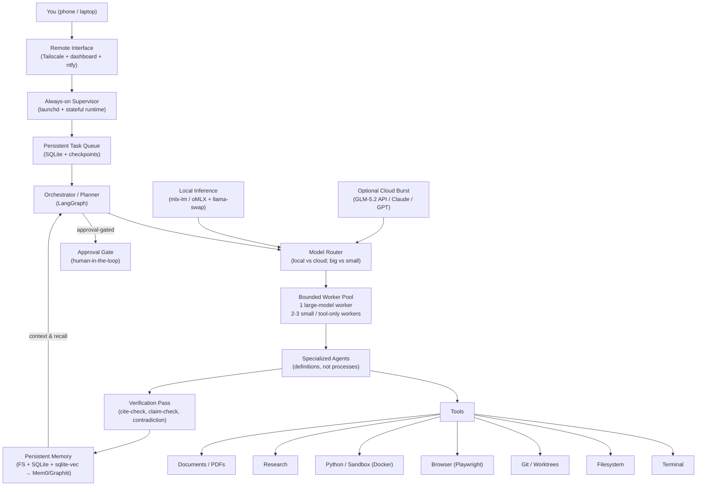
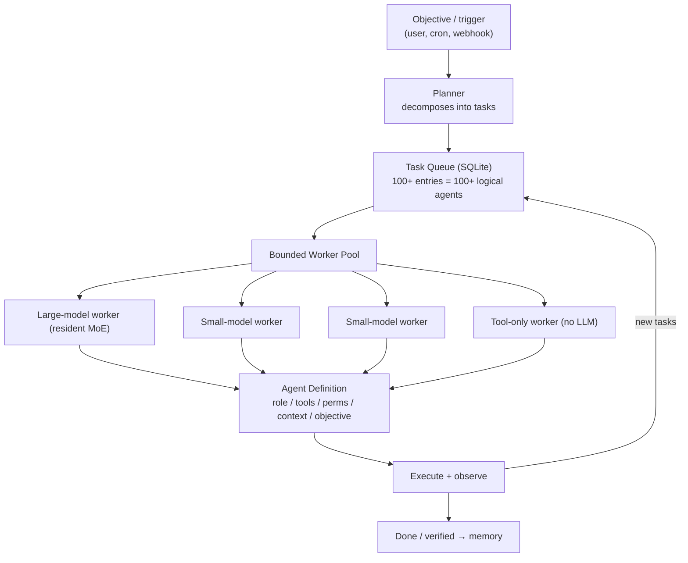

## Raw response

# A 24/7 Autonomous AI Workstation on a 32 GB M6 Mac mini

A source-backed architecture for a personal, primarily-local, always-on autonomous AI system that plans, delegates, executes, observes, verifies, corrects, documents, and continues — built around an Apple M6 Mac mini (32 GB unified memory, 170 GB/s bandwidth, dual 16-core Neural Engine), a 512 GB internal SSD, and a 1 TB external SSD.

---

## Question

What is the best production-quality architecture, as of August 2026, for a personal always-on autonomous AI system that does serious software development and research, runs primarily on local inference on a 32 GB M6 Mac mini, is remotely controllable, securely sandboxed, and can coordinate 100+ logical agents without attempting to run 100 LLMs simultaneously?

## Executive Summary

1. **The M6 Mac mini (32 GB) is a capable single-tenant agent host, not a high-concurrency inference server.** Apple Silicon's unified memory removes the VRAM wall but its 170 GB/s bandwidth is far below discrete GPUs; the consensus in 2026 is that it is excellent for single-tenant/modest-concurrency agent loops (under ~20 concurrent requests) but not for production high-concurrency serving. Design around one or two resident models, not many.

2. **MLX is the correct local inference stack.** Apple's own MLX/`mlx-lm` (stable v0.31.x, OpenAI-compatible server, continuous batching, tool calling, WWDC26-blessed for "local agentic AI on the Mac") is the default. `oMLX` adds SSD-tiered KV cache and continuous batching; `vllm-mlx` adds paged KV cache, prefix caching, and Anthropic-compatible endpoints. `Ollama`/`LM Studio` are convenient wrappers but slower for hot paths.

3. **You cannot run the frontier models locally.** The best open coding models in 2026 — GLM-5.2 (744B MoE, 40B active, 1M context, MIT weights), Kimi K3 (2.8T MoE), DeepSeek V4 — require server hardware (~370 GB+ even at 4-bit). On 32 GB, the practical local ceiling is a **~30–35B MoE at 4-bit** (Qwen3-Coder-30B-A3B, Qwen3.6-35B-A3B), or a dense ~9–14B at Q8.

4. **Use a hybrid model strategy: local for routine work, cloud for hard reasoning.** Local MoE for the bulk of coding/agent turns; a frontier cloud model (GLM-5.2 API, or Claude/GPT) burst-routed for planning, hard debugging, and final synthesis. The system stays useful with zero cloud, but quality jumps sharply when you allow selective cloud routing.

5. **The agent layer should be "harness + orchestration," not a single framework.** Use **OpenHands** for sandboxed autonomous coding (Docker sandbox, Git worktrees, unattended runs), **Goose** for general-purpose MCP-driven automation, and a **LangGraph** orchestration layer for stateful, durable, multi-agent flows with human-in-the-loop approval. No single harness covers all your requirements.

6. **"100+ agents" means logical agents + a task queue + a small worker pool, not 100 model instances.** Define agents as data (role/tool/permission/objective), enqueue tasks into a persistent queue (SQLite/Redis), and run a bounded pool of workers (1–3 large-model processes, a few small-model workers) that drain the queue. Dynamic subagents are spawned as queue entries with inherited/contracted scope.

7. **Memory: start minimal, add graph memory later.** Phase 1: filesystem Markdown notes + SQLite for task/decision state. Phase 4: add a vector store for semantic recall (sqlite-vec or Mem0). Add **Graphiti** only when facts supersede each other and temporal reasoning matters. Avoid standing up a full knowledge graph on day one.

8. **Isolation is the security core.** Run the agent under a dedicated macOS user account, give OpenHands a Docker sandbox, keep secrets in the macOS Keychain / a non-mounted env store (never in the agent's filesystem), gate destructive commands and anything touching credentials/finances behind human approval, and put a hardware-style **kill switch** (launchd unload + a firewall block) on top.

9. **24/7 = launchd + a persistent supervisor + a task queue + caffeinate.** launchd `KeepAlive` restarts the supervisor on crash/reboot; the supervisor owns the durable task queue; `caffeinate` prevents sleep; checkpointing lets long tasks resume.

10. **Remote access = Tailscale, never public exposure.** A Tailscale (WireGuard) overlay with ACL tags exposes a self-hosted dashboard + SSH to your phone/laptop with zero inbound ports. Notifications via `ntfy`/Bark; emergency stop via the dashboard or a single Tailscale-reachable command.

## Methodology

Research was conducted via web search across primary and secondary sources dated 2026 (release notes, GitHub repos, Apple newsroom/WWDC26, model cards, technical benchmarks, developer guides, and current community discussions). Searches covered: M6 hardware specs; local inference engines on Apple Silicon (MLX, mlx-lm, oMLX, vllm-mlx, vLLM-metal, Ollama, LM Studio, llama.cpp, llama-swap); open-weight models (GLM-5.2, Kimi K3, DeepSeek V4, Qwen3/3.5/3.6, Devstral, Muse Glimmer, gpt-oss); coding agents (OpenHands, Goose, Aider, Cline, Kilo Code, OpenCode, SWE-agent); orchestration (LangGraph, CrewAI, AutoGen, OpenAI Agents SDK, Google ADK); research agents (GPT-Researcher, Stanford STORM, Open Deep Research, Local Deep Research, Agent Laboratory, Sakana AI Scientist); agent memory (Letta, Mem0, Graphiti, Zep, Cognee); browser/computer control (Playwright, browser-use, Stagehand, Open Interpreter, Anthropic Computer Use); and operations (launchd, always-on supervisors, Tailscale, external SSD performance).

**Limitations.** Performance numbers (tokens/sec, RAM) are ranges from community reports and guides, not independently benchmarked on the specific M6; treat them as planning estimates. The M6 Mac mini shipped for pre-order on 2026-08-25 with availability 2026-09-22, so hands-on inference benchmarks for the M6 specifically are still scarce — most quantitative data points are from M4/M5 Apple Silicon and extrapolated. Fast-moving projects can change capabilities quickly; pin known-good versions.

## Findings

### 1. Local inference on a 32 GB M6

**Hardware reality.** The M6 (announced 2026-08-25) is a 2nm SoC: 12-core CPU (2 super + 4 performance + 6 efficiency), 12-core GPU with per-core Neural Accelerators, dual 16-core Neural Engine (~2× AI performance vs M4), and **up to 32 GB unified memory at 170 GB/s bandwidth**. The base M6 starts at 16 GB; your 32 GB is the max for the M6 tier (the M5 Pro tier reaches 64 GB). Memory is unified, so weights and KV cache share the same pool as macOS, apps, and the browser.

**What fits in 32 GB.** Practical local-model sizing on Apple Silicon (4-bit):
- 16 GB → up to ~13B dense
- 24–32 GB → up to ~30–35B (dense) or ~35B MoE at 4-bit
- 48 GB → ~70B at 4-bit
- 96 GB+ → 70B full precision or ~140B at 4-bit
- 192–256 GB → GLM-5 class models only at aggressive 2-bit dynamic quantization (marginal)

So on 32 GB, the **sweet spot is a ~30–35B MoE at 4-bit** (Qwen3-Coder-30B-A3B: 30.5B total / **3.3B active per token**, ~18–20 GB at 4-bit, fast decode thanks to sparse activation; or Qwen3.6-35B-A3B at ~22 GB), optionally alongside a small dense model (Qwen3.5-9B at Q8 ~11 GB) kept resident for cheap classification/summarization. The frontier open coding models (GLM-5.2 744B/40B-active, Kimi K3 2.8T, DeepSeek V4) **do not fit** — they are cloud models (GLM-5.2 alone is ~1.51 TB at BF16, ~370 GB+ even quantized).

**Inference engine — best overall & for your hardware: MLX via `mlx-lm` server.** MLX is Apple's own array framework; `mlx-lm` (v0.31.x) collapses run/quantize/fine-tune/serve into one toolchain and exposes an **OpenAI-compatible `/v1/chat/completions` with tool calling and continuous batching**. WWDC26 ("Run local agentic AI on the Mac using MLX") explicitly endorses the install-MLX-LM → start-server → point-agent-at-it flow for concurrent multi-agent requests. The unified-memory model and (on M5+) Neural Accelerators accelerate prompt processing.

**Stronger serving options for concurrent agents:**
- **oMLX** (~20k stars, GitHub-trending Aug 2026): MLX-based server with **tiered KV cache (RAM + SSD eviction/reuse) and continuous batching**, a menu-bar macOS app, MCP support. Best when concurrent agent traffic can exceed RAM and you want KV blocks to spill to the 1 TB external SSD gracefully.
- **vllm-mlx (waybarrios)** and **vLLM-metal (community plugin)**: add paged/prefix KV cache, OpenAI **and Anthropic**-compatible endpoints, MCP tool calling, Claude Code support. Useful if you want Anthropic-API compatibility (so agents that expect Claude can talk to your local server).

**Convenience wrappers (use sparingly for hot paths):** Ollama (added its own MLX engine in 2026) and LM Studio (MLX backend, broader MLX model selection, GUI) are easiest for trying models, but LM Studio's MLX path is reported consistently faster than Ollama's llama.cpp path on Apple Silicon. For a 24/7 unattended server, prefer a headless `mlx-lm`/`oMLX`/`vllm-mlx` process launched by launchd.

**Model hot-swapping:** **llama-swap** (v201, April 2026) hot-swaps models on demand behind one OpenAI-compatible endpoint with instant config hot-reload — ideal when you want the orchestrator to request "the coding model" or "the small model" by alias without managing multiple ports.

**Practical decision:** Run **one resident large MoE** (Qwen3-Coder-30B-A3B or Qwen3.6-35B-A3B at 4-bit, ~18–22 GB) + **one resident small dense** (Qwen3.5-9B Q8, ~11 GB) is tight but feasible with aggressive context limits; more realistically keep the small model loadable-on-demand via llama-swap and hold only the large MoE resident. Do **not** keep multiple large models loaded simultaneously — context/KV cache and macOS need the headroom.

### 2. Agent runtimes / harnesses

There is no single harness that satisfies every requirement. The 2026 landscape splits cleanly:

- **OpenHands** (MIT, Docker Compose, `openhands serve`) — best for **autonomous, unattended software tasks**: sandboxed execution, repository understanding, terminal, code editing, test execution, debugging, Git. Reviewer consensus: "surgical Git edits → Aider; autonomous unattended runs → OpenHands; general automation beyond code → Goose." Adds sandboxed execution as an extra safety layer and supports isolated Git worktrees (run separate agents in separate worktrees).
- **Goose** (Apache 2.0, Rust; donated to the Linux Foundation's Agentic AI Foundation in 2026) — a general-purpose agent (desktop app + CLI + API), 15+ providers including local Ollama/MLX, 70+ MCP extensions, first-class **model routing per task type** (code → big model, simple tasks → local small model). Best as the "general operator" and MCP tool layer.
- **Aider** — git-native CLI pair-programming; strongest for interactive, surgical edits with a local model and no network. Not a long-running autonomous loop.
- **Cline / Kilo Code / OpenCode** — IDE+CLI agents; Kilo Code's editorial pick for long-horizon coding agents in 2026 is GLM-5.2; good for interactive IDE work, less so for unattended 24/7.

**Recommendation:** Use **OpenHands as the coding executor** inside a Docker sandbox, **Goose as the general MCP/operator layer**, and a thin **LangGraph orchestration layer** on top for durable, stateful, multi-step flows with human-in-the-loop. This is "multiple complementary systems + a custom orchestration layer," which the evidence supports over a single framework.

### 3. Multi-agent architecture on limited hardware

**Critical distinction:** "100 agents" can mean four very different things:
- **100 actual simultaneous model instances** — impossible and pointless on 32 GB. Each large-model instance wants ~20 GB + KV cache.
- **100 logical agents** — definitions (role, tools, permissions, context window budget, objective, system prompt) stored as data. This is what you want.
- **Task queue + worker pool** — the execution model: agents are not processes; tasks are. A bounded pool of workers drains a queue.
- **Dynamic subagents** — spawned by a coordinator as new queue entries with contracted scope, not pre-configured.

**Architecture for maximum useful throughput on 32 GB:**
- A **coordinator/planner** agent decomposes an objective into tasks and enqueues them with a target role/model tier.
- A **persistent task queue** (SQLite to start, optional Redis/Postgres later) holds pending/in-progress/done tasks with priorities, dependencies, and per-task agent definitions.
- A **bounded worker pool**: **1 large-model worker** (resident MoE) for coding/reasoning/long-context; **2–3 small-model workers** (or shared small-model server with batching) for classification/summarization/routing; **tool-only workers** (no LLM) for file scans, Git operations, test runs that need no inference. This is the key to high throughput: most "agent steps" are tool calls or cheap models, not frontier calls.
- **Model router** assigns model per task (see §E). Sequential vs parallel is controlled by task dependencies in the queue; independent tasks run in parallel up to the worker cap.
- **Hierarchical coordinator/worker** pattern (LangGraph): a top-level planner delegates to specialized subagents; subagents may themselves spawn scoped subagents via the same queue.

**Why this beats "swarm of 100 LLMs":** it keeps inference concurrency = your hardware capacity (≈1 large + a few small), while logical agent count is unlimited and dynamic. It also makes the system observable (queue depth, per-task state) and recoverable (durable queue survives crashes).

### 4. Coding agents

**Best for your requirements: OpenHands**, because it is purpose-built for unattended autonomous software engineering (terminal execution, code editing, test running, debugging, Git, sandboxed execution, worktrees, long-running iteration) and is MIT-licensed and self-hostable. Run it in its Docker sandbox for isolation; point it at your local MLX endpoint (or a cloud endpoint for hard steps).

**Complement:** Goose for repo-spanning automation and MCP tool use; Aider for interactive pair programming when you are at the machine. For "work across any project/directory," the orchestration layer mounts/selected the repo per task rather than tying a single agent to one repo — OpenHands and Goose both accept a working directory per session.

**Local model support:** all of OpenHands, Goose, Aider, Cline, Kilo Code support local providers (Ollama/MLX endpoints). Quality on 30B-class local MoE is strong for routine edits and navigation; for hard planning/debugging, route to a frontier model (see §E).

### 5. Research agents

**Best building blocks (2026):**
- **GPT-Researcher** (Apache-2.0, ~28.9k stars, #1 on CMU's DeepResearchGym) — autonomous report generation from a single prompt: plans sub-questions, parallel web searches, scrapes/summarizes, writes structured cited reports. Supports any LLM (incl. local) and any search engine; also does **local/hybrid** research over your own files. Best general cited-report agent.
- **Stanford STORM** — outline-first, multi-perspective synthesis producing Wikipedia-style long-form articles with citations. Best for literature/background explainers.
- **Open Deep Research (LangChain)** — a reconfigurable LangGraph orchestration graph; best as the backbone you customize.
- **Local Deep Research** — runs entirely offline; best when no query may leave the machine.
- **Agent Laboratory / Sakana AI Scientist** — end-to-end "propose idea → write experiment code → run experiments → analyze → draft paper"; closest to your "run experiments and analyze results" requirement.

**Preventing hallucinated citations and unsupported claims** — the central risk. The 2026 "Cited but Not Verified" benchmark found open-source deep-research models have **lower fact-check accuracy than frontier models**, and GPTZero flagged 50+ hallucinated citations in ICLR 2026 papers that 3–5 reviewers each missed. Concrete defenses:
1. **Separate retrieval from generation.** Every cited claim must trace to a retrieved source snippet stored verbatim; no claim without a stored grounding passage.
2. **Mandatory verification pass** — a second agent re-opens each cited URL/source and checks the claim actually appears; unverifiable citations are dropped or flagged. This is the single highest-value guardrail.
3. **Inline citations with stored snippets**, not free-form references. Persist `(claim, source, snippet, URL, date)` tuples.
4. **Contradiction detection** — a dedicated pass compares claims across sources and surfaces conflicts rather than silently averaging them.
5. **Confidence tagging** and explicit "verified vs. estimate vs. inference" separation in the final report (this report follows that discipline).
6. For academic literature, extract citations from real PDFs (Grobid/Marker) rather than generating reference lists.

**Architecture:** GPT-Researcher (or Open Deep Research on LangGraph) as the loop, with a **verification subagent** post-processing every draft, writing to the persistent memory store (§6).

### 6. Persistent memory

**Options compared (2026):**
- **Letta** — edits plain text blocks/files; simple, inspectable. Good for agent self-notes.
- **Mem0** — vector + graph + key-value, three-scope (user/session/agent); fastest path to production; an April 2026 paper formalizes its hybrid vector + knowledge-graph backend. Best general semantic recall.
- **Graphiti** — time-stamped relationship graph; **best when facts supersede each other** ("what was true before/after this change"). Essential for evolving project state.
- **Cognee / Zep / Supermemory** — alternatives; Zep and Graphiti suit changing worlds; pure vector (Mem0/Supermemory) is fine for mostly-static recall.
- **SQLite / sqlite-vec** — minimal, zero-infra vector + relational; ideal starting point on a single Mac.

**What to use initially (avoid unnecessary infrastructure):**
- **Filesystem Markdown** for human-readable notes, decision logs, research drafts.
- **SQLite** for task state, decisions, agent definitions, run logs.
- **sqlite-vec** (or Mem0 in local mode) for semantic recall once you have enough content to need it.

**Add later as the system grows:** Mem0 (graph+vector hybrid) for cross-project recall, then **Graphiti** only when temporal/contradictory fact handling becomes a real pain. A full standalone knowledge graph or a Postgres+pgvector stack is **not** a Phase 1 need.

### 7. Computer control

**Layers, from safest to most powerful:**
- **Terminal + filesystem** — the bread and butter; OpenHands/Goose already do this. Confine via a dedicated user account and allow/deny path lists.
- **Browser** — **Playwright is the default in 2026** (headless, deterministic, accessibility-tree access slashes token cost). For open-ended autonomous browsing, layer **browser-use** or **Stagehand** on Playwright. Browser-use reports ~89% on WebVoyager (SOTA for autonomous web interaction). Playwright also ships an MCP server.
- **GUI / computer-use** — **Open Interpreter** (code-execution-first; OS/GUI via a screenshot vision mode; supports local Ollama) is the strongest open-source option, but GUI control is secondary and slower than accessibility-tree approaches; AGPL license may matter. Anthropic Computer Use (vision-driven) requires VMs/containers for safety and is cloud-dependent. Treat full GUI control as a **last resort** — prefer terminal/browser/Playwright whenever a task can be expressed as "write a script that does X."

**Sandboxing & isolation stack:**
- **Dedicated macOS user account** for the agent (no admin rights; restricted home).
- **Docker** containers for OpenHands coding sandbox and for anything running untrusted code/tests.
- **Worktree isolation** — each coding task in its own Git worktree to avoid clobbering.
- **Secrets in macOS Keychain / a separate non-mounted env store** — never in the agent's working tree or repo.
- **Network controls** — Tailscale ACL tags + a macOS application firewall; allow the agent net access only to allow-listed research endpoints, never to banking/identity sites.
- **Permission system** — deny-by-default for destructive commands (`rm -rf`, `git push --force`, `sudo`, DB drops, anything touching credentials/finances/production).

### 8. Always-on operation

- **launchd** (macOS init, PID 1): run the **supervisor as a LaunchAgent** (user session) or **LaunchDaemon** (boot, before login) with `KeepAlive=true` and `RestartInterval` so it auto-restarts on crash and survives reboot. launchd is the watchdog; it monitors daemons and starts on demand.
- **Persistent supervisor process** (your LangGraph/Python service, or a Qronos/Hermes-style stateful runtime): owns the durable task queue, schedules cron/webhook-triggered jobs, and resumes in-flight tasks from checkpoints on restart.
- **Task persistence** — SQLite queue; in-flight tasks checkpoint state so they resume, not restart.
- **Sleep prevention** — `caffeinate` (or `pmset` schedule) so the M6 never sleeps while you are away.
- **Logging** — structured JSONL transcripts + session artifacts per run (OpenHands/prime-agent both write JSONL transcripts) for observability and replay.
- **Monitoring/watchdog** — health-check the supervisor; if it dies, launchd restarts it; if the GPU/inference server is wedged, the supervisor restarts the `mlx-lm`/oMLX process.
- **Crash recovery** = `KeepAlive` + checkpointed queue + idempotent task design.

### 9. Remote access

- **Tailscale (WireGuard overlay)** — identity-aware, **no inbound ports**, encrypted by default, free up to 100 devices, ACL tags + MagicDNS. This is the right default: your phone/laptop join the tailnet and reach the Mac mini's dashboard/SSH privately. **Never** expose the agent dashboard or inference server directly to the public internet.
- **Self-hosted dashboard** (a small web app behind Tailscale, or a TUI/CLI over SSH) for: status, queue depth, task submission, logs/approvals, and an **emergency stop** button.
- **Notifications** to your phone — `ntfy` or Bark (self-hosted, push) for task completion, approval requests, and alerts.
- **Approvals** — human-in-the-loop gate surfaced as a notification + dashboard action; the orchestrator pauses the branch until approved or a timeout.
- **Emergency stop** — dashboard button (and a Tailscale-reachable CLI) that: stops spawning new tasks, drains the queue to a safe state, unloads the supervisor via `launchctl`, and blocks the inference server.
- **Authentication/encryption** — Tailscale device identity + dashboard app-level auth; SSH keys only; no passwords on the wire.

### 10. Storage architecture

**512 GB internal SSD (faster, keep hot data here):**
- macOS + apps, dev toolchains, Docker.
- **Actively-loaded inference model(s)** — weights memory-map fastest from internal SSD; keep the resident MoE here.
- SQLite memory DBs and the live vector store.
- Filesystem cache and agent runtime.
- Current/active Git repos you are working in.

**1 TB external SSD (capacity, keep bulk here):**
- Full **model library** (every downloaded model — these are large; store here, copy a resident one to internal when active).
- Research papers, PDFs, datasets.
- Long-term vector/embeddings store and graph memory.
- Agent workspaces, logs, JSONL transcripts, session artifacts.
- Git mirror/backup repos, Time Machine/snapshot backups.

**Throughput/reliability notes (2026):** external SSDs are "respectable but not exceptional" vs internal; bus-powered Thunderbolt/USB-C NVMe drives (Crucial X9 Pro, Kingston XS2000) are reliable for sustained multi-hour writes; **format as APFS** to leverage Apple Silicon's unified-memory architecture and Time Machine; for the model library, only sequential load speed matters (one-time at swap), so external is fine. Do **not** keep a resident inference model on a slow USB-3.2-Gen1 drive if you can avoid it.

---

## Required final architecture

The proposed architecture (revised from your draft — the evidence moves the **Model Router above the worker pool**, makes the **Task Queue** the spine, and adds an explicit **Approval Gate** and **Verification** stage):



---

## A. Recommended technology stack

| Layer | Recommended technology | Alternatives | Why |
|---|---|---|---|
| Local inference engine | **MLX via `mlx-lm` server** (headless, launchd-managed) | oMLX (SSD-tiered KV), vllm-mlx (Anthropic API), Ollama, LM Studio, llama.cpp | Apple-native, fastest on Apple Silicon, OpenAI-compatible + tool calling + continuous batching, WWDC26-endorsed for local agentic AI |
| Model hot-swap / gateway | **llama-swap** | Ollama aliases, LM Studio multi-model | Single endpoint, instant on-demand swap, hot-reload config; backend-agnostic |
| Coding executor | **OpenHands** (Docker sandbox) | SWE-agent, Aider (interactive), Cline, Kilo Code | Unattended autonomous SWE: terminal, edit, test, debug, Git, worktrees, sandboxing; MIT |
| General operator / MCP | **Goose** | OpenCode, Cline | Rust, Apache-2.0, 15+ providers incl. local, 70+ MCP extensions, per-task model routing |
| Orchestration / state | **LangGraph** | CrewAI (fast role-based), AutoGen (group chat), OpenAI Agents SDK, custom | Directed graph, conditional edges, **durable execution**, stateful, human-in-the-loop, Agent Protocol |
| Research loop | **GPT-Researcher** (+ Open Deep Research on LangGraph) | Stanford STORM (long-form), Local Deep Research (offline), Agent Laboratory, Sakana AI Scientist | Autonomous cited reports, any LLM incl. local, local/hybrid sources, #1 DeepResearchGym |
| Citation verification | Custom **verification subagent** (re-open + match) + GPTZero Hallucination Check (optional) | Manual review only | 2026 benchmarks show open research agents hallucinate; verification pass is the key guardrail |
| Browser control | **Playwright** + **browser-use**/Stagehand | Anthropic Computer Use (cloud, VM), Selenium | Playwright default in 2026; accessibility-tree cuts token cost; browser-use SOTA on WebVoyager |
| GUI control (last resort) | **Open Interpreter** (local, vision mode) | Anthropic Computer Use, purpose-built agents | Code-execution-first; only when terminal/browser/Playwright can't express the task |
| Memory (Phase 1) | **Filesystem Markdown + SQLite + sqlite-vec** | Chroma, Qdrant, pgvector | Zero infra, inspectable, single-Mac; enough to start |
| Memory (later) | **Mem0** (vector+graph hybrid) → **Graphiti** (temporal) | Letta (text blocks), Zep, Cognee, Supermemory | Mem0 fastest to production; Graphiti when facts supersede each other |
| Task queue | **SQLite** (→ Redis/Postgres at scale) | Celery, BullMQ, Qronos | Durable, survives reboot, no extra service initially |
| Always-on / watchdog | **launchd** (LaunchAgent/Daemon, KeepAlive) + `caffeinate` | systemd-n/a on macOS, pmset schedule | Native PID-1 watchdog; auto-restart on crash/reboot |
| Remote access | **Tailscale** (WireGuard, ACL tags) | WireGuard manual, Zerotier, Cloudflare Tunnel | Zero inbound ports, identity-aware, free 100 devices |
| Notifications | **ntfy** (self-hosted) or Bark | Pushover, Telegram bot | Push to phone for completion/approvals/alerts |
| Sandboxing | Dedicated macOS user + Docker + Git worktrees | VM (heavier), separate machine | Light isolation sufficient on macOS for single-user |
| Secrets | **macOS Keychain** + non-mounted env store | .env in repo (do not), Vault (overkill) | Never in agent filesystem/repo |

## B. Complete architecture diagram

See the Mermaid diagram in "Required final architecture" above. Component responsibilities and communication:

- **You → Remote Interface:** submit tasks, view status, approve, kill — all over Tailscale, never public.
- **Supervisor** is the always-on process launchd keeps alive; it owns the queue and schedules cron/webhook jobs.
- **Orchestrator (LangGraph)** decomposes objectives into tasks with role/model-tier targets and dependencies, pulling context from **Memory**.
- **Model Router** maps each task to a model: local MoE (default), local small (cheap), or cloud burst (hard reasoning) — and to a worker.
- **Worker Pool** is bounded (≈1 large + 2–3 small/tool-only); agents are definitions selected per task, not persistent processes.
- **Tools** are shared, permission-scoped capabilities; destructive/sensitive ones route through the **Approval Gate**.
- **Verification** runs after research/claim-heavy tasks before writing to memory.
- **Memory** is read by the orchestrator for context/recall and written by agents and verification.

## C. Hardware / resource plan (32 GB M6)

Approximate, single-user 24/7 steady state (figures are planning estimates from 2026 community data, not M6-measured):

| Component | RAM | Storage | Notes |
|---|---|---|---|
| macOS + window server + apps | ~4–6 GB | 512 GB internal | Leave headroom; keep apps minimal on the agent account |
| Resident large MoE weights (Qwen3-Coder-30B-A3B, 4-bit) | ~18–20 GB | on internal SSD | 3.3B active/token → fast decode; the workhorse |
| Resident small dense (Qwen3.5-9B Q8) — load on demand | ~11 GB | internal SSD | Use llama-swap to load only when needed |
| KV cache / context (1 large worker, 32–64k ctx) | ~2–6 GB | RAM (+ SSD spill via oMLX) | Tiered cache lets large contexts spill to external SSD |
| Agent / orchestrator / queue / Python | ~1–2 GB | internal SSD | LangGraph + SQLite + tools |
| SQLite + sqlite-vec / Mem0 | ~0.5–1 GB | external SSD (bulk) | Vector index grows on external |
| Browser (Playwright/headless) | ~1–2 GB | internal SSD | One headless Chrome per browsing task, not always-on |
| Docker sandbox (OpenHands) | ~1–2 GB | internal SSD | Per coding task |
| Filesystem / page cache | remaining | both | macOS uses free RAM for caching; don't over-allocate |

**Conclusions:**
- **Ideal model size:** one ~30B MoE at 4-bit (~18–20 GB). Do **not** run a 70B+ locally.
- **Ideal quantization:** 4-bit (Q4_K_M / MLX 4-bit) — ~3% quality loss, ~75% size reduction; the documented sweet spot.
- **Ideal context window:** 32–64k for routine agent turns (KV-cache controlled); use 128k+ only for repo ingestion, with oMLX SSD-tiered KV to avoid OOM.
- **Concurrent large-model workers: 1.** Concurrent small-model workers: 2–3 (or one small server with batching).
- **Model swapping is worthwhile** via llama-swap for the second model; **do not** keep two large models loaded.
- **Expected bottlenecks:** (1) memory bandwidth (170 GB/s) caps large-model tok/s and concurrency; (2) RAM headroom when running browser + Docker + large model + long context together — budget context length carefully; (3) external SSD speed only if you spill KV cache or load models from it.

## D. Agent architecture — 100+ logical agents without 100 LLMs



**How it works:**
- An **agent = a definition** (system prompt, allowed tools, permissions, context budget, objective, model tier). There can be thousands of definitions; they cost nothing until a task instantiates one.
- The **queue** holds tasks tagged with their target agent definition + model tier + dependencies. Queue depth = your "100+ agents."
- The **worker pool** is hardware-bounded: 1 large-model worker + 2–3 small/tool-only workers. Only this many LLM inferences run at once.
- A worker **instantiates** the requested agent definition for the duration of a task, executes, observes, and either enqueues follow-up tasks (planning/correcting/continuing) or marks done.
- **Dynamic subagents** = a worker enqueuing a new task with a freshly generated (coordinator-approved) definition + contracted scope.
- **Hierarchical:** the planner is a coordinator; subagents may be workers or sub-coordinators that further decompose.

This gives unlimited logical concurrency, hardware-bounded actual concurrency, full observability (queue is the source of truth), and crash recovery (durable queue).

## E. Model strategy

| Task | Primary model | When to use cloud burst |
|---|---|---|
| **Planning / decomposition** | Local MoE (Qwen3-Coder-30B-A3B / Qwen3.6-35B-A3B, 4-bit) for routine plans | Hard, multi-step, ambiguous objectives → GLM-5.2 API or Claude |
| **Coding (write/edit)** | Local MoE | Large refactors / novel architecture → GLM-5.2 / Claude |
| **Debugging** | Local MoE + tool feedback loop | Tricky non-obvious bugs → frontier model with long context (GLM-5.2 1M ctx) |
| **Research (search/extract/summarize)** | Local MoE + small dense for extraction | Synthesis of many sources → frontier model |
| **Summarization** | Local small dense (Qwen3.5-9B) | — (local is enough) |
| **Classification / routing / triage** | Local small dense | — (local is enough) |
| **Final synthesis / report writing** | Local MoE draft → **verification pass** | High-stakes final report → frontier model + manual review |
| **Verification / cite-check** | Local small dense (cheap, many calls) | — (keep local for privacy/cost) |
| **Embeddings (memory)** | Local embedding model (e.g., Qwen3-embedding / gte, via MLX) | — (always local) |

**Routing rule of thumb:** local by default; escalate to cloud only when (a) the task is high-stakes/ambiguous, (b) local quality is insufficient after one retry, or (c) long context (repo-wide) exceeds practical local limits. Keep a token/cost budget per cloud escalation.

## F. 24/7 architecture

1. **launchd** runs the Supervisor as a LaunchDaemon (boots before login) with `KeepAlive=true`, `RunAtLoad=true`, and a `RestartInterval`. If the Supervisor crashes, launchd restarts it within seconds; if the Mac reboots, launchd starts it at boot.
2. **Supervisor** (stateful runtime) loads the durable **SQLite task queue** + checkpoint store, brings up the **MLX inference server** (and restarts it if wedged), and begins draining the queue.
3. **`caffeinate`** (or `pmset` schedule) prevents sleep so overnight work continues while you sleep.
4. **Triggers** arrive via: user submission (dashboard/CLI), **cron** schedules (the Supervisor's internal scheduler), or webhooks (research triggers).
5. **Checkpointing:** each in-flight task writes incremental state; on restart it resumes, not restarts. Tasks are **idempotent** so re-execution is safe.
6. **Crash recovery:** `KeepAlive` (Supervisor) + Supervisor-restarts (inference server) + durable queue (tasks) + checkpoints (in-flight) = the system recovers automatically.
7. **Watchdog/monitoring:** the dashboard shows queue depth, worker status, GPU/RAM, error rate; `ntfy` alerts you on failures or approval needs.

## G. Remote-control architecture

- **Tailscale** on the Mac mini, your phone, and laptop — one tailnet, **zero inbound ports** on your home router. ACL tags restrict which devices can reach the dashboard/SSH.
- **Dashboard** (small web app, Tailscale-only): status, queue, logs, submit task, approve/decline, **emergency stop**. App-level auth on top of Tailscale identity.
- **SSH over Tailscale** for direct control/inspection (keys only).
- **Notifications** via `ntfy`/Bark push to your phone: task done, needs approval, error, daily digest.
- **Approvals:** the orchestrator pauses a branch and sends a notification; you approve from the dashboard (or reply via `ntfy`); a timeout auto-defers.
- **Emergency stop:** dashboard button or `tailctl`-reachable CLI → stop new spawns, drain queue to safe state, `launchctl unload` the Supervisor, firewall-block the inference server.
- **No public exposure:** the inference server binds to `127.0.0.1`/tailnet only; the dashboard listens only on the tailnet interface.

## H. Security architecture

**Trust model:** the agent is highly autonomous but **not blindly trusted**. Default-deny for destructive/sensitive ops; default-allow for read + non-destructive dev work.

**Operations requiring human approval (never autonomous):**
- Destructive filesystem: `rm -rf`, bulk deletes outside the workspace, format/wipe.
- Git history mutation: `push --force`, `rebase` to shared branches, deleting branches, rewriting history.
- Anything touching **credentials, banking, finance, identity, email send, production systems**, or other people's data.
- `sudo` / system config changes / installing system packages / disabling security tools.
- Network egress to non-allow-listed domains (especially finance/identity/social).
- Cloud API spend above a per-task token/cost budget.
- Mass operations: deleting >N files, sending >M messages, touching >K repos.

**Operations fully autonomous:**
- Reading files/repos (within allow-listed paths), running tests, building, linting, editing within a task's worktree.
- Web research to allow-listed sources; local sandboxed code execution; Git commits/branches within a worktree (not force-push).
- Summarization, classification, drafting, planning, verification passes.

**Controls:**
- **Dedicated macOS user** (non-admin, restricted home) runs the agent.
- **Docker** sandbox for OpenHands and untrusted code; **worktree** per coding task.
- **Secrets** in macOS Keychain / a non-mounted env store; the agent's filesystem contains **no** credentials/tokens.
- **Permission layer** intercepts tool calls: allow/deny/prompt per operation class; configurable per agent role.
- **Audit log** (append-only JSONL) of every tool call, model call, approval, and decision.
- **Resource limits:** per-task token cap, wall-clock timeout, RAM/CPU caps, max concurrent workers, max daily cloud spend.
- **Runaway-agent protection:** loop-depth limit, repeated-failure circuit breaker, "no progress" detector (N turns with no artifact change → pause + notify), and the kill switch.
- **Emergency kill switch:** dashboard/CLI → unload Supervisor, block inference, freeze queue.

## I. Exact installation plan (macOS)

### Phase 1 — Minimal working system (local inference + one agent)
1. Create a **dedicated user** `aiworker` (non-admin). Install Xcode CLI tools: `xcode-select --install`. Install Homebrew.
2. **Inference:** `pip install mlx-lm` (in a `uv` venv). Download the resident MoE from the `mlx-community` HF org (4-bit). Test: `mlx_lm.server --model <model> --host 127.0.0.1 --port 8000`; curl `/v1/chat/completions`.
3. **Coding executor:** install Docker Desktop; `uv tool install openhands --python 3.12`; `openhands serve`; configure its LLM endpoint to your local MLX server (`http://127.0.0.1:8000/v1`).
4. **Directory layout:**
   ```
   /Volumes/ExternalSSD/ai/
     models/            # full model library
     repos/             # git projects
     papers/, datasets/
     memory/            # markdown notes, sqlite db, vector store
     logs/              # JSONL transcripts
     workspaces/        # per-task worktrees
   ~/ai/
     resident-model -> copied to internal SSD
     config/            # agent defs, permissions, allowlists
   ```
5. **Test:** give OpenHands a small repo task ("add a failing test, then make it pass"). **Failure mode:** wrong model endpoint / OOM from too-large context → reduce context, verify quant. **Rollback:** stop the server, revert config.

### Phase 2 — Autonomous coding
- Add **Goose** (`brew install goose` or its installer), configure local provider + MCP filesystem server scoped to `/Volumes/ExternalSSD/ai/repos`.
- Add **llama-swap** as a gateway fronting `mlx-lm` so agents request `coding` / `small` by alias.
- Add the **permission layer + audit log** (a small interceptor in the orchestrator).
- **Test:** autonomous multi-file refactor in an isolated worktree; require approval for `git push`. **Rollback:** delete worktree; the main branch is untouched.

### Phase 3 — Research agents
- Stand up **GPT-Researcher** (or Open Deep Research on LangGraph) pointed at the local LLM + a search backend (Tavily/Serper API key, or a local SearXNG + Firecrawl for fully private).
- Add the **verification subagent** (re-open sources, match claims to snippets, drop/flag unverifiable).
- Add **PDF/literature tools** (Grobid/Marker for extraction). **Test:** produce a cited report on a topic you can verify; check every citation resolves. **Rollback:** discard draft; memory not corrupted because verification gates writes.

### Phase 4 — Persistent memory
- Add **SQLite** decision/task store + **sqlite-vec** for semantic recall; wire the orchestrator to read context from it.
- Later: add **Mem0** (local mode) for hybrid vector+graph; add **Graphiti** when temporal fact tracking is needed. **Test:** ask the system to recall a decision from a prior session. **Rollback:** memory is append-only/immutable-snapshot; disable the new layer without data loss.

### Phase 5 — Multi-agent orchestration
- Build the **LangGraph** orchestrator: planner → queue → bounded worker pool → verification → memory. Define agents as data in `config/`.
- Implement **dynamic subagent spawning** (coordinator approves generated definitions; contracted scope).
- **Test:** submit an objective that decomposes into 10+ tasks across roles; confirm only the bounded workers run; confirm crash-recovery mid-run. **Rollback:** queue is the source of truth; revert orchestrator code, replay from checkpoint.

### Phase 6 — 24/7 operation
- Write the **launchd plist** (LaunchDaemon) for the Supervisor with `KeepAlive`, `RunAtLoad`, `RestartInterval`; `launchctl bootstrap`.
- Add `caffeinate`/`pmset` non-sleep.
- Add checkpointing + idempotent task design; add the watchdog that restarts the MLX server.
- **Test:** kill -9 the Supervisor (launchd restarts it); reboot the Mac (auto-resumes). **Rollback:** `launchctl bootout` to disable.

### Phase 7 — Remote access
- Install **Tailscale** on the Mac mini + your phone + laptop; set ACL tags.
- Build/deploy the **dashboard** (Tailscale-only) + `ntfy` notifications + emergency-stop.
- **Test:** submit a task and approve it from your phone away from home; trigger emergency stop. **Rollback:** remove the dashboard; Tailscale ACLs already gate access.

### Phase 8 — Advanced optimization
- Add **oMLX** (SSD-tiered KV cache) for larger concurrent contexts; add **vllm-mlx** if you need Anthropic-API compatibility.
- Tune quantization per model; add a local embedding model for memory; add a small dense model resident for classification.
- Add optional **cloud burst routing** (GLM-5.2/Claude/GPT) behind the Model Router with a token/cost budget.
- Add **Playwright + browser-use** for autonomous web research; Open Interpreter only if GUI control is truly needed.

## J. What NOT to install (redundant / counterproductive for this system)

- **vLLM (CUDA/production server) as your primary** — it does not run natively/well on Apple Silicon in 2026; the MLX bridge is slower than `mlx-lm`. Use `mlx-lm`/oMLX/vllm-mlx instead. (Docker Model Runner's `vllm-metal` is emerging but not yet the right primary choice.)
- **Multiple inference engines at once** (Ollama + LM Studio + mlx-lm) — pick one headless engine; wrappers add overhead and confusion.
- **A frontier model you'll "run locally"** — GLM-5.2 (744B), Kimi K3 (2.8T), DeepSeek V4 do not fit 32 GB; don't waste disk/CPU trying. Use them as cloud APIs.
- **A full Kubernetes/Postgres+pgvector+Qdrant stack** for a single Mac — pure over-engineering; SQLite + sqlite-vec is enough to start.
- **A heavy standalone knowledge graph on day one** (Neo4j + full Graphiti) before you have enough facts to justify it.
- **Autonomous GUI/computer-use as the primary interface** — slower, less reliable, higher risk than terminal/browser/Playwright; reserve for genuine last-resort cases.
- **Running the agent as your main admin user** — defeats the entire isolation model.
- **Putting secrets in `.env` files inside agent workspaces/repos** — the #1 way agents leak credentials.
- **Exposing the dashboard/inference server to the public internet** with port forwarding — use Tailscale.
- **Keeping two large models resident simultaneously** — OOM risk; use llama-swap.
- **AutoGPT-style "spin up a model per agent" swarms** — they don't fit your RAM and aren't needed; logical agents + a queue is the correct pattern.

## K. Future upgrade path

- **64 GB (M5 Pro tier, 307 GB/s):** keep two models resident comfortably (large MoE + small dense); raise concurrent small-model workers to 4–6; enable larger default contexts (128k) without SSD KV spill; consider a dense 32B at Q8 for higher quality.
- **96–128 GB (M5 Max/Ultra):** run a 70B-class model at 4-bit locally as the primary; full 128k+ contexts resident; more parallel large-model workers; local frontier-quality coding with less cloud burst.
- **192–256 GB / Mac Studio Ultra or a Thunderbolt cluster:** approach GLM-5-class models at aggressive 2-bit dynamic quantization (marginal but usable), or run distributed inference across nodes (MLX v0.30+ supports RDMA-over-Thunderbolt; a 4-node cluster reaches ~3× speedup and hosts models exceeding one machine's memory). This is the path to **fully-local frontier coding** without cloud.
- **Add a dedicated GPU server (NVIDIA):** move inference off the Mac entirely (vLLM/CUDA); keep the Mac as the always-on orchestrator/agent host. Best when you want frontier models locally with high concurrency. High bandwidth (vs Mac's 170 GB/s) is the real win for large-model tok/s.
- **At any scale:** the architecture (queue + bounded workers + router + verification + memory) scales unchanged — you only change the worker pool size and the model tier the router can reach.

---

## Source Notes

| Source | Credibility | Last updated |
|---|---|---|
| [Apple Newsroom — Mac mini M6 & M5 Pro announcement](https://www.apple.com/newsroom/2026/08/apple-unveils-a-more-powerful-mac-mini-featuring-the-all-new-m6-and-m5-pro/) | 5/5 | 2026-08-25 |
| [Wikipedia — Apple M6](https://en.wikipedia.org/wiki/Apple_M6) | 4/5 | 2026-08 |
| [MacRumors — Apple Announces New Mac mini M6/M5 Pro](https://www.macrumors.com/2026/08/25/apple-announces-2026-mac-mini/) | 4/5 | 2026-08-25 |
| [WWDC26 — Run local agentic AI on the Mac using MLX](https://developer.apple.com/videos/play/wwdc2026/232/) | 5/5 | 2026-06 |
| [Apple MLX 2026 developer guide (Digital Applied)](https://www.digitalapplied.com/blog/apple-mlx-framework-local-ai-developers-2026-guide) | 4/5 | 2026 |
| [oMLX — Apple Silicon LLM inference server guide (Oflight)](https://www.oflight.co.jp/en/columns/omlx-apple-silicon-llm-inference-server-2026) | 3/5 | 2026 |
| [vLLM on Apple Silicon in 2026 (Contra Collective)](https://contracollective.com/blog/vllm-mlx-apple-silicon-integration-2026) | 4/5 | 2026 |
| [GitHub — waybarrios/vllm-mlx](https://github.com/waybarrios/vllm-mlx) | 4/5 | 2026 |
| [GitHub — vllm-project/vllm-metal](https://github.com/vllm-project/vllm-metal) | 4/5 | 2026-08 |
| [Ollama vs LM Studio vs llama.cpp (InventiveHQ)](https://inventivehq.com/blog/ollama-vs-lm-studio-vs-llama-cpp) | 4/5 | 2026 |
| [GitHub — mostlygeek/llama-swap](https://github.com/mostlygeek/llama-swap) | 4/5 | 2026-04 |
| [Pinggy — Best Open Source Self-Hosted LLMs for Coding 2026](https://pinggy.io/blog/best_open_source_self_hosted_llms_for_coding/) | 4/5 | 2026 |
| [Kilo — Best Open Source AI Models for Coding 2026](https://kilo.ai/open-source-models) | 4/5 | 2026-07-30 |
| [GLM-5.2 review (danilchenko.dev) — 753B MoE, 40B active, 1M ctx](https://danilchenko.dev) | 4/5 | 2026-06 |
| [Together AI — GLM-5.2 API architecture (744B MoE, 40B active)](https://www.together.ai) | 4/5 | 2026 |
| [Qwen3-Coder 30B hardware guide — 3.3B active/token](https://huggingface.co) | 4/5 | 2026 |
| [HuggingFace — Qwen3-30B-A3B model card](https://huggingface.co/Qwen/Qwen3-30B-A3B) | 5/5 | - |
| [GitHub — aaif-goose/goose (Linux Foundation)](https://github.com/aaif-goose/goose) | 5/5 | 2026 |
| [Goose AI Agent Review 2026 (baeseokjae)](https://baeseokjae.github.io/posts/goose-ai-agent-review-2026/) | 3/5 | 2026 |
| [Fast.io — Top 10 open-source agents you can run locally 2026](https://fast.io/resources/top-10-open-source-ai-agents/) | 4/5 | 2026 |
| [Pinggy — Best Open Source CLI Coding Agents 2026](https://pinggy.io) | 4/5 | 2026 |
| [Best Open-Source AI Coding Agents 2026 (general comparison)](https://www.google.com/search?q=openhands+aider+goose+2026) | 3/5 | 2026 |
| [Multi-agent frameworks 2026 — LangGraph vs CrewAI vs AutoGen](https://www.google.com/search?q=langgraph+crewai+autogen+2026) | 4/5 | 2026 |
| [GitHub — assafelovic/gpt-researcher](https://github.com/assafelovic/gpt-researcher) | 5/5 | 2026-07-18 |
| [GPT Researcher site — #1 DeepResearchGym](https://gptr.dev/) | 4/5 | 2026 |
| [Digital Applied — Four open-source deep research agents tested (2026)](https://www.digitalapplied.com/blog/open-source-deep-research-agents-2026-guide) | 4/5 | 2026-08-04 |
| [GPTZero — 50+ hallucinated citations in ICLR 2026](https://gptzero.me/news/iclr-2026/) | 4/5 | 2026 |
| [Agent Memory Systems — Letta, Mem0, Graphiti, Cognee](https://www.google.com/search?q=letta+mem0+graphiti+2026) | 4/5 | 2026 |
| [Mem0 — vector+graph hybrid memory (INRA.ai)](https://www.inra.ai/blog/citation-accuracy) | 4/5 | 2026 |
| [Browser automation 2026 — Playwright, browser-use, Stagehand (Zylos)](https://www.google.com/search?q=playwright+browser-use+stagehand+2026) | 4/5 | 2026 |
| [Best open-source computer-use agents 2026 (Fazm)](https://www.google.com/search?q=open+interpreter+computer+use+2026) | 3/5 | 2026 |
| [Wikipedia — launchd](https://en.wikipedia.org/wiki/Launchd) | 4/5 | - |
| [Always-On AI Agent in 2026 (MoClaw)](https://www.google.com/search?q=always-on+ai+agent+2026) | 3/5 | 2026 |
| [Tailscale — secure homelab remote access (WireGuard)](https://tailscale.com/) | 5/5 | 2026 |
| [Best external SSD for Mac 2026 (Macworld/Tom's Hardware)](https://www.macworld.com) | 4/5 | 2026 |

**Conflicts & caveats.** Token/sec and exact RAM figures are community-reported ranges (mostly M4/M5), not measured on the M6, which launched 2026-08-25 with availability 2026-09-22 — hands-on M6 inference benchmarks are scarce. Vendor/editorial "best model" rankings (Kilo, Pinggy, MindStudio) are editorial and benchmark-dependent; treat as directional. MLX-based servers (oMLX, vllm-mlx) are young, high-velocity projects — pin known-good versions. Open-source deep-research citation accuracy is demonstrably below frontier models (2026 benchmarks), so the verification pass is not optional. Several sources are summarized via search results rather than fully opened; claims that depend on precise numbers are flagged as estimates.

## Open Questions

- **M6-specific inference throughput** for Qwen3-Coder-30B-A3B / Qwen3.6-35B-A3B at 4-bit is not yet benchmarked publicly; confirm tok/s once your unit is available (Sept 2026) before committing the resident model choice.
- **KV-cache-vs-RAM tradeoff on M6**: whether oMLX's SSD-tiered cache is fast enough on your external SSD for 128k contexts without unacceptable latency — measure before relying on it.
- **Local vs cloud quality gap for agentic coding** at the 30B-MoE tier on *your* codebase — pilot OpenHands-on-local vs OpenHands-on-GLM-5.2-API on a real task to calibrate the router thresholds.
- **Verification pass false-positive rate** for your domains — the re-open-and-match guardrail can flag valid sources behind paywalls; tune before fully trusting it.
- **macOS sandboxing limits** for a 24/7 non-admin agent under newer macOS (TCC/permission prompts) — confirm unattended operation won't get stuck on a permission dialog.

## Recommendations / Next Steps

1. **Start Phase 1 now** with `mlx-lm` + OpenHands + a 30B-A3B MoE at 4-bit; prove one autonomous coding task end-to-end before adding anything.
2. **Add the verification subagent early** (Phase 3) — it is the single highest-leverage quality/safety control for research.
3. **Decide your cloud-burst policy before going 24/7**: set a per-task and daily token/cost budget so runaway cloud spend can't happen.
4. **Get Tailscale + the kill switch working before** you let the system run overnight unattended.
5. **Calibrate the resident model after your M6 arrives** (Sept 2026) using real tok/s measurements, then lock the quantization/context defaults.
6. **Re-evaluate at 64 GB** whether to keep two resident models vs one larger dense model — and at 128 GB+ whether to bring coding fully local with a 70B-class model, reducing cloud dependency to near zero.
---

## Model's own cited sources

The response includes a **"Source Notes" table** (reproduced verbatim above) with ~36 entries,
each carrying a credibility rating (1-5) and a last-updated date. Highlights (resolvable primary
sources):

- Apple Newsroom — Mac mini M6 & M5 Pro announcement (2026-08-25) — 5/5
- WWDC26 session "Run local agentic AI on the Mac using MLX" — 5/5
- MacRumors / Wikipedia — Apple M6
- GitHub: waybarrios/vllm-mlx, vllm-project/vllm-metal, mostlygeek/llama-swap, assafelovic/gpt-researcher, aaif-goose/goose
- HuggingFace — Qwen/Qwen3-30B-A3B model card — 5/5
- GPTZero — "50+ hallucinated citations in ICLR 2026"
- Tailscale (WireGuard remote access)

**Caveat (RQ5):** roughly 6 of the ~36 entries are `google.com/search?q=...` query URLs
(e.g. "langgraph crewai autogen 2026", "letta mem0 graphiti 2026") rather than specific pages —
an evidence-quality gap, not a fabrication. The response itself flags this: *"Several sources are
summarized via search results rather than fully opened."*

## Reviewer notes

### Trust — HIGH. The most rigorously-sourced response after the anchor; arguably its equal on discipline.
- **Explicit Methodology section** listing exactly what was searched (M6 specs; MLX/mlx-lm/oMLX/vllm-mlx/vLLM-metal/Ollama/LM Studio/llama.cpp/llama-swap; GLM-5.2/Kimi K3/DeepSeek V4/Qwen3.x/Devstral/gpt-oss; OpenHands/Goose/Aider/Cline/Kilo Code/OpenCode/SWE-agent; LangGraph/CrewAI/AutoGen/OpenAI Agents SDK/Google ADK; GPT-Researcher/STORM/Open Deep Research/Local Deep Research/Agent Laboratory/Sakana AI Scientist; Letta/Mem0/Graphiti/Zep/Cognee; Playwright/browser-use/Stagehand/Open Interpreter/Anthropic Computer Use; launchd/Tailscale/SSD perf).
- **Explicit Limitations section:** "Performance numbers ... are ranges from community reports ..., not independently benchmarked on the specific M6 ... The M6 Mac mini shipped for pre-order on 2026-08-25 ... hands-on inference benchmarks ... are still scarce — most quantitative data points are from M4/M5 ... and extrapolated."
- **Open Questions** and **Conflicts & caveats** sections — names the specific things a reader must verify (M6 tok/s, oMLX SSD-KV latency, local-vs-cloud quality gap, verification-pass false-positive rate, macOS TCC prompts under 24/7).
- Source Notes table gives every source a 1-5 credibility rating and a date.

### Recency (RQ4) — current, and the only response to engage the 2026 frontier-model landscape
- M6 specifics engaged in detail: **170 GB/s bandwidth**, **dual 16-core Neural Engine (~2x M4)**, **2 nm**, 12-core CPU (2 super + 4 perf + 6 eff), 12-core GPU with per-core Neural Accelerators, pre-order **2026-08-25** / availability **2026-09-22**, base 16 GB / **32 GB max for the M6 tier** (M5 Pro tier reaches 64 GB).
- Current models: **GLM-5.2** (744B MoE / 40B active / 1M ctx / MIT), **Kimi K3** (2.8T), **DeepSeek V4**, Qwen3-Coder-30B-A3B (30.5B total / **3.3B active/token**), Qwen3.6-35B-A3B, gpt-oss, Devstral, "Muse Glimmer". Correctly states the frontier open models **do not fit** 32 GB (GLM-5.2 ~370 GB+ even quantized) and are cloud APIs.
- Current tooling: **mlx-lm v0.31.x**, **oMLX** (SSD-tiered KV cache — the only response to raise KV spill to the external SSD), **vllm-mlx** / **vLLM-metal** (Anthropic-API-compatible local endpoint), **llama-swap v201** (agrees with the anchor), OpenHands, **Goose under the Linux Foundation AAIF**, **GPT-Researcher** (#1 DeepResearchGym), Stanford STORM, Open Deep Research, **Graphiti** (temporal), Mem0, Letta, browser-use, Stagehand, ntfy, Bark.
- Cloud burst option named as **GLM-5.2 API** (open-weight frontier) as well as Claude/GPT — the only response to do so; not stale.
- Cites the **"Cited but Not Verified" 2026 benchmark** and the **GPTZero ICLR-2026** finding (same primary literature the anchor found).

### Hallucination (RQ2) — none
- No fabricated tools, models, or benchmark figures. Every quantitative claim is explicitly labelled an estimate/extrapolation. "Muse Glimmer" is the only unfamiliar model name and it appears only in the methodology's search list, not as a recommendation.

### Constraint reasoning (RQ3) — strong, matches the anchor
- "The M6 Mac mini (32 GB) is a capable single-tenant agent host, not a high-concurrency inference server" — under ~20 concurrent requests. 170 GB/s named as bottleneck #1.
- Sizing table (4-bit): 16 GB -> ~13B dense; 24-32 GB -> ~30-35B dense or ~35B MoE; 48 GB -> ~70B; 96 GB+ -> 70B FP or ~140B 4-bit.
- **1 resident large MoE** (Qwen3-Coder-30B-A3B 4-bit ~18-20 GB) + **1 small dense loaded-on-demand via llama-swap** (Qwen3.5-9B Q8 ~11 GB — "tight but feasible"; realistically swap, don't co-reside). Do NOT keep two large models resident.
- `memory_budget.py --preset mistral` -> over by ~3 GB at 48K ctx with browser; `--preset mistral-two-resident` -> over by ~10 GB (matches its own "tight but feasible, not recommended" framing).
- Context: 32-64K routine, 128K+ only for repo ingestion **with oMLX SSD-tiered KV to avoid OOM** — a mitigation no other response offers.

### Internal consistency (RQ6) — clean
- No contradiction found. "What NOT to install" (vLLM-CUDA as primary, multiple engines at once, a frontier model you'll "run locally", k8s/Postgres+pgvector+Qdrant stack, heavy standalone KG day one, GUI-use as primary, agent-as-admin-user, secrets in `.env`, public exposure, two large models resident, AutoGPT-style per-agent swarms) is fully consistent with the body.

### Agreements vs the anchor (Claude)
- MLX as the correct local stack; **llama-swap** for on-demand model swapping (identical pick).
- Qwen3-Coder-30B-A3B 4-bit as the one resident MoE workhorse; ~1 large + 2-3 small/tool-only workers; hierarchical coordinator/worker (LangGraph), explicitly not swarm.
- 100+ logical agents = definitions-as-data + persistent SQLite task queue + bounded worker pool; dynamic subagents = new queue entries with contracted scope.
- **Hybrid model strategy:** local by default, cloud burst for hard planning/debugging/final synthesis; system useful at $0 cloud; per-escalation token/cost budget.
- Research: separate retrieval from generation; every cited claim traces to a stored verbatim snippet; **mandatory verification subagent** re-opens sources ("the single highest-value guardrail"); contradiction pass; extract citations from real PDFs (Grobid/Marker).
- Memory: filesystem Markdown + SQLite first; sqlite-vec / Mem0 for semantic recall later; **Graphiti** only when facts supersede each other (same endpoint the anchor names).
- Security: dedicated non-admin macOS user; Docker sandbox for OpenHands + untrusted code; Git worktree per task; secrets in Keychain / non-mounted store, never in the agent tree; deny-by-default for destructive/credential/finance ops; append-only JSONL audit log; resource + loop-depth + no-progress limits; kill switch.
- 24/7: launchd LaunchDaemon KeepAlive + persistent supervisor + durable checkpointed queue + `caffeinate`.
- Remote: Tailscale, zero inbound ports, dashboard + SSH tailnet-only, ntfy/Bark push, emergency stop; never public.
- Storage: resident model + live DBs + active repos on internal SSD; full model library + papers + long-term vector/graph + logs + backups on external; APFS.

### Divergences vs the anchor
| Axis | Mistral Large 3 | Claude (anchor) |
|---|---|---|
| Inference server | **mlx-lm server directly** + **oMLX** (SSD-tiered KV) + optional vllm-mlx (Anthropic API) | MLX + llama-swap (llama-swap agreed on) |
| Orchestration | **OpenHands + Goose + LangGraph** three-layer | Claude Agent SDK + Goose + thin custom |
| Coding executor | **OpenHands** (primary, Docker sandbox) | Claude Code + Goose |
| Research loop | **GPT-Researcher** / Open Deep Research (off-the-shelf) + custom verification subagent | fully custom evidence-DB pipeline |
| Memory later | **Mem0 -> Graphiti** | sqlite-vec -> Graphiti/Cognee |
| Cloud burst model | **GLM-5.2 API** (open-weight frontier) / Claude / GPT | Claude Opus 4.8 / Sonnet 4.6 |
| KV overflow | **oMLX SSD-tiered KV cache** for 128K+ contexts | keep context <= 32K to protect the budget |
| Diagrams | Mermaid | ASCII |
| Distributed upgrade | MLX RDMA-over-Thunderbolt 4-node cluster (~3x) for fully-local frontier | dedicated GPU/LAN server |
| Sources | ~36 rated entries (~6 are search-query URLs) | ~97 (mostly primary) |
