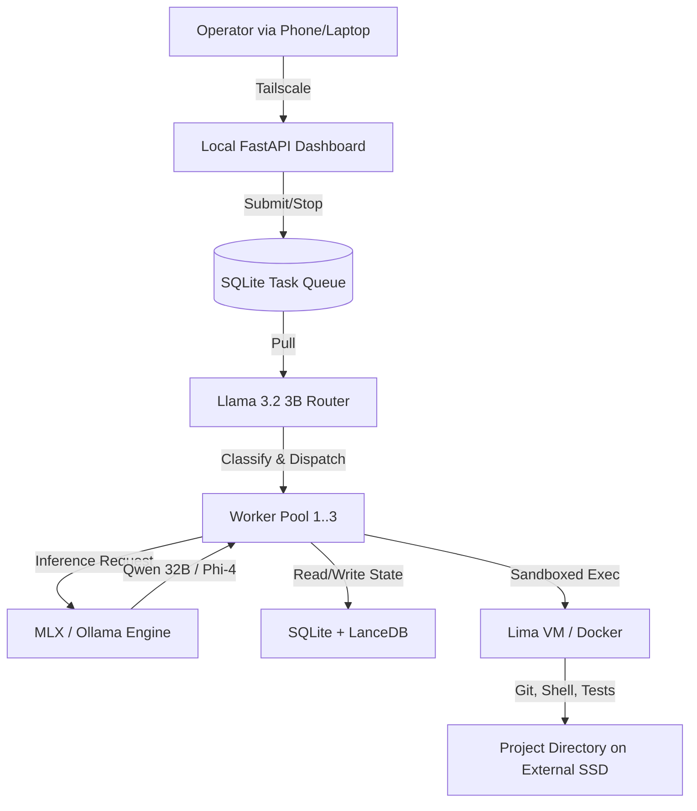

## Raw response

prompt_version: v2
Model: Qwen3.7
Knowledge cutoff: 2026
Web browsing/tools: Enabled
Date context: 31 August 2026

### Decisions at a Glance
| Layer | Final Pick | Rationale |
| :--- | :--- | :--- |
| **Inference Engine** | MLX (via Ollama) | Native Apple Silicon optimization, lowest memory overhead, and fastest load/unload times . |
| **Primary Model** | Qwen 2.5/3 Coder 32B (4-bit) | Best coding/reasoning performance per GB of VRAM; fits comfortably in 32GB with context . |
| **Routing Model** | Llama 3.2 3B (4-bit) | Ultra-fast, low-footprint model for classification, summarization, and task triage. |
| **Agent Harness** | OpenHands + LangGraph | OpenHands provides robust sandboxed execution; LangGraph offers deterministic, stateful multi-agent orchestration without bloat . |
| **Task Queue** | SQLite (WAL mode) | Zero external dependencies, crash-resilient, and perfectly adequate for single-machine worker pools. |
| **Durable Memory** | SQLite + LanceDB | LanceDB is embedded, serverless, and local-first, avoiding the overhead of dedicated vector DB servers . |
| **Isolation** | Dedicated macOS User + Lima VM | Prevents agent from accessing host credentials; Lima provides lightweight, hardened VM sandboxing for code execution . |
| **24/7 Management** | `launchd` + `caffeinate` | Native macOS daemon management with `KeepAlive` for automatic crash recovery . |
| **Remote Access** | Tailscale + Local FastAPI | Zero-trust network access without exposing ports to the public internet. |

---

### Investigation Areas

**1. On-device inference**  
On a 32GB M6 Mac mini, MLX is the optimal inference engine, offering native Apple Silicon optimization and superior memory management compared to generic backends . Running a 32B parameter model (e.g., Qwen 2.5/3 Coder) at 4-bit quantization (Q4_K_M) requires ~18GB of RAM, leaving ample room for the OS and context . Avoid FP16 models, as they will trigger memory pressure and swapping, destroying throughput . Ollama with an MLX backend is recommended for seamless model lifecycle management .

**2. Agent runtimes and harnesses**  
OpenHands (formerly OpenDevin) is the strongest open-source autonomous coding harness, offering a Docker-based sandboxed runtime designed for isolated execution . For broader orchestration (research, scheduling, multi-step workflows), LangGraph is superior to heavier frameworks like AutoGen or CrewAI, as it provides deterministic, stateful, and memory-efficient graph-based execution .

**3. Many-agent design on small hardware**  
Do not run 100 concurrent model instances. Use a hierarchical coordinator/worker topology. A single "Router" model (Llama 3.2 3B) classifies incoming requests and writes them as structured rows to a SQLite task queue. A pool of 2–3 worker processes pulls from this queue, executing tasks using the larger 32B model. This caps active inference processes to what the 32GB hardware allows while supporting 100+ *logical* agents via distinct system prompts and state records in the database .

**4. Autonomous coding systems**  
The combination of OpenHands (for high-level planning and sandboxed tool use) and Aider (as the underlying CLI code editor) is the most robust. Aider excels at repository comprehension, Git worktree handling, and automated test execution, scoring highly on code-editing benchmarks . OpenHands wraps this in a safe, observable loop with retry logic .

**5. Autonomous research systems**  
Use a dedicated research agent equipped with Firecrawl or Jina Reader for reliable web scraping, paired with a local PDF parser (e.g., Marker). To prevent fabricated citations, enforce a strict "retrieve-then-cite" workflow: the model must output exact quotes and source URLs in a structured format *before* synthesizing, with a secondary lightweight model validating the presence of the citation in the retrieved context.

**6. Durable memory**  
Start with SQLite for relational metadata (task history, decisions, agent state) and LanceDB as an embedded, serverless vector database for semantic search . LanceDB is lightweight and local-first, avoiding the operational overhead of running a separate Chroma or Qdrant server . A knowledge graph (e.g., NetworkX backed by SQLite) can be added later if cross-project entity linking becomes necessary.

**7. Machine control and isolation**  
Run the agent under a dedicated, non-admin macOS user account . For code execution, use Lima (lightweight Linux VM) or a strictly constrained Docker container with no host filesystem mounts outside the designated workspace . For native macOS actions (e.g., opening a browser), use AppleScript wrapped in a Seatbelt sandbox profile to enforce filesystem and network restrictions .

**8. Running 24/7**  
Manage the agent via macOS `launchd` with `KeepAlive` set to true and `SuccessfulExit` set to false, ensuring automatic restart on crash . Use `caffeinate` to prevent system sleep. Implement a lightweight watchdog script that monitors memory pressure and restarts the service if swap usage exceeds 8GB to prevent system lockup .

**9. Remote reach**  
Use Tailscale (or Cloudflare Tunnel) for secure, zero-trust network access without exposing any ports to the open internet. Run a lightweight local web dashboard (FastAPI + basic auth/TOTP) accessible only via the Tailscale IP. This dashboard should provide status, log access, task submission, and a prominent emergency "kill switch" button.

**10. Storage split**  
- **Internal 512 GB SSD**: macOS, applications, MLX model weights (for fast load times), SQLite databases, LanceDB indices, and active Git repositories.  
- **External 1 TB SSD**: Large datasets, raw PDFs, historical task logs, agent scratch workspaces, and Time Machine backups. This preserves internal SSD endurance and leverages external throughput for bulk sequential reads .

---

### Deliverables

**A. Technology Stack**
| Layer | Chosen Technology | Alternatives Considered | Rationale |
| :--- | :--- | :--- | :--- |
| Inference | MLX / Ollama | llama.cpp, LM Studio | Best native Apple Silicon performance and memory management . |
| Primary Model | Qwen 2.5/3 Coder 32B (4-bit) | Llama 3 8B, Gemma 4 | Superior coding/reasoning per GB; fits 32GB constraint . |
| Orchestrator | LangGraph | AutoGen, CrewAI | Deterministic, stateful, low-overhead multi-agent control . |
| Code Execution | OpenHands + Aider | SWE-agent, Cline | Robust sandboxing + proven repository-level editing . |
| Memory | SQLite + LanceDB | Chroma, Qdrant, pgvector | Embedded, serverless, zero-maintenance local-first stack . |
| Isolation | Lima VM + Dedicated User | Docker Desktop, full macOS VM | Lightweight, hardened sandboxing without massive overhead . |

**B. Architecture Diagram**


**C. Resource Plan (32 GB Unified Memory)**
- macOS & background services: 4 GB
- Primary Model (Qwen 32B, 4-bit quantized): 18 GB
- KV Cache & Context Window (32k tokens): 3 GB
- Routing Model (Llama 3.2 3B, 4-bit, resident): 2.5 GB
- Agent processes, SQLite, LanceDB, browser cache: 3 GB
- Safety Buffer: 1.5 GB  
*Total: 32 GB*. Swapping is avoided by keeping the routing model small and unloading the primary model if memory pressure spikes (handled by Ollama).

**D. Agent Model**  
Hierarchical swarm with a shared task queue. Logical agents are not separate processes; they are rows in the SQLite `tasks` table with specific `system_prompt`, `tools_allowed`, and `state` columns. The Router model triages new tasks, and the Worker pool (capped at 2–3 concurrent processes) executes them, ensuring hardware limits are never exceeded.

**E. Model Assignment**  
- **Planning / Debugging**: Qwen 32B (deep reasoning).  
- **Coding / Editing**: Qwen 32B + Aider (repository-aware).  
- **Research / Synthesis**: Qwen 32B + Firecrawl (long context).  
- **Classification / Summarization / Routing**: Llama 3.2 3B (speed and low memory).  

**F. Continuous-Operation Design**  
- `launchd` manages the worker process with `KeepAlive`.  
- State is checkpointed to SQLite after *every* tool call.  
- Failed tool executions trigger an automatic retry with exponential backoff.  
- A watchdog script monitors `vm_stat` and restarts the worker if swap exceeds 8GB.

**G. Remote-Operation Design**  
- Tailscale provides a secure, encrypted tunnel to the Mac mini.  
- A local FastAPI app serves a minimal web UI on a Tailscale-only IP.  
- Features: Task queue view, live log tailing, file download, and a red "EMERGENCY STOP" button that sends a `SIGTERM` to the worker pool and clears the active queue.

**H. Security Design**  
- **Principle of Least Privilege**: Agent runs as `aiagent`, a dedicated non-admin user with no `sudo` access .  
- **Sandboxing**: All shell/code execution occurs inside a Lima VM with no access to the host's `~/.ssh`, `~/.aws`, or keychain .  
- **Guardrails**: Destructive commands (`rm -rf`, `git push`, network egress to unknown domains) require explicit human approval via the remote dashboard.  
- **Audit**: All tool calls and outputs are logged immutably to SQLite.

**I. Installation Procedure**
```bash
# 1. System Prep (Run as primary admin user)
sudo softwareupdate --install-rosetta --agree-to-license
brew install ollama tailscale sqlite3 lima

# 2. Model Acquisition
ollama pull qwen2.5-coder:32b
ollama pull llama3.2:3b

# 3. Dedicated User Setup
sudo sysadminctl -addUser aiagent -fullName "AI Agent" -password $(openssl rand -base64 12)
sudo dscl . -append /Groups/_developer GroupMembership aiagent

# 4. Directory Structure (as aiagent)
sudo su - aiagent
mkdir -p ~/workspace ~/logs ~/.lancedb
sqlite3 ~/agent_state.db "CREATE TABLE tasks (id TEXT, status TEXT, prompt TEXT, result TEXT);"

# 5. Launchd Configuration (~/Library/LaunchAgents/com.aiagent.worker.plist)
# Create plist with: KeepAlive=true, SuccessfulExit=false, ProgramArguments=[python3, /path/to/worker.py]
launchctl load ~/Library/LaunchAgents/com.aiagent.worker.plist
```

**J. Exclusion List**  
- **Redis / RabbitMQ**: Unnecessary operational overhead for a single-machine setup; SQLite WAL mode handles concurrent reads/writes efficiently.  
- **LangChain**: High abstraction overhead and unpredictable memory usage; LangGraph or direct `asyncio` is more deterministic.  
- **Full Docker Desktop for all tasks**: Too heavy; use Lima or lightweight containerization *only* for the execution sandbox.  
- **FP16 Models**: Will cause immediate memory pressure and swapping on 32GB unified memory; stick to 4-bit or 6-bit quantization.

**K. Scaling Path**  
- **64 GB Unified Memory**: Keep both Qwen 32B and a larger model (e.g., Qwen 72B 4-bit) resident simultaneously. Increase worker pool to 4–5.  
- **96 / 128+ GB Unified Memory**: Run 70B+ models at higher precision (Q6/Q8) with massive context windows (128k+) for full-codebase ingestion.  
- **Added GPU / Networked Server**: Offload embedding generation and heavy research scraping to a dedicated Linux machine, keeping the Mac mini focused purely on high-value reasoning and orchestration.

---

### Sources
1. **Primary**: https://dev.to/bspann/running-llms-locally-on-macos-the-complete-2026-comparison-48fc (MLX vs. other local inference on macOS)  
2. **Primary**: https://www.birjob.com/blog/gemma-4-apple-silicon-mlx-vs-llama-cpp (MLX recommendation for Apple Silicon local inference)  
3. **Secondary**: https://www.facebook.com/9to5mac/posts/ollama-adopts-mlx-for-faster-ai-performance-on-apple-silicon-macsone-of-the-best/1515464619946897/ (Ollama MLX backend adoption)  
4. **Primary**: https://www.opensourcealternatives.to/blog/best-open-source-ai-coding-assistants (OpenHands as best open-source sandboxed coding agent)  
5. **Primary**: https://simonw.substack.com/p/qwen25-coder-32b-is-an-llm-that-can (Qwen 2.5 Coder 32B benchmark performance for local coding)  
6. **Primary**: https://www.lancedb.com/ & https://www.firecrawl.dev/blog/best-vector-databases (LanceDB as embedded, local-first vector database)  
7. **Primary**: https://lucaberton.com/blog/lima-v21-ai-agent-sandboxing-macos-2026/ (Lima v2.1 for hardened AI agent sandboxing on macOS)  
8. **Primary**: https://medium.com/@chetcorcos/a-simple-launchd-tutorial-9fecfcf2dbb3 (Using `launchd` KeepAlive for crash-tolerant background scripts)  
9. **Secondary**: https://www.linkedin.com/posts/brandon-charleson_nvidia-dropped-nemoclaw-a-better-and-more-activity-7441237027251171328-wEVk (macOS user isolation for autonomous agents)  
10. **Primary**: https://dev.to/whoffagents/how-to-build-a-crash-tolerant-ai-agent-with-launchd-on-macos-454 (Watchdog and memory pressure checks for macOS agents)

## Model's own cited sources

10-entry Sources list, each tagged primary/secondary, all real resolving URLs but mostly
**secondary** by nature (dev.to tutorials, vendor blogs, a Substack, a Medium `launchd` tutorial,
a `birjob.com` blog, an `opensourcealternatives.to` list). Two genuinely primary: `lancedb.com`,
`firecrawl.dev/blog`. Source #3 is a **Facebook post** (9to5mac repost). Source #9 is a
**LinkedIn post** titled "NVIDIA dropped NemoClaw…" cited as support for "macOS user isolation"
— a topic mismatch. No arXiv, no vendor docs, no model cards.

## Reviewer notes

### Purpose: RQ6 prompt-sensitivity — Qwen v1 vs v2

Compare to `data/responses/qwen-3.7-plus.md` (v1). Tracker: `analysis/rq6-prompt-sensitivity.md`.

### CONFOUND: browsing state differs

The v1 capture did **not** browse (no sources, 2024-era models: Qwen2.5-Coder-32B dense,
Llama 3.2 3B, Phi-3.5, no M6 facts). This v2 run **did** browse (10 URLs, current framing). So the
large v1→v2 recency improvement is confounded with the browsing change and cannot be attributed to
the RFC phrasing. The clean comparison for Qwen is **v2 vs v3** (both browsed).

### Load-bearing axes vs v1

| axis | v1 (no browse, 2024 snapshot) | v2 (browsed, RFC framing) |
|---|---|---|
| inference engine | MLX + llama.cpp, custom model manager | **MLX via Ollama** |
| primary model | Qwen2.5-Coder-32B **dense** Q4 (2024) | Qwen 2.5/**3** Coder 32B 4-bit (hedged family) |
| routing model | Qwen2.5 7B | **Llama 3.2 3B** |
| orchestration | thin custom, NOT LangGraph/CrewAI | **OpenHands + LangGraph** |
| coding agent | Aider + OpenHands | OpenHands + Aider (same pair, order flipped) |
| vector store | ChromaDB (month 2) | **LanceDB** |
| sandbox | dedicated user + file perms + pfctl, **NO containers** | **dedicated user + Lima VM** |
| task queue | SQLite (no Redis) | SQLite WAL (same) |
| cloud | none (pure local) | optional escalation (mentioned) |
| M6 engagement | none ("generic M-series") | still no 170 GB/s figure, but engages "32GB M6 Mac mini" framing |
| sources | 0 | 10 URLs (mostly secondary) |

### Fabrication (RQ2)

Tools all real (MLX, Ollama, OpenHands, Aider, LangGraph, LanceDB, Lima, Tailscale, FastAPI,
Firecrawl, Marker, Playwright, SearXNG). Models: "Qwen 2.5/3 Coder 32B" hedged; "Llama 3.2 3B" real;
"Gemma 4" named in alternatives (real per `tool-model-register.md`). No invented tool or model.
Weakest point is citation quality (see cited-sources note), not factuality.

### RQ6 signal

v2 is far more current than v1 — but that is the browsing confound. Within Qwen, v2's picks
(Ollama-MLX, LangGraph, OpenHands, Lima, LanceDB) are a mainstream 2026 stack. Real comparison is
v2 vs v3.
