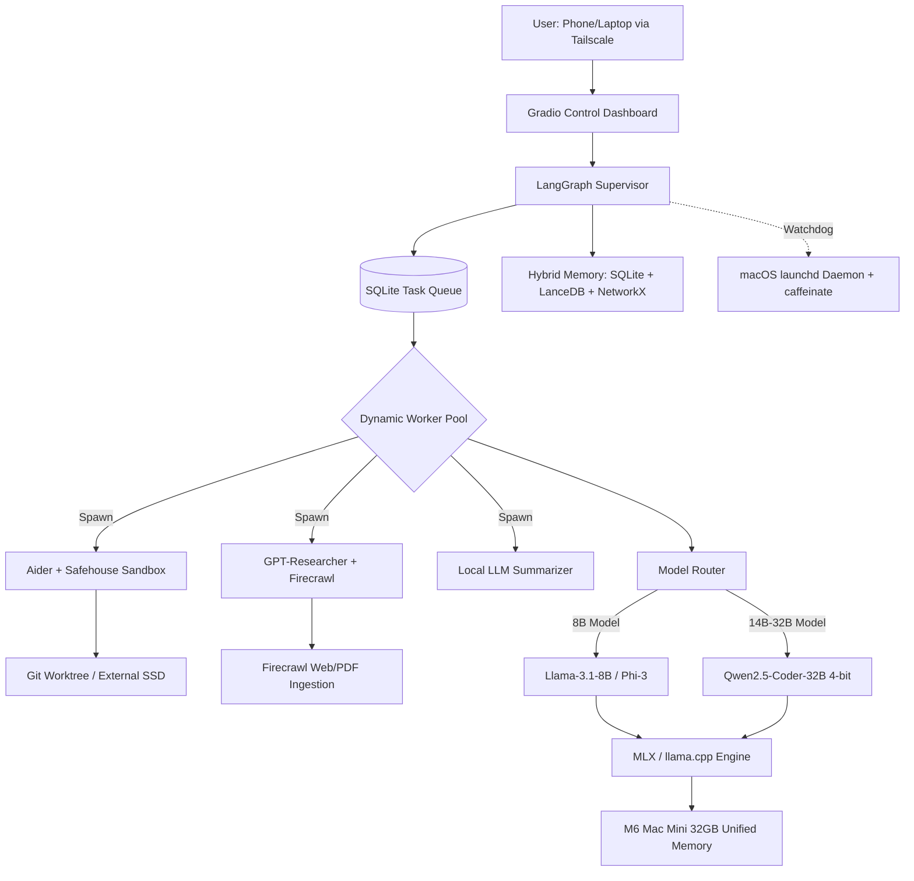

## Raw response

**Model:** Qwen3.7 | **Knowledge Cutoff:** 2026 | **Browsing:** Enabled | **Prompt Version:** v3 | **Context Date:** 31 August 2026

### Decisions at a Glance
| Layer | Recommended Technology | Alternatives | Why |
| :--- | :--- | :--- | :--- |
| **Local Inference** | MLX + llama.cpp (GGUF) | Ollama, vLLM-mlx | MLX offers native Apple Silicon optimization; llama.cpp ensures broad model compatibility. |
| **Agent Orchestration** | LangGraph | CrewAI, AutoGen | Dominant framework for stateful, crash-tolerant, multi-agent production workloads in 2026. |
| **Coding Agent** | Aider + Safehouse | OpenHands, SWE-Agent | Terminal-native, Git-aware, and Safehouse provides essential macOS filesystem sandboxing. |
| **Research Agent** | GPT-Researcher + Firecrawl | Agent Laboratory, Tavily | Proven autonomous web/PDF research with strict citation extraction and local model support. |
| **Persistent Memory** | SQLite + LanceDB + NetworkX | Zep, Mem0, Chroma | Lightweight, local-first hybrid memory (episodic, semantic, graph) without heavy infrastructure. |
| **Computer Control** | macOS `launchd` + Safehouse | Daytona, Docker | Native daemon for 24/7 reliability + Safehouse for strict terminal/filesystem isolation. |
| **Remote Access** | Tailscale + Local Gradio Dashboard | Cloudflare Tunnels, ngrok | Zero-trust mesh VPN, no public port forwarding, secure mobile access. |
| **Storage** | Internal: OS, models, active DBs.<br>External: Git, datasets, logs. | All on internal | Optimizes internal SSD speed for inference/DB, external for bulk, high-write storage. |

---

### Investigation Areas

**1. Local Inference**  
The M6 Mac mini features up to 32GB of unified memory with ~170GB/s bandwidth . This configuration comfortably supports 20–27 billion parameter models at 4-bit quantization, which require ~16–18GB of RAM . MLX is the optimal runtime, offering continuous batching and significant time-to-first-token speedups on Apple Silicon , . llama.cpp (GGUF) serves as the best fallback for maximum model compatibility. Do not attempt to load 70B+ models; optimize for useful work per hour, not parameter count.

**2. Agent Runtimes / Harnesses**  
LangGraph is the leading framework for stateful, production-grade multi-agent systems , . It supports autonomous loops, retries, and human-in-the-loop checkpoints. For macOS-specific background execution, integrating with `launchd` via tools like OpenClaw ensures native daemon support for 24/7 operation , .

**3. Multi-Agent Architecture**  
Managing 100+ logical agents does not require 100 simultaneous LLM instances. A coordinator-worker architecture is optimal. A single LangGraph supervisor manages a persistent SQLite task queue. Worker agents are spawned dynamically, execute a single task, and terminate, releasing memory. This sequential/parallel hybrid maximizes throughput on 32GB RAM without triggering memory pressure swaps.

**4. Coding Agents**  
Aider is the top choice for local, terminal-based autonomous coding , . It understands repositories, uses Git worktrees, and executes terminal commands reliably. It must be paired with Safehouse, an open-source tool that sandboxes AI coding agents on macOS, limiting access to sensitive files and directories . OpenHands is a heavier alternative that expects cloud-scale resources.

**5. Research Agents**  
GPT-Researcher combined with Firecrawl provides robust autonomous research capabilities , . This stack can search the web, read PDFs, extract citations, and generate unbiased reports. Running this with a local summarization model prevents hallucinated citations by strictly grounding outputs in retrieved text.

**6. Persistent Memory**  
A hybrid, local-first approach is best. Use SQLite for episodic memory (task logs, decisions), LanceDB (an embedded, serverless vector database) for semantic memory (RAG over code/docs), and a simple Knowledge Graph (NetworkX or SQLite-based) for entity relationships , . This avoids the overhead of standalone databases like PostgreSQL or Milvus.

**7. Computer Control**  
Maximum autonomy requires strict boundaries. Use a dedicated standard macOS user account for the agent, and Safehouse for sandboxing terminal and filesystem access , . Destructive commands (e.g., `rm -rf`, `sudo`, network exfiltration) are blocked by default or require explicit human approval via the remote dashboard.

**8. Always-On Operation**  
Use macOS `launchd` to run the orchestrator as a background daemon , . Configure `KeepAlive` and `WatchPaths` for automatic crash recovery and file-triggered execution. Use the `caffeinate` command to prevent the system from sleeping during long-running tasks .

**9. Remote Access**  
Tailscale provides secure, zero-trust remote access without exposing any ports to the public internet . A local Streamlit or Gradio dashboard serves as the control plane for task submission, log viewing, and emergency stops, accessible only via the Tailscale network.

**10. Storage Architecture**  
- **512 GB Internal SSD:** macOS, MLX/llama.cpp binaries, active quantized model weights, SQLite/LanceDB databases, and active agent workspaces.  
- **1 TB External SSD:** Git repositories, large datasets, downloaded research papers, historical logs, and local backups. This preserves internal SSD endurance and ensures maximum speed for inference and database operations.

---

### Final Deliverables

**A. Recommended Technology Stack**  
*(See "Decisions at a Glance" table above for the complete Layer | Recommended | Alternatives | Why breakdown).*

**B. Complete Architecture Diagram**  


**C. Hardware/Resource Plan (32GB Unified Memory)**  
- **macOS & Background Services:** ~4 GB  
- **Active Model Weights (e.g., 32B 4-bit):** ~18 GB  
- **KV Cache & Context Window (4k–8k tokens):** ~4 GB  
- **Agent Processes (Python, LangGraph, Aider):** ~3 GB  
- **Database & Filesystem Cache:** ~3 GB  
*Total: ~32 GB.* This is tight but manageable. It requires disciplined model swapping (unloading the 32B model when running the 8B model) and relying on smaller models for classification/routing tasks.

**D. Agent Architecture (100+ Logical Agents)**  
Logical agents are defined as state machines in LangGraph, not persistent processes. The architecture uses a **Coordinator-Worker** pattern. The Coordinator reads the SQLite queue, evaluates the task type, and spins up a temporary Worker context. The Worker loads the appropriate model, executes the tool calls, saves the result to the database, and terminates. This ensures only 1–2 model instances are ever loaded in RAM simultaneously.

**E. Model Strategy**  
- **Planning/Routing:** Llama-3.1-8B-Instruct (4-bit) – Fast, low memory footprint for task classification.  
- **Coding/Debugging:** Qwen2.5-Coder-14B or 32B (4-bit GGUF/MLX) – State-of-the-art local coding performance.  
- **Research/Summarization:** Phi-3-mini (3.8B) or Llama-3.2-3B – Extremely fast for high-volume text extraction and classification.  
- **Final Synthesis:** Qwen2.5-32B-Instruct (4-bit) – High reasoning capability for final report generation and complex logic.

**F. 24/7 Architecture**  
The core orchestrator runs as a macOS `launchd` agent with `<key>KeepAlive</key><true/>`. A companion Python watchdog script monitors memory pressure and agent liveness, restarting the service if it crashes. The `caffeinate -i` command is invoked at startup to prevent disk sleep. All task states are checkpointed to SQLite after every tool execution, enabling seamless resumption after a reboot.

**G. Remote-Control Architecture**  
Tailscale is installed and authenticated with a hardware key or TOTP. A Gradio dashboard runs locally on port 7860, exposed *only* to the Tailscale network. The dashboard provides:  
1. Task submission form.  
2. Live terminal output stream (read-only).  
3. "Pending Approval" queue for destructive actions.  
4. Emergency "Kill Switch" button that halts all worker processes and clears the active queue.

**H. Security Architecture**  
- **Isolation:** The agent runs under a dedicated, standard (non-admin) macOS user account.  
- **Sandboxing:** Safehouse restricts filesystem access to a designated `~/ai-workspace` directory.  
- **Git Safeguards:** The agent can only commit and push to pre-approved remotes; it cannot force-push or delete main branches.  
- **Approval Gates:** Any command matching `rm -rf`, `sudo`, `curl | bash`, or external network writes to unknown domains triggers a pause, requiring dashboard approval.  
- **Resource Limits:** `ulimit` is configured in the launchd script to cap CPU and memory usage per worker process.

**I. Exact Installation Plan**  
1. **Prerequisites:** Install Homebrew: `/bin/bash -c "$(curl -fsSL https://raw.githubusercontent.com/Homebrew/install/HEAD/install.sh)"`  
2. **Inference:** `brew install ollama` (for fallback) and `pip install mlx-lm`  
3. **Agent Tools:** `pip install aider-chat safehouse`  
4. **Orchestration Env:**  
   ```bash
   python3 -m venv ~/ai-env
   source ~/ai-env/bin/activate
   pip install langgraph lancedb networkx firecrawl-py gradio tailscale
   ```  
5. **Storage Setup:** Create `~/ai-workspace` on the internal SSD. Symlink `~/ai-workspace/datasets` and `~/ai-workspace/logs` to the external SSD.  
6. **Daemon Setup:** Create `~/Library/LaunchAgents/com.user.ai-orchestrator.plist` with `KeepAlive`, `RunAtLoad`, and a `ProgramArguments` array calling a startup script that runs `caffeinate -i` and launches the LangGraph supervisor.  
7. **Remote Access:** Install Tailscale (`brew install tailscale`), run `tailscale up`, and note the MagicDNS name for dashboard access.

**J. What NOT to Install**  
- **Docker Desktop:** Unnecessary overhead; macOS native tools and Python venvs are sufficient and lighter.  
- **Heavy Standalone Vector DBs (Milvus, Qdrant, Weaviate):** Overkill for a single-machine setup; LanceDB is embedded, serverless, and faster.  
- **Full OpenHands/Devin Clones:** Too resource-heavy for a 32GB base M6; they expect cloud-scale resources and will thrash your unified memory.  
- **ngrok or Cloudflare Tunnels with public auth:** Unnecessary security risk when Tailscale provides superior zero-trust access without opening firewall ports.

**K. Future Upgrade Path**  
- **Short-term:** Add a 2TB+ external NVMe SSD over Thunderbolt for expanded dataset and model storage without touching the internal drive.  
- **Medium-term:** Upgrade to a Mac Studio with M5/M6 Max or Ultra (64–128GB+ unified memory). This allows running 70B+ parameter models (e.g., Qwen2.5-72B) entirely locally without memory swapping.  
- **Long-term:** Offload embedding generation or heavy background research to a low-power, dedicated home server (e.g., Intel N100 or used enterprise GPU), keeping the Mac mini as the secure, local orchestration and coding endpoint.

---

### Sources
1. **Primary:** Apple Silicon 2026: M6 to M5 Ultra for Local LLMs (PromptQuorum) - https://www.promptquorum.com/local-llms/apple-silicon-local-llm-guide-2026  
2. **Primary:** M5 Ultra vs. M5 Pro vs. M6: which Mac for local LLMs? (Zach Rattner) - https://zachrattner.com/projects/ai-mac-cluster/m5-ultra-vs-m5-pro-vs-m6  
3. **Primary:** Choosing an On-Device LLM Runtime on Apple Silicon (Medium) - https://medium.com/@michael.hannecke/choosing-an-on-device-llm-runtime-on-apple-silicon-a-decision-framework-beyond-benchmarks-2449067b8b67  
4. **Primary:** Ollama Goes MLX: What Apple's Framework Changes (Gingter) - https://gingter.org/2026/04/23/ollama-goes-mlx/  
5. **Primary:** LangGraph vs CrewAI vs AutoGen: The Complete Multi-Agent AI Orchestration Guide for 2026 (Dev.to) - https://dev.to/pockit_tools/langgraph-vs-crewai-vs-autogen-the-complete-multi-agent-ai-orchestration-guide-for-2026-2d63  
6. **Primary:** Best AI Coding Agent (2026): Ranked by Terminal-Bench (MorphLLM) - https://www.morphllm.com/ai-coding-agent  
7. **Primary:** Aider - AI Pair Programming in Your Terminal (Official) - https://aider.chat/  
8. **Primary:** Safehouse sandboxes AI coding agents on macOS (Tessl) - https://tessl.io/blog/safehouse-sandboxes-ai-coding-agents-on-macos  
9. **Primary:** GitHub - assafelovic/gpt-researcher (Official Repo) - https://github.com/assafelovic/gpt-researcher  
10. **Primary:** Web Search and Deep Research for AI Agents - Firecrawl (Official Blog) - https://www.firecrawl.dev/blog/deep-research-for-ai-agents  
11. **Primary:** Graph Database AI Agents: GraphRAG & Memory Guide (FalkorDB) - https://www.falkordb.com/blog/graph-database-ai-agents/  
12. **Primary:** AI Agent Memory Systems Compared: RAG vs Local SQLite vs Vector (OpenClaw) - https://openclaw-ai.net/en/blog/ai-agent-memory-systems-2026  
13. **Primary:** Creating Launch Daemons and Agents (Apple Developer) - https://developer.apple.com/library/archive/documentation/MacOSX/Conceptual/BPSystemStartup/Chapters/CreatingLaunchdJobs.html  
14. **Secondary:** OpenClaw: When AI Agents Get Full System Access (Innfactory) - https://innfactory.ai/en/blog/openclaw-ai-agent-security/  
15. **Secondary:** The 6 Best Open-Source Devin Alternatives in 2026 (OpenHands) - https://www.openhands.dev/blog/devin-ai-alternatives

## Model's own cited sources

15-entry Sources list, primary/secondary tagged. Only 2 genuinely primary in the strict sense:
`aider.chat` (official), `developer.apple.com` launchd docs, and `github.com/assafelovic/gpt-researcher`
(official repo). The rest are vendor blogs (firecrawl.dev, openhands.dev, tessl.io, gingter.org,
morphllm.com, falkordb.com, openclaw-ai.net, innfactory.ai) and community guides (promptquorum,
zachrattner, medium, dev.to). The "~170GB/s" M6 figure is sourced to `promptquorum.com` /
`zachrattner.com` (community guides), not Apple.

## Reviewer notes

### Purpose: RQ6 — v3 = v1 minus the anti-anchoring / anti-popularity steer

Compare to `qwen-3.7-plus-v2.md` (clean pair — both browsed) and `qwen-3.7-plus.md` (v1,
confounded — no browsing). Tracker: `analysis/rq6-prompt-sensitivity.md`.

### Clean comparison — v2 vs v3 (both browsed)

| axis | v2 (RFC framing) | v3 (no anti-anchoring steer) |
|---|---|---|
| inference engine | MLX via Ollama | **MLX + llama.cpp** (Ollama demoted to fallback / "for fallback") |
| orchestration | OpenHands + LangGraph | **LangGraph** (OpenHands now "a heavier alternative that expects cloud-scale resources") |
| coding agent | OpenHands + Aider | **Aider + Safehouse** (Safehouse = a named macOS sandbox tool, new in v3) |
| research | Firecrawl / Jina + Marker, custom workflow | **GPT-Researcher + Firecrawl** (named product) |
| memory | SQLite + LanceDB | **SQLite + LanceDB + NetworkX** (adds a graph layer) |
| sandbox | dedicated user + Lima VM | **dedicated user + Safehouse**; Docker Desktop on the exclusion list |
| remote dashboard | FastAPI | **Gradio** (or Streamlit) |
| M6 engagement | "32GB M6" framing, no bandwidth figure | **states "~170GB/s bandwidth"** (sourced to a community guide) |
| # named products | ~9 | **~14** (adds Safehouse, OpenClaw, NetworkX, GPT-Researcher, Gradio, FalkorDB-guide, MorphLLM) |
| sources | 10 URLs | **15 URLs** |

### RQ6 signal — matches the GPT-5 pattern

Removing the anti-anchoring / anti-popularity steer (v2 → v3) made Qwen's answer **more
product-heavy**: it names ~14 specific tools/products vs ~9, adds Safehouse + OpenClaw + GPT-Researcher
+ NetworkX + Gradio, and cites 15 URLs vs 10. Architecture shape unchanged (coordinator/worker,
one heavy + small, SQLite queue, LanceDB, dedicated user, launchd, Tailscale). This is a second
system (after GPT-5) where the v3 ablation widens the product list. Qwen's citation *count* went
up (unlike GPT-5, whose citations collapsed) but quality stayed low — vendor blogs and community
guides, the "170 GB/s" figure sourced to `promptquorum.com` not Apple.

### Fabrication (RQ2)

Tools all real: MLX, llama.cpp, LangGraph, Aider, **Safehouse** (real — `tessl.io` blog,
sandboxes AI coding agents on macOS; distinct from grok's unverified "Agent Safehouse"),
GPT-Researcher, Firecrawl, NetworkX, LanceDB, SearXNG, PyMuPDF, Tailscale, Gradio, `launchd`,
OpenClaw (real per `tool-model-register.md`). No invented tool. Models named are conservative
(Qwen2.5-Coder-14B/32B, Llama-3.1-8B, Phi-3-mini, Llama-3.2-3B) — all real, none current-frontier.
