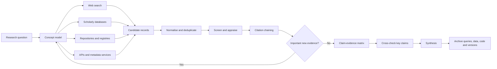
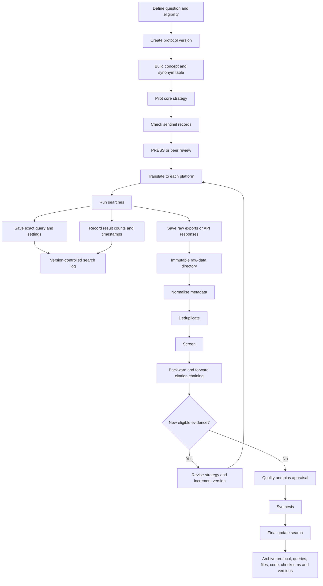
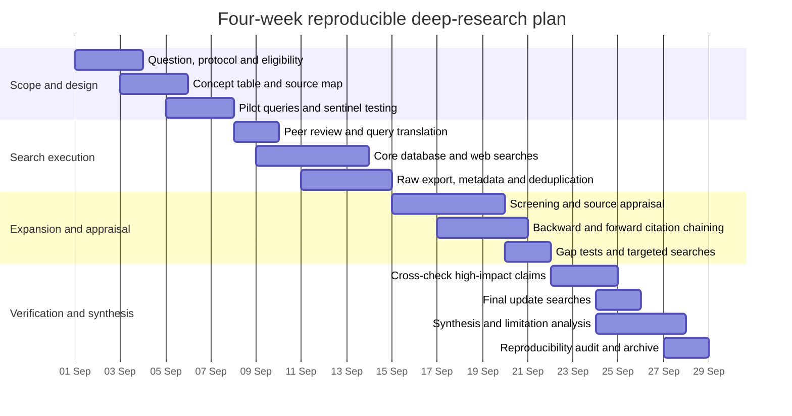

# Comprehensive, Reproducible Deep Research on the Web

> **Provenance.** External artefact — a ChatGPT "Deep Research" report commissioned by the study
> owner on 2026-09-01, on how to run a reproducible multi-source literature/web search. Kept as a
> **methodology reference** for this study's own search-and-verification protocol (see
> `docs/methodology.md`) and for the paper's methods section — the fabrication-flag episode
> (`analysis/verification/tool-model-register.md`) showed the study needs a dated, auditable
> verification trail, which is exactly what this describes. The `citeturn…search…` tokens are
> ChatGPT's internal citation markers and are **not resolvable links**; the "Primary sources and
> references" table at the end names the actual sources (PRISMA-S, Cochrane, PRESS, National
> Academies, and the various API docs). Kept verbatim; not authored by this project.

## Executive summary

Comprehensive deep research is not achieved by finding a single "best" search engine. It is achieved by combining several retrieval systems whose indexes, ranking methods, subject coverage, metadata and citation graphs differ, then recording the process well enough that another researcher can understand, audit and substantially repeat it. PRISMA-S makes the same point for systematic-review searches. It asks researchers to report not only the database, but also the platform, complete strategies, limits, search dates and record counts because platform differences can materially change what is retrieved. citeturn7search0turn7search5

For this report, "deep research" means an iterative, multi-source process that moves from question definition through systematic searching, source verification, citation chaining, critical appraisal, synthesis and update checking. It borrows heavily from systematic-review methods, but deep research is not automatically a systematic review. A systematic review additionally requires pre-specified eligibility rules, structured study selection and, where relevant, formal risk-of-bias assessment. Cochrane guidance treats searching as a designed process in which sensitivity, precision, controlled vocabulary, free-text terms, specialist databases and supplementary citation searching all have roles. citeturn8search0

"Reproducibility" also needs qualification. The National Academies defines computational reproducibility as obtaining consistent results using the same input data, computational steps, methods and code. Search reproducibility is necessarily weaker because search indexes change. A researcher may rerun the exact same query months later and retrieve a different set because records were added, corrected or removed. The realistic goal is therefore procedural reproducibility: preserve enough information to reconstruct exactly what was asked of each source, when it was asked, what settings applied, what was returned and what transformations followed. citeturn15search0turn7search0

The strongest general-purpose research design is a layered one:

| Research need | Recommended layer | Reason |
|---|---|---|
| Broad web and grey literature | Google plus Bing or DuckDuckGo | Search-engine indexes and rankings differ. Domain and file-type restrictions are useful for official reports and grey literature. Google officially documents `site:` and `filetype:`, while DuckDuckGo documents `site:`, `filetype:`, `intitle:` and `inurl:`. citeturn18search0turn16search0 |
| Broad scholarly searching | Google Scholar plus Semantic Scholar plus OpenAlex | Scholar has very broad scholarly web coverage and citation chaining. Semantic Scholar adds citation and recommendation functions plus an API. OpenAlex provides an open scholarly graph and structured API. citeturn19view0turn2search8turn4search3 |
| Subject database | PubMed, arXiv or another relevant specialist index | Subject-specific indexing, vocabulary and document types often retrieve records that generic engines handle poorly. PubMed provides MeSH, field searching and explicit query translation. arXiv provides structured preprint retrieval and an API. citeturn3search0turn20view3 |
| Curated citation indexing | Scopus and Web of Science when access exists | Both offer structured fields, Boolean searching, citation networks, exports and alerts. Their coverage should be treated as complementary rather than identical. citeturn19view2turn19view3 |
| DOI and metadata verification | Crossref | Public API, structured publisher-deposited metadata and persistent identifiers. citeturn20view1 |
| Patents plus scholarship | Lens | Particularly useful where academic work and patents must be connected. Lens exposes scholarly and patent corpora through a versioned API. citeturn20view2 |
| Reference and audit trail | Zotero as a strong free-first default | Zotero has an open API, explicit API versioning, object/library version numbers, raw export formats and local automation. Mendeley and EndNote remain useful alternatives, particularly where institutional workflows already depend on them. citeturn21search0turn21search8turn6search13turn6search1 |

No single database should be treated as exhaustive. Cochrane explicitly recommends searching multiple appropriate bibliographic and specialist sources because extensive searching reduces the risk of missing relevant evidence and publication bias. Citation searching and reference checking should supplement, not replace, well-designed database searching. citeturn8search0

The main practical recommendation is to separate three things that researchers often mix together:

1. The intellectual search strategy, meaning the concepts, synonyms, exclusions and eligibility boundaries.
2. The platform-specific implementation, because PubMed, Scopus, Web of Science, Google and Lens do not interpret syntax identically.
3. The evidence record, meaning exact queries, dates, results, raw exports, deduplication decisions, code and file hashes.

The search itself should be treated as research data.

For systematic or decision-critical work, have the principal strategy peer reviewed before translating it to other databases. The PRESS guideline found that structured peer review can identify search errors and improve term selection. Its retained review elements include translation of the research question, Boolean and proximity operators, subject headings, text words, spelling and syntax, and limits or filters. citeturn9search1turn9search6

Automation is useful, but its strongest current role is assistance rather than autonomous evidence judgement. Active-learning systems such as ASReview can prioritise likely relevant records and substantially reduce screening effort in simulation studies, while Rayyan supports semi-automated collaborative screening. Recent review work still describes the evidence base for active-learning approaches as fragmented, so human oversight, audit samples and explicit stopping rules remain important. citeturn12search0turn12search4turn12search2

The report assumes an experienced but cross-disciplinary audience because no target audience was specified. No length limit was specified, so the treatment is intentionally detailed. No citation style was specified, so sources are given through inline linked citations and a primary-source reference section.

**Status checked: 1 September 2026, Pacific/Auckland.**

## Concepts and evidence model

A useful way to think about comprehensive research is as an information-retrieval system followed by an evidence-validation system.

**Web search** searches an engine's index of web resources. It does not search "the whole internet". Google itself notes that search operators remain constrained by indexing and retrieval limits. DuckDuckGo says its results are assembled from multiple sources, while most of its traditional web links currently come from Bing. citeturn18search0turn16search8turn16search9

**Scholarly search** operates over bibliographic records, full text, metadata, citation relationships, repositories or combinations of these. Different scholarly services represent different universes. Google Scholar includes journal and conference papers, theses, books, preprints, abstracts, technical reports and other scholarly material from publishers and repositories. It also warns that uninterrupted coverage of a source cannot be guaranteed. citeturn19view0

**Deep research**, as used here, is a method rather than a particular commercial product. It has five characteristics: breadth across independent sources, iterative query refinement, deliberate verification of important claims, traceable source selection, and an explicit stopping rule. PRISMA-S and Cochrane provide useful methodological foundations even when the project is not a formal systematic review. citeturn7search0turn8search0

**Reproducibility** has two levels in this context. Method reproducibility means another researcher can reconstruct the sources, query logic, dates, filters and transformations. Result reproducibility means they can obtain the same or nearly the same records. The latter is much harder with live search services because indexes and metadata evolve. Google Scholar, for example, reports adding new papers several times a week and notes that corrections to existing records can take months. citeturn19view0turn15search0

A practical hierarchy is:

| Level | What must be preserved | What a later researcher should be able to do |
|---|---|---|
| Transparent | Databases, dates and general methods | Understand where evidence came from |
| Repeatable | Exact queries, filters, interfaces and procedures | Repeat the same actions |
| Reconstructable | Raw exports, result counts, logs and deduplication rules | Reconstruct the original evidence set even if the live index changed |
| Computationally reproducible | Scripts, API requests, software versions and source files | Re-run automated processing from preserved inputs |
| Auditable | Decisions, exclusions, provenance and checksums | Verify how every included item moved through the workflow |

The most important distinction is between **search sensitivity** and **search precision**. Sensitivity asks whether you retrieved the relevant material. Precision asks how much retrieved material was relevant. For comprehensive evidence reviews, Cochrane recommends favouring sensitivity, accepting that this may lower precision. Broad synonym sets are normally joined with `OR`, while distinct concepts are joined with `AND`. Controlled vocabulary and free text should both be used where available. citeturn8search0

For example, the conceptual strategy:

```text
Concept A: "systematic review" OR "evidence synthesis" OR "literature review"

AND

Concept B: reproducib* OR transparen* OR "search reporting"

AND

Concept C: search* OR retrieval OR database*
```

is not yet a reproducible database query. Each platform must translate it into its own fields, syntax, stemming rules, proximity operators and controlled vocabulary.

A useful evidence model is:



This loop matters. Good research rarely has a perfect first query. Relevant papers expose vocabulary, authors, organisations, subject headings and citations that improve later searches. Cochrane recommends checking whether known key publications are retrieved and using citation searches to test whether the original strategy was sufficiently sensitive. PRISMA-S requires that changes and search methods be reported clearly enough for another researcher to understand them. citeturn8search0turn7search0

**Citation chaining** has three useful forms. Backward chaining checks references cited by a relevant paper. Forward chaining checks later works that cite it. Similarity or co-citation searching looks for structurally related material. Google Scholar explicitly supports "Cited by" and "Related articles". Web of Science supports cited-reference searching and related records, while citation indexes generally let researchers move in both directions through the literature. citeturn19view0turn14search5turn8search0

**Snowballing** applies these operations iteratively. Wohlin's original guidelines describe backward and forward snowballing as a systematic literature-search approach and show how successive rounds can extend an initial seed set. Citation snowballing is especially useful for terminology that the original query did not anticipate. citeturn7search4

There is, however, an important inference to make. Because snowballing follows existing citation links, it naturally favours work connected to already selected papers. Highly cited, older or mainstream clusters can therefore receive disproportionate attention. For that reason, citation chaining should normally complement independent keyword, database and grey-literature searching rather than become the sole retrieval method. This recommendation is consistent with Cochrane's treatment of citation searching as an additional method and completeness check. citeturn8search0

## Tool comparison and example queries

The table below compares the requested tools from a reproducibility perspective. "Reproducibility" here is an analytical rating of how well a search can be specified, exported and repeated. It is not a vendor rating.

| Tool | Best role | Query control and notable strengths | API and access | Reproducibility | Example |
|---|---|---|---|---|---|
| **Google** | Broad web, government documents, grey literature, organisations and current web pages | Officially supports `site:` and `filetype:`. Search operators remain subject to Google's index and retrieval limits. citeturn18search0 | Custom Search JSON API exists for configured Programmable Search Engines and requires an API key plus search-engine ID. It is not simply a bulk API for ordinary consumer Google results. citeturn17search1 | Low to medium for exact result sets, good for a documented supplementary search | `"reproducible research" site:who.int filetype:pdf` |
| **Bing** | Independent broad-web check and grey literature | Supports quotes, parentheses, `AND`, `NOT`, `OR`, `+` and operator precedence. Microsoft notes that only the first ten terms are used to obtain results, which matters for long strategies. citeturn18search5 | The former Bing Search APIs were retired on 11 August 2025. Microsoft directs former users towards Grounding with Bing Search in Azure AI Agents. citeturn17search3 | Low to medium | `("systematic review" OR "evidence synthesis") AND reproducibility` |
| **DuckDuckGo** | Privacy-oriented second web engine and rapid cross-engine searches | Supports quoted phrases, `site:`, `filetype:`, `intitle:`, `inurl:`, exclusions and `!bang` shortcuts. DuckDuckGo warns that some advanced syntax does not work perfectly for every query. citeturn16search0 | No general-purpose bulk SERP interface is documented in the official search guidance reviewed here | Low to medium | `site:govt.nz filetype:pdf "systematic review" reproducibility` |
| **Google Scholar** | Broad academic finding, citations and related works | Author, title, publication and date controls, `author:`, quotes, "Cited by", "Related articles", date sorting and alerts. Coverage is intentionally broad. citeturn19view0 | Google does not provide bulk Scholar access and asks automated clients to respect robots.txt. A query exposes at most 1,000 results. citeturn19view0 | Medium for documented manual searching, low for exhaustive machine harvesting | `"literature search" reproducibility author:"Rethlefsen"` |
| **Semantic Scholar** | Scholarly finding, citation graphs, recommendations and alerting | Paper, author and citation relationships, recommendations and research feeds. Alerts can follow papers, authors and topics. citeturn13search0turn13search1 | Official Academic Graph and Recommendations APIs provide papers, authors, citations and related endpoints. API keys are preferable for stable programmatic use. citeturn2search8turn2search3 | High when API request parameters and returned data are archived | `reproducible literature search systematic review` |
| **PubMed** | Medicine, biomedicine and life sciences | Strong structured retrieval with MeSH, field tags, Boolean operators, phrase and proximity searching, truncation, publication-date filtering, Search Details and query history. Search Details is particularly valuable because it shows how PubMed translated the query. citeturn3search0 | NCBI E-utilities offer a public programmatic interface to PubMed and other Entrez databases. citeturn2search12turn2search20 | Very high when query, Search Details, date and API response are saved | `("systematic review"[Title/Abstract] OR "evidence synthesis"[Title/Abstract]) AND reproducib*[Title/Abstract] AND 2021:2026[dp]` |
| **Scopus** | Curated multidisciplinary literature and citation analysis | Document, author and affiliation searching, field codes, Boolean and proximity operators, filters and citation functions. Elsevier reports more than 92 million records and daily updating as of 2026. citeturn19view2 | Scopus APIs exist through Elsevier developer services, but access and entitlements depend on subscription and use case. citeturn2search7 | High for logged strategies and exports, subject to subscription access | `TITLE-ABS-KEY(("systematic review" OR "evidence synthesis") AND reproducib*) AND PUBYEAR > 2020` |
| **Web of Science** | Curated multidisciplinary citation searching | Field tags, Boolean logic, saved query sets and exact-search control. Stemming and lemmatisation apply when Exact Search is off. Quotation marks can force exact phrases. citeturn19view3 | Web of Science APIs provide structured metadata and citation information, with product access depending on subscription. citeturn2search0 | High | `TS=(("systematic review" OR "evidence synthesis") AND reproducib*) AND PY=(2021-2026)` |
| **arXiv** | Preprints in physics, mathematics, computing and related disciplines | Structured fields such as title and all-fields searching. Particularly valuable for recent work that has not yet completed journal publication. citeturn20view3 | Official Atom API supports GET or POST, Boolean query construction, paging and sorting. arXiv encourages considerate request rates and points bulk harvesting towards appropriate bulk mechanisms. citeturn20view3 | High | API form: `ti:"systematic review" AND all:reproducibility` |
| **Crossref** | DOI resolution, publisher metadata, funding, licences, ORCID/ROR and post-publication metadata | Excellent for identifier verification and structured metadata rather than as a sole relevance-search database. Metadata is deposited by Crossref members and trusted sources. citeturn20view1 | Public REST API, no sign-up required for ordinary use. Supports filters, facets, sampling and JSON. citeturn20view1turn4search0 | Very high for API retrieval if response snapshots are preserved | `/works?query.title=reproducible%20literature%20search&filter=from-pub-date:2021-01-01` |
| **Lens.org** | Scholarly literature linked with patents, innovation and intellectual property | Structured scholarly fields include titles, abstracts, dates, authors, citations, sources, subjects and funding. Lens search syntax uses field-based query expressions. citeturn4search4turn4search10 | Versioned REST API for scholarly and patent corpora. Access requires a Lens token/request. API documentation was at version 2.19.3 on 17 April 2026. citeturn20view2 | High once API version, token entitlement, query and output are logged | `title:("systematic review") AND abstract:reproducib*` |
| **OpenAlex** | Open scholarly graph, metadata aggregation and large-scale bibliometrics | Works, authors, sources, institutions and related entities can be searched, filtered, sorted and grouped. The work API has extensive structured filters. citeturn4search3turn4search6 | Public REST API. Current documentation provides free initial use with API-key options for larger budgets. citeturn4search3 | Very high for archived API results | `/works?search=reproducible%20literature%20search&filter=from_publication_date:2021-01-01` |
| **Zotero** | Reference collection, metadata capture, tagging, attachments and reproducible library management | Strong import/export support and programmable searches of a research library. Zotero's API can search title/creator/year or full text and export BibTeX, CSL JSON, CSV, RIS and other formats. citeturn21search0 | Web API v3 is the recommended version. Local API is also available and can operate offline without network rate limits. citeturn21search0turn21search5 | Very high as an audit and storage layer because library and object versions are exposed | Library/API: `?q=reproducible%20search&qmode=everything` |
| **Mendeley** | Reference management and collaborative literature libraries | Web Importer can capture documents and metadata from browsers, search engines and databases. citeturn6search0 | Mendeley exposes APIs including catalogue searching and document operations through authenticated endpoints. citeturn6search13 | Medium to high when exports and API calls are preserved | Catalogue API concept: `/search/catalog?query=reproducible%20search` |
| **EndNote** | Mature desktop reference management, institutional workflows and database imports | Can run online searches through supported connections and import database exports using provider-specific filters. EndNote itself recommends using appropriate database interfaces where their advanced search is stronger, then importing records. citeturn6search1turn6search2 | Automation is less centred on an open public REST research-library API than Zotero. Sync and structured imports remain strong workflow features. citeturn5search11 | Medium to high if raw database exports are separately retained | Online search example: `Title contains "systematic review"` plus a publication-year condition, using the selected database's fields |

The most important analytical distinction in this table is between **finding systems** and **record systems**. Google, Bing and DuckDuckGo are good at locating web material. PubMed, Scopus, Web of Science and arXiv search defined scholarly collections. Crossref and OpenAlex are especially useful as structured metadata and graph infrastructures. Zotero, Mendeley and EndNote should be treated mainly as research-record and bibliography-management systems rather than replacements for specialist databases. citeturn20view1turn21search0turn6search1

A free-first stack that performs well across many disciplines is therefore:

**Google + DuckDuckGo or Bing → Google Scholar + Semantic Scholar + OpenAlex → Crossref verification → relevant specialist database → Zotero.**

Where institutional access exists, add **Scopus and Web of Science** rather than replacing the open tools. Their value lies partly in independent coverage, curated citation relationships and structured search controls. citeturn19view2turn19view3

For biomedical questions, PubMed should move from "specialist supplement" to a core source because its controlled vocabulary and explicit query interpretation materially improve search control. citeturn3search0

For technology-commercialisation, patent or innovation work, Lens becomes much more important because it integrates scholarly and patent search within one infrastructure. citeturn20view2

For recent computer science, mathematics or physics work, arXiv can expose important material before journal indexing catches up, but a preprint should not be mistaken for a peer-reviewed version of record. arXiv is explicitly an e-print repository, so publication status should be verified separately. citeturn20view3

## Search techniques, automation and APIs

The strongest search strategies begin with concepts, not strings.

Suppose the research question is:

> What methods improve the reproducibility of literature searches used in evidence synthesis?

A concept table might be:

| Concept | Controlled or preferred terms | Natural-language variants |
|---|---|---|
| Evidence synthesis | systematic review | evidence synthesis, scoping review, literature review, evidence review |
| Search process | information retrieval | literature search, search strategy, database search, web search |
| Reproducibility | reproducibility | transparency, reporting, repeatability, replicability, auditability |

The generic Boolean structure is:

```text
("systematic review" OR "evidence synthesis" OR "scoping review")
AND
("literature search" OR "search strategy" OR "information retrieval")
AND
(reproducib* OR transparen* OR repeatab*)
```

Do not mechanically paste that string into every database. Platform translation matters. PRISMA-S notes that even the same underlying database can behave differently across platforms because field codes, phrase searching, truncation and added metadata differ. citeturn7search0

**Boolean logic.** Put synonyms for the same idea inside parentheses and connect them with `OR`. Connect different required concepts with `AND`. Use `NOT` sparingly. Exclusion terms can silently eliminate relevant records when a word has several meanings. PRESS specifically includes Boolean and proximity logic among the elements that should be peer reviewed. citeturn9search1

**Phrase searching.** Quotes are useful when word order matters, but exact behaviour is platform-specific. Bing officially treats quotes as exact phrase matching. DuckDuckGo notes that when an exact phrase yields few or no results it may show related results. Web of Science uses quotation marks for exact phrases, while Google Scholar supports quoted title searches. citeturn18search5turn16search0turn19view3turn19view0

**Field searching.** For systematic work, fielded searching is often more reproducible than generic relevance searching. PubMed exposes fields such as `[Title/Abstract]` and controlled MeSH indexing. Scopus provides advanced field codes. Web of Science provides field tags. Lens and OpenAlex expose structured fields through their web/API models. citeturn3search0turn19view2turn19view3turn4search4turn4search6

**`site:` searches.** These are especially effective for grey literature:

```text
site:who.int "food security" filetype:pdf
site:govt.nz "artificial intelligence" consultation
site:europa.eu "data governance" regulation
site:oecd.org "digital trade" filetype:pdf
```

Google officially documents `site:` and `filetype:` but cautions that operator results are still bounded by the index. DuckDuckGo documents both operators as well. citeturn18search0turn16search0

A useful refinement is to search the same institution several ways:

```text
site:example.org "target phrase"
site:subdomain.example.org "target phrase"
"target phrase" "Example Organisation"
"target phrase" filetype:pdf "Example Organisation"
```

This compensates for changing domains, document repositories and imperfect indexing.

**File-type searches.** PDF is useful for reports, white papers and policy documents, but it should not be treated as a quality filter. Official material may be HTML, spreadsheets, datasets or machine-readable JSON. DuckDuckGo's documented file filters include PDF, Word, Excel, PowerPoint and HTML variants. Google documents `filetype:` at the general level. citeturn16search0turn18search0

**Date restrictions.** For reproducible scholarly work, prefer a database's structured publication-date field to a generic web search date estimate. PubMed has date fields and filters. Google Scholar offers year limits and sorting. Scopus and Web of Science expose publication-year filtering. The search log should distinguish publication date, database-entry date and search execution date. citeturn3search0turn19view0turn13search7turn14search1

PubMed deserves particular care because it exposes its **Automatic Term Mapping** and **Search Details**. After running a query, inspect how PubMed interpreted it rather than assuming the words were processed literally. This is a major reproducibility advantage over opaque web ranking. citeturn3search0

A good search strategy should also contain **sentinel records**. Select several papers already known to be relevant. Test whether your core search retrieves them. Cochrane recommends this as a basic performance check, while warning that merely retrieving known papers does not prove completeness. If citation searches subsequently produce many additional eligible studies, Cochrane recommends reconsidering the original search design. citeturn8search0

**Citation chaining protocol**

A reproducible chaining procedure can be written as:

```text
Seed set = all studies passing full-text inclusion

For each seed:
    collect all cited references
    collect all citing works
    record source used for citation graph
    screen newly identified records

Repeat one additional round from newly included records

Stop when:
    no new eligible studies are identified in a complete round
    OR a pre-specified stopping rule is reached
```

Record the parent seed for every snowballed item. Without that provenance, later researchers cannot tell whether a record came from a database query, reference list, forward-citation search, expert referral or manual browsing.

**Automated literature reviews.** Automation can assist at several stages: query execution, metadata retrieval, deduplication, relevance prioritisation, citation-network expansion, document classification and alerting. It is less dependable for autonomous decisions about methodological quality or whether nuanced inclusion criteria are met. ASReview's original paper showed that active learning can prioritise likely relevant material efficiently while retaining a transparent workflow. Rayyan's original evaluation positioned its prediction features as semi-automation to support reviewers rather than replace them. citeturn12search0turn12search4

For machine-assisted screening, log at least:

| Automation field | Why it matters |
|---|---|
| Tool and exact version | Model behaviour can change between releases |
| Model/classifier | Determines prioritisation behaviour |
| Feature representation | Affects what textual information the model can use |
| Seed records | Early training examples can strongly affect active learning |
| Every human label | Allows reconstruction of the training sequence |
| Random seed, where relevant | Makes stochastic runs easier to reproduce |
| Record ordering | Screening order can affect learning |
| Stopping rule | Determines which records were never manually examined |
| Audit sample | Tests whether low-ranked records contain missed eligible studies |
| Export of final labelled set | Preserves the human-machine decision trail |

Automation should usually operate **after raw records have been preserved**. Never keep only the transformed or machine-ranked dataset.

### API-first research

When a source offers an official API, prefer it to HTML scraping for repeatable high-volume retrieval. APIs expose explicit fields, parameters, pagination and status codes. Crossref, PubMed, OpenAlex, Semantic Scholar, arXiv, Lens and Zotero all offer structured programmatic interfaces. citeturn20view1turn2search12turn4search3turn2search8turn20view3turn20view2turn21search0

Google's situation requires care. Its Custom Search JSON API operates against a configured Programmable Search Engine and needs an API key plus `cx` identifier. It should not be described as a general bulk interface reproducing ordinary Google Search. citeturn17search1

Bing changed materially before the date of this report. Microsoft's generic Bing Search APIs were retired on **11 August 2025**, so older tutorials recommending Azure Bing Web Search API are now obsolete. citeturn17search3

Google Scholar is almost the opposite of an API-friendly source. Google explicitly says it does not provide bulk access to Scholar records, asks automated software to respect robots.txt and caps display at 1,000 results for an individual query. For systematic harvesting, use Scholar as a human search and citation-chaining layer, then obtain structured records from Crossref, OpenAlex, Semantic Scholar, publishers or another authorised database. citeturn19view0

### Curl examples

Crossref:

```bash
curl -G 'https://api.crossref.org/works' \
  --data-urlencode 'query.title=reproducible literature search' \
  --data-urlencode 'filter=from-pub-date:2021-01-01,until-pub-date:2026-09-01' \
  --data-urlencode 'rows=100' \
  --data-urlencode 'mailto=researcher@example.org' \
  --output crossref_2026-09-01.json
```

Crossref's public API supports work queries, filtering and JSON responses. Crossref recommends identifying polite clients, and large retrievals should use the API's pagination mechanisms rather than repeatedly changing offsets. citeturn20view1turn4search5

PubMed E-utilities:

```bash
curl -G 'https://eutils.ncbi.nlm.nih.gov/entrez/eutils/esearch.fcgi' \
  --data-urlencode 'db=pubmed' \
  --data-urlencode 'term=("systematic review"[Title/Abstract]) AND reproducib*[Title/Abstract]' \
  --data-urlencode 'retmode=json' \
  --data-urlencode 'retmax=0' \
  --output pubmed_count_2026-09-01.json
```

NCBI documents `ESearch` as part of E-utilities and supports POST requests where long queries make GET inconvenient. citeturn2search20

OpenAlex:

```bash
curl -G 'https://api.openalex.org/works' \
  --data-urlencode 'search=reproducible literature search' \
  --data-urlencode 'filter=from_publication_date:2021-01-01,to_publication_date:2026-09-01' \
  --data-urlencode 'per-page=100' \
  --output openalex_2026-09-01.json
```

OpenAlex supports work searching, filtering, sorting and paging through its public API. citeturn4search3turn4search7

Semantic Scholar:

```bash
curl -G 'https://api.semanticscholar.org/graph/v1/paper/search' \
  -H "x-api-key: $SEMANTIC_SCHOLAR_API_KEY" \
  --data-urlencode 'query=reproducible literature search' \
  --data-urlencode 'limit=100' \
  --data-urlencode 'fields=paperId,title,year,authors,externalIds,citationCount' \
  --output semantic_scholar_2026-09-01.json
```

The Semantic Scholar API exposes paper, author and citation data through its Academic Graph service. citeturn2search8turn2search9

### Python example with automatic provenance capture

A reproducible API script should preserve not only parsed records but also the request, unmodified response and checksum.

```python
from __future__ import annotations

import csv
import hashlib
import json
from datetime import datetime, timezone
from pathlib import Path

import requests


OUT = Path("research/exports/raw")
OUT.mkdir(parents=True, exist_ok=True)

LOG = Path("research/search-log.csv")

endpoint = "https://api.crossref.org/works"
params = {
    "query.title": "reproducible literature search",
    "filter": "from-pub-date:2021-01-01,until-pub-date:2026-09-01",
    "rows": 100,
    "mailto": "researcher@example.org",
}

headers = {
    "User-Agent": "ReproducibleResearch/1.0 researcher@example.org"
}

timestamp = datetime.now(timezone.utc)
run_id = timestamp.strftime("crossref_%Y%m%dT%H%M%SZ")

try:
    response = requests.get(
        endpoint,
        params=params,
        headers=headers,
        timeout=60,
    )
    response.raise_for_status()
except requests.RequestException as exc:
    raise SystemExit(f"API request failed: {exc}") from exc

raw_bytes = response.content
sha256 = hashlib.sha256(raw_bytes).hexdigest()

raw_path = OUT / f"{run_id}.json"
raw_path.write_bytes(raw_bytes)

request_path = OUT / f"{run_id}_request.json"
request_path.write_text(
    json.dumps(
        {
            "endpoint": endpoint,
            "params": params,
            "headers": {
                "User-Agent": headers["User-Agent"]
            },
            "executed_utc": timestamp.isoformat(),
        },
        indent=2,
        ensure_ascii=False,
    ),
    encoding="utf-8",
)

fields = [
    "run_id",
    "executed_utc",
    "source",
    "endpoint",
    "query",
    "http_status",
    "response_file",
    "sha256",
]

new_file = not LOG.exists()

with LOG.open("a", newline="", encoding="utf-8") as fh:
    writer = csv.DictWriter(fh, fieldnames=fields)

    if new_file:
        writer.writeheader()

    writer.writerow(
        {
            "run_id": run_id,
            "executed_utc": timestamp.isoformat(),
            "source": "Crossref",
            "endpoint": endpoint,
            "query": json.dumps(params, sort_keys=True),
            "http_status": response.status_code,
            "response_file": str(raw_path),
            "sha256": sha256,
        }
    )

print(f"Saved: {raw_path}")
print(f"SHA-256: {sha256}")
```

Crossref is a particularly good example because the API is publicly available and returns publisher-deposited metadata plus information such as funding, licences, ORCID/ROR identifiers and post-publication updates where supplied. citeturn20view1

The same pattern should be used for other APIs. Keep the original bytes. Do not save only a pandas dataframe or cleaned CSV because that discards fields and makes later reprocessing impossible.

### Alerts and update tracking

Search reproducibility should include a plan for **updates**, not just the first search. Major systems provide several mechanisms:

| Source | Update mechanism | Research use |
|---|---|---|
| Google Scholar | Topic search alerts, author alerts and citation alerts. citeturn19view0 | Good broad scholarly surveillance |
| Semantic Scholar | Paper, author and topic alerts plus Research Feed recommendations. citeturn13search0turn13search14 | Good for citation and related-paper monitoring |
| PubMed | My NCBI email alerts and RSS feeds for saved searches. citeturn13search3 | Excellent for reproducible biomedical updates |
| Scopus | Saved searches and search alerts for newly indexed documents matching the query. citeturn13search7 | Good subscription-based update layer |
| Web of Science | Saved-search alerts and citation alerts. citeturn14search0turn14search2 | Good for both query and citation monitoring |
| arXiv | RSS and API-generated feeds can monitor new records by category or custom query. citeturn20view3 | Good for fast-moving preprint fields |
| Crossref/OpenAlex | Poll APIs using publication/index dates or stored watermarks | Useful for automated pipelines when all request state is logged. citeturn20view1turn4search3 |

For a living research project, store the **last successful retrieval timestamp and cursor**, then fetch increments rather than simply rerunning an uncontrolled relevance query.

## Reproducible workflow and records

The central principle is simple:

> Never let the search interface become the only place where the search exists.

A robust workflow has an immutable raw layer, a processed layer and a decision layer.



PRISMA-S provides a sound minimum reporting basis. It asks researchers to identify information sources and platforms, report complete search strategies, describe limits and filters, record search dates and document record counts. It also encourages search-strategy peer review. citeturn7search0

A useful project structure is:

```text
research/
├── README.md
├── protocol/
│   ├── protocol-v1.0.md
│   └── eligibility.md
├── queries/
│   ├── google/
│   ├── pubmed/
│   ├── scopus/
│   ├── wos/
│   └── openalex/
├── exports/
│   ├── raw/
│   └── processed/
├── metadata/
│   ├── source-register.csv
│   └── identifier-map.csv
├── screening/
│   ├── decisions.csv
│   └── exclusions.csv
├── citation-chaining/
│   └── provenance.csv
├── scripts/
├── search-log.csv
├── environment.txt
└── checksums.sha256
```

Keep `exports/raw/` immutable. If an error is found, make a new run rather than silently modifying the old file.

### Search-log template

| Field | Required content |
|---|---|
| `run_id` | Unique persistent identifier, for example `PUBMED-20260901-001` |
| Project/protocol version | Version of the research question and eligibility criteria |
| Source | Google, PubMed, Scopus, OpenAlex, etc. |
| Database | Distinguish database from platform where applicable |
| Platform/provider | For example MEDLINE via PubMed rather than simply "MEDLINE" |
| Interface/API | Web UI, API endpoint, client version |
| Exact query | Verbatim query as executed |
| Query version | `v1.0`, `v1.1` and so on |
| Date and time | ISO 8601 with timezone |
| Coverage date | Publication-date boundaries or "no restriction" |
| Filters | Language, document type, OA status, discipline, etc. |
| Sort order | Relevance, date, citations or API default |
| Locale/settings | Relevant for general web engines |
| Result count | Number reported by source, with caveats |
| Records captured | Actual number downloaded or manually examined |
| Export format | RIS, BibTeX, CSV, JSON, XML |
| Output filename | Exact raw file |
| SHA-256 | Checksum of saved output |
| Pagination/cursor | Starting offset, cursor or token |
| Rate-limit state | Relevant headers or delays where applicable |
| Searcher | Person or automated process |
| Notes | Errors, warnings, query interpretation or anomalies |

PRISMA-S explicitly treats total record counts by source as useful reproducibility information. If a later rerun with the same historical time boundary produces a radically different count, that can flag a database change, reporting problem or search error. citeturn7search0

### Synthetic sample search log

The counts below are deliberately marked as examples. They illustrate logging format and are not claimed to be live result counts.

| Run ID | Source | Executed | Exact strategy | Settings | Result count | Captured | Artefact |
|---|---|---|---|---|---:|---:|---|
| WEB-EX-001 | Google | 2026-09-01 09:00 NZST | `"reproducible research" site:who.int filetype:pdf` | Region NZ, signed out, relevance | Not treated as authoritative | First 100 screened | `google-WEB-EX-001.csv` |
| PUB-EX-001 | PubMed | 2026-09-01 09:30 NZST | `("systematic review"[Title/Abstract]) AND reproducib*[Title/Abstract] AND 2021:2026[dp]` | No language restriction | `412 [synthetic]` | `412 [synthetic]` | `pubmed-PUB-EX-001.nbib` |
| OA-EX-001 | OpenAlex API | 2026-09-01 10:00 NZST | `search=reproducible literature search` | Publication date ≥ 2021-01-01 | `1,284 [synthetic]` | First 1,000, continued by cursor | `openalex-OA-EX-001.json` |
| WOS-EX-001 | Web of Science | 2026-09-01 10:30 NZST | `TS=(("systematic review" OR "evidence synthesis") AND reproducib*)` | 2021-2026, relevance | `376 [synthetic]` | `376 [synthetic]` | `wos-WOS-EX-001.ris` |

The Google row deliberately avoids treating a displayed hit estimate as a scientific count. General web result counts, ranking and accessible result depth are poor substitutes for an exported bibliographic result set. The purpose of the web-search log is to preserve what you actually inspected.

### Metadata capture

For every candidate work, capture identifiers before relying on titles:

| Metadata | Why |
|---|---|
| DOI | Best general scholarly deduplication key when present |
| PMID/PMCID | Stable biomedical identifiers |
| arXiv ID | Links preprint versions |
| OpenAlex ID | Useful graph identifier |
| Semantic Scholar Paper ID | Useful for citation/recommendation operations |
| Scopus EID | Useful within Scopus workflows |
| Web of Science accession number | Useful within WoS workflows |
| ISBN/ISSN | Useful for books and serials |
| ORCID | Author identity disambiguation |
| ROR | Organisation identity |
| Full title | Fallback matching and human verification |
| Authors | Fallback matching and disambiguation |
| Publication year/date | Version and duplicate checking |
| Version status | Preprint, accepted manuscript, version of record, correction |
| Source database | Provenance |
| Retrieval run ID | Connects work to its search |

Crossref's API is valuable here because its records can contain DOI metadata, ORCID, ROR, funding, licence and update information. OpenAlex supplies an additional open graph for works, authors, institutions and sources. citeturn20view1turn4search3

Do not deduplicate using titles alone. Variations in punctuation, subtitles, author order and preprint titles create both false duplicates and missed duplicates. Use identifier-first matching, then normalised title/author/year matching, followed by manual review of uncertain pairs.

A robust deduplication hierarchy is:

```text
Exact DOI
→ exact PMID / arXiv / database identifier
→ normalised title + first author + year
→ high-similarity title + overlapping authors
→ manual adjudication
```

Preserve the original records even after deduplication. The merged record should point back to every source record.

### Versioning

Use version control for:

```text
protocols
search strategies
query translations
screening rules
analysis scripts
data dictionaries
README files
reproducibility documentation
```

Large raw exports should be preserved separately if ordinary Git storage is unsuitable, but their filenames, checksums and provenance records should remain version-controlled.

A simple release convention is:

```text
protocol-v1.0
search-v1.0
search-v1.1-query-expansion
screening-v1.0
analysis-v1.0
final-search-2026-09-28
```

Never overwrite `search-v1.0` when terms change. Create `v1.1` and record the reason.

Zotero's API offers unusually useful versioning primitives for this type of workflow. Every server-side library and object has a version number, and API clients can request objects modified since a recorded version. Production API code can explicitly request API version 3 rather than silently relying on whatever becomes the default. citeturn21search0turn21search8

### Reproducibility checklist

| Check | Minimum evidence | Complete |
|---|---|---|
| Research question fixed | Written question and scope | ☐ |
| Inclusion/exclusion rules fixed | Protocol or eligibility document | ☐ |
| Concept table preserved | Concepts, synonyms, controlled vocabulary | ☐ |
| Sources justified | Reason each engine/database was chosen | ☐ |
| Database and platform distinguished | Example: MEDLINE via PubMed | ☐ |
| Exact queries preserved | Copy-pasteable search strings | ☐ |
| Search dates recorded | Date, time and timezone | ☐ |
| All filters recorded | Years, languages, fields, document types | ☐ |
| Sort recorded | Relevance, date, citation count, etc. | ☐ |
| Query interpretation checked | PubMed Search Details or equivalent where available | ☐ |
| Sentinel papers tested | Known relevant studies and results | ☐ |
| Strategy peer reviewed | PRESS or equivalent review for high-stakes work | ☐ |
| Result counts captured | Per source and per query | ☐ |
| Raw exports retained | Untouched RIS, JSON, XML, CSV, etc. | ☐ |
| Raw files hashed | SHA-256 or equivalent | ☐ |
| API endpoint/version captured | Endpoint, parameters, headers where relevant | ☐ |
| Pagination preserved | Cursor, page or offset details | ☐ |
| Deduplication rules documented | Algorithm and manual decisions | ☐ |
| Search provenance retained | Each item linked to run/source | ☐ |
| Citation chaining documented | Seeds, direction, rounds and source | ☐ |
| Automation documented | Tool/model/version/seeds/stopping rule | ☐ |
| Exclusion decisions retained | Record-level reason where applicable | ☐ |
| Corrections/retractions checked | Status verified before synthesis | ☐ |
| Update alerts configured | Saved searches or API polling | ☐ |
| Final update search performed | Date and results recorded | ☐ |
| Legal/terms check recorded | API terms, robots, privacy, licensing | ☐ |
| Repository/archive prepared | Protocol, logs, data, code and documentation | ☐ |

For formal systematic reviews, this checklist should be aligned with PRISMA-S rather than treated as a replacement. PRISMA-S contains sixteen reporting items focused specifically on literature searches. citeturn7search0turn7search5

## Quality, bias, legality and failure modes

Search quality has two independent components:

**Retrieval quality:** Did you find the right evidence?

**Evidence quality:** Is the retrieved source itself trustworthy enough for the claim you are making?

A highly reproducible search can consistently retrieve poor evidence. A strong paper can also be missed by a weak strategy.

### Source-quality framework

Do not assign quality based only on domain name, journal prestige or citation count. Evaluate the source against the claim.

| Dimension | Questions to ask | Preferred evidence | Warning signs |
|---|---|---|---|
| Provenance | Who produced the information? | Original paper, legislation, official dataset, regulator, standards body | Anonymous repost, unsourced aggregation |
| Directness | Is this the original evidence? | Primary study, official decision or direct dataset | Repeated claims citing another summary |
| Method transparency | Can the method be inspected? | Protocol, sampling, measures, analysis, search strategy | Unclear data origin or undisclosed methods |
| Identifiers | Can the object be unambiguously identified? | DOI, PMID, report number, version, persistent URL | Title only, broken link |
| Version status | Is this the current authoritative version? | Version of record, current regulation, corrected dataset | Preprint treated as final, obsolete guidance |
| Reproducibility | Are data, code or search details available? | Data/code repository and documented procedures | No supporting material |
| Internal validity | Does the design support the claim? | Appropriate controls and analysis | Confounding, inappropriate comparison |
| External validity | Does the evidence apply to the target context? | Relevant population, jurisdiction and period | Over-generalisation |
| Conflicts and funding | Who funded or benefits from the claim? | Clear declarations | Undisclosed sponsorship |
| Correction status | Has the record changed? | Crossmark, publisher corrections, retraction checks | Retracted or corrected paper used uncritically |
| Corroboration | Do independent sources agree? | Independent primary evidence | Many sites repeating one source |
| Retrieval bias | Could the database have systematically excluded relevant material? | Multiple independent indexes and grey-literature search | One engine or English-only source set |

Cochrane's search guidance explicitly connects broad, multi-source identification with reducing publication bias and recommends searching appropriate national, regional and subject-specific databases. citeturn8search0

Citation counts should be used as finding signals rather than truth scores. They are affected by field size, publication age, database coverage and citation practices. A new high-quality paper may have few citations simply because it is new.

The same applies to search rank. High placement means the platform's ranking system considered an item relevant or useful under its model. It does not establish methodological quality.

### Bias introduced by the search itself

A rigorous project should ask not just "Is this source biased?" but "How did my retrieval process shape which sources I ever saw?"

Common mechanisms include:

| Search bias | How it appears | Mitigation |
|---|---|---|
| Database coverage bias | Important journals, regions or document types are absent | Search multiple databases and regional/specialist sources |
| Publication bias | Positive or significant results are more visible | Search registries, reports, theses, regulatory sources and grey literature |
| Language bias | English queries retrieve mostly English evidence | Add translated terminology and regional databases |
| Citation bias | Well-connected papers dominate chaining | Combine citation chasing with independent concept searches |
| Recency bias | Sorting by date hides established foundational work | Run relevance and date-oriented passes |
| Prestige bias | High-impact venues receive undue weight | Appraise study design directly |
| Search-engine ranking bias | Only first pages are inspected | Use structured site queries, independent engines and documented stopping depth |
| Vocabulary bias | Research using unexpected terminology is missed | Mine terms from seed papers, thesauri and subject headings |
| Indexing lag | New or corrected papers are absent | Search preprint repositories and rerun later |
| Availability bias | Open-access items receive more attention because they are easier to obtain | Keep inaccessible but potentially relevant records in the evidence set and seek lawful access separately |

Google Scholar provides a useful illustration of why coverage needs to be treated dynamically. It says it attempts broad indexing but cannot guarantee uninterrupted coverage of a particular source, limits any query to 1,000 displayed results and may take months to reflect corrections to existing records. citeturn19view0

### Web scraping: ethics and law

There is no universal rule that "public webpage = legally scrapeable".

Scraping legality depends on jurisdiction, what data is collected, how access is obtained, the site's terms, copyright and database rights, privacy law, contract issues and what happens to the collected data. For serious projects, legal review should be based on the jurisdiction and use case.

The Robots Exclusion Protocol is an important ethical and operational signal, but the IETF standard states explicitly that robots.txt rules are **not a form of access authorisation**. In other words, robots.txt does not itself determine whether access is legally authorised. citeturn10search1

A minimum scraper should therefore:

```text
Prefer an official API
→ read the site's API and usage terms
→ inspect robots.txt
→ identify itself responsibly where appropriate
→ use low request rates
→ cache responses
→ avoid repeated downloads
→ respect authentication and technical access controls
→ minimise personal-data collection
→ preserve source attribution
→ assess copyright/database rights
→ document the legal and ethical basis
```

**United States.** The Ninth Circuit's 2022 *hiQ Labs v LinkedIn* decision held, at the preliminary-injunction stage, that hiQ had raised serious questions over whether scraping publicly accessible LinkedIn profiles constituted access "without authorization" under the US Computer Fraud and Abuse Act. The court distinguished publicly available material from areas protected by authentication. This is not a universal permission to scrape. Other legal theories, contracts, privacy claims, intellectual-property rules and other jurisdictions can still apply. citeturn10search0

**European Union.** The Database Directive can protect qualifying databases against extraction or re-use of substantial portions and addresses repeated or systematic reuse in relevant circumstances. Scientific-research exceptions exist in defined situations, but they are not a blanket exemption for every automated use. citeturn11search15turn11search18

Personal data adds another layer. EU data protection law requires principles including lawfulness, fairness, transparency, purpose limitation and data minimisation. Public availability does not remove those obligations. citeturn11search13

**New Zealand.** This is particularly relevant to a New Zealand-based researcher. The Office of the Privacy Commissioner states that the Privacy Act generally expects personal information to be collected directly from the person, although publicly available sources can fall within exceptions. Collection must still be lawful, fair and reasonable. The Commissioner also notes that use of publicly available personal information depends on circumstances and fairness, and that web scraping can create substantial privacy impacts in sensitive contexts such as biometric information. citeturn11search1turn11search7turn11search11turn11search0

This section is methodological guidance, not legal advice.

### Major failure modes and mitigations

| Failure | Why it matters | Better approach |
|---|---|---|
| Searching only Google | Web ranking is not a bibliographic completeness strategy | Add scholarly databases, citation indexes and specialist sources |
| Searching only Google Scholar | Broad coverage is attractive, but there is a 1,000-result cap, no bulk API and dynamic coverage | Pair Scholar with structured bibliographic/API sources. citeturn19view0 |
| Treating Google Scholar `site:` as exhaustive | Scholar says `site:` searches only the primary version of each paper | Search target repositories directly as well. citeturn19view0 |
| Copying the same syntax into every platform | Search semantics differ | Maintain one conceptual strategy plus a versioned translation for every database. citeturn7search0 |
| Using too many `AND` concepts | Sensitivity collapses | Search the few concepts most reliably represented in records and use broad synonym sets. citeturn8search0 |
| Excessive `NOT` use | Relevant records can disappear silently | Exclude mainly during screening unless the exclusion has been validated |
| Not checking PubMed's translated query | The executed search may differ from the researcher's assumption | Save Search Details. citeturn3search0 |
| Using displayed hit counts as data | Web counts can be unstable or unavailable | Count only records actually captured or exported |
| Saving only cleaned CSV | Original fields and provenance disappear | Keep immutable raw JSON/XML/RIS alongside processed data |
| Deduplicating by title only | Versions and similar titles are confused | Use DOI/PMID/arXiv identifiers first |
| Mixing preprints and final articles | One study may be counted twice, or preliminary findings treated as final | Link versions and designate a preferred version |
| Automating Scholar scraping | Google explicitly declines bulk Scholar access and asks automated software to respect robots.txt | Use Scholar manually and retrieve structured metadata elsewhere. citeturn19view0 |
| Following an old Bing API tutorial | Generic Bing Search APIs were retired in August 2025 | Use current supported Microsoft services or another authorised search API. citeturn17search3 |
| Letting machine learning decide unseen exclusions without audit | False negatives may never receive human inspection | Use human-in-the-loop screening and a documented audit/stopping strategy. citeturn12search0turn12search2 |
| Citation chaining without provenance | Search expansion cannot be reproduced | Record seed, direction, source and round |
| Stopping when "enough papers" are found | Confirmation bias can decide the stopping point | Pre-specify saturation or stopping criteria |
| Failure to rerun searches | Synthesis can be outdated before publication | Use alerts and execute a final update search |
| Ignoring corrections or retractions | Superseded evidence can enter the synthesis | Verify current publication status before final analysis |
| Recording database but not platform | The strategy may not run the same elsewhere | Record both, as required by PRISMA-S. citeturn7search0 |

For formal intervention reviews, Cochrane currently requires relevant searches to be rerun within 12 months before publication and prefers a shorter interval where practical. That exact requirement is domain-specific, but the general principle is strong: perform a final update close to completion. citeturn8search0

## Four-week research plan and recommendations

A four-week plan can produce a defensible deep-research package if the objective is evidence mapping and synthesis rather than a very large formal systematic review. The dates below start from 1 September 2026.



The workflow should be organised around deliverables rather than simply "searching for a week".

| Period | Main output | Quality gate |
|---|---|---|
| First week | Protocol, eligibility rules, concept matrix, tool/source map, pilot searches and sentinel set | Can another researcher understand what is in and out? Do pilot queries retrieve known key evidence? |
| Second week | Final platform-specific queries, exact search logs, untouched exports, identifier mapping and deduplicated master set | Are every query and export linked to a run ID? Has the core strategy received peer review where warranted? |
| Third week | Screened evidence set, citation-chaining graph, supplementary grey-literature searches and preliminary source appraisal | Does chaining still find many eligible studies? If yes, revisit the search |
| Fourth week | Verified claim-evidence matrix, update run, synthesis, limitations, archived data/code/logs | Can a second researcher reconstruct the evidence set from the archived material? |

PRESS recommends peer reviewing the primary search before translating it across other databases, which fits naturally at the boundary between the first and second weeks. citeturn9search1

A final "gap test" should ask:

| Test | Interpretation |
|---|---|
| Do all sentinel records appear? | If not, the vocabulary or database coverage needs investigation |
| Does forward/backward citation chasing produce many new eligible records? | If yes, the core strategy may be insufficient. Cochrane explicitly makes this point. citeturn8search0 |
| Does a second independent database add unique eligible records? | If yes, retain it and assess whether another source family is missing |
| Are important claims supported only by one paper? | Run a claim-specific verification search |
| Are most sources from one country, language, publisher or research group? | Test geographical, language and institutional search variants |
| Are recent claims supported only by preprints? | Search for subsequent journal versions and corrections |
| Are citations circular? | Trace claims to original studies rather than chains of secondary citations |
| Are any search changes undocumented? | Reconstruct them and increment the query version before finalising |

The strongest general recommendation, where there is no fixed budget, is to design the method so that paid databases are **additive**, not structurally essential. A research package should remain inspectable even by someone without the same subscriptions.

A practical baseline is therefore:

**Core web:** Google plus Bing or DuckDuckGo.

**Core scholarly:** Google Scholar, Semantic Scholar and OpenAlex.

**Core metadata:** Crossref.

**Domain layer:** PubMed, arXiv, Lens or another appropriate specialist source.

**Reference management:** Zotero.

**Institutional additions:** Scopus and Web of Science where available.

**Update layer:** PubMed/Scholar/Semantic Scholar/Scopus/WoS alerts plus API polling where appropriate. citeturn13search3turn13search0turn13search7turn14search2

For citation management specifically, Zotero is the strongest default for a reproducibility-oriented, budget-neutral workflow because the current API is versioned, public libraries can be read without authentication, a local API is available, numerous structured export formats are supported, and library/object versions can be used for incremental synchronisation. That is an analytical recommendation based on reproducibility features, not a claim that Zotero is universally superior to Mendeley or EndNote. citeturn21search0turn21search5turn21search8

Mendeley remains a reasonable choice where teams already use its reference library and browser importer. Its API can search its catalogue and manage documents, while the Web Importer captures references from web and database interfaces. citeturn6search0turn6search13

EndNote is particularly strong where established institutional workflows, publisher integrations and direct database-import processes matter. Its documentation supports online database searching, provider-specific import filters and synchronisation. For highly advanced searching, EndNote's own guidance recognises the value of searching through the database provider's native interface and then importing the resulting records. citeturn6search1turn6search2turn5search11

The final research package should make it possible to answer six audit questions without contacting the original researcher:

| Audit question | Evidence that should answer it |
|---|---|
| What exactly was being researched? | Protocol and scope version |
| Where was evidence sought? | Source register |
| What exactly was searched? | Platform-specific query files |
| What was returned at that time? | Raw exports, result counts and checksums |
| How did records become included evidence? | Deduplication, screening and citation provenance |
| Can the process be updated later? | Versioned scripts, search log, saved alerts and final-search watermark |

That is the practical standard for comprehensive, reproducible deep research.

## Primary sources and references

The sources below prioritise official documentation, standards, guidelines and original methodological papers.

| Primary source | Relevance | Link |
|---|---|---|
| Rethlefsen et al., **PRISMA-S: an extension to the PRISMA Statement for Reporting Literature Searches in Systematic Reviews**, 2021 | Core reporting standard for reproducible literature searches. Includes 16 search-reporting items and guidance on databases, platforms, full strategies and record counts. | citeturn7search0turn7search5 |
| Cochrane Handbook, **Searching for and selecting studies**, current chapter updated March 2025 | Authoritative guidance on sensitive searching, controlled vocabulary, databases, citation searching, updates and information-specialist involvement. | citeturn8search0 |
| McGowan et al., **PRESS Peer Review of Electronic Search Strategies: 2015 Guideline Statement**, 2016 | Original evidence-based guideline for peer review of electronic search strategies. DOI 10.1016/j.jclinepi.2016.01.021. | citeturn9search1turn9search2 |
| National Academies, **Reproducibility and Replicability in Science**, 2019 | Authoritative definition separating computational reproducibility from replication with new data. | citeturn15search0turn15search17 |
| Google, **Google Scholar Search Help** | Official guidance on coverage, author/title searching, citation chaining, alerts, exports, 1,000-result limit and bulk-access policy. | citeturn19view0 |
| Google Search Central, **Search operators** | Official documentation for `site:` and `filetype:` plus caveats about index/retrieval limits. | citeturn18search0 |
| Google Developers, **Custom Search JSON API** | Current official programmatic search documentation, last updated January 2026 in the retrieved source. | citeturn17search1 |
| Microsoft Support, **Bing advanced search options** | Official Boolean, phrase and grouping syntax. | citeturn18search5 |
| Microsoft Lifecycle, **Bing Search APIs retirement** | Confirms generic Bing Search APIs were retired on 11 August 2025. | citeturn17search3 |
| DuckDuckGo, **Advanced Search Syntax** | Official `site:`, `filetype:`, phrase, exclusion, `intitle:` and `inurl:` guidance. | citeturn16search0 |
| NCBI, **PubMed User Guide** | Official PubMed syntax, Automatic Term Mapping, fields, MeSH, search history, alerts and RSS. | citeturn3search0turn13search3 |
| NCBI, **E-utilities** | Official API infrastructure for PubMed/Entrez programmatic retrieval. | citeturn2search12turn2search20 |
| Elsevier, **Scopus Search** | Official Scopus search capabilities, field codes, proximity and Boolean searching, and current database information. | citeturn19view2 |
| Elsevier, **Scopus search alerts** | Official saved-search and alert functions. | citeturn13search7 |
| Clarivate, **Web of Science Advanced Search Query Builder** | Official field-tag, exact-search, stemming and Boolean-query guidance. | citeturn19view3 |
| Clarivate, **Web of Science Saved Searches and Alerts** | Official query and citation update tracking. | citeturn14search2turn14search0 |
| Semantic Scholar, **Academic Graph and Recommendations APIs** | Official structured access to papers, authors, citations and recommendations. | citeturn2search8turn2search3 |
| Semantic Scholar, **Alerts and Research Feeds** | Official paper, author, topic and recommendation-alert functions. | citeturn13search0turn13search14 |
| arXiv, **API User's Manual** | Official API query construction, Atom responses, paging and custom-feed guidance. | citeturn20view3 |
| Crossref, **REST API documentation** | Official public metadata API, including publisher-deposited scholarly metadata and identifiers. | citeturn20view1turn4search0 |
| Lens, **API Documentation** | Official versioned scholarly and patent REST API documentation, current API version retrieved as 2.19.3 in April 2026. | citeturn20view2 |
| OpenAlex, **API documentation** | Official open scholarly graph API covering works, authors, sources and other entities with search/filter functionality. | citeturn4search3turn4search6turn4search7 |
| Zotero, **Web API v3** | Official versioned research-library API with structured exports, searching, version numbers and synchronisation support. | citeturn21search0turn21search8 |
| Mendeley, **Web Importer and API documentation** | Official reference capture and programmatic catalogue/document functions. | citeturn6search0turn6search13 |
| EndNote, **Online Search, Import Filters and Sync documentation** | Official documentation for database connections, reference import and synchronisation. | citeturn6search1turn6search2turn5search11 |
| van de Schoot et al., **An open source machine learning framework for efficient and transparent systematic reviews**, 2021 | Original ASReview paper describing active-learning-assisted screening. | citeturn12search0 |
| Ouzzani et al., **Rayyan: a web and mobile app for systematic reviews**, 2016 | Original paper on semi-automated collaborative review screening. DOI 10.1186/s13643-016-0384-4. | citeturn12search4turn12search10 |
| Wohlin, **Guidelines for snowballing in systematic literature studies and a replication in software engineering**, 2014 | Original methodological paper on systematic backward and forward snowballing. DOI 10.1145/2601248.2601268. | citeturn7search4 |
| IETF, **RFC 9309: Robots Exclusion Protocol** | Primary technical standard for robots.txt. Explicitly states that robots rules are not access authorisation. | citeturn10search1 |
| US Court of Appeals for the Ninth Circuit, **hiQ Labs v LinkedIn**, 2022 | Important US appellate decision concerning CFAA treatment of automated access to publicly accessible web data. | citeturn10search0 |
| European Union, **Directive 96/9/EC on the legal protection of databases** | Primary EU legal source relevant to extraction and re-use of database contents. | citeturn11search15 |
| New Zealand Office of the Privacy Commissioner, **Privacy Act principles and public-source guidance** | Primary New Zealand guidance on collection, fairness and use of publicly available personal information, relevant to scraping. | citeturn11search1turn11search7turn11search11 |